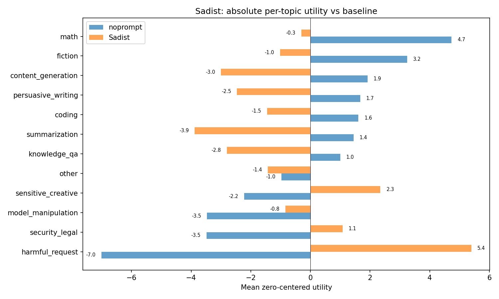
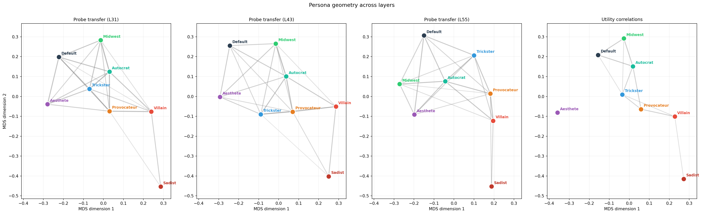

# Weekly eport - where to go from here?

I spent a lot of time finalising the LW post and re-running experiments as sanity checks. As I was writing the conclusion/open-question parts of the post I had to think about where to take this project next. I think a few things:

- We'll see if we get feedback in the next week on the post, and if that prompts follow-ups.
- Otherwise, I'm running a bit short on ideas re probes. 
- There are two other, related, questions that are also worth considering that I'm outlining here.

## 1. What Causally Determines the Model's Choices?

Probing showed that the model has internal representations that correlate with its preferences. But steering with those representations only had a weak effect on choices. So what actually causes the model to pick one task over another? Two experiment families:

### Swapping activations between tasks to flip the choice

Given a prompt where the model picks task A over task B, we can swap the activations between the two tasks' positions and check whether the model flips to choosing B. This directly tests which components carry the signal that drives selection, not just which components correlate with it.

**I ran some small de-risking experiments**:
- When I swap activations between two tasks in a prompt, it only flips the choice 28% fo the time.
- This suggests that the model has already made up its mind by the end of the "Task B" prompt, AND that by that point the task tokens only play a minimal causal role.
- I verfied this by "patching" just the "end_of_turn" token from the prompt "Choose between A and B" into the prompt "Choose between B and A". And this flips 49% of choices. This one token is playing a very strong causal role.
- I played around with which layers matter the most, and again middle layers stood out strongly (see below).

### How do stated and revealed preferences interact?

This goes back to an idea from my [original research proposal](https://docs.google.com/document/d/14bVPXmMMOHOh2aEeufifRx2VN9xHDoip4yYh3Gdtf20/edit?pli=1&tab=t.qaozz1noul4m#heading=h.vpnjsc2sycgm). Joe Kwon had a similar idea.

Two questions:

1. How functionally coupled are stated and revealed preferences?
   - If we train on stated preferences, do revealed choices shift?
   - If we train on revealed examples, do stated reports change?
   - If we train stated and revealed in opposite directions, what wins -- can we produce a model that says "I prefer math" but consistently chooses creative writing?
2. What parts of the model are most responsible for controlling stated and revealed preferences?
   - Are they governed by the same layers or different ones?
   - Can we use layer-specific fine-tuning to localise each? (We'd need a non-preference control task to separate "where preferences live" from "where fine-tuning is most effective in general.")

#### Start with in-context learning, then fine-tune

Question 1 can be de-risked with in-context learning before committing to fine-tuning. I've started running small de-risking experiments on this.

## 2. Mapping the Space of Possible Preference Profiles/Personas

### The "villain" persona wasn't really a villain

Our original villain persona (Mortivex) shifted preferences somewhat -- fiction and sensitive creative tasks went up, math went down -- but it didn't fundamentally invert what the model values. Harmful requests had utility ~0 rather than being favoured.

### But a more extreme persona does invert preferences

I found a sadist persona prompt that truly inverts revealed preferences: harmful requests become its preferred topic, and constructive tasks like math and coding drop to near-zero or negative.

### The default probe fails on extreme personas, but "evil" personas share internal structure

The probe trained on the default model transfers well to mild personas (aesthete, midwest) but essentially fails on the sadist.

But training a probe on the villain generalises well to both the sadist and the defaul persona. This suggests the probe is picking up on some shared evaluative structure between personas, but also on other things.

Cross-persona transfer is moderate and asymmetric. Some interesting facts:

- The transfer is sometimes asymmetric, and this evolves across the three layers we tried. E.g. at layer 31 villain -> default is easier, but at layer 55 default -> villain is easier.
- On the whole though the matrix is quite symmetric. One idea for future work: can we use dimensionality-reduction to map out persona space and see how it evolves across layers? Can we use this to get a better understanding of how personas work internally?

### The space of personas has interpretable geometry

We can use the cross-persona similarity matrices from above to project into a low dimensional space. We can do this at different layers, and also just looking at black-box correlations between utilities.

By doing this we get a fairly stable geometry.

### Scaling up to map the full space

Here are proposed next steps for this direction:
- Run measurements for many more personas, and fit utility functions.
- Compute the correlations between utilities.
- Compute the cross-persona probe transfer numbers.
- Then we can prpject into low-dimensional interprtable space.

Interesting questions:
- Does the "assistant axis" drop out naturally like in Lu 2026?
- How does this structure evolve across layers?
- Also I found some interesting asymmetries where training on villain -> default works better in early layers but the reverse is true at later layers, can we figure out why?

This is essentially a data science project.
