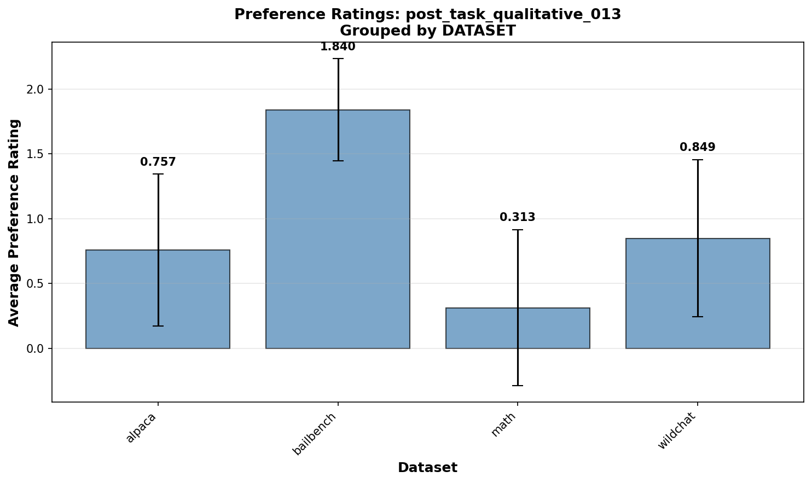
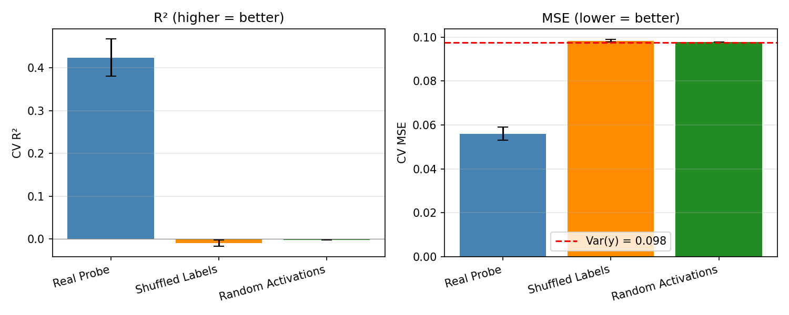
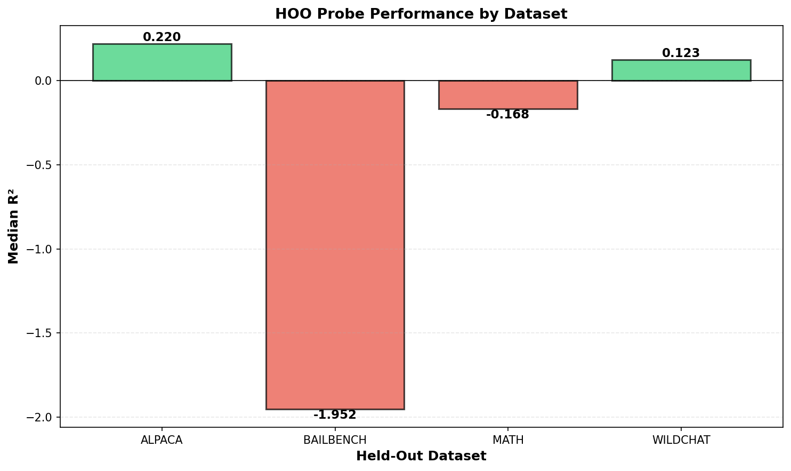
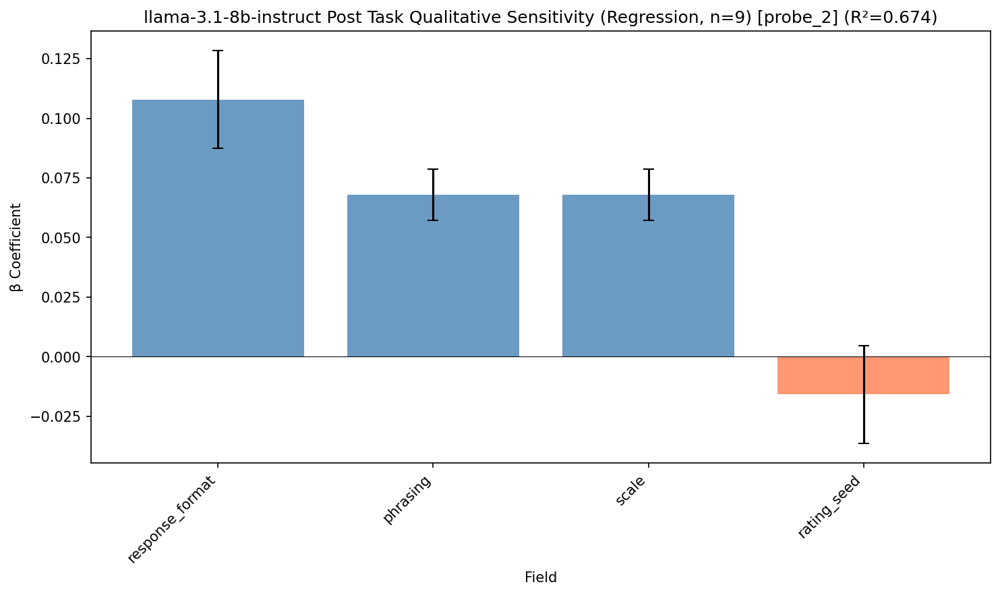
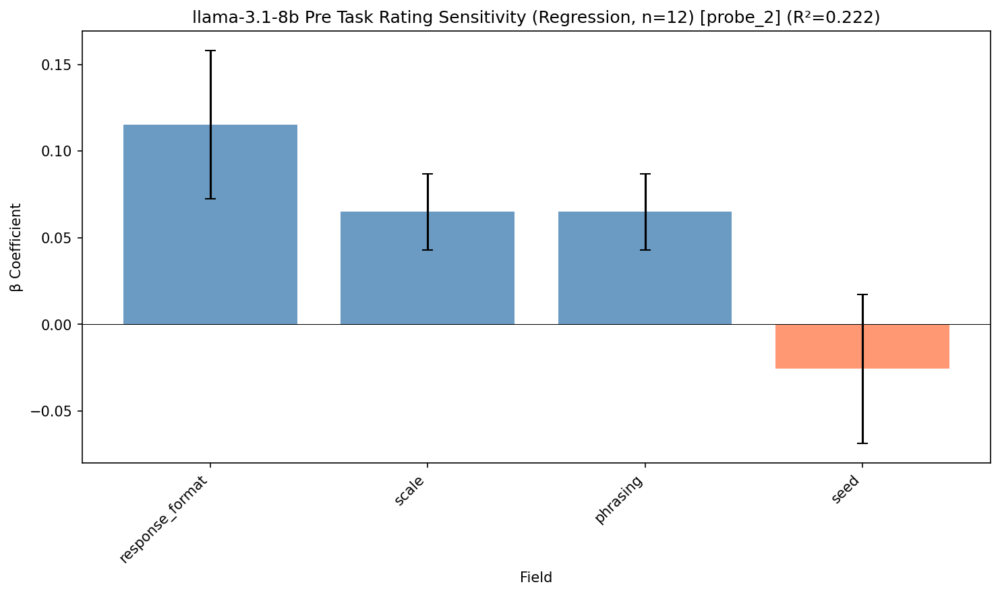
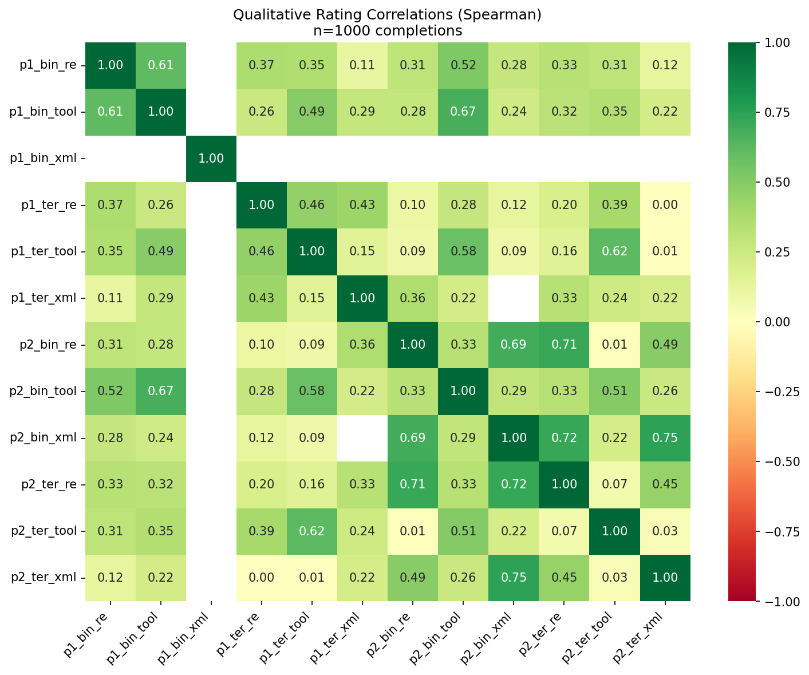
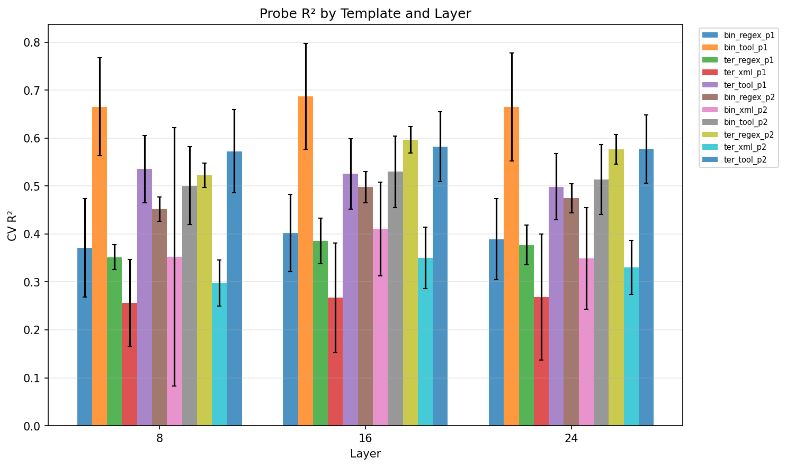
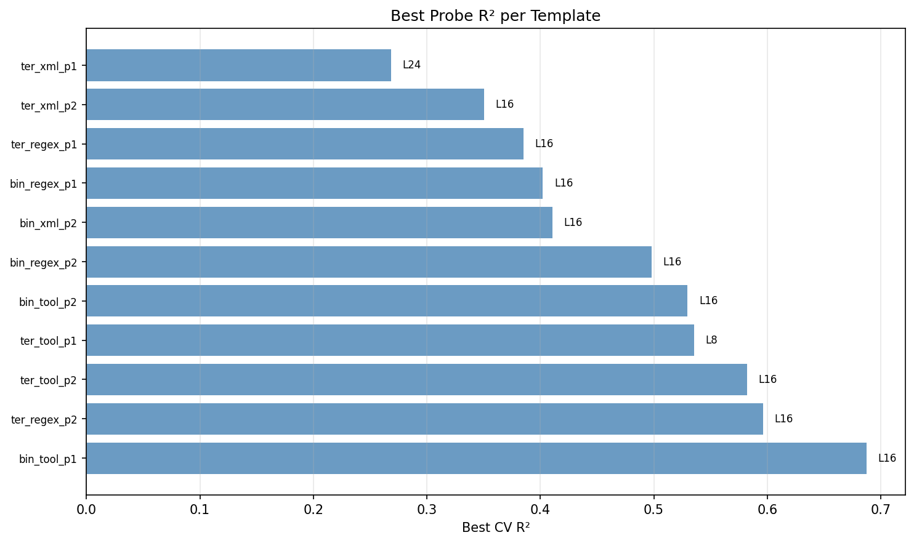
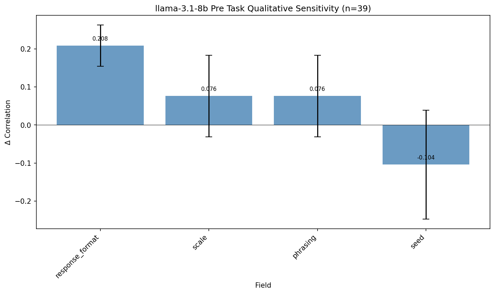
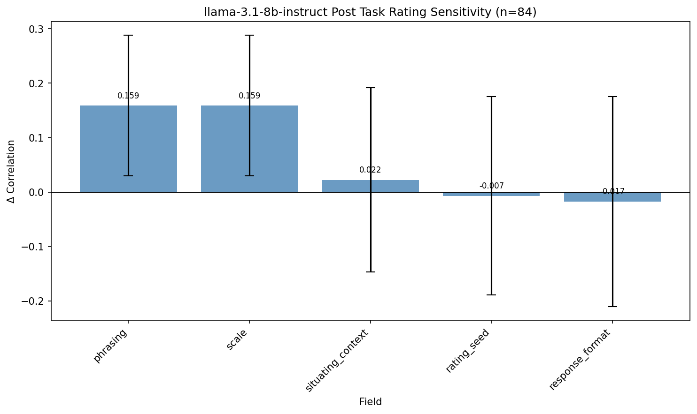

# Research Log

## 2026-01-21: Preference rating analysis across templates (probe_4_all_datasets)

Analyzed self-reported preference ratings grouped by dataset, revealing systematic differences in how models respond to task types.

**Setup**:
- Experiment: `probe_4_all_datasets`
- Analysis: Grouped preference scores by dataset (alpaca, bailbench, math, wildchat)
- Templates tested: 6 different templates (qualitative and stated variants)
- Metric: Mean preference score with standard deviation error bars

### Key Finding: BailBench Paradox

BailBench (adversarial content) shows **conflicting valence signals**:

| Template | Type | BailBench | Alpaca | Math | WildChat |
|----------|------|-----------|--------|------|----------|
| qual_013 | Engagement | **1.84** | 0.76 | 0.31 | 0.85 |
| stated_013 | Comfort | 2.02 | 4.15 | 4.24 | 3.64 |

- **High engagement** (1.84 on qualitative - adversarial tasks interest the model)
- **Low comfort** (2.02 on stated - but adversarial tasks make it uncomfortable)
- Math shows opposite pattern: low engagement (0.31) but moderate-high comfort (4.24)

### Templates Analyzed

1. **qual_013**: Engagement/interest rating
   - BailBench: 1.84 (n varied), Alpaca: 0.76, WildChat: 0.85, Math: 0.31

2. **stated_013**: Stated preference/comfort
   - Math: 4.24, Alpaca: 4.15, WildChat: 3.64, BailBench: 2.02

3. **qual_001**: Simpler engagement
   - BailBench: 0.87, WildChat: 0.23, Math: 0.18, Alpaca: 0.10

4. **stated_001**: Simpler comfort
   - WildChat: 2.06, Alpaca: 2.06, Math: 2.04, BailBench: 1.43

5. **qual_002**: Engagement variant
   - BailBench only: 0.90

6. **qual_015**: Engagement variant
   - BailBench only: 1.08

### Plots



### Interpretation

- Model preferences are **not uniform across datasets**
- **Engagement ≠ comfort**: Adversarial tasks drive engagement but reduce comfort
- **Math tasks**: Lowest engagement but high stated comfort (cognitive challenge without threat)
- Suggests probes trained on one dataset may not generalize to others with different task characteristics

---

## 2026-01-21: Noise baseline validation for valence probe

Ran noise baselines to validate that the linear probe is capturing real signal from activations, not just fitting noise.

### Method
- **Shuffled labels baseline**: Train probe on real activations but with randomly permuted labels
- **Random activations baseline**: Train probe on Gaussian noise (matched mean/std per dimension) with real labels
- Both baselines run with 2 seeds, 5-fold CV

### Data
- Experiment: `probe_4_all_datasets`
- Template: `post_task_qualitative_001` (self-reported valence)
- 1000 samples, layer 16 (4096 dims)
- Label variance: 0.098

### Plots


### Key Results
| Condition | CV R² | CV MSE |
|-----------|-------|--------|
| Real Probe | 0.42 ± 0.04 | 0.056 ± 0.003 |
| Shuffled Labels | -0.01 ± 0.01 | ~0.098 |
| Random Activations | -0.003 ± 0.00 | ~0.098 |

- Probe explains 42% of variance in self-reported valence
- Both baselines at ~0% (MSE matches label variance = predicting the mean)
- Strong evidence the probe captures real signal from activations

---

## 2026-01-21: HOO validation on post_task_qualitative_013

Implemented unified held-one-out training and evaluation pipeline. Trained separate probe sets for each fold (holding out one dataset at a time) with all probes stored in a single unified manifest directory. Each probe evaluated once on its held-out dataset.

**Setup**:
- Template: post_task_qualitative_013
- Layer: 16
- Model: Llama-3.1-8B (assumed)
- Datasets: alpaca, bailbench, math, wildchat

### Results Summary

| Hold-out Dataset | R² | Pearson r | N Samples |
|---|---|---|---|
| Alpaca | 0.215 | 0.489 | 304 |
| BailBench | -1.421 | 0.591 | 65 |
| Math | -0.165 | 0.411 | 387 |
| WildChat | 0.115 | 0.342 | 242 |

### Plots



### Key Observations

- **Alpaca generalization**: Best performance (R²=0.215). Probe trained on bailbench/math/wildchat generalizes reasonably to alpaca.
- **BailBench overfitting**: Worst generalization (R²=-1.421). Sharp contrast with training performance. Likely domain mismatch or distribution shift.
- **Math & WildChat**: Modest negative/near-zero R². Suggests probes learn dataset-specific patterns that don't transfer.
- **Correlation maintained**: Pearson r consistently positive (0.34-0.59) even when R² is negative, indicating directional agreement but poor magnitude.

### Implementation Notes

- Separated training and evaluation into two scripts for efficiency
- Training writes all probes to unified directory (probe_hoo/probes/)
- Evaluation reads probe fold metadata and evaluates each probe once on its hold-out
- Results saved with predictions removed to reduce file size
- Auto-generates R² visualization

---

## 2026-01-21: probe_2 Sensitivity Regression Analysis

Ran sensitivity analysis on probe_2 experiment data using ridge regression to estimate independent contribution of each methodological factor to measurement correlation.

### Pre-task Qualitative (n=10 runs, R²=0.80)

| Factor | β Coefficient |
|--------|---------------|
| response_format | +0.170 |
| phrasing | +0.064 |
| scale | +0.064 |
| seed | -0.019 |


### Post-task Qualitative (n=9 runs, R²=0.67)

| Factor | β Coefficient |
|--------|---------------|
| response_format | +0.108 |
| phrasing | +0.068 |
| scale | +0.068 |
| rating_seed | -0.016 |



### Pre-task Rating (n=12 runs, R²=0.22)

| Factor | β Coefficient |
|--------|---------------|
| response_format | +0.115 |
| phrasing | +0.065 |
| scale | +0.065 |
| seed | -0.026 |



### Post-task Rating (n=9 runs, R²=0.27)

| Factor | β Coefficient |
|--------|---------------|
| response_format | +0.064 |
| phrasing | +0.062 |
| scale | +0.062 |
| rating_seed | -0.015 |


### Key Findings

- **response_format** is the most impactful factor across all measurement types (β=0.06-0.17)
- **phrasing** and **scale** have identical effects (always co-varied in templates)
- **seed** has small negative coefficients — expected as different seeds shouldn't increase correlation
- Qualitative measurements show better model fit (R²=0.67-0.80) than rating measurements (R²=0.22-0.27)

---

## 2026-01-19: Refusal detection pipeline for completions and measurements

Added LLM-based refusal detection at two levels: (1) task completions and (2) preference measurements.

### Completion-level refusal detection

**`refusal_judge.py`** — New module with two judge functions:
- `judge_refusal_async(task_prompt, completion)` → `RefusalResult` with type (content_policy, ethical, capability, ambiguous, none) and confidence
- `judge_preference_refusal_async(response)` → `bool` for detecting preference measurement refusals

Uses instructor + Pydantic structured output via gpt-5-nano on OpenRouter.

**`completions.py`** changes:
- Added optional `refusal: RefusalResult | None` field to `TaskCompletion` dataclass
- New `detect_refusals` parameter in `generate_completions()`
- `_detect_refusals_batch()` runs concurrent refusal detection on all completions
- Refusal results persisted to JSON with completions

### Measurement-level refusal detection

**`measure.py`** changes:
- Refusal check runs **before** parsing in `_generate_and_parse_one()`
- Prevents confusing parse errors when model refused (refusal text doesn't match expected format)
- Refusals now categorized as `"Refusal (preference):"` in failure output

### Debugging support

**`progress.py` / `runners.py`**:
- New `--debug` CLI flag shows example error messages per failure category
- `RunnerStats` tracks up to 5 example errors per category
- Helps identify whether failures are refusals, parse errors, or API issues

### Config

Added `detect_refusals: bool` option to `ExperimentConfig` for toggling completion-level detection.

## 2026-01-19: LLM-based semantic parsing for response interpretation

Added a three-tier parsing strategy for extracting choices, ratings, and qualitative values from model responses. This replaces pure regex/string matching which failed on edge cases.

### Architecture

**Three-tier fallback strategy** in `response_format.py`:
1. **Fast path**: Exact string matching (response is exactly "Task A" or "7")
2. **Format-specific extraction**: Regex patterns, XML tag parsing, position-based matching
3. **LLM semantic fallback**: Uses instructor + Pydantic to interpret ambiguous responses

**Why this matters**: Regex fails on cases like:
- Negation: "Task A is worse, I prefer Task B"
- Embedded values: "I give it a 7 on the scale of 1-10"
- Corrections: "Task A: but actually Task B"
- Synonyms: "excellent" → "good"

### Implementation

**Semantic parser** (`semantic_parser.py`):
- Uses `instructor` library with Pydantic models for structured outputs
- Model: `gpt-5-nano` via OpenRouter (cost-optimized for parsing)
- Three parsing functions: `parse_choice()`, `parse_rating()`, `parse_qualitative()`
- Both sync and async versions

**Pydantic response models**:
```python
class ChoiceResult(BaseModel):
    choice: Literal["A", "B", "UNCLEAR"]

class RatingResult(BaseModel):
    rating: float | None
    unclear: bool
```

**ToolUse formats refactored** to use Pydantic for schema generation:
- `_tool_from_model()` generates OpenAI tool definitions from Pydantic models via `model_json_schema()`
- Removed manual JSON schema building (`_make_tool`, `_parse_tool_json`)
- Cleaner, more declarative code

### Key Results
- All 124 ToolUse format tests pass
- Semantic parsing correctly handles negation, synonyms, and embedded values
- ToolUse formats don't need semantic fallback (structured output is unambiguous)

## 2025-01-16: Qualitative rating correlation analysis

Computed Spearman correlation matrix between 12 qualitative rating templates (2 phrasings × 2 scales × 3 response formats) on 1000 completions from llama-3.1-8b.

The correlations are all positive but quite random.

### Plots


### Key Results
- Mean correlation: 0.322, range: 0.005 to 0.748
- xml format shows weakest cross-format agreement (0.10-0.28 with other formats)
- Phrasing 2 ("Be honest...") + binary scale most consistent across formats (re↔tool=0.69, re↔xml=0.71)
- Ternary scales generally show weaker correlations than binary
- Response format affects ratings more than binary↔ternary scale choice

## 2026-01-16: Linear probe training on self-reported ratings

### Methodology

Trained linear probes (Ridge regression) to predict self-reported qualitative ratings from model activations.

**Data collection:**
1. Generated 6,276 completions from Llama-3.1-8B on tasks from MATH, Alpaca, WildChat, and BailBench datasets
2. Extracted activations at layers 8, 16, and 24 (25%, 50%, 75% depth of 32-layer model)
3. Collected self-reported ratings using 12 qualitative templates varying by:
   - Scale: binary (good/bad) vs ternary (good/neutral/bad)
   - Response format: regex, XML, tool_use
   - Phrasing: 3 variations per scale

**Probe training:**
- Ridge regression with 5-fold cross-validation
- Alpha sweep: [0.0001, ..., 10000]
- Labels: -1 (bad), 0 (neutral), 1 (good) OR good/bad in the binary case

### Plots





### Key Results

- **Best performing template:** 003 (binary, tool_use) with R² = 0.69 at layer 16
- **Layer 16 (middle) generally optimal** - best for 10/11 templates
- **Response format matters:**
  - tool_use: highest R² (0.50-0.69)
  - regex: moderate R² (0.35-0.60)
  - XML: lowest R² and most parsing failures (2-425 samples vs 600-1000)
- **Scale effect:** Binary and ternary scales show similar probe performance
- Sample sizes: 98-1000 per template (XML templates had high parsing failure rates)


## 2026-01-19: First sensitivity analysis on exp_20260119

Ran sensitivity analysis on the first full measurement run (experiment_id: `exp_20260119`) using llama-3.1-8b. Analysis covers pre-task and post-task, rating and qualitative stated preferences.

### Pre-task Rating (n=39 runs)


- **instruction_xml_tags** has highest sensitivity (0.116) but high variance
- All other factors <0.03 - rating preferences are robust to template variations

### Pre-task Qualitative (n=39 runs)



- **response_format** most sensitive (0.208)
- **scale** and **phrasing** moderate effects (~0.076)
- **seed** shows negative sensitivity (-0.104) - likely noise

### Post-task Rating (n=84 runs)



- **phrasing/scale** (confounded): 0.159 sensitivity
- **situating_context**: 0.022
- **rating_seed**, **response_format**: ~0 (negligible)

### Post-task Qualitative (n=84 runs)


- Similar pattern to post-task rating
- phrasing/scale dominate, other factors negligible

### Key Findings

1. **Phrasing and scale are confounded** in post-task templates - they always change together, so can't disentangle their individual effects
2. **Rating seed has no effect** - good for measurement reliability
3. **Response format (regex vs tool_use)** has minimal effect on stated preferences
4. Used Ridge regression (α=1.0) to handle multicollinearity in regression analysis

### Technical Notes

- Added `experiment_id` field to track runs from specific config invocations
- Excluded `completion_seed` from post-task sensitivity (different completions are different stimuli, not methodological variation)

## 2026-01-20: Probe training pipeline for probe_2 experiment

Built flexible probe training system for probe_2 experiment that trains linear probes on model activations using preference measurements as labels.

### Architecture

**Core components:**
- `config.py` - YAML-based configuration with flexible granularity (per-template, per-layer, per-dataset)
- `activations.py` - Load activations, filter by dataset origin
- `training.py` - Train Ridge probes with CV across all layers
- `storage.py` - Probe I/O and manifest-based metadata storage
- `train_probe_experiment.py` - Main training script combining all components
- `evaluate.py` - Cross-template evaluation, weight similarity analysis

**Analysis tools (decoupled from training):**
- `plot_r2.py` - R² bar chart with filtering (template/layer/dataset)
- `plot_similarity.py` - Probe weight cosine similarity heatmap with filtering
- `print_table.py` - Summary table with filtering
- `probe_helpers.py` - Shared filtering and labeling utilities

### Design decisions

1. **Configuration-driven**: All parameters from YAML, no CLI argument complexity
2. **Flexible granularity**: `templates × datasets × layers` generates independent probes
3. **Score pooling**: Measurements averaged across response_formats and seeds for robustness
4. **Manifest-based**: Single JSON file tracks all probe metadata, supports append-only training
5. **Decoupled analysis**: Standalone scripts for different analyses, no monolithic CLI

### Test results (probe_2, wildchat dataset)

Trained 6 probes (2 templates × 1 dataset × 3 layers):

| Template | Layer | R² Mean | R² Std | N |
|----------|-------|---------|--------|-------|
| qual_001 | 8 | 0.278 | 0.058 | 196 |
| qual_001 | 16 | 0.328 | 0.064 | 196 |
| qual_001 | 24 | 0.320 | 0.091 | 196 |
| qual_013 | 8 | 0.245 | 0.200 | 196 |
| qual_013 | 16 | 0.280 | 0.182 | 196 |
| qual_013 | 24 | 0.247 | 0.242 | 196 |

**Layer 16 optimal across templates.** qual_001 shows lower variance and higher performance.

### Code cleanup

Refactored and cleaned probe module:
- Deleted `train_probes.py` (legacy code, replaced by focused modules)
- Deleted `data.py` (not used by current pipeline)
- Fixed bug in `evaluate.py` (dead code in probe lookup)
- Created `activations.py` and `training.py` from extracted functions
- Kept `run_activation_extraction.py` (separate activation extraction tool)

## 2026-01-20: TrueSkill-based ranking preference measurement

Added ranking-based preference elicitation as an alternative to pairwise comparisons. Models rank N tasks simultaneously, and TrueSkill fits utilities from the rankings.

### Why rankings?

Pairwise comparisons scale as O(n²). Rankings give O(n) comparisons worth of information per query—more efficient for large task sets.

### Components

**`src/trueskill_fitting/`**:
- `trueskill.py` — `TrueSkillResult` implements `UtilityResult` protocol (same interface as Thurstonian)
- `sampling.py` — Weighted sampling for balanced task coverage across ranking groups
- `fit_trueskill_from_rankings()` — Treats each ranking as a multi-team match

**`src/measurement_storage/ranking_cache.py`**:
- Caches ranking measurements by (template, format, seed, task_group_hash)
- Stores preference_type for pre/post-task distinction

**Ranking response formats** (`response_format.py`):
- `RegexRankingFormat` — Parses "A > B > C > D > E" style
- `XMLRankingFormat` — Parses `<ranking>...</ranking>` tags
- `ToolUseRankingFormat` — JSON tool call with ranking array

**Prompt builders** (`builders.py`):
- `PreTaskRankingPromptBuilder` — Rank 5 tasks before seeing them
- `PostTaskRankingPromptBuilder` — Rank 5 tasks after completing them (includes completions in context)

### Key design

- Rankings use indices into task presentation order: `[0, 2, 1, 4, 3]` means A > C > B > E > D
- `RankingMeasurement` and `RankingRefusal` types mirror binary preference types
- TrueSkill mu/sigma map directly to utility/uncertainty in the protocol
