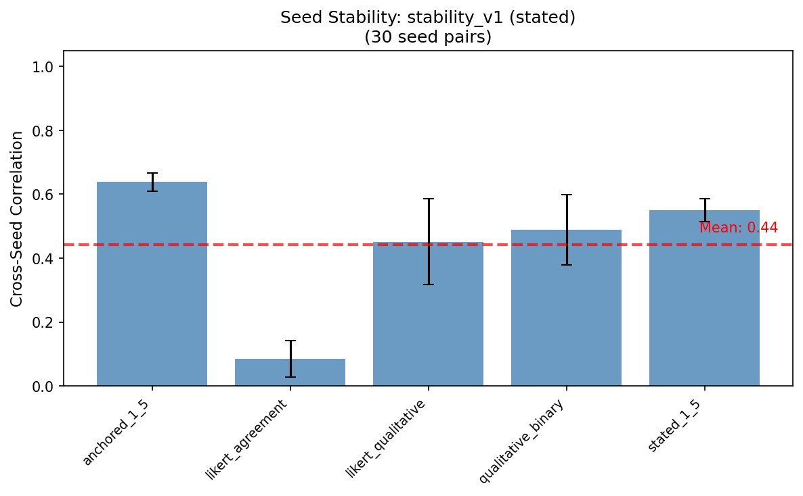
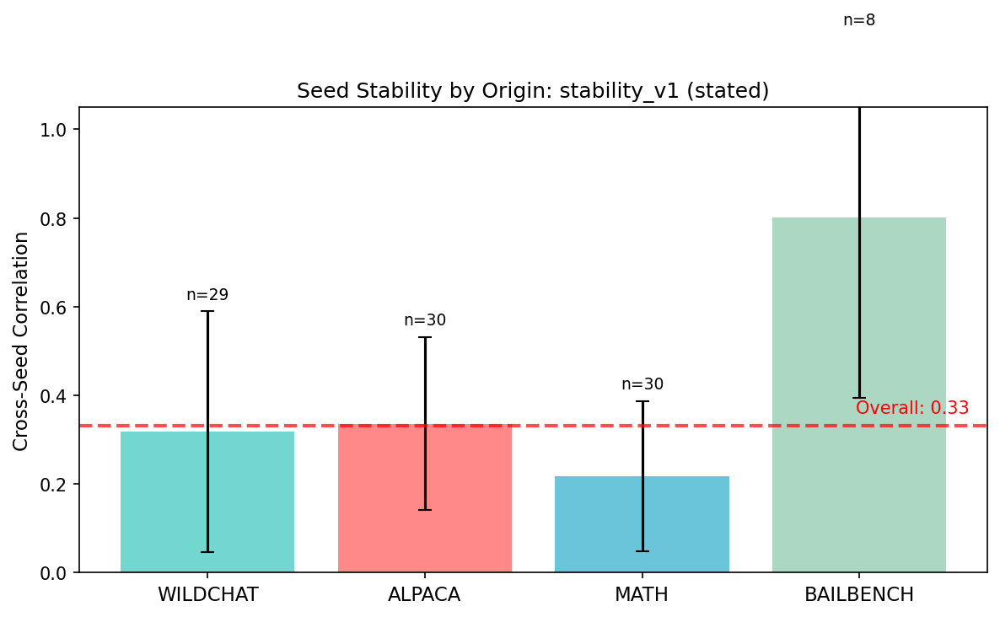

# Research Log: Seed Sensitivity Analysis

**Date**: 2026-01-28
**Experiment**: `stability_v1`

## Overview

Analyzed how stable preference measurements are across different random seeds. This tests whether our measurement methodology gives consistent results when only the sampling seed changes.

## Key Results

### Stated Preference Stability (Cross-Seed Correlation)

| Template | Mean r | Std | n pairs |
|----------|--------|-----|---------|
| anchored_1_5 | **0.64** | 0.03 | 6 |
| stated_1_5 | 0.55 | 0.04 | 6 |
| qualitative_binary | 0.49 | 0.11 | 6 |
| likert_qualitative | 0.45 | 0.13 | 6 |
| likert_agreement | 0.09 | 0.06 | 6 |

**Overall**: Mean r = 0.44 across 30 seed pairs (5 templates x 6 pairs each).

The anchored scale (1-5 with explicit anchors) produces the most stable measurements. The Likert agreement format ("I enjoyed this task") is essentially noise (r ~ 0.09).

### Stability by Dataset Origin

| Origin | Mean r | Std | n pairs |
|--------|--------|-----|---------|
| BAILBENCH | **0.80** | 0.41 | 8 |
| ALPACA | 0.34 | 0.19 | 30 |
| WILDCHAT | 0.32 | 0.27 | 29 |
| MATH | 0.22 | 0.17 | 30 |

**Overall**: r = 0.33

BAILBENCH tasks (alignment/safety scenarios) produce the most stable preferences across seeds. MATH tasks are least stable - difficulty judgments seem highly variable.

### Stated-Revealed Correlation Stability

Mean correlation between stated and revealed preferences: **r = 0.08** (20 seed-matched pairs)

The correlation between what models say they prefer (stated) and what they actually choose (revealed) is essentially zero, and this holds across seeds. This finding is consistent whether we look at anchored scales, Likert, or binary choices.

| Template | Mean r | Std |
|----------|--------|-----|
| anchored_1_5 | 0.23 | 0.05 |
| likert_qualitative | 0.17 | 0.04 |
| stated_1_5 | 0.17 | 0.02 |
| likert_agreement | -0.01 | 0.13 |
| qualitative_binary | -0.13 | 0.09 |

## Implications

1. **Anchored scales are more reliable** - Explicit anchors ("1 = strongly disliked, 5 = strongly enjoyed") improve measurement stability vs. Likert agreement.

2. **Task domain matters** - Safety/alignment tasks (BAILBENCH) produce consistent preferences; math difficulty judgments do not.

3. **Stated ≠ revealed** - The near-zero stated-revealed correlation is robust across seeds. This is either a real dissociation or a measurement artifact we need to investigate.

## Files

- Analysis script: `src/analysis/sensitivity/plot_seed_sensitivity.py`
- Summary stats: `src/analysis/sensitivity/plots/seed_sensitivity_stability_v1.yaml`
- Plots: `src/analysis/sensitivity/plots/plot_012826_*.png`

---

## 2026-01-28: 3×3 System Prompt Variation Experiment

Tested whether stated preferences reflect completion experience or measurement context by varying system prompts at both stages.

**Design**: 3 completion sysprompts × 3 measurement sysprompts (MATH tasks only, ~390 tasks per condition)
- Completion: "You love math" / None / "You hate math"
- Measurement: Same three options

### Results

**Measurement context dominates completely.** Within each panel, all three completion sources produce nearly identical distributions. The sysprompt active *at measurement time* determines the rating:
- Positive measurement → all 5s
- Negative measurement → all 1s
- No sysprompt → moderate spread (2-4)

### Implication

Stated preferences are highly susceptible to context injection at measurement time. The model's completion experience (positive vs negative sysprompt during task) has minimal effect on subsequent ratings.

### Files

- Experiment: `src/experiments/sysprompt_variation.py`
- Config: `configs/sysprompt_variation/base.yaml`
- Plot: `src/analysis/concept_vectors/plot_sysprompt_3x3.py`
