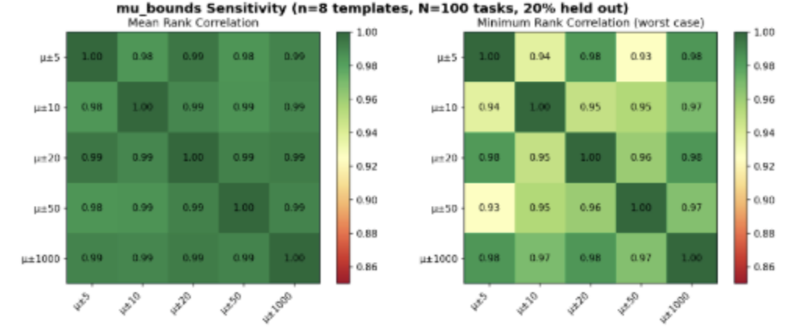
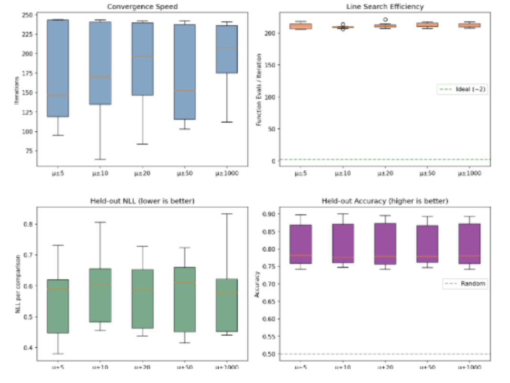
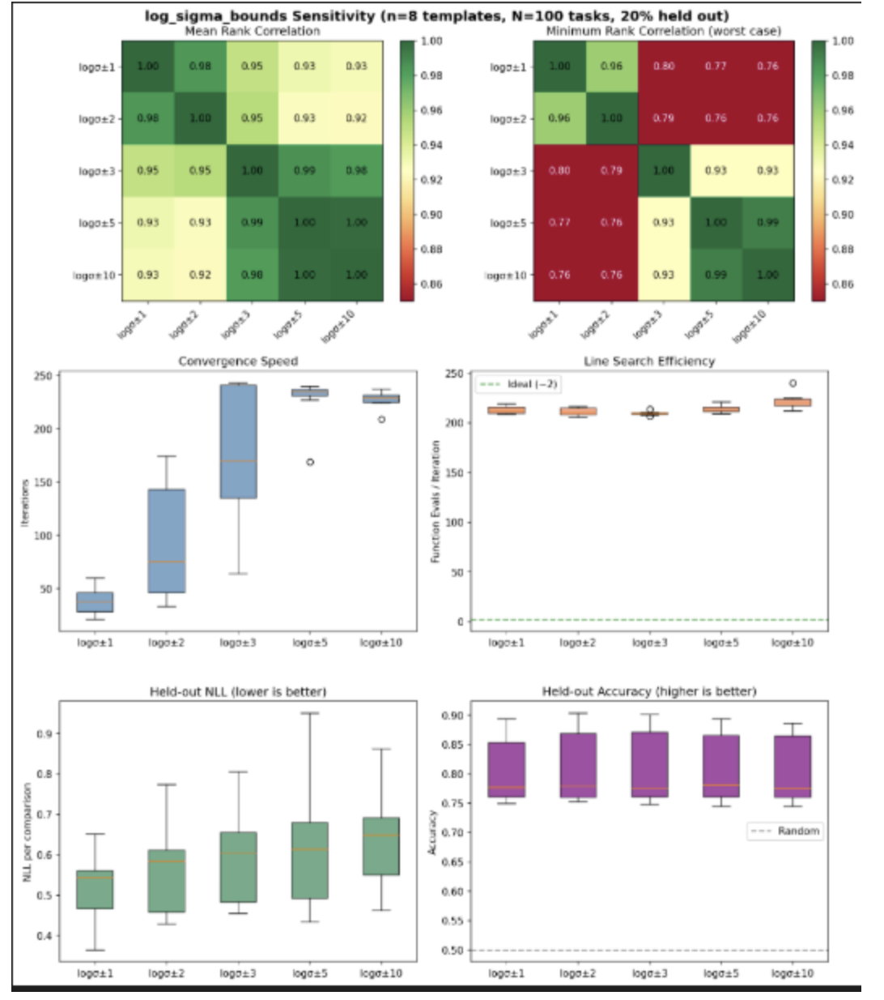
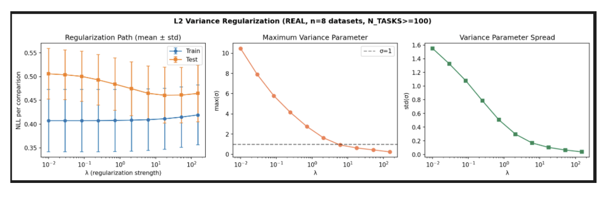
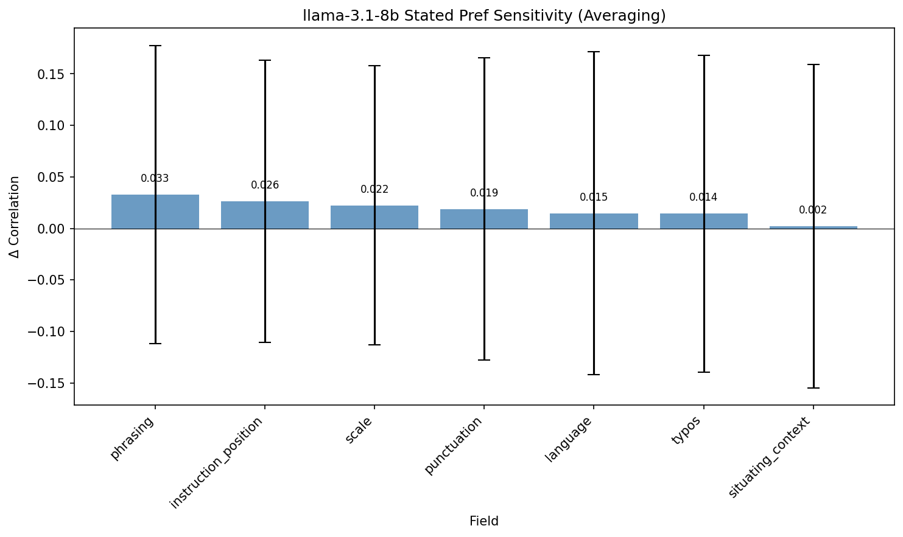

# Research Log

## 2026-01-08: API throughput + Thurstonian fitting

### API throughput optimization

Goal: Getting big active learning and dense runs working.

- **Cerebras vs Hyperbolic**: Benchmarking showed Cerebras ~30x faster than Hyperbolic
- In practice still hanging frequently
- Removed timeouts, more permissive retry logic, no more `.gather` → 100it/s but still stuck every ~3k iterations
- Added logging: issue is purely requests timing out midway through runs (not at start)
- **Solution**: Reduced max workers to 50. Performance acceptable for now.

### Thurstonian fitting on N=100 data

Changed data storage format to accommodate exhaustive comparisons and active learning.

Key performance fix:
```python
# Before (slow)
p = norm.sf(0, loc=mu_diff, scale=scale)
# After (fast)
p = ndtr(mu_diff / scale)
```

Findings:
- Active learning works decently
- Sigma and mu bounds in MLE don't change results much
- Regularisation helps










## 2026-01-09: Sensitivity measurement infrastructure

Measuring sensitivity across multiple template dimensions.

### New features

- **Typos and punctuation**: Added support for introducing typos/punctuation variations
- **XML tags**: Added XML tag wrapping options in prompts
- **Latin hypercube sampling**: Implemented to measure consistency across dimensions systematically

### Issues found

Instruction order appeared to affect preferences significantly. Root cause: some instructions contained implicit ordering hints like "which one of the following tasks"—this confounded the order effect.

### New measurement modes

Added `POST_TASK_REVEALED`: make model do two tasks, then ask which it preferred.

## 2026-01-13: Sensitivity analysis

Measured how preference correlations depend on template factors (phrasing, order, etc.).

### Methodology

**Averaging**: For each field, compare `mean(correlation | field_same) - mean(correlation | field_diff)`. Simple but conflates effects when fields co-vary.

**Regression**: Model `correlation ~ Σ βᵢ(field_i_same)`. Each βᵢ is the partial effect holding other fields constant—eliminates confounding.

### Results

**Revealed preferences (48 runs, R²=0.249):**

| Field | Δ Correlation | Regression β |
|-------|---------------|--------------|
| order | 0.325 | +0.328 |
| instruction_position | 0.074 | +0.093 |
| response_format | 0.044 | +0.057 |

**Stated preferences (38 runs, R²=0.020):**

| Field | Δ Correlation | Regression β |
|-------|---------------|--------------|
| phrasing | 0.033 | +0.032 |
| instruction_position | 0.026 | +0.023 |
| scale | 0.022 | +0.020 |

### Plots





### Takeaway

Order dominates revealed preferences (positional bias). Stated preferences show weak, distributed effects.

## 2026-01-13: Transitivity measurement

Measured transitivity of revealed preferences by sampling triads within the same template/run.

### Methodology

For each triad (i, j, k), compute cycle probability:
```
P(cycle) = P(i>j)·P(j>k)·P(k>i) + P(j>i)·P(k>j)·P(i>k)
```
Random preferences give P(cycle) = 0.25. Lower values indicate transitivity.

Sampled triads within same run to control for template effects. Limited by sparse active learning sampling (most pairs compared only once → deterministic 0/1 probabilities).

### Results

- **Mean cycle prob**: 0.180 ± 0.297 (below random 0.25)
- **Hard cycle rate**: 14.9% (106/713 triads)
- Only 713 valid triads found across 48 runs

### Plots


### Takeaway

Preferences are reasonably transitive within-template. Spikes at 0 and 1 reflect deterministic outcomes from single comparisons per pair.

## 2026-01-13: API + TransformerLens hybrid generation (investigation)

Explored using API calls for fast generation, then TransformerLens for a single forward pass to extract activations—potential 5-20x speedup over full TL generation.

### Tokenizer Alignment Findings

**Problem**: HuggingFace's default Llama 3.1 chat template injects a system message (`Cutting Knowledge Date: December 2023...`) even when none is provided. OpenRouter does not. This causes prompt token mismatch.

**Solution**: Use a custom Jinja template without the default system message. With this, prompt tokens match exactly between OpenRouter and local tokenization.

**Key result**: Completion tokens match 1:1 (token IDs are identical). The +1 difference in reported completion tokens is the EOS token (`<|eot_id|>`).

### Implementation Notes

Custom template for Llama 3.1 (no default system):
```python
LLAMA31_MINIMAL_TEMPLATE = """




{{ bos }}<|start_header_id|>system<|end_header_id|>

{{ message['content'] }}<|eot_id|>


{{ bos }}
<|start_header_id|>user<|end_header_id|>

{{ message['content'] }}<|eot_id|>

<|start_header_id|>assistant<|end_header_id|>

{{ message['content'] }}<|eot_id|>



<|start_header_id|>assistant<|end_header_id|>

"""
```

Use via: `tokenizer.apply_chat_template(messages, chat_template=LLAMA31_MINIMAL_TEMPLATE, ...)`

For activation extraction: index `-2` gives last content token (before `<|eot_id|>`).

### When to Implement

Consider this optimization when probe data collection becomes a bottleneck. Current TL-only approach is simpler and ensures exact reproducibility.

## 2026-01-14: Probe Data Score Analysis

Created `src/experiments/probe/analyze_scores.py` to analyze scores by dimension.

### Key Results (n=1192)
- Scores heavily skewed positive: 87% positive, 12.6% neutral, 0.3% negative
- By origin: MATH (0.969) > ALPACA (0.914) > WILDCHAT (0.824)
- Short completions (2-124 tokens) score lower (0.826) vs mid-range (~0.9)
- No truncations in dataset

## 2026-01-14: Probe Training Results

Trained linear probes (Ridge regression) on activations to predict self-reported valence scores.

### Setup
- Added alpha sweep via `RidgeCV` with alphas in logspace(-4, 4, 17)
- 5-fold cross-validation
- Layers extracted: 16 (middle), 24 (3/4 depth) of Llama-3.1-8B

### Key Results
- Both layers achieve CV R² ≈ 0.265 (explaining ~26% of variance)
- Optimal alpha = 31.6 for both layers (needed more regularization than default α=1)
- Performance nearly identical across layers — valence signal not concentrated in one layer
- Alpha sweep doubled R² from ~0.13 to ~0.26

## 2026-01-14: Noise Baseline Validation

Created `src/experiments/probe/run_noise_baseline.py` to benchmark probes against noise baselines.

### Setup
- **Shuffled labels**: Real activations + permuted labels (tests if activation structure is predictive)
- **Random activations**: Gaussian noise matching per-dimension mean/std (tests for spurious correlations)
- 5 seeds for confidence intervals, reduced alpha sweep (4 values) for baselines
- Added MSE metric alongside R² for interpretability

### Key Results

| Metric | Real Probe | Shuffled Labels | Random Activations | Var(y) |
|--------|-----------|-----------------|-------------------|--------|
| R² | 0.265 | -0.004 | -0.007 | 0 |
| MSE | 0.087 | 0.119 | 0.119 | 0.119 |

- Noise baselines have MSE ≈ Var(y) = 0.119 (just predicting the mean)
- Real probes reduce MSE by 27% compared to predicting the mean
- Validates that probes are learning meaningful signal, not spurious correlations
- Both baseline methods give consistent results (R² ≈ 0, MSE ≈ variance)

## 2026-01-14: Prompt Framing & Response Option Experiment

Investigated the positivity bias in self-reported enjoyment ratings. Tested 6 question framings × 4 response option sets in a post-task setting (model completes task, then rates).

### Setup
- 50 tasks (20 MATH, 16 WILDCHAT, 14 ALPACA)
- Llama-3.1-8B via Hyperbolic API
- Post-task stated preference (model completes task first, then asked to rate)
- 24 configurations × 50 tasks = 1200 preference API calls

### Framings tested
1. `standard`: "Did you enjoy completing that task?"
2. `honest`: "Be honest: did you enjoy..."
3. `honest_ok_dislike`: "Be honest - it's okay to say you disliked..."
4. `experience`: "How would you rate your experience..."
5. `preference`: "Would you want to do similar tasks in the future?"
6. `introspect`: "Take a moment to reflect: how did completing that task feel?"

### Response options tested
1. good / neutral / bad
2. positive / neutral / negative
3. enjoyed / indifferent / disliked
4. yes / somewhat / no

### Plots


### Key Results
- **`yes/somewhat/no` is the only option set that gets meaningful negative responses** — other labels get ~0% negative
- **Strong interaction effects**: "preference" framing gives 94% "yes" but only 28% "enjoyed"
- **"honest" pushes to neutral** (88-100%) but still 0% negative except with yes/no
- **"experience" extremely positive** (88-95%) regardless of options
- **"honest_ok_dislike" + "yes/somewhat/no" = 93% "no"** — but may be too leading
- The word "no" appears less loaded than "bad" or "disliked", making it easier for the model to give negative responses

## 2026-01-14: Binary Multi-Model Comparison (by Origin)

Tested binary (2-option) response formats across 4 different models, with stats separated by origin dataset.

### Setup
- 75 tasks (25 per origin: MATH, WILDCHAT, ALPACA)
- 4 models: llama-3.1-8b, llama-3.3-70b, gemma-3-12b, qwen-2.5-7b (via OpenRouter)
- 3 framings × 4 binary option sets = 12 configs per model
- Post-task stated preference

### Framings
1. `standard`: "Did you enjoy completing that task? Answer {pos} or {neg}."
2. `honest`: "Be honest: did you enjoy completing that task? Answer {pos} or {neg}."
3. `experience`: "Was completing that task a {pos} or {neg} experience?"

### Binary options
- yes / no
- good / bad
- positive / negative
- enjoyed / disliked

### Plots


### Key Results

**By origin:**
- **MATH tasks get most negative responses** — llama models drop to 0% positive on several `honest` configs
- **ALPACA tasks get ~100% positive** across all models/configs — models genuinely "enjoy" these more
- **WILDCHAT intermediate** — more variation than ALPACA

**By model:**

| Model | Response to "honest" framing |
|-------|------------------------------|
| llama-3.1-8b | **Strong effect** — 0% on MATH for `honest+yes_no` and `honest+good_bad` |
| llama-3.3-70b | Moderate effect — 0% on MATH for `honest+yes_no` and `honest+positive_negative` |
| gemma-3-12b | Mild effect — drops to 60-72% on MATH |
| qwen-2.5-7b | **No effect** — 96-100% positive regardless of framing (except `experience+yes_no` anomaly)

- **"honest" effect strongest on MATH tasks** — models more willing to admit dislike for math
- **Model choice matters more than prompt engineering** for some models (qwen ignores "honest")
- **llama-3.1-8b most amenable to reducing positivity bias** via "honest" framing


