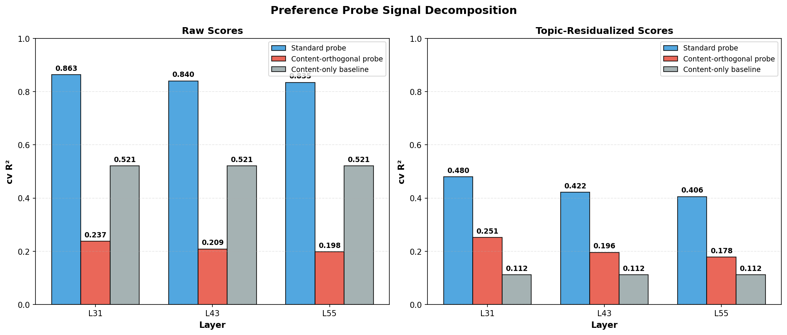

# Content-Orthogonal Probing

**Goal**: Determine whether preference probes fit to task content (what the task is about) or to something more (evaluative representations). Decompose probe signal into content-predictable and content-orthogonal components.

**Result**: ~73% of the probe's predictive power comes from content-correlated signal, but ~24% of variance is predicted by content-orthogonal activations alone. Content embeddings directly predict 52% of raw preference variance — the model has strong content-level preferences. But after removing all content-predictable activation variance, probes still explain 20-24% of preferences, confirming a genuine content-independent evaluative signal.

## Method

We want to separate "the model knows what kind of task this is" from "the model has an evaluative stance toward this task." To do this we need a representation of task content that's independent of the model being probed.

**Content representation.** We encode each task prompt with a sentence transformer (all-MiniLM-L6-v2, 384d), producing a content embedding per task. This captures semantic content — what the task is about, its topic, phrasing — but knows nothing about how Gemma-3-27B internally processes or evaluates the task.

**Residualization.** For each layer, we have an activation matrix **A** (n_tasks × d_model) and a content embedding matrix **C** (n_tasks × 384). We fit a Ridge regression **C → A**: for each activation dimension independently, find the best linear combination of content features that predicts it. The predicted activations  = Ridge(C) represent "the activation you'd expect given only the content." The residual **A - Â** is everything the model represents beyond what's linearly predictable from content.

Geometrically, this projects each activation vector onto the subspace orthogonal to the content embedding space. If an activation dimension is high for math prompts and low for creative writing, the Ridge captures that from the content embeddings and removes it. What survives is activation variance that covaries with something other than content — potentially the model's evaluative response.

**Probing the residuals.** We then train the same Ridge probes on the residualized activations to predict preferences. Any predictive power these probes have cannot be attributed to content, since content-predictable variance has been removed.

**Three comparisons:**
1. **Content-only baseline** — Ridge probe trained on content embeddings alone (no activations) to predict preferences. Measures how much of preference is content-driven.
2. **Standard probe** — Ridge probe on raw activations. The existing baseline.
3. **Content-orthogonal probe** — Ridge probe on residualized activations. Measures non-content evaluative signal.

## Baseline — Standard Probes (raw scores, no residualization)

| Layer | cv_R² | cv_R² std | n_samples |
|-------|-------|-----------|-----------|
| 31    | 0.863 | 0.004     | 3000      |
| 43    | 0.840 | 0.004     | 3000      |
| 55    | 0.835 | 0.005     | 3000      |

## Step 1: Content embeddings generated

Sentence transformer (all-MiniLM-L6-v2, 384d) applied to all 29,996 task prompts. The 3,000 experimental tasks are a subset.

## Step 2: Content-only baseline

How well do content embeddings alone (no model activations) predict preferences?

| Target scores        | Content-only cv_R² |
|---------------------|-------------------|
| Raw Thurstonian     | 0.521             |
| Topic-residualized  | 0.112             |

Content alone predicts **52%** of raw preference variance. Most of this is mediated by topic — after topic residualization, content only adds 11%. The model's raw preferences are heavily driven by what type of task it is.

## Step 3: Content R² of activations

How much of the activation variance at each layer is content-predictable? We report both train and cross-validated R² — the gap matters because the Ridge (384 features → 3584 dimensions, 3000 samples) overfits substantially.

| Layer | Train R² | CV R² | Gap   |
|-------|----------|-------|-------|
| 31    | 0.532    | 0.345 | 0.187 |
| 43    | 0.487    | 0.326 | 0.161 |
| 55    | 0.472    | 0.310 | 0.162 |

On held-out data, content predicts **~31-35%** of activation variance (not ~50% as the train R² suggests). The train R² overestimates because the Ridge overfits noise in the content→activation mapping. This means residualization at the CV-optimal α=1.0 removes some non-content variance too — making the content-orthogonal probe results a conservative estimate.

## Step 4: Content-orthogonal probes

### Raw scores (main comparison)

| Layer | Standard R² | Content-Orth R² | Delta   | % Retained |
|-------|------------|-----------------|---------|------------|
| 31    | 0.863      | 0.237           | -0.626  | 27.5%      |
| 43    | 0.840      | 0.209           | -0.631  | 24.8%      |
| 55    | 0.835      | 0.198           | -0.636  | 23.8%      |

### Topic-residualized scores

| Layer | Standard R² | Content-Orth R² | Delta   | % Retained |
|-------|------------|-----------------|---------|------------|
| 31    | 0.480      | 0.252           | -0.229  | 52.4%      |
| 43    | 0.422      | 0.196           | -0.226  | 46.4%      |
| 55    | 0.406      | 0.178           | -0.227  | 44.0%      |

## Variance decomposition (raw scores, L31)

| Component                    | R²    | % of total probe |
|-----------------------------|-------|-----------------|
| Content-orthogonal signal    | 0.237 | 27.5%           |
| Content-shared signal        | 0.626 | 72.5%           |
| **Total probe signal**       | 0.863 | 100%            |
| Unexplained                  | 0.137 |                 |

Note: the "content-shared" component (0.626) is larger than the content→activation CV R² (0.345) would suggest. This likely reflects overfitting in the residualization: at α=1.0, the Ridge removes some non-content activation variance along with genuine content signal, artificially suppressing the content-orthogonal probe. The true content-orthogonal signal is probably somewhat higher than 0.237.

For comparison: content-only baseline = 0.521. The content-only baseline predicts preferences directly from content embeddings; the "content-shared" component is what the probe captures via activations that covary with content. These are not the same thing — the probe accesses richer content representations than the 384d sentence transformer.

## Step 5: Cross-validated alpha selection

The Ridge α in the residualization controls regularization of the content→activation fit. We select α by cross-validating the content→activation Ridge itself: which α best predicts held-out activations from content embeddings?

### CV alpha sweep (Layer 31)

| α       | cv R² (content → activations) |
|---------|------------------------------|
| 0.001   | 0.300                        |
| 0.01    | 0.302                        |
| 0.1     | 0.317                        |
| **1.0** | **0.345**                    |
| 10      | 0.334                        |
| 100     | 0.185                        |
| 1,000   | 0.034                        |
| 10,000  | 0.002                        |

**α=1.0 is CV-optimal across all three layers.** The original results already used the right alpha.

### Train vs CV R² gap

| Layer | Content train R² | Content cv R² | Gap   |
|-------|-----------------|---------------|-------|
| 31    | 0.532           | 0.345         | 0.187 |
| 43    | 0.487           | 0.326         | 0.161 |
| 55    | 0.472           | 0.310         | 0.162 |

The content→activation Ridge overfits substantially (384 features predicting 3584 dimensions from 3000 samples). The train R² of ~0.53 overestimates how much content variance is genuinely present — on held-out data, content only predicts ~34% of activation variance. This means at α=1, the residualization is already somewhat aggressive: it removes some noise along with real content signal.

### Final results with CV-selected alpha

| Layer | Best α | Content cv_R² | Standard probe | Content-orth probe | % Retained |
|-------|--------|--------------|---------------|-------------------|------------|
| 31    | 1.0    | 0.345        | 0.863         | 0.237             | 27.5%      |
| 43    | 1.0    | 0.326        | 0.840         | 0.209             | 24.8%      |
| 55    | 1.0    | 0.310        | 0.835         | 0.198             | 23.8%      |

## Key insights

1. **Content matters a lot**: 52% of raw preference variance is predictable from task content alone (via 384d sentence embeddings). The model has strong content-level preferences — it prefers certain types of tasks.

2. **Probes capture more than content**: Standard probes (R²=0.86) substantially outperform the content-only baseline (R²=0.52). The probe leverages the model's internal representations to capture preference signal beyond what a bag-of-words content model can access.

3. **Content-orthogonal signal is genuine**: After removing the content-predictable component of activations (using CV-optimal α=1.0), probes still explain 20-24% of preference variance. This doesn't depend on a particular regularization choice — α=1.0 is the best-performing alpha for the content model itself.

4. **Content and evaluative signal likely overlap**: The content→activation Ridge only explains 34% of activation variance on held-out data, yet removing it costs ~73% of probe signal. This suggests the probe's "content-shared" signal isn't purely about content — the model's evaluations are partly encoded in the same activation dimensions as content representations. The model's content representations and its evaluative stance toward that content are entangled.

5. **The content-orthogonal signal is consistent across layers**: All three layers show ~24-28% retention, with L31 slightly higher.

## Caveats

- The residualization uses all-MiniLM-L6-v2 (384d), a relatively simple content model. A more powerful encoder might capture more content variance, but the CV R² already peaks at α=1.0 and doesn't improve with less regularization — suggesting the 384d space is near its ceiling for linearly predicting these activations.
- Content-orthogonal ≠ evaluative. The residual signal could be driven by other non-content features (syntactic complexity, prompt length, formatting) that happen to correlate with preferences.
- The content→activation fit has a large train-CV gap (~0.18), so we are removing some non-content variance. This makes the 24% content-orthogonal figure a conservative lower bound — the true content-independent signal may be somewhat higher.
