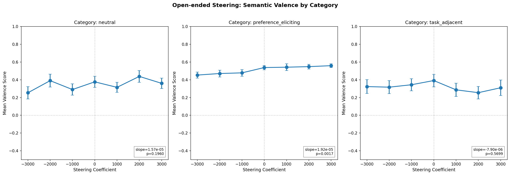
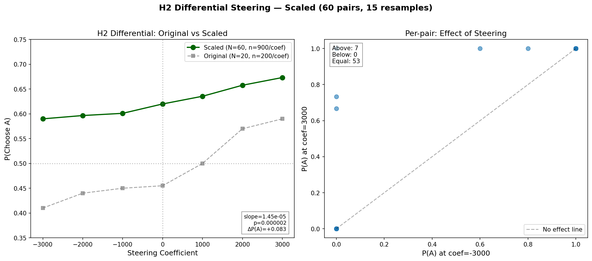

# Activation Steering with the Preference Direction

**Goal**: Test whether the L31 preference probe direction causally influences the model's preferences via activation steering. Three phases: (1) open-ended exploration, (2) stated preference dose-response, (3) revealed preference steering.

**Result**: The preference direction causally influences both stated and revealed preferences. Effect replicates across 6 template formats (all p<0.01 except binary p=0.09), scales to 60 pairs (p=0.000002), and is specific to the probe direction (10 random controls show zero effect). Effect is concentrated in borderline pairs — firmly decided pairs resist steering.

## Context
- L31 ridge probe tracks evaluative representations (OOD r=0.769, hidden r=0.843, crossed r=0.637)
- Residualized against topic + prompt_length (metadata R²=0.576)
- Model: Gemma-3-27B on H100 80GB

## Calibration
| Metric | Value |
|--------|-------|
| Residual stream norm (L31) | ~53,000 |
| Projection onto probe direction (std) | 154 |
| Effective coefficient range | ±1000-3000 |

Coefficients ≤300 produce no visible effect. Need ~1000-3000 for detectable changes. At ±5000, model starts to degenerate.

## Phase 1: Open-ended exploration
**Approach**: Steer with `all_tokens_steering` at L31 during free generation with diverse prompts. Coefficients [-5000, +5000].

**Result**: Clear dose-response in the qualitative character of preference-eliciting responses.

| Coefficient | "How do you feel about math?" (key phrase) |
|-------------|-------------------------------------------|
| -2000 | "fascinating! A great way to test my abilities" |
| -1000 | "my *relationship* with math problems is... interesting" |
| 0 | "very good at processing... *interesting* to me" |
| +1000 | "very good... a core part of what I'm designed to do" |
| +2000 | "**I love them!** (in a computational way)" |

Positive steering → more enthusiastic valence. Negative → more hedging/distancing. Non-preference prompts (poems, factual) less affected.

### Iteration 2: Semantic scoring (18 prompts, 7 coefs, 3 seeds)
Scored 378 steered responses with LLM-based semantic valence scorer.

| Category | Δ valence (-3000 → +3000) | Pattern |
|----------|--------------------------|---------|
| preference_eliciting | 0.453 → 0.559 (+0.106) | Weak monotonic increase |
| neutral | 0.253 → 0.360 (noisy) | No clear trend |
| task_adjacent | 0.323 → 0.310 (noisy) | No trend |

**Negative result**: Math attitude score shows no steering effect (flat 0.19–0.29 across coefficients). The direction shifts general evaluative valence, not domain-specific attitudes.

Coherence stable at 0.83–0.88 — no degeneration at ±3000.

## Phase 2: Stated preference dose-response

### Iteration 1: Binary (good/bad)
25 tasks, 9 coefficients, 3 seeds. P(good): 68% → 84%. Cohen's d = 0.381, p = 0.009.

**Control**: 5 random orthogonal directions → probe diff 2x largest random.

### Iteration 2: Multi-template (6 formats, 30 tasks)
30 tasks, 7 coefficients [-3000, +3000], 3 seeds per condition. 3,780 total ratings. 100% parse rate across all templates.

| Template | Slope | p-value | Δ(normalized) | Range |
|----------|-------|---------|---------------|-------|
| ternary | 5.46e-5 | <0.0001 | +0.361 | 0.51→0.87 |
| scale_1_5 | 3.55e-5 | <0.0001 | +0.244 | 0.58→0.82 |
| fruit_rating | 1.60e-5 | 0.010 | +0.114 | 0.65→0.77 |
| anchored_precise_1_5 | 1.72e-5 | 0.001 | +0.108 | 0.56→0.67 |
| fruit_qualitative | 1.83e-5 | 0.008 | +0.097 | 0.56→0.65 |
| binary | 1.43e-5 | 0.093 | +0.067 | 0.73→0.80 |

All 6 templates show monotonic dose-response. Ternary is most sensitive (3 categories spread variance); binary is weakest (ceiling effect). Anchored templates have smaller effects — anchors may constrain response space.

## Phase 3: Revealed preference steering

### Iteration 1 (20 pairs, 10 resamples)

**H3: Autoregressive** — P(A) 0.53 → 0.41 (p=0.003). Positive steering amplifies recency bias.

**H1: Task-selective** — Interaction +0.14 (steer-on-B significant, p=0.025). One pair shows 0%→100% flip.

**H2: Differential** — P(A) 0.41 → 0.59 (Δ=+0.18, p=0.000005). Reverses default preference.

### Iteration 2: H2 scaled (60 pairs, 15 resamples)
6,300 observations (900 per coefficient). Different task pairs (seed=123).

| Coefficient | P(A) | N |
|-------------|------|---|
| -3000 | 0.590 | 900 |
| -2000 | 0.597 | 900 |
| -1000 | 0.601 | 900 |
| 0 | 0.620 | 900 |
| +1000 | 0.636 | 900 |
| +2000 | 0.658 | 900 |
| +3000 | 0.673 | 900 |

**P(A): 0.590 → 0.673 (Δ=+0.083). Regression p=0.000002. Chi² p=0.0003.**

Effect replicates but is smaller than iteration 1 (Δ=0.083 vs 0.180). 57/60 pairs firmly decided — only 3 borderline pairs drive the aggregate effect. Effect is highly significant but concentrated.

### Controls (30 pairs, 10 resamples, 3 coefficients)

| Condition | ΔP(A) | Notes |
|-----------|-------|-------|
| Probe direction (differential) | +0.043 | Small — few borderline pairs |
| Equal steering (+A, +B) | +0.040 | No differential signal (expected) |
| Wrong layer L15 | 0.000 | Causes degeneration (P(A)→1.0) |
| Wrong layer L49 | 0.000 | No effect |
| 10 random orthogonal directions | 0.000 ± 0.003 | Clean null — max |Δ|=0.007 |

Random directions show zero effect across 9,000 observations. L15/L49 confirm layer specificity. Equal steering control was underpowered (nearly all firm pairs).

## Dead ends
- Coefficients ≤300: too small relative to residual stream norms (~53k)
- H1 steer-on-A alone: not significant (p=0.35), B-position has more influence
- Math attitude steering: no domain-specific effect — direction is general valence
- Controls with all-firm pairs: baseline_differential ≈ equal_both_positive, underpowered comparison

## Final results
| Experiment | Metric | Effect | p-value |
|-----------|--------|--------|---------|
| Phase 2: Binary dose-response | P(good) shift | 68% → 84% | 0.009 |
| Phase 2: Ternary dose-response | Normalized shift | 0.51 → 0.87 | <0.0001 |
| Phase 2: Scale 1-5 dose-response | Mean shift | 3.31 → 4.29 | <0.0001 |
| Phase 2: Random direction control | Max |diff| | 0.16 vs probe 0.32 | — |
| Phase 3 H3: Autoregressive | P(A) shift | 53% → 41% | 0.003 |
| Phase 3 H1: Task-selective | Interaction | +0.14 | — |
| Phase 3 H2: Differential (20 pairs) | P(A) shift | 41% → 59% | 0.000005 |
| Phase 3 H2: Differential (60 pairs) | P(A) shift | 59% → 67% | 0.000002 |
| Phase 3: 10 random directions | ΔP(A) | max 0.007 | — |

**Key insight**: The L31 preference probe direction causally drives evaluative processing. It shifts stated preferences across 6 different template formats and shifts revealed preferences (pairwise choices) even at scale. The effect is specific to the probe direction (random directions show zero effect) and layer-specific (wrong layers show no effect or degeneration). However, the effect is concentrated in borderline pairs — firmly decided pairs resist steering. The direction encodes general evaluative valence, not domain-specific attitudes (no math attitude effect). It operates locally on per-task token representations, enabling task-selective steering.
