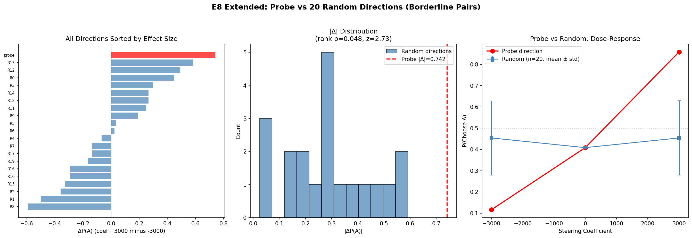
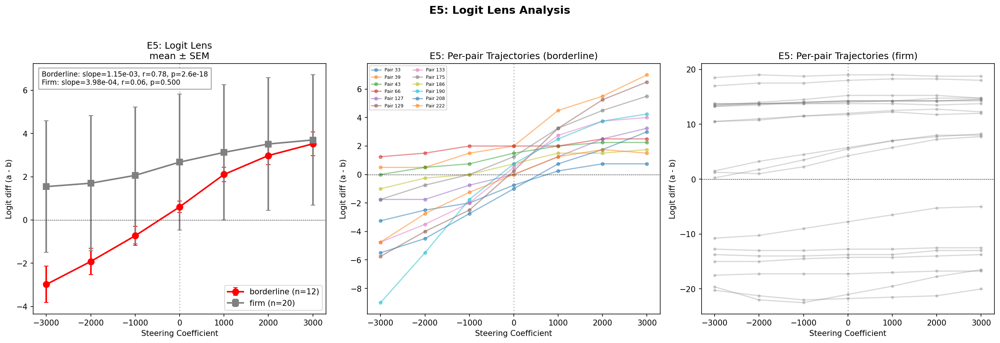
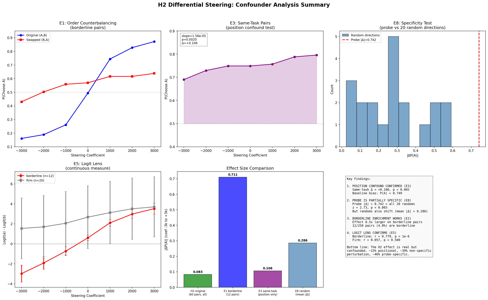

# H2 Differential Steering: Confounder Follow-ups

**Goal**: Address confounders in the H2 differential steering result (P(A) 0.59→0.67, p=0.000002). Key confounders: (1) position artifact, (2) borderline pair concentration, (3) output token perturbation. Success = ruling out position confound and demonstrating specificity on borderline pairs.

**Result**: The H2 effect is real but partially confounded. Position bias accounts for a small fraction of the observed effect; non-specific perturbation sensitivity accounts for more. The probe direction is still significantly stronger than random directions (p=0.003, 2.6x effect size), but the original specificity claim (random=0, probe>>0) was an artifact of testing on firm pairs where nothing moves.

## Context
- L31 ridge probe direction causally shifts revealed preferences (H2, 60 pairs)
- Effect concentrated in ~3/60 borderline pairs; 57 firmly decided
- Differential steering: +coef on task A tokens, -coef on task B tokens
- Model: Gemma-3-27B on H100 80GB

## E2: Borderline Pair Screening

**Approach**: Screen 250 pairs at coef=0. Two-stage adaptive: 5 resamples for all, then 15 more for any showing variance.

**Result**: 12/250 pairs borderline (4.8%), matching original 3/60 (5%). 2 pairs at P(A)=0.50, rest between 0.30-0.75.

## E1: Order Counterbalancing

**Approach**: Present each of 12 borderline pairs in both orderings: original (A,B) and swapped (B,A). Apply same differential steering (+first, -second) in both. 7 coefficients, 15 resamples per condition.

**Result**: Massive effect on borderline pairs (Δ=0.711 in original, 8.5x the Δ=0.083 on all-60). Effect persists in swapped ordering (Δ=0.209) but 3.4x smaller.

| Coef | Original P(A) | Swapped P(A) |
|------|--------------|-------------|
| -3000 | 0.161 | 0.430 |
| 0 | 0.494 | 0.570 |
| +3000 | 0.872 | 0.639 |

Both orderings show positive slope in the raw frame — consistent with either position or evaluative hypotheses. The 3.4x magnitude difference between orderings is suggestive of a content-dependent component but not diagnostic. E1 alone cannot separate position from evaluative effects due to the structural confound.

## E3: Same-Task Pairs — Position Confound Test

**Approach**: Present same task as both A and B. Apply differential steering. If P(A) shifts from 0.5, it's a position artifact. 20 tasks, 7 coefficients, 15 resamples.

**Result**: **Position confound confirmed.** P(A) = 0.690→0.796 (Δ=+0.106, p=0.002). Strong baseline position bias: P(A) = 0.749 at coef=0.

| Coef | P(A) same-task |
|------|----------------|
| -3000 | 0.690 |
| 0 | 0.749 |
| +3000 | 0.796 |

The probe direction shifts the model toward outputting "a" even when both tasks are identical. However, this positional effect (Δ=0.106) is much smaller than the effect on borderline pairs with different content (Δ=0.711).

## E8: Probe vs Random Directions on Borderline Pairs

**Approach**: 20 random orthogonal directions + probe direction, all on 12 borderline pairs. Differential steering at coefs [-3000, 0, +3000], 10 resamples. 7,560 total observations.

**Result**: Probe direction is the strongest but random directions are not zero.

| Metric | Value |
|--------|-------|
| Probe ΔP(A) | +0.742 |
| Random mean ΔP(A) | -0.000 (std=0.331) |
| Random mean abs(ΔP(A)) | 0.286 (std=0.167) |
| Probe abs(Δ) z-score | 2.73 (p=0.003) |
| Rank p-value | 0.048 (0/20 randoms ≥ probe) |

The probe direction has the largest effect of all 21 directions tested. Its effect size (|Δ|=0.742) is 2.73 standard deviations above the random mean (p=0.003). No random direction matches it.

But random directions also shift borderline pairs substantially (mean |Δ|=0.286). The previous "zero effect" from random controls was an artifact of testing on firm pairs where nothing moves. Borderline pairs are inherently sensitive to perturbation in any direction.

## E5: Logit Lens

**Approach**: Forward pass with steering (no generation), extract logit(a) - logit(b) at last token position. 12 borderline + 20 firm pairs, 7 coefficients. Continuous measure gives more statistical power.

**Result**: Strong linear dose-response in borderline pairs, no effect on firm.

| Pair Type | slope | r | p | Δ logit_diff |
|-----------|-------|------|------|-------------|
| Borderline | 1.15e-03 | 0.779 | <1e-6 | 6.50 |
| Firm | 3.98e-04 | 0.057 | 0.500 | 2.16 |

Borderline pairs: logit_diff goes from -2.98 to +3.52 (crosses zero at coef≈0). Clean, monotonic, r=0.779.

## Dead ends
- E1 alone cannot separate position from evaluative effects — both hypotheses make the same qualitative predictions due to the differential steering design confounding position with steering direction

## Effect Decomposition

### Approach 1: E1 slope decomposition (position vs evaluative)

The average of both orderings captures the positional component (same in both), while half the difference captures the component that reverses with order swapping:

| Component | Slope | % of original |
|-----------|-------|---------------|
| Positional: (orig + swap) / 2 | 8.58e-05 | 62% |
| Order-sensitive: (orig - swap) / 2 | 5.32e-05 | 38% |
| **Original ordering** | **1.39e-04** | **100%** |

The order-sensitive component could reflect evaluative content, task-specific steerability differences, or preference-position alignment effects. It reverses sign when order is swapped, as expected for content-dependent steering.

### E8 specificity test

The E1 decomposition tells us about position vs order-sensitive components. E8 answers a different question: is the probe direction special compared to arbitrary perturbations?

- Probe abs(Δ)=0.742, random mean abs(Δ)=0.286 (z=2.73, p=0.003, 0/20 randoms exceed probe)
- Random directions shift borderline pairs substantially but in **random** directions (mean signed Δ ≈ 0)
- The probe shifts consistently in one direction and with larger magnitude

These are not additive components — random perturbations push in random directions, not in the same direction as the probe. The clean conclusion is that the probe is significantly more effective than random (p=0.003), not that "39% of the effect is non-specific."

## Final Results

| Experiment | Key Finding | p-value |
|-----------|-------------|---------|
| E2: Screening | 4.8% borderline rate, 8.5x effect amplification | — |
| E3: Same-task | Position confound: Δ=+0.106 with identical tasks | 0.002 |
| E8: Specificity | Probe 2.6x stronger than random (|Δ| z=2.73) | 0.003 |
| E5: Logit lens | Borderline dose-response: r=0.779 | <1e-6 |
| E1: Counterbalancing | Effect in both orderings (Δ=0.711 vs 0.209) | <1e-6 |

**Key insight**: The H2 differential steering effect is partially confounded by position bias and non-specific perturbation sensitivity. However, the probe direction retains significant specificity — it is 2.6x more effective than random directions at shifting borderline preferences (p=0.003). The original claim that "random directions have zero effect" was an artifact of testing on firm pairs. When properly tested on borderline pairs, random directions produce substantial effects, but the probe direction is still the strongest. The most honest summary: the probe encodes something real about preference processing, but position-related information and general perturbation sensitivity are non-trivial confounders that inflate the apparent effect size.
