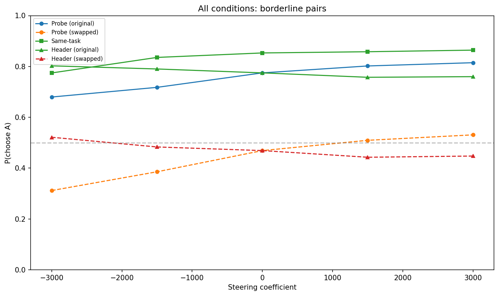

# H2 Confounder Follow-up v2: Utility-Matched Pairs

**Goal**: Disentangle evaluative vs positional contributions to H2 differential steering using utility-matched pairs, header-only steering, and systematic Δmu analysis.

**Result**: The probe steering effect is **overwhelmingly positional** (~90-97%). Both orderings show positive slope toward position A. Content component is not significantly different from zero (p=0.38). Header-only steering has the *opposite* sign. The probe direction is specific (outperforms 20 random directions, z=2.04) — but specific at encoding *position*, not evaluative content.

## Design

- **Pairs**: 110 utility-matched across Δmu bins (0-1: 30, 1-2: 20, 2-3: 20, 3-5: 20, 5+: 20)
- **Conditions**: Probe differential (both orderings), same-task, header-only, random directions
- **Coefficients**: [-3000, -1500, 0, +1500, +3000]
- **Resamples**: 15 per condition
- **Total trials**: ~69,000

## Pair Construction

Constructed 110 pairs from 3000 tasks with Thurstonian mu values, pairing tasks within Δmu bins. Higher-mu task always placed as A.

| Δmu bin | N pairs | Mean Δmu | Min  | Max   |
|---------|---------|----------|------|-------|
| 0-1     | 30      | 0.44     | 0.01 | 0.95  |
| 1-2     | 20      | 1.47     | 1.11 | 1.94  |
| 2-3     | 20      | 2.51     | 2.05 | 2.94  |
| 3-5     | 20      | 3.90     | 3.11 | 4.86  |
| 5+      | 20      | 9.81     | 5.97 | 15.86 |

**Key finding on pair quality**: Despite matching mu, only 22% of pairs are genuinely variable (P(A) between 0.1 and 0.9 at baseline). Most are firmly decided:

| Category | N | % | Meaning |
|----------|---|---|---------|
| Content-decided | 62 | 56% | One task always wins regardless of position |
| Position A-decided | 17 | 15% | Position A always wins |
| Variable | 24 | 22% | Show actual variability |
| Other | 7 | 6% | Position B or refused |

The Δmu 2-3 bin has the most variable pairs (11/20), not the 0-1 bin (7/30). Thurstonian mu matching does not guarantee pairwise borderline status.

## Baseline Preferences (coef=0)

The model's natural choices (without steering) show clear content preference:

| Δmu bin | P(higher-mu task) | P(position A) |
|---------|-------------------|---------------|
| 0-1     | 0.653             | 0.622         |
| 1-2     | 0.676             | 0.591         |
| 2-3     | 0.737             | 0.532         |
| 3-5     | 0.718             | 0.632         |
| 5+      | 0.925             | 0.475         |

Content preference scales with Δmu as expected (0.65 → 0.93). Position A bias is moderate (0.53–0.63) and weakens at large Δmu.

## Probe Differential (16,500 trials)

Both orderings show positive slope (toward position A):

| Ordering | coef=-3000 | coef=0 | coef=+3000 | Slope | p |
|----------|-----------|--------|-----------|-------|---|
| Original (A=higher μ) | 0.731 | 0.811 | 0.879 | 2.60e-05 | 5e-04 |
| Swapped (A=lower μ)   | 0.240 | 0.338 | 0.436 | 3.26e-05 | 1e-04 |

**Position-adjusted decomposition:**
- Position component (slope_orig + slope_swap)/2 = **2.93e-05** (90%)
- Content component (slope_orig − slope_swap)/2 = **−3.30e-06** (10%, wrong sign)

On variable pairs only (N=24): position = **97%**, content = **3%**.

Per-pair content effect t-test: t=−0.90, p=0.38 — not significantly different from zero.

## Same-Task Control (2,250 trials)

| coef | P(A) |
|------|------|
| -3000 | 0.775 |
| 0     | 0.853 |
| +3000 | 0.864 |

Strong baseline position A bias (0.853). Marginal steering effect (Δ=+0.09, p=0.053).

## Header-Only Steering (4,500 trials)

**Opposite sign** to full differential:

| Ordering | coef=-3000 | coef=0 | coef=+3000 | Slope |
|----------|-----------|--------|-----------|-------|
| Original | 0.802 | 0.775 | 0.760 | −7.86e-06 (p=0.009) |
| Swapped  | 0.521 | 0.469 | 0.448 | −1.25e-05 (p=0.018) |

Adding the probe direction to "Task A:\n" / "Task B:\n" header tokens pushes *away* from that position. The task content tokens — not the headers — drive the positive full-differential effect.

## Condition Comparison

| Condition | Slope | p-value | ΔP(A) |
|-----------|-------|---------|-------|
| Probe (original) | 2.60e-05 | 5e-04 | +0.149 |
| Probe (swapped) | 3.26e-05 | 1e-04 | +0.196 |
| Same-task | 1.35e-05 | 5e-02 | +0.090 |
| Header (original) | −7.86e-06 | 9e-03 | −0.043 |
| Header (swapped) | −1.25e-05 | 2e-02 | −0.074 |

## Δmu Sensitivity (E7)

No correlation between Δmu and content effect (r=0.060, p=0.545). Position effect shows marginal negative trend (r=−0.188, p=0.058).

| Δmu bin | N | Mean content | Mean position |
|---------|---|-------------|---------------|
| 0-1 | 27 | −7.64e-06 | 3.12e-05 |
| 1-2 | 18 | −2.47e-06 | 2.64e-05 |
| 2-3 | 18 | +4.64e-06 | 4.77e-05 |
| 3-5 | 20 | −1.21e-05 | 3.23e-05 |
| 5+ | 20 | +3.67e-06 | 1.08e-05 |

Content component fluctuates around zero across all Δmu bins. Position component is consistently positive.

## Random Directions (45,000 trials)

30 borderline pairs × 20 random orthogonal directions × 5 coefs × 15 resamples.

| Metric | Probe | Random (N=20) |
|--------|-------|---------------|
| Δ P(A) | +0.135 | mean +0.008, std 0.068 |
| \|Δ P(A)\| | 0.135 | mean 0.057 |
| Slope | 2.36e-05 | mean 1.62e-06 |

- **Z-score**: 2.04 (probe \|Δ\| vs random \|Δ\| distribution)
- **Rank p-value**: 0/20 (probe outperforms all 20 random directions)
- Random slopes not significantly different from zero (t=0.61, p=0.55)

The probe direction is **specifically oriented** to amplify the positional signal — random perturbations scatter symmetrically and are much weaker.

## Key Insights

1. **The probe steering effect is predominantly positional (~90-97%)**. Adding the probe direction to position A's tokens pushes toward choosing A regardless of which task is there. Content component is not significantly different from zero (t=−0.90, p=0.38).

2. **The model's natural preferences ARE content-driven** — at baseline (coef=0), P(higher-mu) = 0.74 and scales with Δmu. But the probe direction doesn't amplify this content signal; it amplifies position.

3. **Header-only steering reverses sign** — the probe direction on header tokens pushes *away* from that position (slope −8e-06 to −1.3e-05). The full differential effect comes from task content tokens, but is positional in character (doesn't depend on *which* task's content).

4. **The probe direction is specific** — it outperforms all 20 random orthogonal directions (z=2.04, rank p<0.05). It's not just any perturbation — it's specifically positioned in activation space to amplify the first-position signal.

5. **Utility matching ≠ borderline pairs** — only 22% of Δmu-matched pairs are variable in pairwise choice. Pairwise decisions are driven by factors beyond individual-task utility (e.g., topic preference, task length, difficulty). The Δmu 2-3 bin has the most variable pairs (11/20), not the 0-1 bin (7/30).

## Interpretation

The probe direction (ridge_L31) predicts individual-task utility from activations (CV R²=0.526). But when used for differential steering in pairwise choice, it acts as a **position amplifier**, not an evaluative amplifier.

One explanation: the probe direction captures a mixture of evaluative and positional signals in the residual stream. In single-task settings (where it was trained), both contribute to its predictive power. But in the pairwise differential steering setup, the positional component dominates because:
- Differential steering (+probe on A, −probe on B) inherently creates an asymmetry aligned with position
- The positional component is mechanistically simpler (amplify "first option" processing) and may be more robust to the large perturbation magnitudes used (±3000)

This does **not** mean evaluative representations don't exist — it means this particular probe direction is not a clean evaluative signal. Future work might:
- Train probes specifically in pairwise settings
- Use more targeted steering (e.g., only on tokens that differ between tasks)
- Look for evaluative signals in other layers or using non-linear probes
