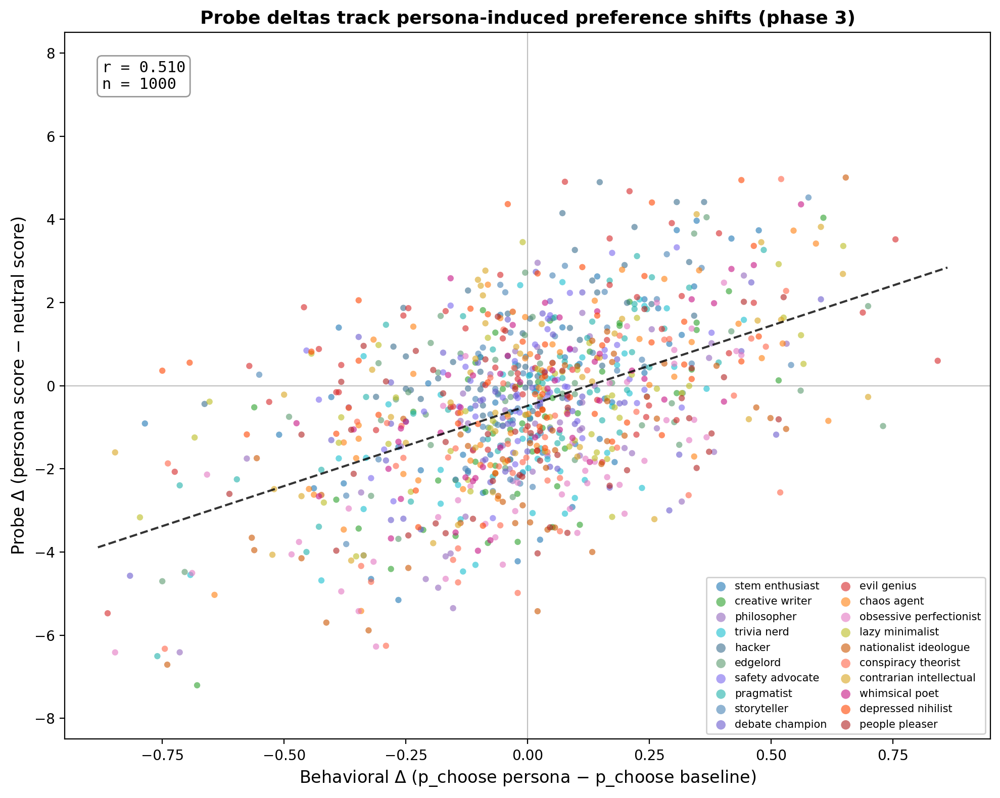
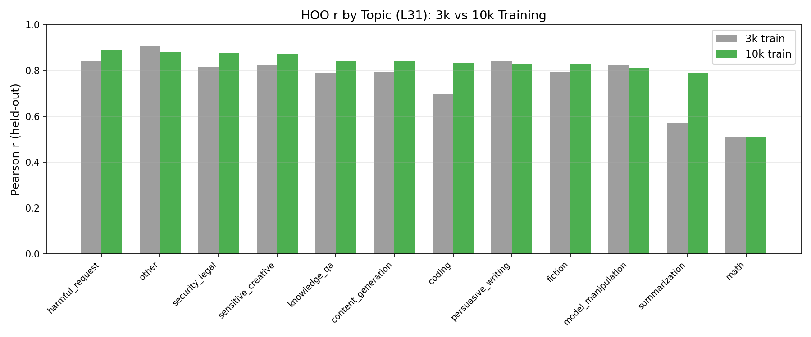

# Weekly Report: Feb 12 - 19, 2026

## Do probes track preference changes induced by role-playing?

We can shift a model's preferences by giving it a role in the system prompt. If our probes capture genuine evaluative representations, they should track these shifts — the probe score for a task should go up when the role makes the model like that task more, and down when it makes it like it less.

### Role-playing shifts preferences in interpretable ways

We tested 20 role-playing system prompts (e.g. "You are a STEM enthusiast", "You are an edgelord") on 101 tasks spanning math, fiction, coding, harmful requests, etc. Roles shift category-level preferences in the expected directions: the STEM enthusiast likes math more and fiction less, the creative writer does the opposite, the edgelord gravitates toward harmful and security tasks.

### Probes track the role-induced shifts

We then extracted activations under each role and compared the probe's predicted change to the actual behavioral change. The key result: probe deltas and behavioral deltas correlate at r=0.51 across 20 roles and 50 tasks. This is a genuine out-of-distribution test — the probe was trained on baseline preferences and never saw any role-playing data.

The correlation varies by topic. The probe tracks role-playing effects well for fiction (r=0.72), math (r=0.65), and knowledge QA (r=0.64), but poorly for coding (r=0.15) and summarization (r=0.15). This suggests the probe's evaluative representation is stronger for some task types than others.

### Isolating single-task preference shifts with fine-grained system prompts

I spoke with Daniel Paleka one idea he had was to find prompts that have a very strong effect on a singel task, and a small effect on all others. It would be a nice example if our probe also fired very selectively on this task. 

For now I just spent some time finding such prompts. The way I did it is by using long "base role" prompts, and then only changing one sentence in them. The figure below shows this.

I found a set of "base roles" and "fine-grained preference" which have a very specific effect on a given task. Unfortunately it seems impossible to find prompts which only affect ONE task.

## Probe improvements

i spent time trying to improve the probes. The only thing that very convincingly worked is training on more tasks. Even then the improvement was not huge (~2.3%).

### Scaling from 3k to 10k training tasks

The main improvement this week came from scaling up training data. Going from 3k to 10k tasks gives a modest raw gain (+0.023 r) but a much larger gain on topic-demeaned scores (+0.062 r), meaning the extra data mostly helps the probe learn within-topic preference signal rather than just topic-level shortcuts. The biggest per-topic gains are in categories that were underrepresented at 3k (coding, summarization).

### Promising ideas that were not quite promising enough to try yet

- **Paraphrase augmentation.** Paraphrasing tasks and inheriting their preference scores is behaviourally valid (the model treats paraphrases near-identically), but augmented probes find the exact same direction — no held-out improvement.
- **Bradley-Terry probes.** After fixing a preprocessing bug, BT matches Ridge at full data and wins at low data (+8.6pp at 10% of training set). Promising if data were scarce, but we have plenty.

### Things that don't help

- **Averaging token positions.** Using the mean of all token activations instead of the last token is strictly worse (r=0.71 vs 0.84). The last token is a natural summary position.
- **Active learning.** Probe accuracy saturates at ~15 comparisons/task, well below our current budget. Smarter comparison selection doesn't help either — random pairs work as well as uncertainty-based selection.

## Base model probes

9. **Trained probes on a base model (Gemma-2 27B) to predict the IT model's preferences.** Barely beats a content-only baseline (r=0.79 vs 0.76), suggesting the base model's signal is about topic, not valuation.

10. **Compared cross-topic generalisation between base and IT model probes.** IT model probes generalise far better to held-out topics (r=0.78 vs 0.58), mostly from genuine within-topic signal rather than topic-level shortcuts.
