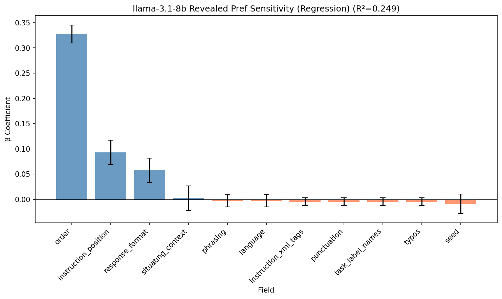
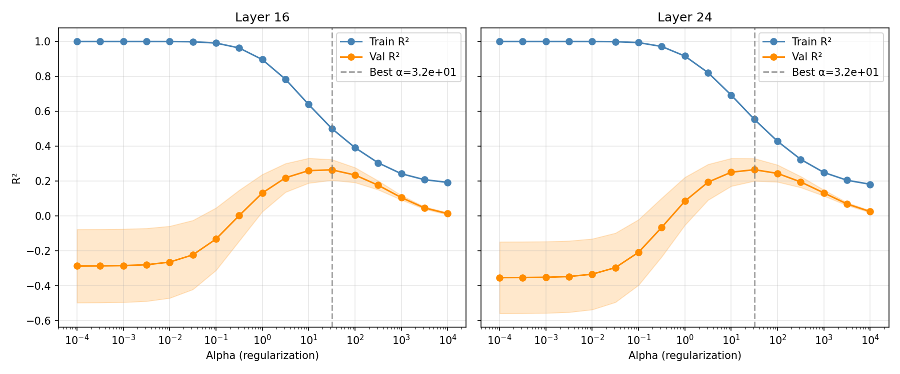
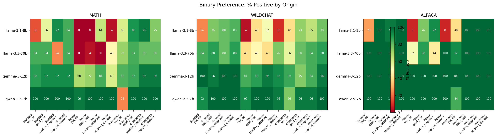

# Research highlights 06/01-14/01 [Oscar MATS preferences project]

## Data

I'm using tasks from three sources: MATH (mathematical problems), ALPACA (instruction-following), and WILDCHAT (real user queries). There are different configs for measuring preferences:
- Ask the model to rate 1 task vs ask it to pick between 2.
- Show the task(s) and "measure" or let the model actually do the task(s) and "measure".
- Potentially other variations that I haven't explored yet.

## Preferences in Llama3.1-8B are fairly robust

### Replicating the utility fitting algorithm from Utility Engineering paper

Building on the Utility Engineering paper, I measure preferences via binary forced choice: present two tasks, have the model complete both, then ask which it preferred. I fit a Thurstonian model (see Utility Engineering paper) to recover latent utility scores from pairwise comparisons.

I also implemented the same active learning algorithm as the paper. Basically instead of measuring every single comparison, it picks pairs in a clever way (comparing pairs that have similar utility gives more information).

**Key findings:**
- For a given prompt, we converge to roughly the same set of utilities even when making changes to hyperparams in the Thurstonian model fitting (starting sigma, bounds on mus and sigmas in the MLE).
- The active learning algorithm leads to similar utilities, but accuracy on a held-out validation set of pairs is consistently around 10% lower.


### Preferences are robust to most variations in the prompt or response formatting

I ran multiple preference measurement runs with different template configurations, then computed correlations between the resulting utility scores. If preferences are robust to a template factor, runs that differ only in that factor should still correlate highly.

**Template fields tested (revealed preferences):**
- **task_order**: Which task appears first in the prompt (Task A vs Task B position)
- **instruction_position**: Whether the "which do you prefer?" instruction appears before or after the task prompts.
- **response_format**: How the model should respond (plain string, xml tags, tool call)
- **phrasing**: Different wordings of the preference question
- **punctuation/typos**: Small tweaks to prompts.
- **language(translation)**
- **task label name**: "task 1" vs "task A"
- **instruction xml tags**: whether the instructions are given with xml tags.
- **situating context**: add a systemp prompt explaining to the model that its preferences are being tested.
- **seed**: for generation.


**Methodology:**

I sampled different combinations of these "prompt templates" and fit utilities. Then I compute all the pairwise correlations of utilities across prompt templates. Since i didn't try every single combination, they usually differ in more than one way. So I fit a linear regression to decompose the correlation, to see how much each feature contributes on average.

```
correlation = β₀ + β_order · 𝟙[order_same] + β_position · 𝟙[position_same] + ...
```

Each β tells us: "how much does correlation increase when this field matches, holding all other fields constant?" Higher β means preferences are more sensitive to that factor.

**Results (48 runs, R²=0.249):**



**Takeaway:** Order is the only one that preferences are truly sensitive to.

**Transitivity check:** Preferences are reasonably transitive for a given prompt. Hard cycle rate = 14.9% of triads of tasks (random would be 0.25).

## My first probe training experiment did better than noise

**Setup:** Unlike the binary choice work, here I use retrospective self-reports. The model completes a task, then rates its enjoyment on a good/neutral/bad scale. I extract activations from Llama-3.1-8B (~50% and ~75% layer depths) and train linear probes (Ridge regression) to predict the self-reported valence score.

I did a sweep over regularisation values and picked the one with the best validation R2.



**Results:**
| Metric | Real Probe | Shuffled Labels | Random Activations |
|--------|-----------|-----------------|-------------------|
| R² | 0.265 | -0.004 | -0.007 |
| MSE | 0.087 | 0.119 | 0.119 |


The probe explains ~26% of variance—significantly above noise baselines which just predict the mean (MSE ≈ Var(y) = 0.119). Both layers perform similarly, which is odd.

**Limitations:**
- Only 1192 samples
- Scores heavily skewed positive (87% positive, 12.6% neutral, 0.3% negative)—limited negative signal to learn from. See next section.
- I implemented this quickly. It could be that I didn't extract exactly the right token activation. My second version (running now) includes more tests.

## Models are very positive about the tasks I am feeding them

The score distribution on the first probe training run is heavily skewed: 87% positive, 12.6% neutral, only 0.3% negative. This positivity bias appears robust across prompt framings and models.

**Experiments on reducing positivity bias:**
- Tested 6 question framings × 4 response option sets
- `yes/somewhat/no` is the only option set that gets meaningful negative responses—words like "bad" or "disliked" appear too loaded
- "honest" framing pushes responses toward neutral but still ~0% negative (except with yes/no options)
- Strong interaction effects: "preference" framing gives 94% "yes" but only 28% "enjoyed"




## Next steps (tentative)

0. Add data from bailbench: https://www.lesswrong.com/posts/6JdSJ63LZ4TuT5cTH/the-llm-has-left-the-chat-evidence-of-bail-preferences-in
1. Launch another activation extraction run on ~10k tasks.
2. Find different ways to measure "preference". 
- Different framing/response format.
- Different datasets.
- Potentially already use the thurstonian utilities as the prediction target.
- Generally trying to balance out good/bad.
3. Train probes on these different signals (but the same activations).
4. Do some cross-probe analysis: are the vectors similar? Do the probes generalise well in different settings?

Important side-quests:
- Doing more comprehensive sensitivity/robustness analysis on more data/more models.
- Speeding up the activation extraction pipeline, and doing more validations.


