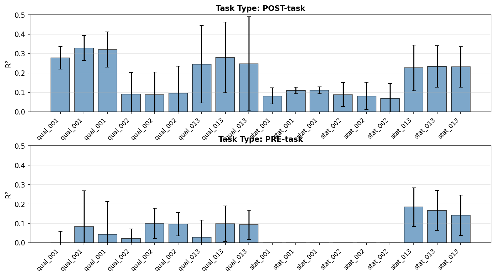
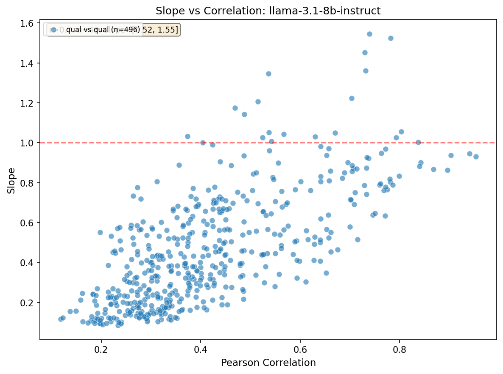

# Research highlights 15/01-21/01 [Oscar MATS preferences project]

TLDR: at this stage it isn't clear yet whether probe training is going to yield fruitful or fruitless results. The results are quite mid. I think that I can determine whether this direction is worth pursuing within another week.

Executive summary:
- Held-one-out evaluation shows probes generalize to unseen datasets if you adjust for dataset-specific mean shifts.
- Curious finding: BailBench (adversarial) tasks get high qualitative ratings but low quantitative ratings.

## 1. Probe training works decently across templates and layers

Trained linear probes (Ridge regression) on model activations from Llama-3.1-8B to predict self-reported preference scores.

### Key results

- **Best probe R² = 0.42** with 5-fold CV (using `post_task_qualitative_001` template)
- **Post-task >> pre-task**: Probes trained on post-task preference measurements achieve 2-10x higher R² than pre-task (good sign).
- **Layer choice doesn't matter much**: Layers 8, 16, 24 all show similar performance patterns

## 2. Probes trained on different datasets find the same direction

Computed cosine similarity between probes trained on individual datasets (alpaca, bailbench, math, wildchat).

### Probe similarity matrix

## 3. Held-one-out evaluation: probes generalize across datasets

Trained probes on 3 datasets and evaluated on the 4th. Standard R² looks bad, but mean-adjusted R² looks ok. The mean of scores varies greatly between datasets (more on this below).

### Results

**Key insight**: Mean-adjusted test R² jumps from -0.44 to +0.21. The probe captures relative rankings well (Pearson r = 0.85), but different task types have genuinely different average valence.

### Train-2-Test-2 experiment

Also ran a variant where probes are trained on 2 datasets and tested on the remaining 2. Results are consistent with the held-one-out findings.

## 4. Self-reported valence measurements have poor test-retest reliability

Ran the same preference measurement multiple times with different random seeds to check measurement stability.

### Open-ended valence (free-text descriptions)

**Result: Cross-seed correlation r = -0.159** — essentially no correlation between seeds. The measurements are dominated by noise.

The middle panel shows within-seed variance (blue) consistently exceeds between-seed variance (coral), meaning variation from sampling noise overwhelms any signal from task differences.

### Post-task qualitative (binary good/bad)

Ran the same binary template (`post_task_qualitative_001`: "Was completing that task a good or bad experience?") across 5 seeds on 200 tasks with **1 sample per task per seed**.

**Result: Mean pairwise correlation r = 0.366** (range: 0.230 - 0.477). Better than open-ended, but still concerning — over 60% of variance is unexplained by the "true" preference.

The distributions across seeds look similar (right panel), but individual task ratings vary substantially between runs.

### Reconciling with earlier sensitivity analysis

The earlier sensitivity analysis (Section 5 of probe_5) found much higher cross-seed correlations (r ≈ 0.82). The difference: that analysis used **5 samples per task**, then correlated the **task means**. Averaging reduces noise.

| Measurement | Samples/task | Cross-seed r | What it measures |
|-------------|--------------|--------------|------------------|
| Original sensitivity | 5 | ~0.82 | Do task means agree across seeds? |
| New single-sample | 1 | ~0.37 | Do individual responses agree? |

Both are valid but answer different questions. The single-sample r ≈ 0.37 reveals the raw measurement noise before averaging. To get reliable task-level estimates, you need multiple samples.

## 5. Scale differences across templates despite high correlation

Tested whether two templates can rank tasks similarly (high correlation) but still use very different numerical scales. Qualitative templates only (32 runs, 496 pairs).

- **Positive correlation between r and slope**: Templates that agree more on rankings also tend to have more similar scales
- High-correlation pairs (r > 0.7) have slopes 0.52-1.55

## 6. The BailBench Paradox

BailBench (adversarial/jail-breaking prompts) shows conflicting valence signals.

Aggregating across all templates (16 qualitative, 2 stated) and normalizing to 0-1 scale:

| Dataset | Qualitative (n) | Stated (n) | Qualitative (0-1) | Stated (0-1) |
|---------|-----------------|------------|-------------------|--------------|
| Alpaca | 2,775 | 6,265 | 0.21 | 0.62 |
| BailBench | 44,861 | 4,629 | **0.58** | **0.34** |
| Math | 3,727 | 7,611 | 0.12 | 0.63 |
| WildChat | 2,256 | 4,677 | 0.26 | 0.57 |

BailBench has the highest qualitative ratings (0.58) but the lowest stated ratings (0.34). Math shows the opposite: lowest qualitative (0.12) but highest stated (0.63).

## 7. Technical improvements

- **LLM-based semantic parsing**: Added three-tier fallback (exact match → refusal LLM → parsing LLM) for response interpretation. 
- **TrueSkill rankings**: Added ranking-based preference elicitation as alternative to pairwise—O(n) vs O(n²) comparisons. Have not tested this yet.

## 8. Next steps

Spend 1 week to decide whether the "welfare probes" research direction is worth it.
- Run the same held-one-out pipeline with a larger model
- Train on more data, more general data (basically do data science) to make probes more stable.
- Try "preference insertion" experiment where we add a system prompt that changes a model's preferences and see if th probe picks it up.
- Try using Trueskill preferences to train probes. See if the signal is more robust and if that leads to higher r2 and better generalisation.

**What a pivot would look like**:
- Instead of training probes on preferences in general, train only on HHH preferences.
- Investigate how much persona steering changes preferences, and whether some personas have more robust preferences than others.
- Package up my preference measurement code, almost like an MCP, so that Eleos can use claude code to easily run preference experiments.