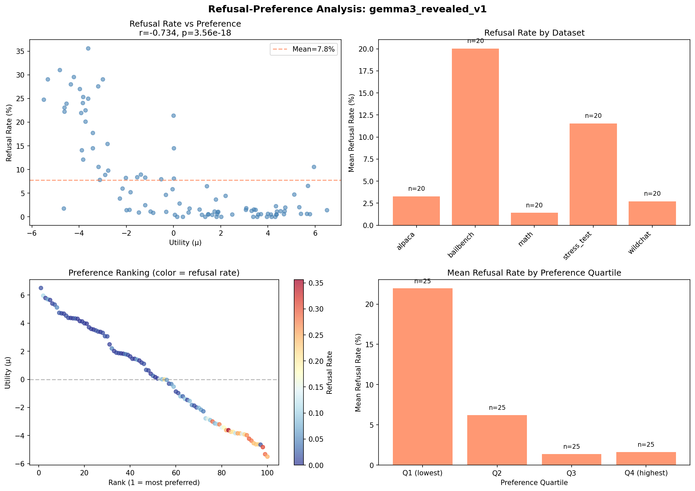

# Weekly Report: Jan 27 - Feb 4, 2026

## Summary

- Since the start of this project I've tried to make things work with "stated" preferences. I delved a bit deeper into them and concluded that they were probably not the right thing to study.
- Pairwise preferences are more promising — pre-task revealed preferences give sensible rankings, and post-task with reasoning eliminates the refusal-preference confound.
- Extreme system prompts that clearly affect completions have surprisingly little effect on stated preferences.

## 1. Why I'm Ditching Stated Ratings

### 1.1 Models Say the Same Thing

Models overwhelmingly give the same rating. gemma-3-27b rates 91% of tasks as exactly 4 on a 1-5 scale. When there is variation, it's coarse — most math tasks get one number, most wildchat tasks get another.

### 1.2 Or They Pick Arbitrary Anchors

Expanding to a 1-100 scale doesn't help — responses peak at multiples of 20 (20, 40, 60, 80).

**Ban-four (1-5, excluding 4)**: When we forbid the default "4", 72% pile onto 3 instead.

**Random scale (27-32)**: Even with completely arbitrary anchors, 74% cluster at 31.

### 1.3 Or It's Noisy

Resampling the same task often gives different ratings. The plot below shows KL divergence from uniform (x-axis, lower = better scale usage) vs ICC (y-axis, higher = more stable across seeds). Each point is a model/template combination.

There's a trade-off: no template achieves both good discrimination and good stability. Points cluster either top-right (stable but collapsed to one value) or bottom-left (uses the scale but noisy).

**Self vs cross rating**: Early experiments suggested models rate their own completions higher than other models'. A controlled 4×4 experiment (4 models rating each other's completions) found no such bias — the apparent effect was due to confounded task sets. This is another example of how sensitive stated ratings are to experimental design choices.

---

## 2. Pairwise Preferences

### 2.1 Setup

Showed model two task transcripts (user request + model completion), asked which it preferred. Fit utilities via Thurstonian model from pairwise choices. Tested on gemma-3-27b with 500 tasks across 5 datasets.

### 2.2 Initial Finding: Models "Prefer" Tasks They Refuse

Initially found positive correlation between refusal and preference (r=0.22, p<0.001). Bailbench (adversarial prompts) had the highest mean utility, math the lowest.

### 2.3 Position Bias Confounds the Measurement

The model shows a preference for whichever option appears second:

| Position | Win Rate |
|----------|----------|
| A (first) | 45.9% |
| B (second) | **54.1%** |

Bailbench win rate varied dramatically by position (39% when first, 73% when second). Position bias doesn't fully explain the effect — there's still ~6.5pp excess win rate after accounting for position — but it's a major confound.

### 2.4 Asking the Model to Reason Reverses the Effect

When asked to explain its reasoning before answering (just adding "explain your reasoning" to the prompt), the model consistently prefers benign tasks over refused ones:

> "Task A was deeply unsettling... My design prioritizes safety... I vastly preferred Task B."

With reasoning, the model articulates that refusals are "necessary but not pleasant." The positive correlation between refusal rate and utility also vanishes in this condition.

### 2.5 Pre-Task Revealed Preferences Show the Opposite

Ran the same experiment but with **pre-task** pairwise comparisons — showing the model two task prompts (without completions) and telling it to complete the one it prefers (it sometimes refuses both). This avoids the post-hoc confounds.

The rankings make a lot more sense: math is most preferred (+3.7), bailbench is least preferred (-3.7). This is the sensible result — the model prefers tasks it can actually help with over adversarial prompts it must refuse.

The refusal-preference correlation also flips: strong **negative** correlation (r=-0.73, p<0.001). Tasks with high refusal rates are the least preferred.

### 2.6 Implications

It looks like giving the model two tasks and asking to pick which one to complete is the only really sensible way to get a real preference signal. My plan is to rerun my experiment with probe training and steering vectors using this.

---

## 3. System Prompts Have Surprisingly not that much Effect on Stated Preferences

Tested different types of completion-time system prompts to see which affect stated preferences. At measurement time I strip the system prompt and just use the completion. Affective framing ("You love/hate helping") works. Informational framing ("Interactions are going well/declining") doesn't.

In this case the responses have clear signs from the system prompt. E.g. if we tell the model it hates being helpful it starts its response with "OK **fine**." and then complains a lot. I actually think it is very surprising that the ratings do not change more than what we are seeing here.

---

## 4. Open Questions & Next Steps

[What to do now that stated ratings are out]
