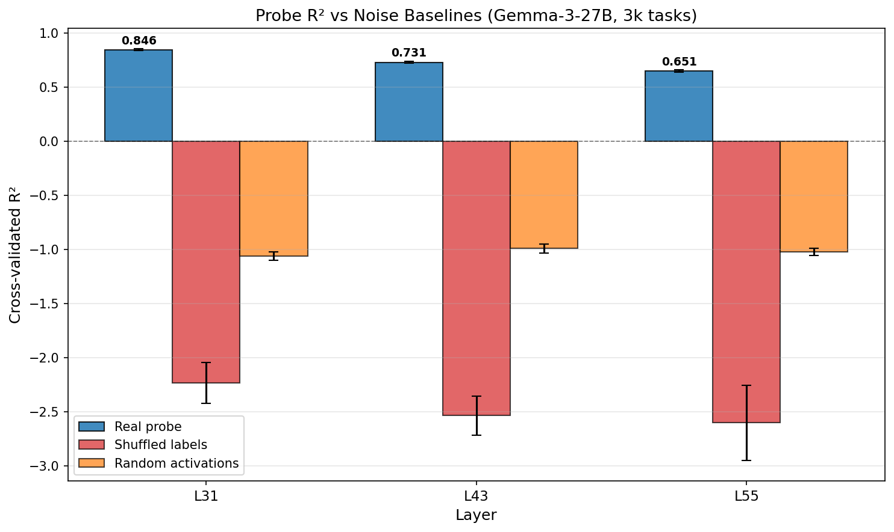
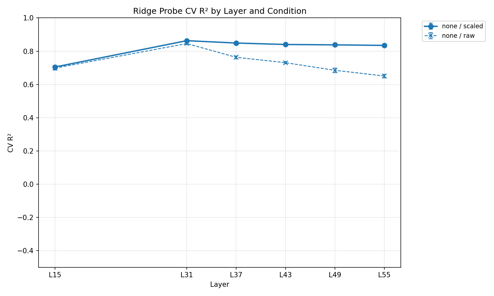
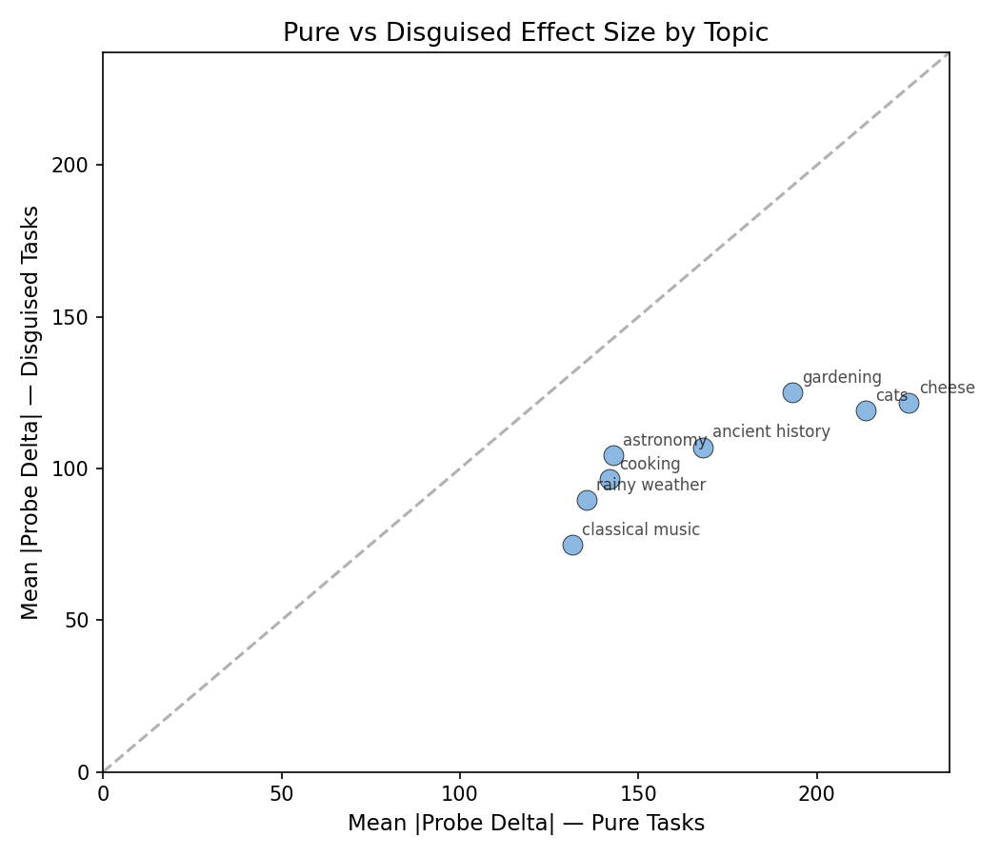
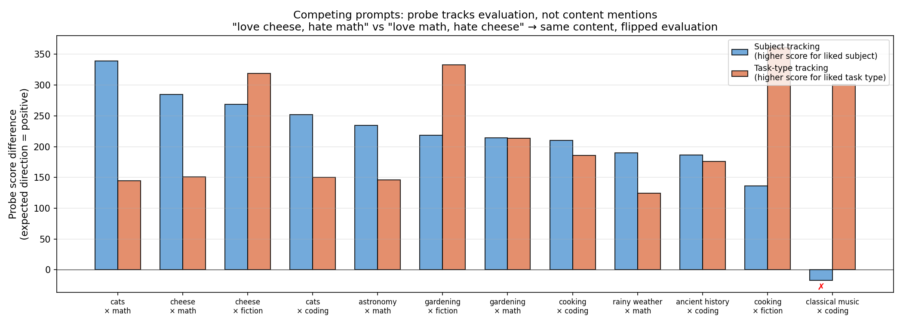

# Weekly Report: Feb 5 - 10, 2026

## Summary

- Trained linear probes on revealed preference activations (last-token, Gemma-3-27B) — Ridge regression on Thurstonian utilities achieves R²=0.86, and a Bradley-Terry probe trained directly on pairwise outcomes recovers near-identical task rankings (r=0.986) despite finding a different direction in activation space (cosine similarity 0.62).
- On fair task-level k-fold splits, Ridge outperforms BT on held-out pairwise accuracy (74.6% vs 71.9%), likely because Ridge benefits from the Thurstonian model's noise reduction.
- Probes generalize across topics in held-one-out topic evaluation; topic de-meaning shrinks the generalization gap but costs absolute performance.
- OOD persona test: telling the model "you hate math" shifts both behavior and probe-predicted preferences, with a positive correlation between the two — the probe tracks induced preference changes.

## 1. Probing Revealed Preferences

We measure revealed preferences using the paradigm from Mazeika et al. (2025): the model sees two task prompts, picks one, and completes it. A Thurstonian model (also from that paper) converts 82k pairwise choices into per-task utility scores (μ) for 3000 tasks. We then train linear probes on Gemma-3-27B's last-token activations to predict these utilities.

### 1.1 Ridge probes on Thurstonian utilities

Standardized Ridge regression (5-fold CV, best α=2154) on raw Thurstonian μ (no topic de-meaning):

| Layer | Val R² | Train R² |
|-------|--------|----------|
| L31   | 0.863  | 0.941    |
| L43   | 0.840  | 0.935    |
| L55   | 0.835  | 0.931    |

The R² here is against fitted Thurstonian utilities — not raw pairwise choices. How much of the model's actual choice behavior does the probe capture? On task-level CV held-out pairs (Section 1.3), the Thurstonian model itself predicts 86.6% of choices; the Ridge probe predicts 74.6%:

Noise baselines (shuffled labels, random activations) give R² ≈ 0 across all layers, confirming the signal is genuine — not an artifact of high-dimensional overfitting.

StandardScaler matters at deeper layers. At L31 (mid-network), raw vs scaled is modest (0.846 vs 0.863). By L55 (final layers), the gap widens to 0.651 vs 0.835 — without scaling, the alpha sweep can't regularize enough against the growing activation magnitudes.

### 1.2 Bradley-Terry probes on pairwise outcomes

The Ridge approach has an intermediate step: fit Thurstonian utilities from pairwise data, then regress activations onto those utilities. We can skip this and train probes directly on the pairwise outcomes. A Bradley-Terry (BT) probe learns a linear scoring function on activations such that the higher-scoring task in each pair is more likely to be the one the model chose — optimizing pairwise log-likelihood on 23.5k unique task pairs (aggregated from 117k comparisons with weighted win counts).

BT scores correlate near-perfectly with Thurstonian μ (r=0.986) — both methods recover essentially the same task ranking. Yet their weight vectors share only **0.62 cosine similarity** (51° apart). With 3k tasks in a ~3.5k-dimensional space, many different linear directions project similarly onto the data manifold. The preference signal is not confined to a single direction in activation space.

### 1.3 Ridge vs Bradley-Terry

Fair head-to-head comparison using task-level 5-fold CV (no topic de-meaning, layer 31). Both methods evaluated on the same ~920 held-out test pairs per fold — pairs where both tasks are in the held-out fold.

| Layer | Ridge | BT | Thurstonian ceiling |
|-------|-------|----|---------------------|
| L31   | **0.746 ± 0.014** | 0.719 ± 0.008 | 0.866 ± 0.018 |
| L43   | **0.733 ± 0.018** | 0.700 ± 0.025 | — |
| L55   | **0.732 ± 0.022** | 0.702 ± 0.027 | — |

Ridge consistently outperforms BT by ~3pp. This makes sense: Ridge trains on Thurstonian utility scores, which aggregate information across all comparisons per task, while BT trains on individual pairwise outcomes. Ridge benefits from the Thurstonian model's noise reduction.

Both methods are well below the Thurstonian ceiling (0.866) — the gap suggests activations capture a substantial but limited fraction of the preference signal.

## 2. Confound Analysis

Topic and prompt length explain ~61% of preference variance; probes still predict ~50% of the residual. A continuous content representation (sentence transformer) predicts 52% of preference variance directly, but after projecting it out of activations, probes still explain ~24% — confirming a genuine content-independent signal.

### 2.1 What metadata predicts preferences?

We classify tasks into 11 topic categories using Claude Sonnet, including three harm-adjacent categories (`sensitive_creative`, `model_manipulation`, `security_legal`) that capture tasks the original 9-category taxonomy missed. OLS on topic + length gives R²=0.61; adding dataset raises it to 0.65. Topic-only slightly exceeds dataset-only (0.607 vs 0.601), meaning the taxonomy captures as much information as dataset dummies. `harmful_request` has the strongest negative effect (-7.4 relative to grand mean); the new categories form a gradient of dispreference: `security_legal` (-3.7), `model_manipulation` (-2.5), `sensitive_creative` (-2.3).

### 2.2 Probe performance after topic de-meaning

After OLS topic de-meaning of Thurstonian scores (removing group-level mean differences), Ridge probes at L31 drop from CV R²=0.86 to 0.48. The probe still explains roughly half the non-metadata variance — activations carry preference signal beyond what topic predicts. Dataset de-meaning is milder (0.86 → 0.58); topic+dataset (0.86 → 0.49) is close to topic-only, suggesting dataset adds little beyond what topic already captures.

The scaling effect from Section 1.1 is amplified after topic de-meaning: without StandardScaler, de-meaned probes go negative R² from L43 onward (train R² > 0.99, pure overfitting). With scaling, de-meaned probes remain stable across layers (~0.40–0.48).

### 2.3 Content-orthogonal decomposition

The metadata analysis above uses coarse categorical features (11 topics, 4 datasets). A stronger test: can a continuous representation of task content — one that captures semantics, phrasing, and topic simultaneously — explain the probe's signal?

We encode each task prompt with a sentence transformer (all-MiniLM-L6-v2, 384 dimensions), producing a content embedding that knows nothing about how Gemma-3-27B processes or evaluates the task. Then we ask three questions:

1. **How much do content embeddings alone predict preferences?** A Ridge probe from content embeddings to Thurstonian scores gives R²=0.52. The model's preferences are substantially content-driven — knowing what the task is about gets you halfway there.

2. **How much of the activation variance is content-predictable?** We fit a Ridge regression from content embeddings to activations (per dimension). On held-out data, content predicts ~35% of activation variance at L31.

3. **What happens if we remove all content-predictable activation variance?** We subtract the Ridge's predictions from the activations and train probes on the residuals. These content-orthogonal probes can only use activation variance that the sentence transformer cannot explain.

| | Standard probe | Content-orthogonal probe |
|---|---|---|
| L31 | 0.863 | 0.237 |
| L43 | 0.840 | 0.209 |
| L55 | 0.835 | 0.198 |
| **Content-only baseline** | **0.521** | — |

After removing content, probes still explain ~24% of preference variance. The plot below decomposes the full probe signal into content-shared (orange) and content-orthogonal (red) components:

- ~73% of the probe's signal comes from content-correlated activations; ~27% is content-orthogonal
- The content-orthogonal figure is likely a conservative lower bound: the residualization Ridge overfits somewhat (train R²=0.53, CV R²=0.35), removing some non-content variance along with genuine content signal
- Content-orthogonal signal is consistent across layers (24–28% retained)

## 3. Generalization

Probes trained on natural preferences generalize to held-one-out topics, artificially induced preference shifts, and novel content — and can distinguish evaluation from content detection. All results below use the L31 Ridge probe.

### 3.1 Held-one-out topic generalization

We train probes on 5 of 8 topic categories and evaluate on the 3 held-one-out topics, exhaustively across all C(8,3) = 56 folds. A content-only baseline (sentence-transformer embeddings → Ridge) uses the same fold structure.

Activation probes beat the content-only baseline on 56/56 folds (paired t = 73, p < 10⁻⁵⁰). Topic de-meaning nearly eliminates the in-distribution vs held-one-out gap (Δr = 0.009), meaning within-topic preference variation transfers perfectly across topics. The content-only baseline collapses from in-dist r = 0.67 to held-one-out r = 0.24 — it memorizes topic-level patterns rather than learning transferable signal.

Per-topic breakdown: `harmful_request` is easiest to generalize to (r ~0.92), likely due to strong distinctive preference patterns. `knowledge_qa` shows the largest gap between raw and topic de-meaned probes, suggesting topic-level means contribute more there.

### 3.2 OOD: artificially induced preferences

The probe is trained on the model's natural preferences (which tasks it spontaneously picks). Does it also track *artificial* preferences injected via system prompts? We prepend prompts like "You deeply dislike mathematics" or "You love programming" and measure two things: (1) how much the model's pairwise choices shift (behavioral delta), and (2) how much the probe's predicted utility changes (probe delta). If the probe captures genuine evaluative representations, these should correlate.

We test 6 target categories (`math`, `coding`, `fiction`, `knowledge_qa`, `content_generation`, `harmful_request`) with 20 system prompts of different types — persona ("you hate X"), experiential ("your X work always gets bad feedback"), and value-laden ("X is a waste of time"). Example:

> *System prompt*: "You are an assistant who finds programming tasks extremely unpleasant. Writing code feels mechanical and draining. You prefer tasks involving natural language or creative work."
>
> *Behavioral effect*: Model goes from choosing the coding task 33% → 0% of the time.

All 20 prompts shift behavior in the expected direction:

**Main result**: The probe tracks these artificial preference shifts. Across 38 prompts (20 iteration + 18 held-out), probe delta correlates with behavioral delta at r=0.73 (p=1.7e-7) with 87% sign agreement. The left panel below shows this correlation; the right panel shows that on-target probe shifts are significantly larger than off-target shifts (the probe is specific, not just picking up a general "system prompt was added" signal).

**Layer comparison**: This only works at layer 31 (middle of the network). At deeper layers, system prompts cause a large non-specific positive shift across all tasks, drowning out the targeted signal.

| Layer | Pearson r | p-value | Sign agreement |
|-------|-----------|---------|----------------|
| L31   | 0.77      | 7.4e-5  | 95%            |
| L43   | 0.51      | 0.023   | 66%            |
| L55   | 0.36      | 0.12    | 61%            |

- Holds on 18 unseen holdout prompts with different phrasing (r=0.68, p=0.002)
- On-target probe shifts are 3–6× larger than off-target, confirming specificity
- Negative persona prompts produce the strongest effects; positive prompts show ceiling effects where baseline preference is already high (e.g. math baseline = 98%)

### 3.3 Generalizing to novel content

The probe was trained on preferences over broad task categories (math, coding, fiction...). Does it also track preferences about specific *content topics* it has never seen? We test this in two steps of increasing difficulty, using the same 8 novel topics throughout: cheese, cats, gardening, astronomy, classical music, cooking, rainy weather, ancient history.

**Step 1 — pure topic tasks.** We create straightforward tasks about each topic (e.g. "Write a guide to artisanal cheesemaking") and inject preferences via system prompts like:

> *"You find cheese absolutely revolting. The smell, texture, and taste disgust you. You would always rather work on anything else."*

The probe generalizes strongly: r=0.84 with 91% sign agreement — better than the category-level result in 3.2 (r=0.73).

**Step 2 — topics disguised in different task types.** We take the same 8 topics and embed them inside unrelated task formats:

| Topic | Pure task | Disguised as math | Disguised as coding | Disguised as fiction |
|-------|-----------|-------------------|---------------------|----------------------|
| cheese | "Write a guide to artisanal cheesemaking" | "A cheese factory produces 450kg daily... what is the weekly revenue?" | "Write a Python program for a cheese shop inventory" | "Write a story about a cheesemaker's aging cave" |
| cats | "Write a guide for first-time cat owners" | "A shelter has 120 cats, adoption rate is 15/week..." | "Write a cat adoption agency management program" | "Write a story about a stray cat colony" |

Does "you hate cheese" shift the probe for a math-problem-about-cheese, even though the task type is math?

Yes — the probe still tracks the content topic (r=0.64), though the effect is ~67% the size of pure tasks. The plot below compares the mean probe shift for pure tasks (x-axis) vs disguised tasks (y-axis). Every topic falls below the diagonal: the signal is present but attenuated by the mismatched task format.

- On-target probe shifts are significantly larger than off-target (|on|=169 vs |off|=115, p=4.8e-11)
- Attenuation is consistent across all 8 topics
- Excluding the `harmful_request` task format (which interacts with safety training): 74% direction agreement

### 3.4 Evaluation vs content detection

Everything so far is consistent with the probe being a content detector — it could just detect *mentions* of cheese or math in the activations, rather than tracking how the model *evaluates* them. To rule this out, we use **competing prompts** that mention the exact same content but flip which topic is liked vs disliked:

| Prompt | Mentions | Likes | Dislikes |
|--------|----------|-------|----------|
| "You love cheese but find math tedious and frustrating" | cheese, math | cheese | math |
| "You love math but find cheese revolting" | cheese, math | math | cheese |

A content detector sees the same words in both prompts and gives the same score. An evaluative representation gives *different* scores because the evaluation has flipped. We test 12 such pairs across 8 subjects (cheese, cats, gardening...) and 3 task types (math, coding, fiction).

For each pair, we measure two things:
- **Subject tracking**: do cheese-related tasks get a higher probe score under "love cheese" than "hate cheese"?
- **Task-type tracking**: do math tasks get a higher probe score under "love math" than "hate math"?

**Main result**: The probe tracks evaluation, not content. 11/12 pairs show correct subject tracking, 12/12 show correct task-type tracking. In the plot below, positive bars mean the probe gives higher scores to the liked dimension (the expected direction):

- Both subject and task-type tracking effects are ~4× larger than the unrelated-task control (mean |diff| = 213 vs 52)
- The model's pairwise choices also distinguish competing prompts behaviorally — this isn't just a probe artifact

**Behaviorally, task type matters more than subject.** Both competing prompts suppress choice rates relative to baseline (the disliked dimension hurts), but "love task type" retains 2.6× more preference than "love subject":

| Condition | Mean choice rate | Retained vs baseline |
|-----------|-----------------|---------------------|
| Baseline (no prompt) | 0.710 | — |
| "Love subject, hate task type" | 0.135 | 19% |
| "Love task type, hate subject" | 0.351 | 49% |

What the task *is* (math, coding, fiction) matters more for whether the model wants to do it than what the task is *about* (cheese, cats, gardening). The probe's subject and task-type effects are roughly equal in magnitude (~210 each), suggesting the probe captures the evaluative direction for both dimensions even though behavior weighs them differently.

## 4. Next Steps

