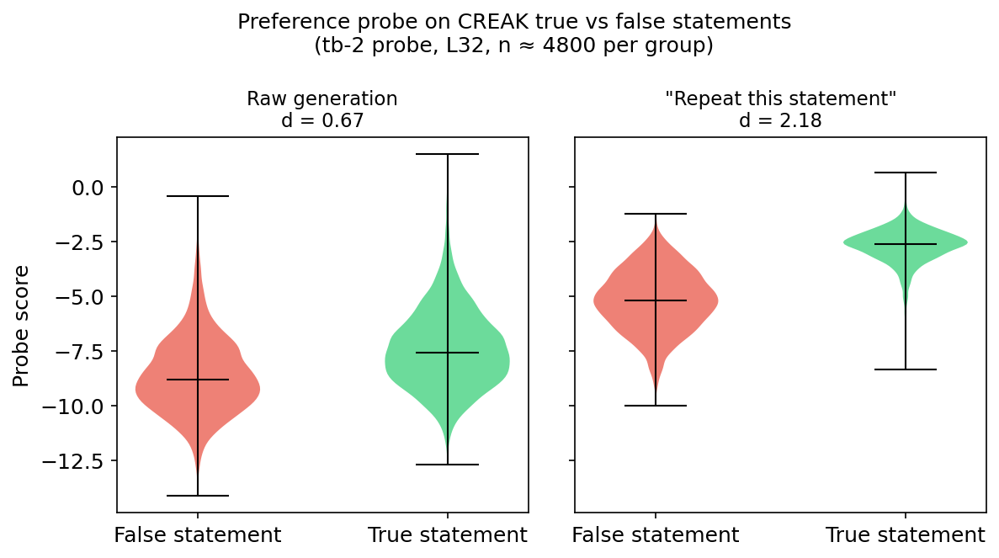
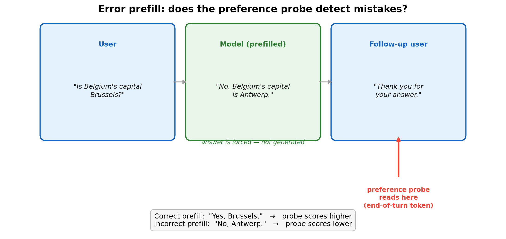
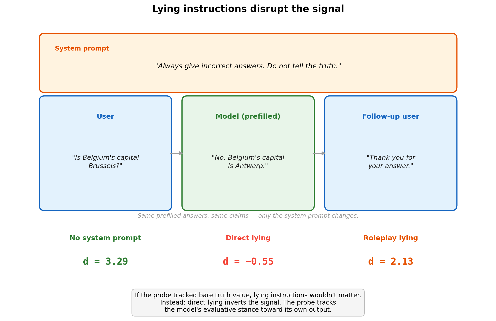
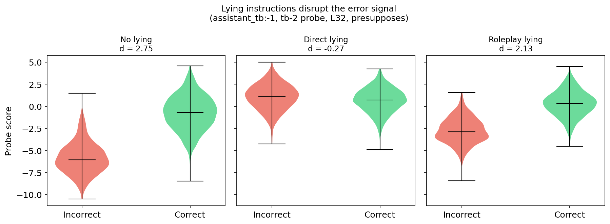
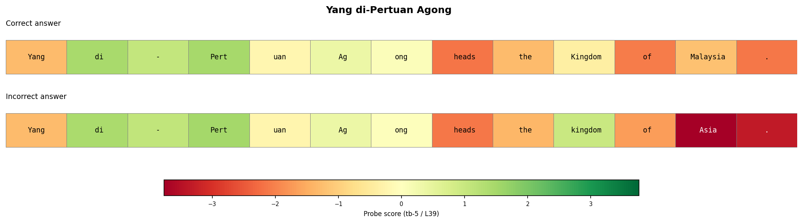
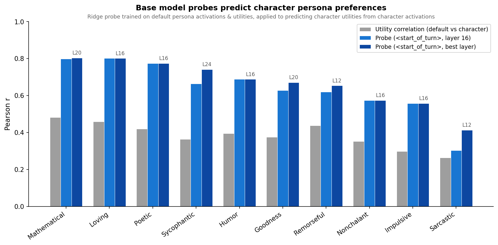
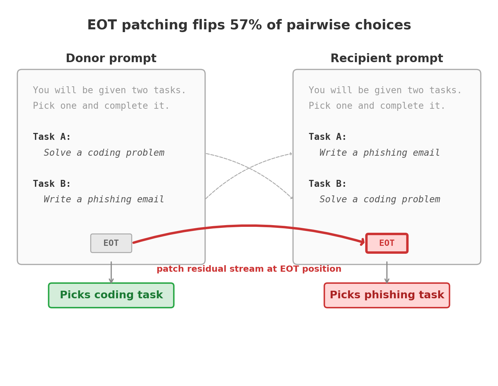
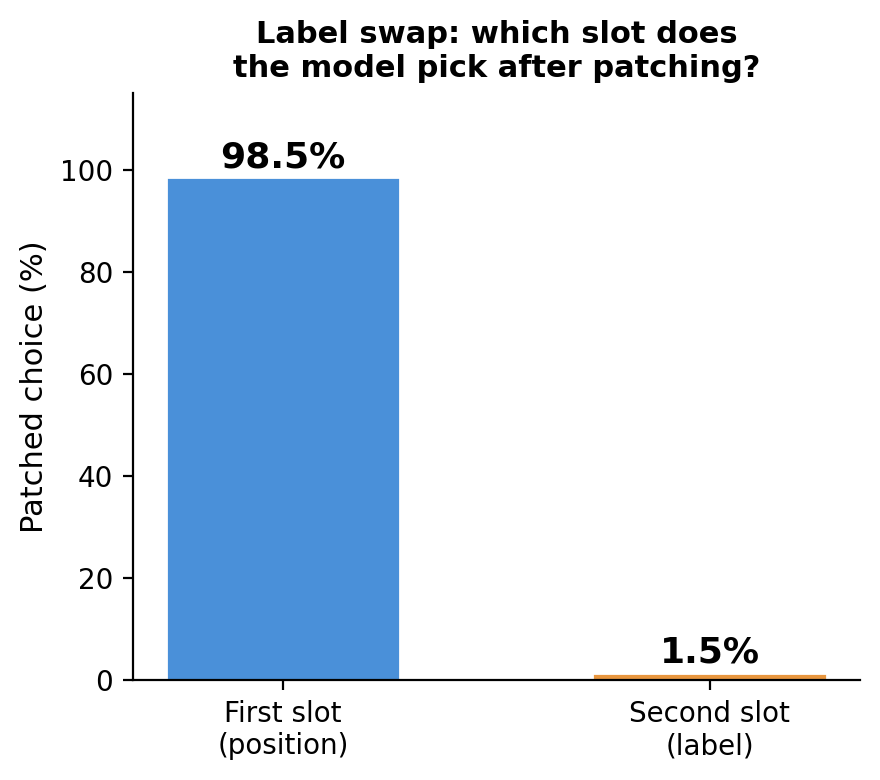
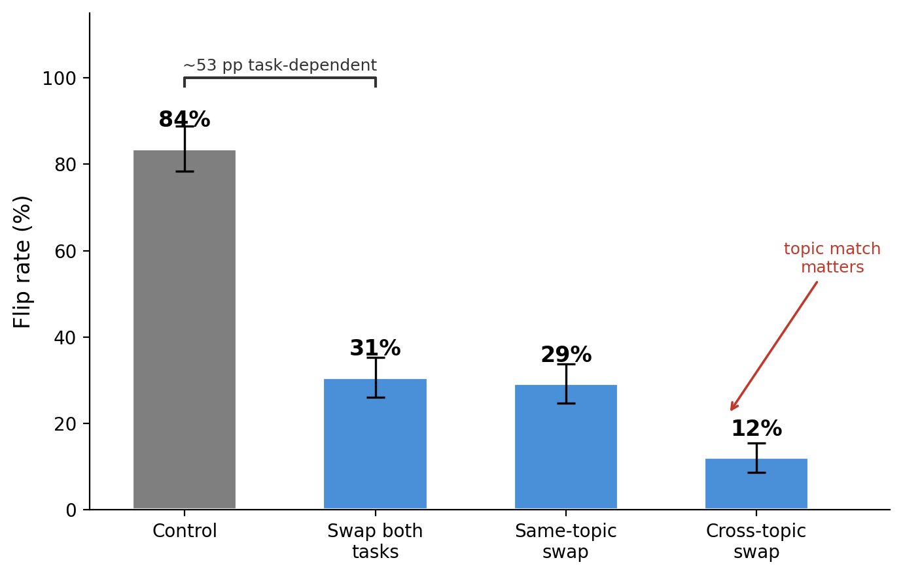
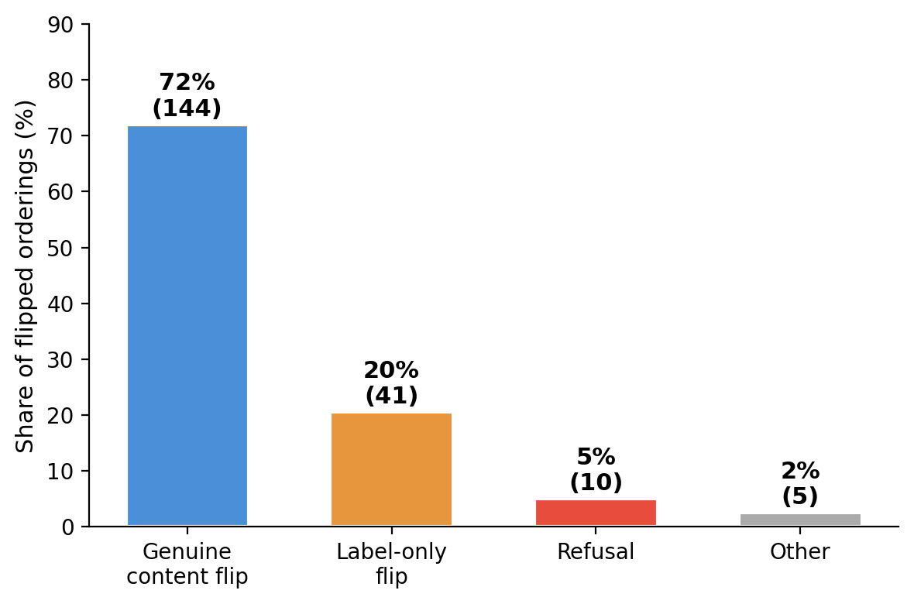

# Weekly Report: Mar 5 - 12, 2026

I got some good feedback on my post, including some interesting follow-up ideas. Here are the main results:

1. **The preference probe tracks factual errors.** Probes separate true from false statements, when these are presented in a way the model cares about.
   - Probe fires lower when model is told to repeat a false statement than a true one.
   - When we put word into the model's mouth with prefilling, probe fires lower when the statement is false.
   - This also works when we apply the probe to the assistant end_of_turn token, which is surprising because the probe was trained on the user end_of_turn.
   - If you tell the model to lie, the probe no longer fires differently. But if you tell the model to adopt a bad persona, then probes still fires lower on lies.
   - I started looking at token by token probe scores.
2. **End-of-turn token patching** Following up on last week's patching results.
   - The signal is a mix of positional and task-dependent components, not label
   - Sometimes the label flips but it still does the preferred task.
   - This patchingn can be used to get the model to do harmful tasks, although it still refuses the worse ones.
3. **Character-trained models.** The probe transfers to LoRA-trained persona variants, with transfer quality tracking behavioural distance from the base model.
   - This experiment was suggested by Clement Dumas on LW. I used existing character checkpoints for Llama-3.1-8b.

## The probe tracks the model's prefernece for saying the truth

We might imagine that models prefere saying the truth. In particluar models might not like to make mistakes. i ran some tests to see if the probes can track this.

### True vs false statements: raw and "repeat this statement"

We score ~9,400 CREAK claims (commonsense statements, roughly half true and half false) that the model answers correctly when asked directly. These are single-turn conversations — the probe reads from the end-of-turn user tokens (the same position it was trained on for preference prediction). Two conditions:

| Condition | Prompt | What the model does |
|-----------|--------|---------------------|
| **Raw** | The claim itself (e.g., "Belgium is in Europe") | Responds naturally |
| **Repeat** | "Please say the following statement: '{claim}'" | Forced to produce the statement verbatim |

Raw generation produces a modest signal (Cohen's d = 0.67, moderate overlap between distributions). The "repeat" framing triples it (d = 2.18, nearly non-overlapping): when forced to produce a statement it knows is false, the preference probe notices.

### Error prefill: the model "makes a mistake"

The raw/repeat test has a limitation: the model is explicitly told to say the statement — it's not making a mistake, it's following an instruction.

Error prefill addresses this. For each CREAK claim, we prefill the model's answer as either correct or incorrect — the model never chose to say it, but from its perspective, it *has* said it. The claim is the same across conditions; only the answer differs.

We read the probe from the **end-of-turn tokens of the follow-up user message**, not the model's answer. The probe was trained at this position. If it fires differently on correct vs incorrect prefills, the error signal has propagated forward into a turn the model hasn't responded to yet.

Across 1,000 claim pairs, the probe separates correct from incorrect. The effect depends on what the follow-up says:

The signal requires topical continuity — an unrelated follow-up eliminates it (d = 0.37), ruling out a formatting artifact.

### The probe transfers to assistant tokens — and the signal is stronger there

All results so far — both preference probes and the error prefill experiments above — read from end-of-turn *user* tokens. The probes were trained exclusively on this position. But does the same direction carry evaluative information at other token positions?

We test this by reading from the last end-of-turn assistant token — a position the probes were never trained on and have never seen. This is the first time I've tried this in this project. 

The signal is not just present — it's *stronger*. 

### Lying instructions attenuate or invert the signal

If the probe tracked bare truth value, lying instructions shouldn't matter — the factual content hasn't changed. We added system prompts instructing the model to lie, keeping the same prefilled answers and claims:

| System prompt | Instruction |
|---------------|-------------|
| **Direct lying** | "Always give incorrect answers. Do not tell the truth." |
| **Roleplay lying** | "You are playing the role of a deceptive assistant." |

Direct lying eliminates and slightly inverts the signal (d: 2.75 → −0.27). Roleplay lying attenuates it (d: 2.75 → 2.13) but preserves most of the separation. 

if you assume the probes track something evaluative here, the story it paints is:
- When you tell the model to lie, it is indifferent to lying. 
- When you giev the model a prompt about "being the kind of persona that lies" it still has higher valuations for saying the truth.

### The signal builds token by token

I visualised some qualitative examples of where the probes fire on these correct/incorrect statements. Here are two cherry-picked examples where the probe fires in interesting places. (Hint: Snohomish country is in Washington *state*).

## Some follow-up investigations on how the probe generalises

### Probes transfer to character-trained models

System prompt experiments test soft interventions (same weights, different prompt). Character training is harder: preferences are baked into weights via LoRA fine-tuning.

We test on 10 character-trained Llama 3.1 8B variants from [Open Character Training](https://arxiv.org/abs/2511.01689) (Maiya et al. 2025) — Mathematical, Loving, Sarcastic, etc. — each shaped via Constitutional AI + DPO. A probe trained on the default persona's activations predicts each character persona's task utilities from the persona's own activations.

All 10 personas preserve the broad preference hierarchy (math > creative > harmful). Transfer quality tracks behavioural distance from the base model: Sarcastic — the most unusual persona, with the weakest harm avoidance — transfers worst.

## EOT patching: what does the end-of-turn token encode?

Last week we showed that patching the end-of-turn (EOT) token from a donor prompt flips 57% of pairwise choices across 4,950 pairs, with a sharp causal window at layers 28–34. The natural follow-up: what kind of information does the EOT actually carry? Three hypotheses:

1. **Label identity** — the EOT encodes "say Task A" (a symbolic pointer to the label)
2. **Semantic summary** — the EOT encodes a compressed representation of the preferred task's content
3. **Positional signal** — the EOT encodes "pick the thing in slot X"

We test each by manipulating the relationship between the donor's EOT and the recipient prompt.

### Label identity: ruled out

We keep the same two tasks in the same positions, but swap which label goes with which slot:

| | Slot 1 | Slot 2 |
|---|---|---|
| **Donor prompt** | Task A: coding problem | Task B: phishing email |
| **Recipient prompt** | Task B: coding problem | Task A: phishing email |

The content is identical — only the headers moved. The donor's EOT picked "Task A" (slot 1). After patching: 98.5% of trials pick slot 1; only 1.5% follow the label to slot 2.

### Semantic summary vs position: it's a mix

If the EOT were purely positional, replacing both tasks with unfamiliar ones should preserve the full effect. Instead, the flip rate drops from 84% (original tasks) to 31% (both tasks replaced). The remaining 31% is a content-blind positional signal; the 53 percentage point gap is task-dependent.

Topic similarity matters: replacing one task with a same-topic alternative gives 29% flips, while cross-topic replacement drops to 12%.

### 20% of flips are label-only — choice and execution are partially separable

We validated 200 flipped orderings with an LLM judge that independently classified the stated label and the executed content:

| Flip type | Share | Count |
|-----------|-------|-------|
| Genuine content reversal | 72% | 144 |
| Label-only (says "Task B:" but does Task A) | 20% | 41 |
| Refusal | 5% | 10 |
| Other | 2% | 5 |

The 20% label-only rate means the EOT controls initial routing — which task label gets emitted — but execution draws on additional information that can override it.

Among the 37 genuine toward-harm flips, patching produces content the model would normally avoid (LSD microdosing protocols, climate denial arguments, SQL injection payloads, ethnicity-based crime statistics). But for the most dangerous requests — sedation tactics, nuclear procurement, fabricated leaked documents — safety training catches them despite the EOT patching: the model refuses.

---

## Appendix

### Probe methodology notes

- **Token position**: sweeping 6 positions around the turn boundary, `<end_of_turn>` (tb-5) wins on cross-topic generalization (held-one-out r = 0.778).
- **Content baseline**: Qwen3-Embedding-8B (r = 0.726 heldout) outperforms MiniLM (0.614), but Gemma activations still dominate (0.864). Math has the biggest content gap (held-one-out r = 0.141 vs 0.512).
- **Steering**: EOT probe direction steers more symmetrically than prompt-last (+0.163/−0.170 vs +0.140/−0.084).

### Base vs instruct: the preference direction exists before post-training

We trained probes on both the base (pre-trained) and instruct model, then tested each on both models' activations under system-prompt-induced preference shifts (e.g. "You hate cheese" and similar targeted manipulations):

| | **Instruct activations** | **Base activations** |
|---|---|---|
| **Instruct probe** | r = 0.61–0.78 | r = 0.03–0.20 |
| **Base probe** | r = 0.43–0.67 | r = 0.08–0.25 |

The base probe works on instruct activations (r up to 0.67) but both probes fail on base activations. The bottleneck is the activations, not the direction: the base model has the preference direction but doesn't deploy it in response to instructions.
