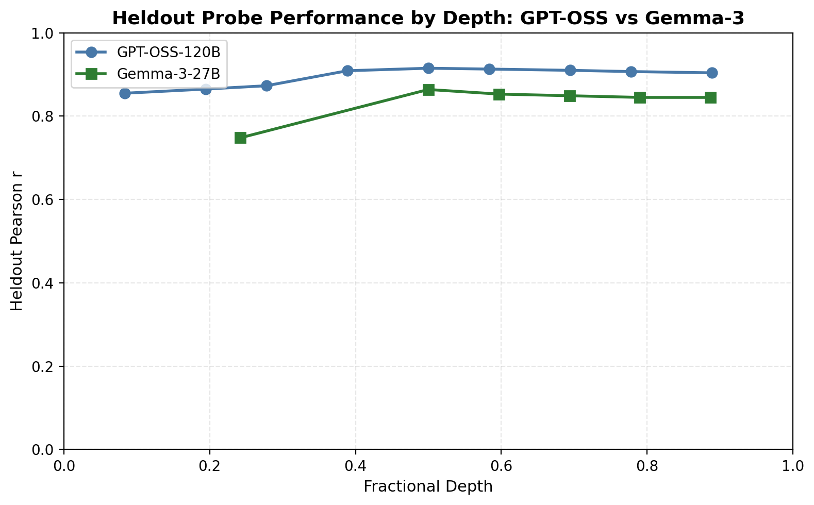

## Appendix C: Replicating the probe training pipeline on GPT-OSS-120B

We replicated the utility fitting and probe training pipeline on OpenAI's GPT-OSS-120B. The same procedure (10,000 pairwise comparisons via active learning, Thurstonian utility extraction, ridge probe training on last-token activations) transfers directly.

### Probe performance

The raw probe signal is comparable to Gemma-3-27B: best heldout r = 0.915 at layer 18 (Gemma: 0.864 at L31).

### Safety topics: noisy utilities, probably not poor generalisation

Safety-adjacent topics have poor probe performance overall.

Surprisingly, safety topics perform *better* when held out than when trained on. This is the opposite of what we'd expect if the issue were generalisation. The explanation: high refusal rates (~35% for harmful_request, ~34% for security_legal, ~26% for model_manipulation) probably throw off the Thurstonian utility estimates, so including these topics in training adds noise.

