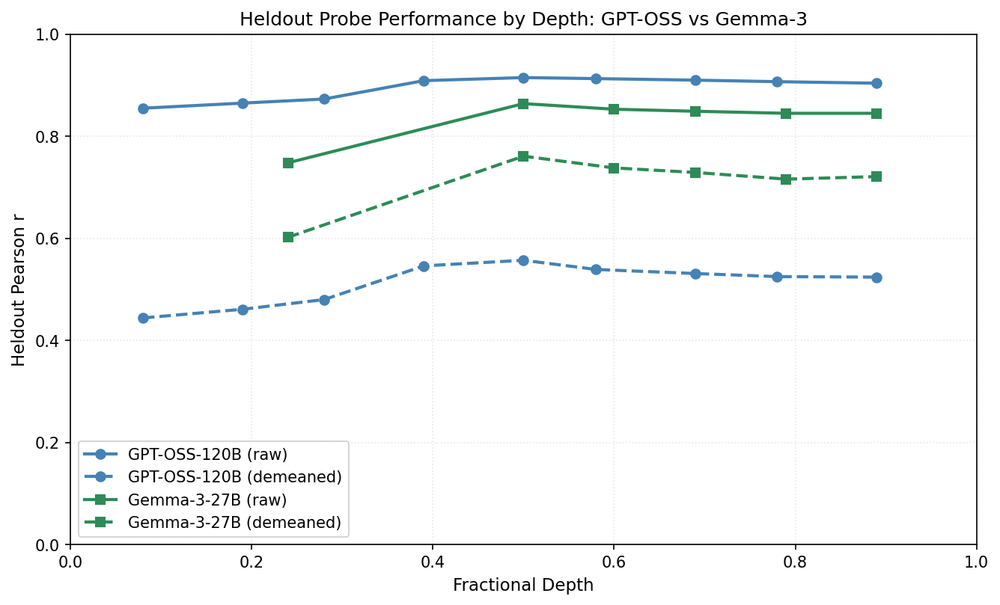
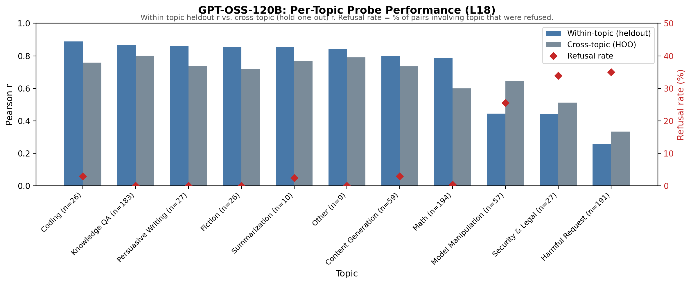

## Appendix B: Replicating the probe training pipeline on GPT-OSS-120B

We replicated the utility fitting and probe training pipeline on OpenAI's GPT-OSS-120B (36 layers, 120B parameters). The same procedure (10,000 pairwise comparisons via active learning, Thurstonian utility extraction, ridge probe training on last-token activations) transfers directly.

### Probe performance

The raw probe signal is comparable to Gemma-3-27B: best heldout r = 0.915 at layer 18 (Gemma: 0.864 at L31).

However, cross-topic generalisation is substantially weaker. The per-topic breakdown reveals that safety-adjacent topics drive the gap.

### Safety topics break the probe

The per-topic breakdown reveals why. Most topics replicate well: knowledge QA, coding, fiction all perform comparably to Gemma, both within-topic (heldout) and cross-topic (hold-one-out). But safety-adjacent topics fail catastrophically:

For harmful_request, the largest safety category (n=191), the within-topic probe correlation drops to r = 0.258, and cross-topic generalisation to r = 0.334. The probe cannot predict preferences for these tasks.

### Refusal drives the failure

This correlates with refusal rates. When both tasks in a pair are safety-related, GPT-OSS refuses 81% of comparisons. Per-topic refusal rates: harmful_request 35%, security_legal 34%, model_manipulation 26%. Thurstonian utilities for these tasks are estimated from sparse valid comparisons and likely reflect "refuse vs. not refuse" rather than genuine preference structure.