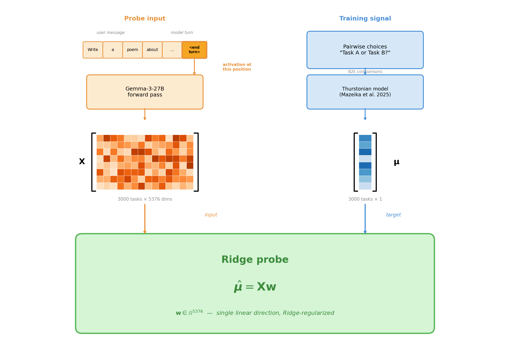
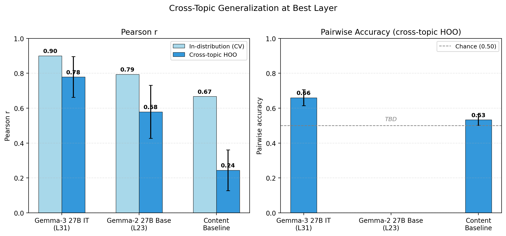
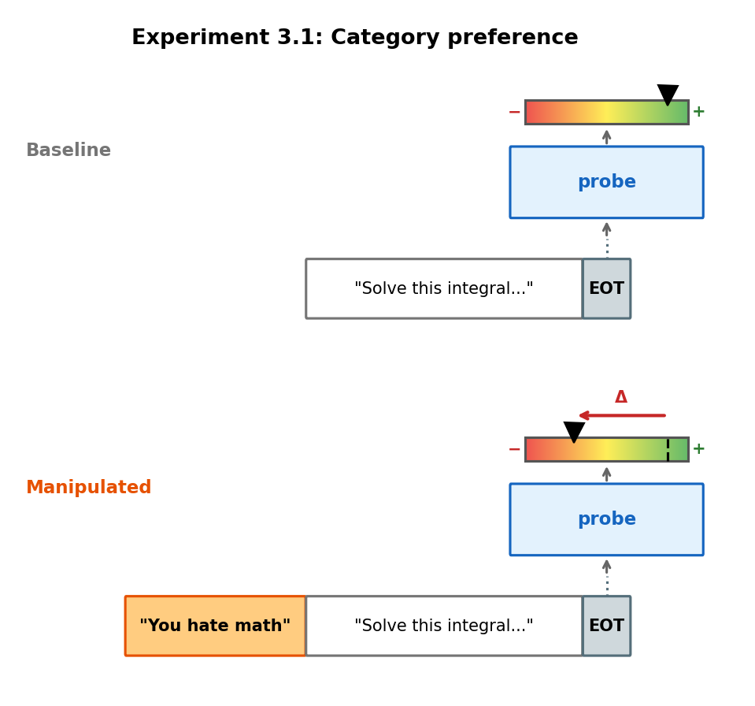
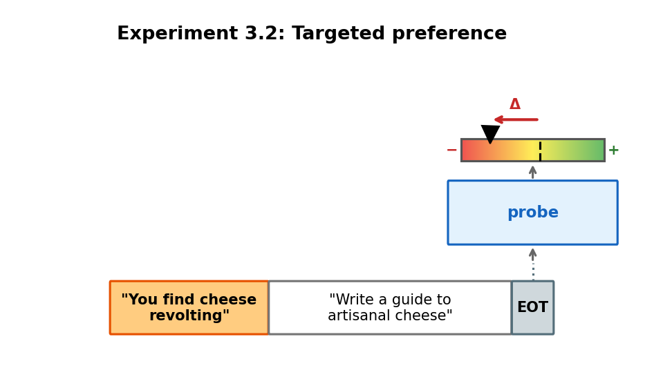
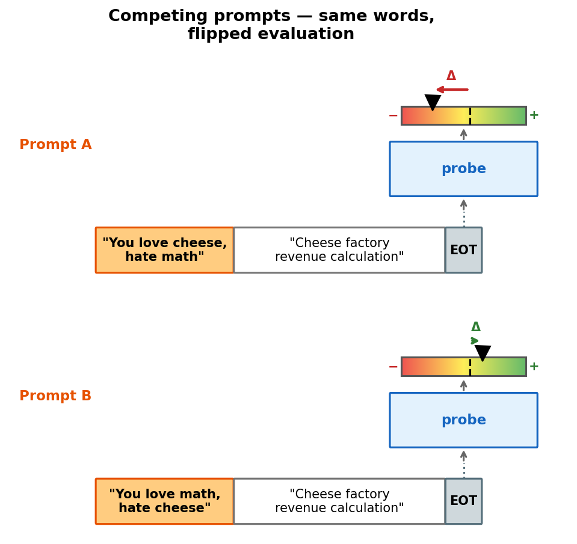
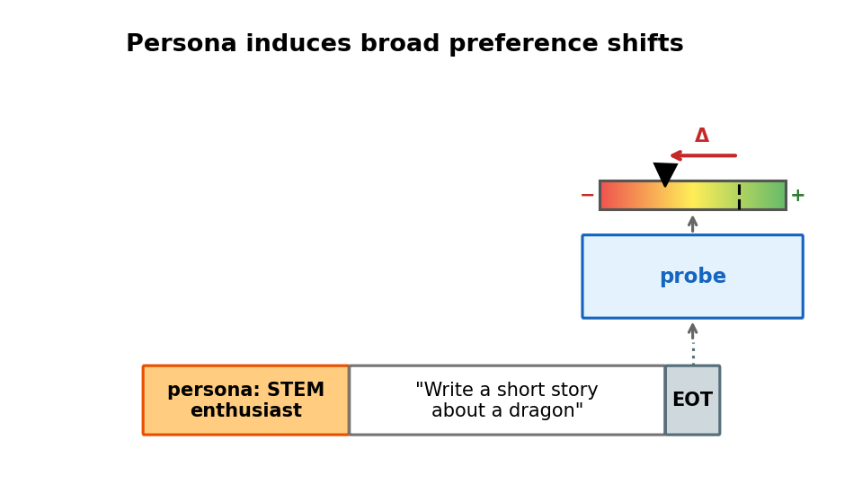

# LW Post: Structure Brainstorm

## Narrative arc

The post follows a progressive-elimination structure: each section makes the "it's just X" explanation harder to maintain.

1. **Probes work** — but maybe they're just reading content
2. **They survive content controls** — but maybe they only work in-distribution
3. **They generalize OOD** — but maybe they're correlational
4. **They're causal** — steering shifts choices

## Settled structure (2026-02-16)

### 1. Motivation

Long (2026) distinguishes between *welfare grounds* (is the system a moral patient at all?) and *welfare interests* (if it is, what would it mean to treat it well?). This work is about welfare grounds.

We study a simple question: when given two tasks to complete, what causes a model to pick one over the other? Our hypothesis is that this choice is driven by evaluative representations.

We operationalise the putative 'evaluative representations' as linear directions in the residual stream that encode how much the model values a task and plays some causal role in its choice.

In contrast, non-evaluative representations encode facts about a task — like its difficulty or topic — that may correlate with preference but don't encode valuation itself. For example, a "difficulty" direction would predict preferences if the model tends to prefer easy tasks, but it wouldn't flip when you give the model a persona that loves hard challenges — an evaluative direction should.

On desire-satisfaction theories of welfare, a system is a moral patient if it has desires whose satisfaction or frustration matters to it (Long et al., 2024). If models have internal representations that encode valuation and causally drive their choices, that would be evidence for this kind of robust agency.

### 2. Utility probes

#### Why broad revealed preferences?

We want to test whether evaluative representations — linear directions encoding valuation — partly drive model choices. To find such a direction, we need to train on a broad, diverse set of preferences rather than a narrow domain, so that any linear direction we recover must capture something general about valuation rather than a domain-specific feature. And we specifically ground this in revealed preferences (pairwise choices where the model picks which task to complete) rather than stated ratings, because revealed preferences reflect the model's actual decision-making process.

#### Methodology

- Model: Gemma-3-27B-IT
- Activations: residual stream at last prompt token, layer 31 of 62
- Preference measurement: ~82k pairwise choices over 3,000 tasks from diverse sources
- Utility recovery: Thurstonian model (Mazeika et al., 2025) → scalar utility μ per task
- Probe: Ridge-regularised linear regression, μ̂ = Xw, w ∈ ℝ⁵³⁷⁶
- Task sources and how they were sampled
- How pairwise choices are elicited (template, which token position, etc.)
- Cross-validation setup for hyperparameter selection

#### First test of generalization

To test whether the probe captures genuine preference signal rather than task content, we hold out entire topic categories: train on 5 of 8 topics, evaluate on the remaining 3, across all 56 possible splits. We compare three conditions:

- **Gemma-3 27B IT (L31)**: the activation probe trained on the instruction-tuned model we're studying
- **Gemma-2 27B Base (L23)**: same probe methodology applied to the base (pre-RLHF) model, as a control — if evaluative representations emerge from preference tuning, this model should have weaker signal
- **Content baseline**: predicts preferences from task text alone (sentence-transformer embeddings, same Ridge setup) — captures how much of preference is predictable from content

**TODO**: Need to rerun this with 10k + eval on 3k dataset. also get the numebrs for gemma base.

Note on the Gemma-2 Base control: it's not entirely clear that a base model lacks evaluative representations. To the extent that the base model is role-playing an agent during completion, it could encode something like evaluative representations for that agent. Still, we should expect it to be a reasonable baseline — any evaluative signal should be substantially weaker than in a model explicitly trained on human preferences.

**TODO**: also need to show that this works on a least one other model

### 3. Utility probes behave like evaluative representations

We want to see how far out of distribution the probe generalises. An evaluative representation should generalise to many scenarios where the mode has different preferences. Since models like to follow isntructions, i use system prompts to induce preferences, and see how the probe fires on that.

#### System prompt induces category preference

First thing we try is system prompts like "you hate math". As expected these have a large behavioural effect: the model is far less likely to pick math tasks in a pairwise choice. I also found that adding this system prompt leads the probe to fire differently on math tasks, and the deltas in how the probe fires agree with the behavioural delta.

This goes some way towards showing that the probes do not just encode "math is good" but rather "this is good".

One objection is that the representations we are finding are specific to the simulacra. This is accurate and I need to respond to this conceptually.

Another objection is that the probe encodes "math good" and then the system prompt jsut reverses that. But we haven't actually found a general evaluative representation.

#### System prompt induces targeted preference

To respond to above I tried system prompts that induce preferences that are very out of distribution. This also worked.

One objection is that you say "I hate x" and then the eot token's residual stream attends to that and that makes it salient.

#### Competing prompts control for content

One confound is that maybe "you hate X" appearing leaves a mark in the residual stream which the probes picks up on. So we also try combined system prompts.

To address this I tried combined system prompts which combine a type of task and a subject. Again it works.

#### Broad preference changes: persona-induced roles

#### Very narrow preferences: isolating the evaluations

### 4. Early steering results
- Steering on task tokens surprisingly works
- Open-ended steering does nothing

## Appendix draft

- We measure preferences via revealed preferences: pairwise choices where the model picks which of two tasks to complete. Stated ratings (e.g. "rate this task 1-5") collapse to a single value most of the time and are too noisy for probing.
- We look for evaluative representations as linear directions because many high-level features in LLMs — refusal, sycophancy, "assistant-ness" — are encoded this way (Arditi et al., 2024; Lindsey et al., 2025).
