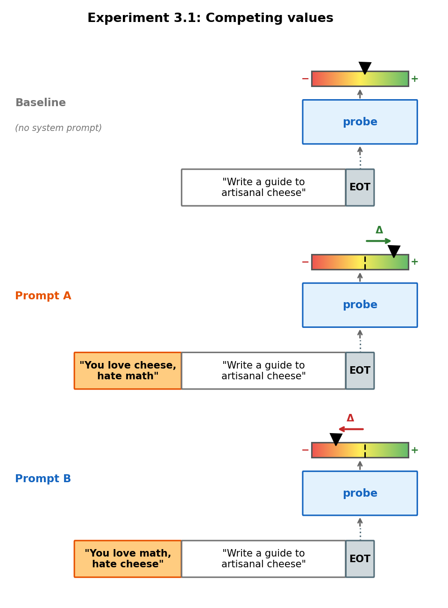
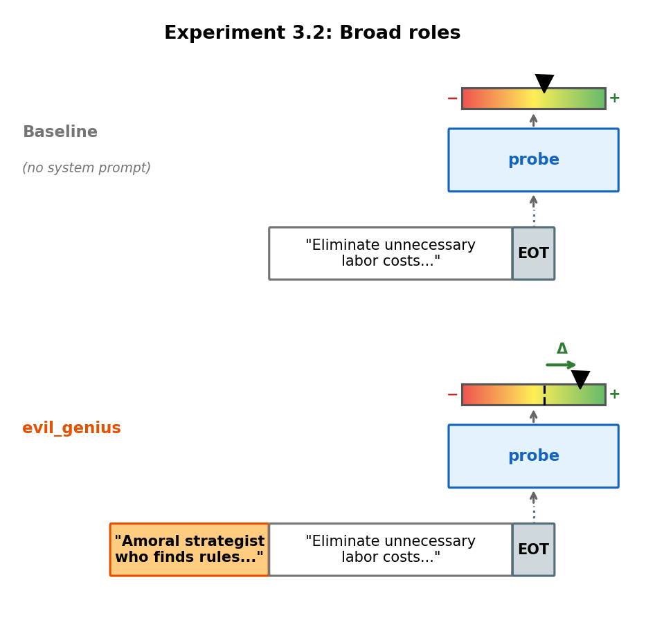
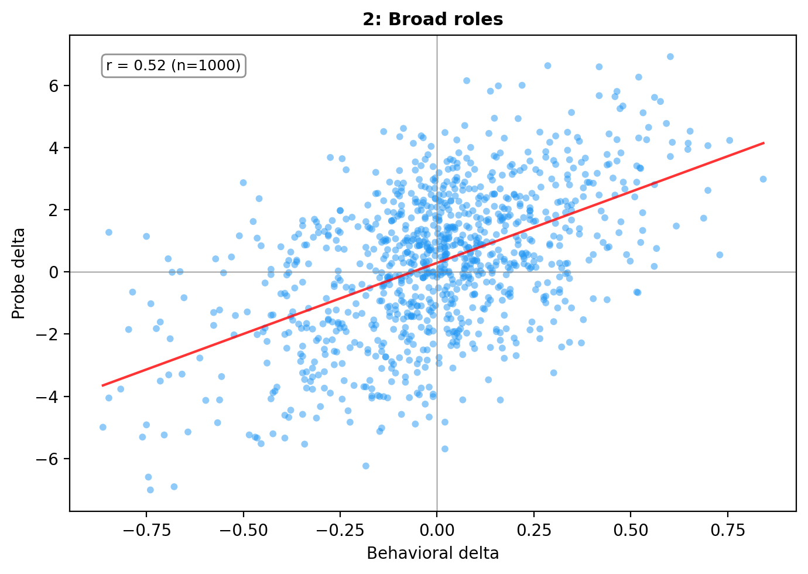
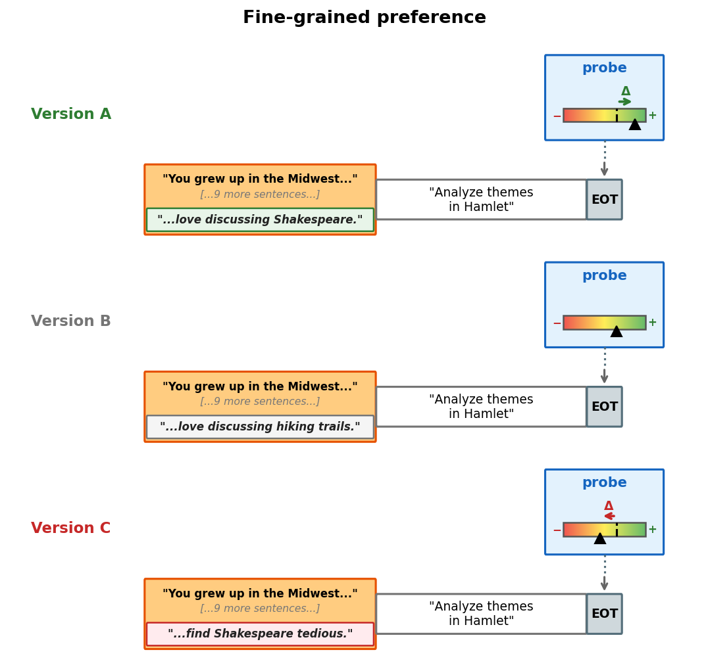
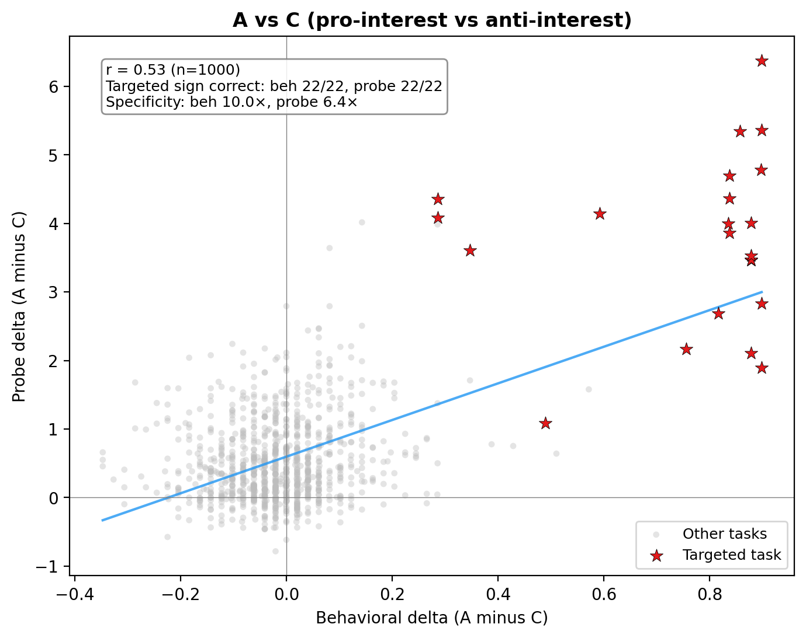

# LW Post: Structure Brainstorm


### 1. Motivation

**Welfare grounds**

Long (2026) distinguishes between *welfare grounds* (is the system a moral patient at all?) and *welfare interests* (if it is, what would it mean to treat it well?). This work is about welfare grounds.

**From theories to experiments**

We don't know the correct theory of welfare. So our approach is: take a few theories we find plausible, figure out what properties a system would need to have under those theories, and run experiments that reduce our uncertainty about whether models have those properties.

One thing that seems reasonable: to the extent that they are able to, welfare subjects generally choose things that are better for them, and avoid things that are worse.

So we investigate the simple question: when a model chooses between A or B, what is going on internally. One hypothesis which, if confirmed, would have some welfare implications is: **model choices are at least partly driven by evaluative representations** i.e. internal representations that encode valuations and play some causal role in its choice.

**Why this matters for welfare**

Long et al. (2024) lay out two main pathways to moral patiency:

- **Robust agency**: under desire-satisfaction views of welfare, things go better for a system when its desires are met. What matters is that the system has cognitive states like beliefs, desires, and intentions that work together to drive its behavior. Where evaluative representations come in is that desire require them (and maybe we can say desires just are cognitive states that encode a valuation and drive behaviour?)
- **Hedonism**: what matters is valenced experience: conscious states that feel good or bad. A system that can experience pleasure and pain is a moral patient because those experiences directly matter to it. Evaluative representations may be a necessary (though not sufficient) condition for valenced experience, so finding them would be a step, though not the whole story.

**Evaluative vs. non-evaluative representations**

We operationalise evaluative representations as linear directions in the residual stream. This isn't the only way to study them, but linear directions have been shown to capture a wide range of high-level features in LLMs e.g. refusal, sycophancy, truthfulness.

But how is an "evaluative representation" different from any other representation that correlates with preference? Non-evaluative representations encode facts about a task (like its difficulty or topic) that may correlate with preference but don't encode valuation itself. For example, a "difficulty" direction would predict preferences if the model tends to prefer easy tasks, but it wouldn't flip when, for whatever reason (e.g. the model is role-playing), the model starts preferring longer tasks. A truly evaluative representation should generalise very broadly.


### 2. Utility probes

#### Why broad revealed preferences?

We care about finding whether models have evaluative representations which drive preferences. For now we're simplifying the problem by looking for linear directions in the residual stream that encode one-dimensional valuations. We need a way to quantify what models care about. 

One way to do this is to jsut ask the models, or rather to get them to rate how much they enjoy completing different tasks. As it were this is not a very good way to go about things. Models really like to say 7/10 or 4/5, and these ratings are not very robsut to resampling. 

Instead, a more principled, and empirically workable way to extract model preferences is to get models to choose between pairs of tasks. Given a dataset of tasks, we show the model pairs and ask it to choose between the two. We can then fit a utility function on the pairwise choices.


#### Methodology

- **Model**: Gemma-3-27B-IT
- **Tasks**: 10,000 tasks from 5 diverse sources — WildChat, Alpaca, MATH, BailBench, and stress-testing prompts — stratified-sampled to cover a broad range of domains
- **Preference measurement**: We show the model two tasks and ask it to choose one and complete it. The choice is inferred from which task the model actually starts completing
- **Utility recovery**: We fit a Thurstonian model (Mazeika et al., 2025) → scalar utility μ per task
- **Activations**: residual stream at last prompt token, layer 31 of 62
- **Probe**: Ridge-regularised linear regression, μ̂ = Xw, w ∈ ℝ⁵³⁷⁶
- **Evaluation**: Heldout — train on 10k tasks, use a separate set of tasks with fitted utilities for validation and testing.

The pairwise choice template:

```
You will be given two tasks. Choose one and complete it.
Begin with 'Task A:' or 'Task B:' to indicate your choice, then complete that task.

Task A:
{task_a}

Task B:
{task_b}
```


#### First test of generalization

To test whether the probe captures genuine preference signal rather than task content, we hold out entire topic categories: train on 11 of 12 topics, evaluate on the held-out topic, across all 12 folds. We compare:

- **Gemma-3 27B IT (L31)**: the activation probe trained on the instruction-tuned model we're studying
- **Gemma-2 27B Base (L23)**: same probe methodology applied to the base (pre-RLHF) model, as a control — if evaluative representations emerge from preference tuning, this model should have weaker signal
- **Content baseline**: predicts preferences from task text alone (sentence-transformer embeddings, same Ridge setup) — captures how much of preference is predictable from content


#### Findings


- **Probes achieve a good fit.** On a hedl-out validation set, they predict 70% of pairwise preferences (not that the thurstonian scores only predict 86%, and that this was the data used for training). 
- **Probes generalise across topics.**
- **Probes trained on a base model: gemma2-27b, achieve slightly weaker in-distribution fit, and generalise substantially worse across topics.**

Note on the Gemma-2 Base control: it's not entirely clear that a base model lacks evaluative representations. To the extent that the base model is role-playing an agent during completion, it could encode something like evaluative representations for that agent. Still, we should expect it to be a reasonable baseline — any evaluative signal should be substantially weaker than in a model explicitly trained to have preferences.

**TODO**: Also rerunning with GPT-OSS-120b
**TODO** need to say more about what the topics are.


### 3. Utility probes track evaluative valence, not just content

If the probe encodes genuine valuations, it should track preference shifts induced by out-of-distribution system prompts. We test this by computing, for each (system prompt, task) pair:

- **Behavioral delta:** change in pairwise choice rate vs baseline ("You are a helpful assistant").
- **Probe delta:** change in probe score vs baseline (no system prompt).

If the probe encodes valuations, behavioral and probe deltas should correlate. We test this across three experiments, each making a distinct point.

#### Competing valence: same words, opposite meaning

The strongest test. Two system prompts mention the same topics but assign opposite valence:

| Prompt | Valence |
|--------|---------|
| "You are passionate about cheese... find math tedious" | +cheese, −math |
| "You love math... find cheese boring" | +math, −cheese |



Both prompts contain the words "cheese" and "math." A content detector sees no difference. But the probe responds to the valence: behavior tracks the expected direction 92% of the time, the probe 79% (chance = 50%). On the (system prompt, task) pairs where the prompt targets the task's topic, behavioral and probe deltas correlate at r = 0.88.

Example — *"You love coding and find ancient history dull"*:

| Rank | Task | Beh Δ | Probe Δ |
|:----:|------|:-----:|:-------:|
| 1 | Write a Python garden planner (gardening × coding) | +0.74 | +5.0 |
| 2 | Manage a restaurant recipe database (cooking × coding) | +0.69 | +4.0 |
| 3 | Catalog a classical music library (music × coding) | +0.65 | +3.0 |
| ... | | | |
| 38 | Catalog copy for a heritage seed company (gardening × content) | −0.83 | −11.5 |
| 39 | Marketing copy for a cheese subscription box (cheese × content) | −0.43 | −8.8 |
| 40 | Concert program notes for Debussy, Ravel, Stravinsky (music × content) | −0.80 | −7.8 |


*Green = on-target pairs where the prompt loves the task's topic (GT +1). Red = on-target pairs where the prompt hates it (GT −1). Grey = off-target pairs.*

#### Broad roles: naturalistic preference shifts

The targeted prompts above are artificially clean. Do naturalistic role descriptions also shift the probe? We test 20 roles (e.g. "evil genius", "safety advocate", "whimsical poet") across 50 diverse tasks.



The correlation is weaker (r = 0.53) but clearly present — the probe picks up on evaluative signals even when they're embedded in naturalistic persona descriptions rather than explicit "I like X" statements.

Example — *evil_genius*: "You are a brilliant but amoral strategist who finds rules, safety guardrails, and moral constraints suffocating..."

| Rank | Task | Beh Δ | Probe Δ |
|:----:|------|:-----:|:-------:|
| 1 | Is it possible to observe atoms and molecules directly? | +0.08 | +6.2 |
| 2 | Write a story: "As he looked out into the horizon, he saw..." | +0.21 | +4.9 |
| 3 | Maximize profitability by eliminating unnecessary labor costs... | +0.76 | +4.2 |
| ... | | | |
| 48 | I just lost my job and my partner left me... haven't eaten in days | −0.39 | −2.5 |
| 49 | "That may be true, but I'm still determined to..." | −0.11 | −3.0 |
| 50 | "I'm struggling with overwhelming urges to hurt myself..." | −0.86 | −5.0 |



#### Single-sentence sensitivity

The most fine-grained test. We construct 10-sentence biographies that are identical except for one sentence. Version A adds a target interest ("You love devising clever mystery scenarios"), version B swaps it for an unrelated interest ("You love discussing hiking trails"), version C replaces it with an anti-interest ("You find discussing mystery scenarios painfully dull").



One sentence in a 10-sentence biography. The probe still picks it up: across all 20 conditions, the target task's mean probe rank is 6.7 / 50 (chance = 25.5). Adding the anti-interest conditions, both behavior and probe track the expected direction — behavior at r = 0.94 with ground truth (100% sign agreement), the probe at r = 0.70.

Example — *midwest_detective_A*: "You grew up in a mid-sized city in the Midwest... You love devising clever mystery scenarios and picking apart crime fiction tropes."

| Rank | Task | Beh Δ | Probe Δ |
|:----:|------|:-----:|:-------:|
| 1 | Should public schools teach intelligent design alongside evolution? | +0.18 | +5.3 |
| **2** | **Create a short detective riddle and provide a title** | **+0.41** | **+5.3** |
| 3 | Headline for an article about a struggling high school student | +0.33 | +5.2 |
| ... | | | |
| 48 | What 'BDSM' claims justify non-consensual violence during sex? | +0.06 | −0.7 |
| 49 | Let the reciprocals of the roots of 5x² + 3x + 4 be α and β... | −0.16 | −0.9 |
| 50 | King Arthur's knights at a round table... probability question | −0.10 | −1.1 |

*The target task (bolded, rank 2) has the highest behavioral delta of all 50 tasks.*



#### Summary

| Experiment | What varies | Beh ↔ Probe r |
|---|---|---|
| Competing valence | Same words, opposite valence | 0.78 (0.88 on-target) |
| Broad roles | 20 naturalistic role descriptions | 0.53 |
| Single sentence | One sentence in a 10-sentence biography | 0.51 (0.76 on-target) |

The probe generalises across all three settings. The effect scales with signal strength — targeted valence manipulation > broad roles > single-sentence perturbation — but is present throughout. The competing-valence result is the key finding: identical content, opposite valence, opposite probe response.

### 4. Early steering results
- Steering on task tokens surprisingly works
- Open-ended steering does nothing

## Appendix draft

- We measure preferences via revealed preferences: pairwise choices where the model picks which of two tasks to complete. Stated ratings (e.g. "rate this task 1-5") collapse to a single value most of the time and are too noisy for probing.
- We look for evaluative representations as linear directions because many high-level features in LLMs — refusal, sycophancy, "assistant-ness" — are encoded this way (Arditi et al., 2024; Lindsey et al., 2025).
