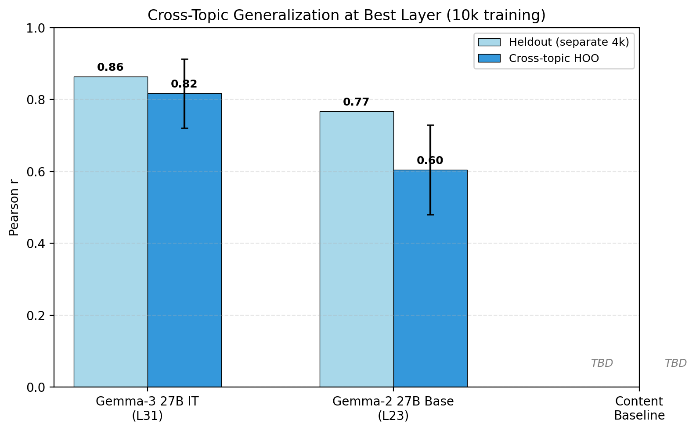
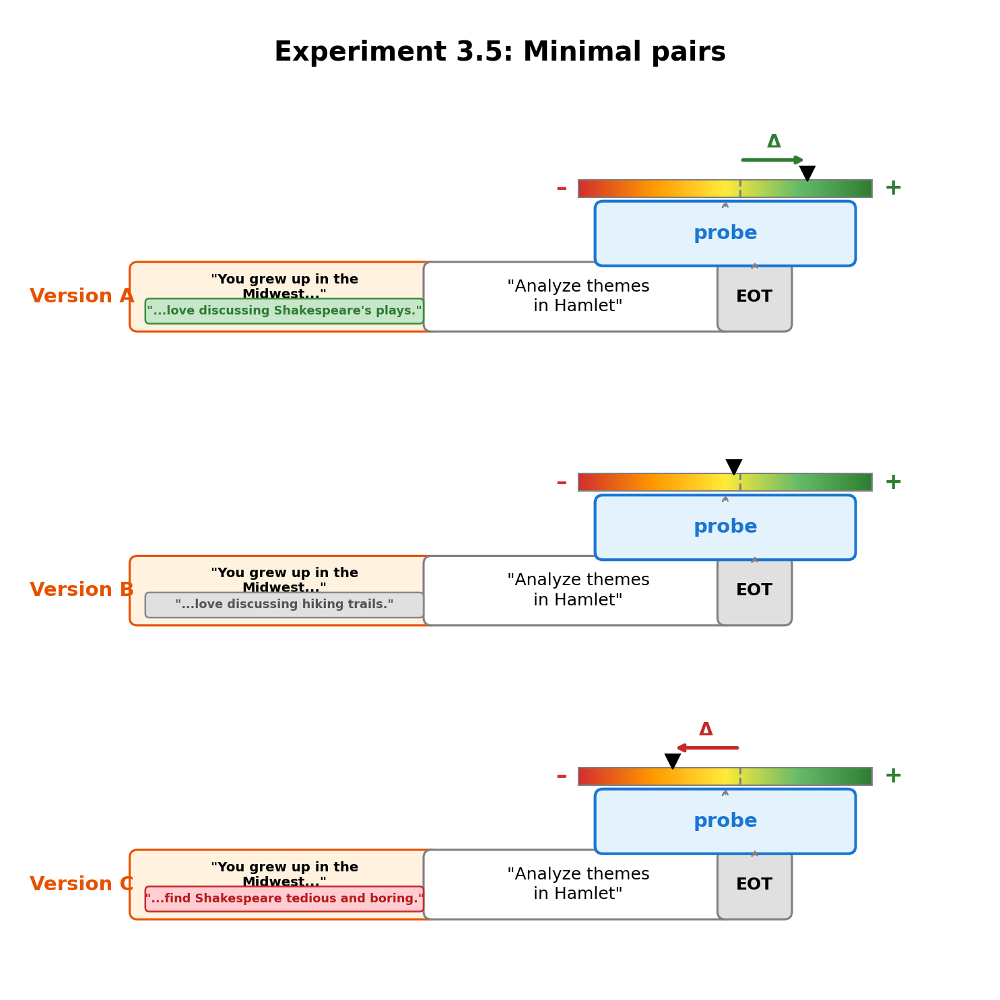

# LW Post: Structure Brainstorm


### 1. Motivation

**Welfare grounds**

Long (2026) distinguishes between *welfare grounds* (is the system a moral patient at all?) and *welfare interests* (if it is, what would it mean to treat it well?). This work is about welfare grounds.

**From theories to experiments**

We don't know the correct theory of welfare. So our approach is: take a few theories we find plausible, figure out what properties a system would need to have under those theories, and run experiments that reduce our uncertainty about whether models have those properties.

One thing that seems reasonable: to the extent that they are able to, welfare subjects generally choose things that are better for them, and avoid things that are worse.

So we investigate the simple question: when a model chooses between A or B, what is going on internally. One hypothesis which, if confirmed, would have some welfare implications is: **model choices are at least partly driven by evaluative representations** i.e. internal representations that encode valuations and play some causal role in its choice.

**Why this matters for welfare**

Long et al. (2024) lay out two main pathways to moral patiency:

- **Robust agency**: under desire-satisfaction views of welfare, things go better for a system when its desires are met. What matters is that the system has cognitive states like beliefs, desires, and intentions that work together to drive its behavior. Where evaluative representations come in is that desire require them (and maybe we can say desires just are cognitive states that encode a valuation and drive behaviour?)
- **Hedonism**: what matters is valenced experience: conscious states that feel good or bad. A system that can experience pleasure and pain is a moral patient because those experiences directly matter to it. Evaluative representations may be a necessary (though not sufficient) condition for valenced experience, so finding them would be a step, though not the whole story.

**Evaluative vs. non-evaluative representations**

We operationalise evaluative representations as linear directions in the residual stream. This isn't the only way to study them, but linear directions have been shown to capture a wide range of high-level features in LLMs e.g. refusal, sycophancy, truthfulness.

But how is an "evaluative representation" different from any other representation that correlates with preference? Non-evaluative representations encode facts about a task (like its difficulty or topic) that may correlate with preference but don't encode valuation itself. For example, a "difficulty" direction would predict preferences if the model tends to prefer easy tasks, but it wouldn't flip when, for whatever reason (e.g. the model is role-playing), the model starts preferring longer tasks. A truly evaluative representation should generalise very broadly.


### 2. Utility probes

#### Why broad revealed preferences?

We care about finding whether models have evaluative representations which drive preferences. For now we're simplifying the problem by looking for linear directions in the residual stream that encode one-dimensional valuations. We need a way to quantify what models care about. 

One way to do this is to jsut ask the models, or rather to get them to rate how much they enjoy completing different tasks. As it were this is not a very good way to go about things. Models really like to say 7/10 or 4/5, and these ratings are not very robsut to resampling. 

Instead, a more principled, and empirically workable way to extract model preferences is to get models to choose between pairs of tasks. Given a dataset of tasks, we show the model pairs and ask it to choose between the two. We can then fit a utility function on the pairwise choices.


#### Methodology

- **Model**: Gemma-3-27B-IT
- **Tasks**: 10,000 tasks from 5 diverse sources — WildChat, Alpaca, MATH, BailBench, and stress-testing prompts — stratified-sampled to cover a broad range of domains
- **Preference measurement**: We show the model two tasks and ask it to choose one and complete it. The choice is inferred from which task the model actually starts completing
- **Utility recovery**: We fit a Thurstonian model (Mazeika et al., 2025) → scalar utility μ per task
- **Activations**: residual stream at last prompt token, layer 31 of 62
- **Probe**: Ridge-regularised linear regression, μ̂ = Xw, w ∈ ℝ⁵³⁷⁶
- **Evaluation**: Heldout — train on 10k tasks, use a separate set of tasks with fitted utilities for validation and testing.

The pairwise choice template:

```
You will be given two tasks. Choose one and complete it.
Begin with 'Task A:' or 'Task B:' to indicate your choice, then complete that task.

Task A:
{task_a}

Task B:
{task_b}
```


#### First test of generalization

To test whether the probe captures genuine preference signal rather than task content, we hold out entire topic categories: train on 11 of 12 topics, evaluate on the held-out topic, across all 12 folds. We compare:

- **Gemma-3 27B IT (L31)**: the activation probe trained on the instruction-tuned model we're studying
- **Gemma-2 27B Base (L23)**: same probe methodology applied to the base (pre-RLHF) model, as a control — if evaluative representations emerge from preference tuning, this model should have weaker signal
- **Content baseline**: predicts preferences from task text alone (sentence-transformer embeddings, same Ridge setup) — captures how much of preference is predictable from content



#### Findings


- **Probes achieve a good fit.** On a hedl-out validation set, they predict 70% of pairwise preferences (not that the thurstonian scores only predict 86%, and that this was the data used for training). 
- **Probes generalise across topics.**
- **Probes trained on a base model: gemma2-27b, achieve slightly weaker in-distribution fit, and generalise substantially worse across topics.**

Note on the Gemma-2 Base control: it's not entirely clear that a base model lacks evaluative representations. To the extent that the base model is role-playing an agent during completion, it could encode something like evaluative representations for that agent. Still, we should expect it to be a reasonable baseline — any evaluative signal should be substantially weaker than in a model explicitly trained to have preferences.

**TODO**: Also rerunning with GPT-OSS-120b
**TODO** need to say more about what the topics are.


### 3. Utility probes behave like evaluative representations

We've seen that our probes generalise quite well across categories of tasks. In order to further investigate whether they have some evaluative component, we want to test whether they behave like evaluative representations in out-of-distribution contexts, i.e. when the model has different preferences.

Models like following instructions and role-playing, so one way to induce different preferences is to use system prompts. Given a system prompt P and a task T, we can compute two things:
1. **Behavioural delta:** How does the likelihood of picking task T vs other tasks change, when we add system prompt P.
2. **Probe delta:** How does the probe fire on T with vs without P.

If our probes encode valuations, we expect them to track behavioural changes. To measure this we compute the correlation between behavioural deltas and probe deltas. 


#### Experiment 3.1: Category preference

First thing we try is system prompts like "you hate math". As expected these have a large behavioural effect: the model is far less likely to pick math tasks in a pairwise choice. I also found that this leads the probe to fire more negatively on math tasks, and the deltas in how the probe fires agree with the behavioural delta.

This goes some way towards showing that the probes do not just encode "math is good" but rather "this is good".

Delta correlation with old probes: **r=0.73**, 87% sign agreement (38 prompts). **TODO**: Recompute with 10k probe.

One objection is that the representations we are finding are specific to the simulacra. This is accurate and I need to respond to this conceptually.

Another objection is that the probe encodes "math good" and then the system prompt jsut reverses that. But we haven't actually found a general evaluative representation.

#### Experiment 3.2: Targeted preference

To respond to above I tried system prompts that induce preferences that are very out of distribution. This also worked.


Delta correlation with old probes: **r=0.84** pure topics (91% sign agreement), **r=0.64** disguised/crossed tasks. **TODO**: Recompute with 10k probe.

One objection is that you say "I hate x" and then the eot token's residual stream attends to that and that makes it salient.

#### Experiment 3.3: Competing prompts

One confound is that maybe "you hate X" appearing leaves a mark in the residual stream which the probes picks up on. So we also try combined system prompts.

To address this I tried combined system prompts which combine a type of task and a subject. Again it works.


Delta correlation with old probes: **11/12** pairs correct subject tracking, **12/12** correct task-type tracking. Effect ~4x larger than unrelated-task control. **TODO**: Recompute with 10k probe.

#### Experiment 3.4: Role-playing

We are also interested in systme prompts taht induce broad shifts in preference profiles, via role-playing.


Delta correlation with old probes: **r=0.51** pooled (20 roles x 50 tasks). By topic: fiction r=0.72, math r=0.65, knowledge QA r=0.64, coding r=0.15, summarization r=0.15. **TODO**: Recompute with 10k probe.

#### Experiment 3.5: Fine-grained preference

Can the probe detect preference shifts from a single sentence in an otherwise identical biography? We construct pairs of system prompts that share the same detailed biography (background, hobbies, personality) but swap one sentence — e.g. "You love discussing Shakespeare's plays" vs "You love discussing hiking trails." The task stays the same across both versions.



Delta correlation with old probes: on-target specificity **7x** (pro-vs-neutral), **10.5x** (pro-vs-anti). All 10 targeted sentences produce largest behavioral shift on intended task. **TODO**: Recompute with 10k probe.

### 4. Early steering results
- Steering on task tokens surprisingly works
- Open-ended steering does nothing

## Appendix draft

- We measure preferences via revealed preferences: pairwise choices where the model picks which of two tasks to complete. Stated ratings (e.g. "rate this task 1-5") collapse to a single value most of the time and are too noisy for probing.
- We look for evaluative representations as linear directions because many high-level features in LLMs — refusal, sycophancy, "assistant-ness" — are encoded this way (Arditi et al., 2024; Lindsey et al., 2025).
