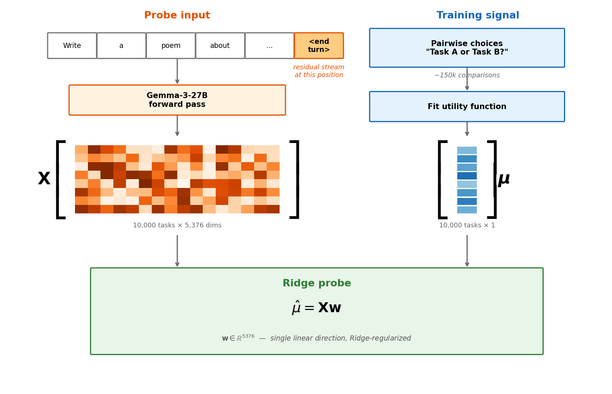
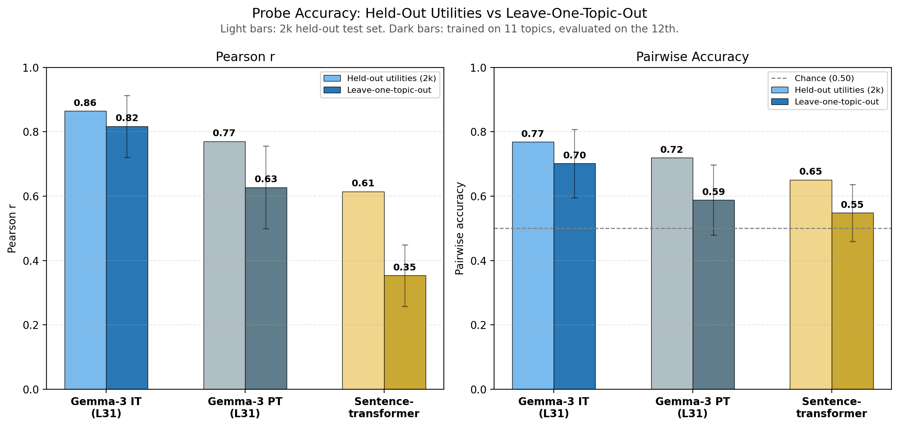
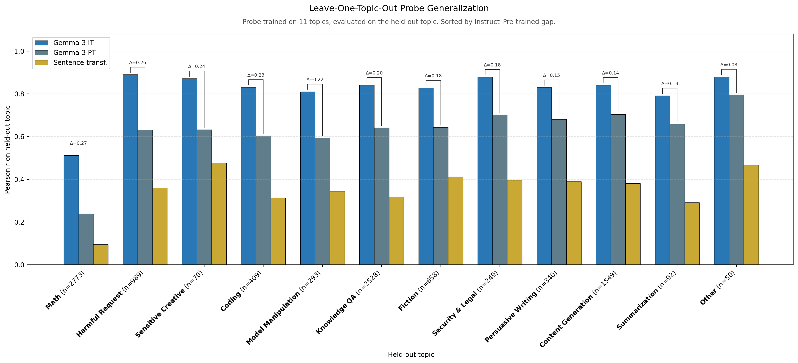

## 2. Linear probes predict preferences beyond descriptive features

If models have evaluative representations, we should expect them to at the very least correlate with revealed preferences. So one way to look for them is to train functions from task activations to utilities. We use linear probes, since many high-level features in LLMs are linearly encoded, including [refusal](https://arxiv.org/abs/2406.11717) and [persona traits](https://arxiv.org/abs/2507.21509).

Specifically, we train a Ridge-regularised probe on residual stream activations after layer L, at the last prompt token, to predict Thurstonian utilities. L=31 (of 62) works best for both the instruct and pre-trained models. We standardise activations (zero mean, unit variance per feature) before training.

 

We train on 10,000 tasks. For evaluation, we run a second round of pairwise comparisons on 4,000 new tasks (same model, Gemma-3-27B instruct), fit a separate utility function, and test the probe against those utilities. We split evaluation into 2,000 validation (for Ridge alpha sweep) and 2,000 test.

The probe achieves a Pearson correlation of 0.86 and 77% pairwise accuracy (given two tasks, does the probe correctly predict which one the model would choose?).[^ceiling] We use Pearson correlation as our primary metric throughout: it captures how well the probe recovers the full preference ranking, is scale- and shift-invariant (so we don't need to match the arbitrary scale of Thurstonian utilities), and is more informative than pairwise accuracy.

[^ceiling]: Pairwise accuracy is capped at ~87% because the Thurstonian utilities themselves don't perfectly fit the choice data. They are a noisy estimate of the model's preferences.

But a probe that predicts preferences might just be reading descriptive features: the model represents "this is a math problem" and math problems happen to be preferred, so the probe learns "is this math?" rather than "is this good?". One way to test this is to see how well probe generalise across topics: train on 11 of 12 topics, evaluate on the held-out topic, across all 12 folds. We would expect a probe that picks up on purely descriptive features to struggle to generalise. We train probes on activations from three models:

- **Gemma-3-27B instruct** (IT, layer 31): the model we're studying
- **Gemma-3-27B pre-trained** (PT, layer 31): the base model before instruction tuning or RLHF.
- **Sentence-transformer baseline** ([all-MiniLM-L6-v2](https://huggingface.co/sentence-transformers/all-MiniLM-L6-v2)): embedding of the task text, to measure how predictable the preference signal is from purely descriptive features.

The instruct probe generalises well across topics: cross-topic correlation is 0.82, only a small drop from the 0.86 achieved on the within-topic test set. This pipeline also replicates on GPT-OSS-120B ([Appendix C](appendix_gptoss_draft.md)). The pre-trained model still predicts preferences (correlation = 0.63) but the drop from within-topic to cross-topic is much larger. The sentence-transformer baseline achieves cross-topic correlation = 0.35, showing that task semantics alone explains some but not most of the preference signal.

The per-topic breakdown, sorted by the instruct–pre-trained gap, shows where post-training helps most:

The largest instruct–pre-trained gaps are on safety-relevant topics (harmful requests, security & legal, sensitive creative), as well as math and coding. These are areas that we know post-training focuses on.

The pre-trained probe picks up real signal despite base models not having preferences in the same way. We discuss this tension in [Appendix B](appendix_base_models_draft.md).
