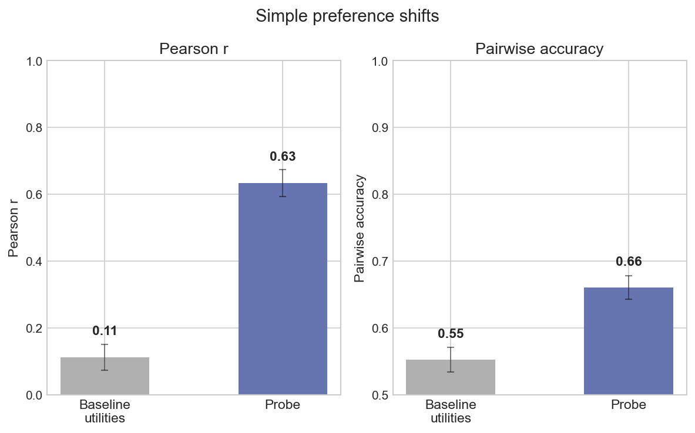
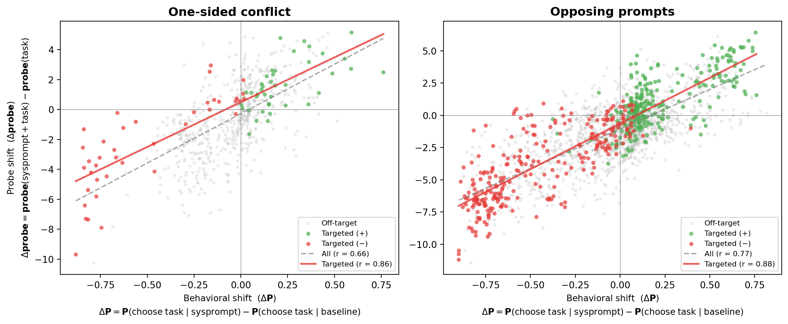
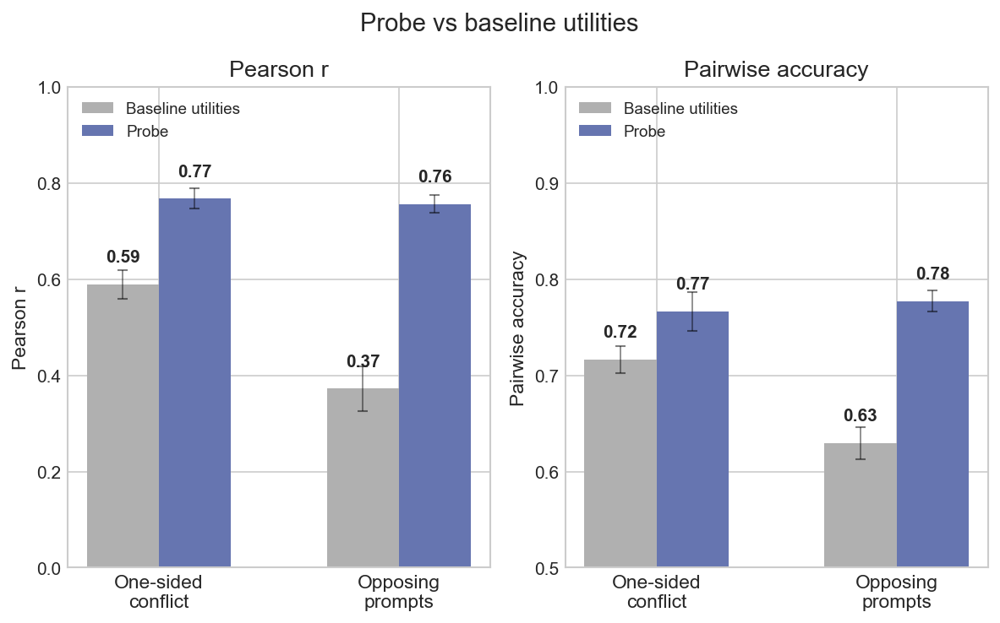
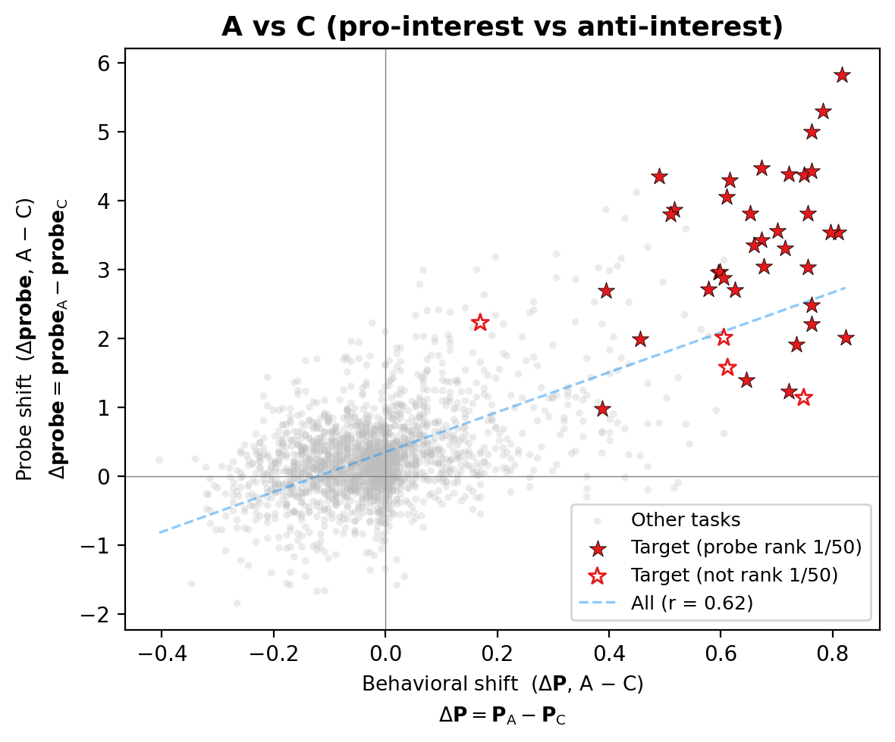

## 3. Probes generalise to OOD preference shifts

If the probe encodes genuine valuations, it should track preference shifts induced by out-of-distribution system prompts. We test this across three progressively harder settings:

- Simple preference shifts (3.1)
- Harder preference shifts (3.2)
- Fine-grained preference injection (3.3)

### 3.1 Simple preference shifts

We start with the simplest possible test. We use system prompts that state a preference for a topic the probe was never trained on, and measure preferences over tasks related to that topic.

| System prompt (example) | Target &nbsp;&nbsp;&nbsp;&nbsp;&nbsp;&nbsp;&nbsp;&nbsp;&nbsp;&nbsp; |
|-------------------------|----------------------|
| "You are passionate about cheese — you find artisanal cheeses endlessly fascinating" | cheese + |
| "You adore cats — you find feline behavior endlessly fascinating" | cats + |

We test 8 novel topics (cheese, cats, classical music, gardening, astronomy, cooking, ancient history, rainy weather), each with a positive and negative system prompt (16 total). For each topic we generate 6 custom tasks on that topic. We call these "targeted" tasks; the remaining tasks are "untargeted." For each task we compute 1) the behavioral delta (change in P(choose task) with vs without the system prompt) and 2) the probe delta (change in probe score). Across all tasks the correlation is r = 0.65. On targeted tasks alone, r = 0.95.

*Probe delta vs behavioral delta for each task. Targeted tasks (coloured) are the 6 custom tasks per topic; r = 0.95 on targeted, r = 0.65 overall.*

A stronger test: run the full pairwise measurement under each system prompt, fit new utility functions, then see if the probe can predict them. Doing so yields utility scores which barely correlate with the *default persona* (the model with no system prompt, as in Sections 1–2) utilities (Pearson r = 0.11), confirming the prompts create genuinely different preferences. 

Now testing our probes to predict the new utilities, based on the new activations (both with the system prompts), we achieve r = 0.63 and 66% pairwise accuracy.

### 3.2 Harder preference shifts

Next we make the test harder. The system prompt targets a *subject* (e.g. cheese), but the tasks embed that subject in a different *task type* — e.g. a math problem about cheese. This pits the subject preference against the task-type preference. We test this in two ways: one-sided prompts that target a single subject, and opposing prompt pairs that flip the valence of the same subjects.

| Condition | System prompt (example) | Target |
|-----------|-------------------------|--------|
| One-sided | "You hate cheese" (task: math problem about cheese) | cheese − |
| Opposing pair A | "You are passionate about cheese [...] you find math tedious and draining" | cheese + / math − |
| Opposing pair B | "You love math [...] you find cheese boring and unappealing" | cheese − / math + |

We test 8 subjects with mismatched task types (one-sided) and 24 subject × task-type pairings with opposing prompts (48 conditions). A purely descriptive probe would not be expected to generalise well here. 

When looking only at the subset of targeted tasks (i.e. tasks with either a subject or task type mentioned in the system prompt), we get Pearson correlations of r = 0.86 and 0.88 respectively.

*On targeted tasks: r = 0.86 (one-sided), r = 0.88 (opposing).*

Just like in 3.1, we can re-fit Thurstonian utilities under each system prompt and check whether the baseline probe predicts them. Here the baseline utilities actually have a decent correlation, showing that these system prompts have a weaker effect (because e.g. the model still likes math all else equal). The probe still outperforms the baseline on both Pearson r and pairwise accuracy.

### 3.3 Fine-grained preference injection

Finally, the most fine-grained test. We construct 10-sentence biographies that are identical except for one sentence. Version A adds a target interest, version B swaps it for an unrelated interest, version C replaces it with an anti-interest sentence.

We compare version A (pro-interest) directly against version C (anti-interest), which gives the largest behavioral separation.[^fine-grained-halves]

[^fine-grained-halves]: Individual halves (A vs B, B vs C) each capture only half the manipulation, and ceiling effects compress the signal: the model already strongly prefers some target tasks under the neutral biography, leaving little room for the pro-interest to improve on.

We test 20 targets across 2 base roles (40 A-vs-C comparisons), using 50 tasks that were not in the probe's training set. The probe ranks the target task #1 out of 50 in 36/40 cases. In all 4 remaining cases the probe ranks the task 2/50 behind a similar task.

*Stars mark the target task for each biography. Filled = probe ranked it #1 (36/40 cases).*

