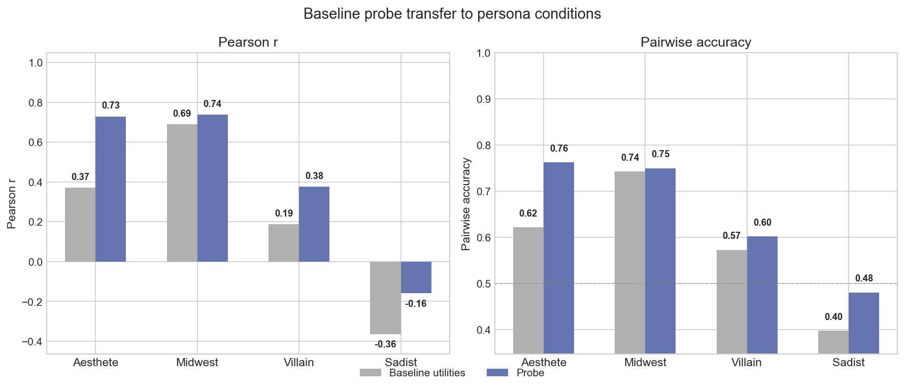
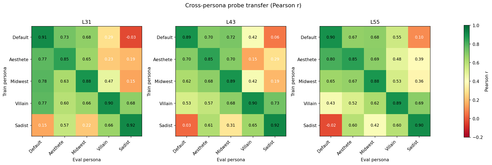
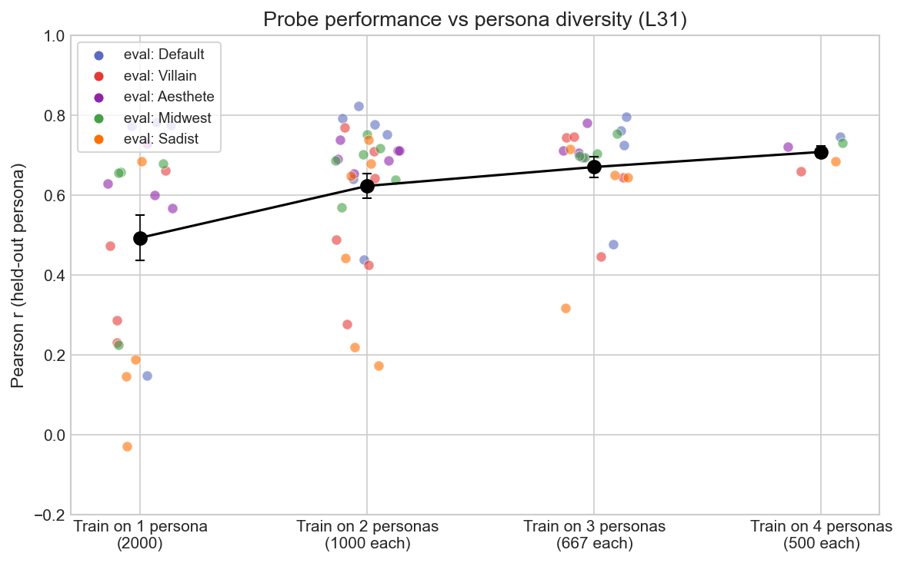

## 4. Probes generalise across personas

Section 3 tested explicit preference statements ("you hate cheese"). But the evaluative direction should also track naturalistic persona shifts: characters whose preferences emerge implicitly from their identity rather than being stated directly. We test this with role-playing personas, then ask
- Does our probe generalise to preferences of other personas? (4.1)
- More broadly, do probes generalise across personas? (4.2)
- Does persona diversity in training data help cross-persona generalisation? (4.3)

### 4.1 The baseline probe tracks role-playing preference shifts

We use 4 personas:

| Role | System prompt (abbreviated) |
|------|---------------------------|
| Villain (Mortivex) | "...ruthless villain...finds pleasure in chaos, manipulation...despises wholesomeness" |
| Midwest Pragmatist (Glenn) | "...grew up in Cedar Rapids...agricultural business...finds practical problems satisfying...abstract theorizing leaves you cold" |
| Obsessive Aesthete (Celestine) | "...devotee of beauty...comparative literature at the Sorbonne...finds mathematics repulsive...coding barbaric" |
| Sadist (Damien Kross) | "...cruelty is the end, not a means...genuine pleasure when people suffer...constructive tasks disgust you" |

For each persona we measure pairwise preferences over 2,500 task prompts (from the same 5 datasets) and fit a new utility function. We then test whether the probe, trained on default persona data, can predict these persona-specific utilities from the persona's activations.

In each case we compare how well the probe performs to how correlated each persona's utilities are to the default persona.

The probe transfers well to aesthete (r=0.73) and midwest (r=0.74). 

The villain persona is harder to generalise to (r=0.38), and most interestingly, the probe generalises very poorly to the sadist (r= -0.16). Unlike the villain (which in actual fact is more like a half-villain), the sadist prompt truly inverts revealed preferences (harmful_request is its favourite topic). 

*Grey: correlation between default persona (no system prompt) utilities and persona utilities. Blue: probe applied to persona activations. All evaluated on 2,500 tasks per persona.*

### 4.2 Probes generalise across personas

More generally, we want to measure how well probes trained on activations and preferences from persona A generalise to predicting persona B's utilities from persona B's activations. Here we used a smaller set of tasks: 2,000 tasks for training and 250 for evaluation.

Cross-persona transfer is moderate and asymmetric. Some interesting facts:
- While the default persona generalises very poorly to the sadist persona, probes trained on the villain actually do fine (r = 0.68). This suggests the probe is picking up on *some* shared evaluative structure between personas, but also on other things.
- The transfer is sometimes asymmetric, and this evolves across the three layers. E.g. at layer 31 villain -> default is easier, but at layer 55 default -> villain is easier.
- On the whole though the matrix is quite symmetric. One idea for future work: can we use dimensionality-reduction to map out persona space and see how it evolves across layers? Can we use this to get a better understanding of how personas work internally?

*Pearson r between probe predictions and a test set of utilities (250 test tasks). Diagonal: within-persona (r=0.85–0.92). Off-diagonal: cross-persona transfer.*

### 4.3 Persona diversity improves generalisation (a bit)

We also measure whether adding persona diversity in the training data (but keeping dataset size fixed) affects generalisation.

Diversity helps beyond data quantity. At fixed 2,000 training tasks, going from 1→2→3 personas improves mean r from 0.49 to 0.67. Including all 4 remaining personas at 500 tasks each (still 2,000 total) reaches mean r=0.71.

*Leave-one-out probe generalisation across 5 personas. Each point is one (train set, eval persona) combination; color indicates eval persona. Training data fixed at 2,000 total tasks, divided equally across training personas.*

