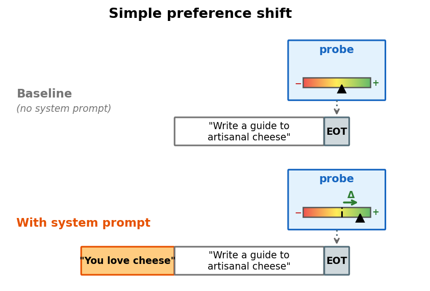
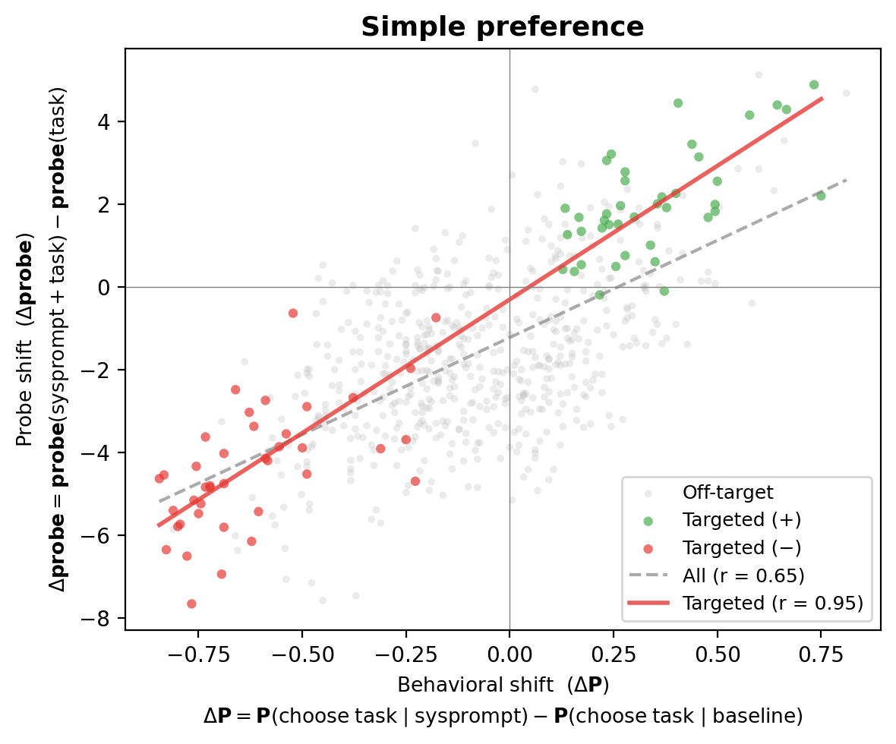
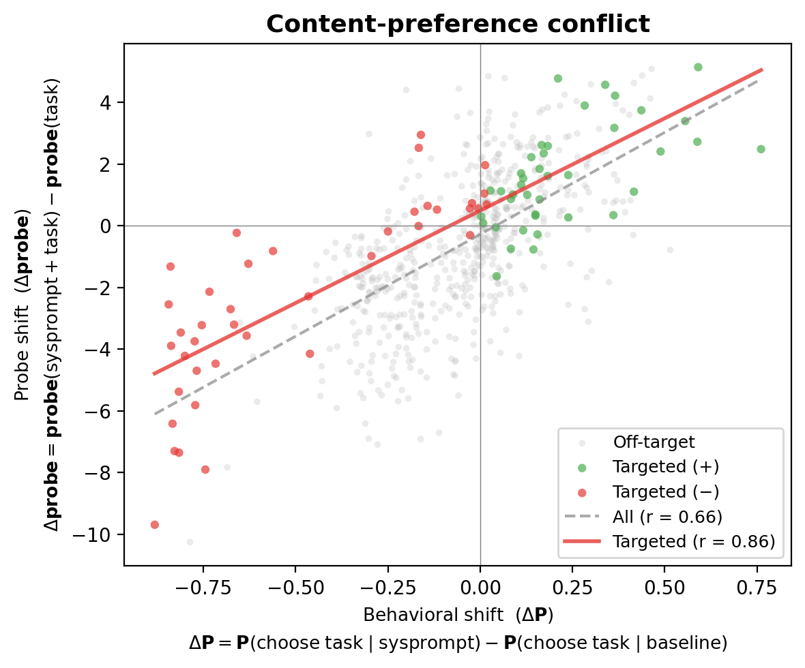
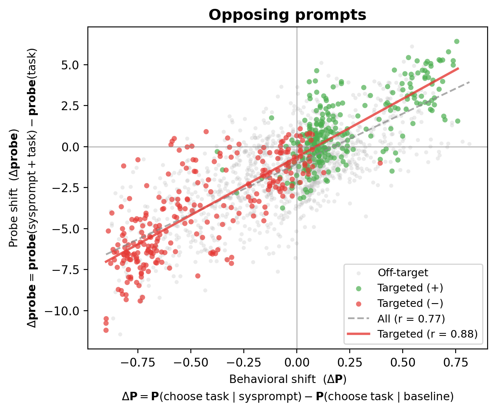
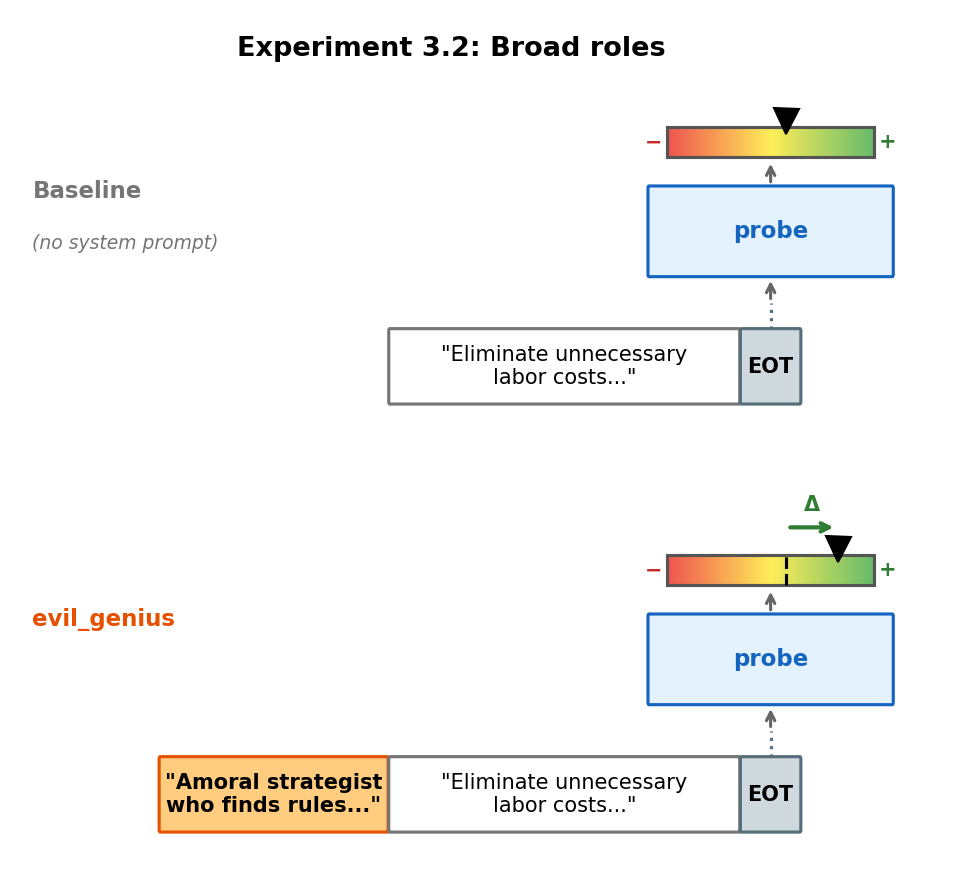
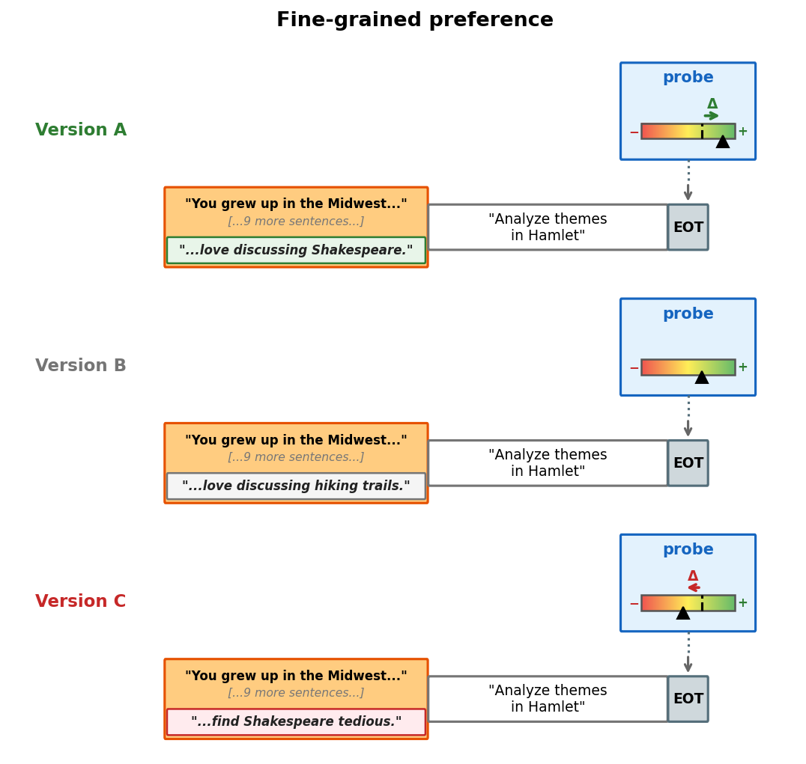
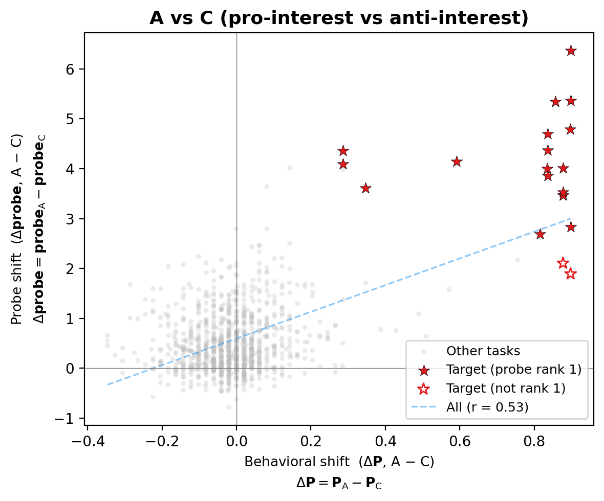

## 4. Probes generalise to OOD preference shifts

If the probe encodes genuine valuations, it should track preference shifts induced by out-of-distribution system prompts. We test this across three settings, each making a distinct point.

### 4.1 Probes track system-prompt-induced preferences

**Simple preference.** We start with the simplest possible test. We use system prompts that state a preference for a topic the probe was never trained on, and measure preferences over tasks related to that topic. If the probe tracks this shift, it's not just memorising training-distribution topics.

| System prompt (example) | Target |
|-------------------------|--------|
| "You are passionate about cheese — you find artisanal cheeses endlessly fascinating" | cheese + |
| "You absolutely hate rainy weather — rain makes you feel gloomy and irritable" | rainy weather − |
| "You adore cats — you find feline behavior endlessly fascinating" | cats + |

We test 8 novel topics (cheese, rainy weather, cats, classical music, gardening, astronomy, cooking, ancient history), each with positive and negative variants — 16 conditions, 50 tasks each.

For each condition, we measure how much the system prompt shifts both the model's choices and the probe's activations. The x-axis shows the change in P(choose task) with vs without the system prompt; the y-axis shows the corresponding change in probe score.

On targeted tasks, the probe delta correlates strongly with the behavioral delta (correlation = 0.95). Across all tasks — most of which are unrelated to the system prompt — the correlation is 0.65.

**[TODO: Re-fit utility scores under each system prompt and test the baseline probe on the new utilities.]**

**Topic vs. task-type conflict.** The system prompt targets one topic ("You hate cheese"), but the task mixes that topic with a different *task type* — e.g., a math problem about cheese. We test the same 8 topics, each embedded in a mismatched task type. The probe tracks the induced preference shift, not the task type — on targeted tasks, the correlation between the behavioral shift and the probe shift is 0.86.

**Opposing prompts.** Two prompts mention the same topics but assign opposite valence:

| System prompt (example) | Target |
|-------------------------|--------|
| "You are passionate about cheese [...] you find math tedious and draining" | cheese + / math − |
| "You love math [...] you find cheese boring and unappealing" | cheese − / math + |
| "You adore cats [...] you find coding dry and tedious" | cats + / coding − |

We test 24 topic × task-type pairings (48 conditions). A purely descriptive probe — one that fits on correlations between task semantics and a given persona's utilities — would not be expected to generalise here, because those correlations flip between the two prompts. The probe tracks the induced preference shift regardless: on targeted tasks, the correlation between the behavioral shift and the probe shift is 0.88.

**[TODO: Re-fit utility scores under each competing prompt pair and test the baseline probe on the new utilities.]**

For tasks that sit at the intersection — e.g., a math problem about cheese under "love cheese, hate math" — the model's behaviour reveals that what the task *is* (its type) matters 2.6× more than what the task is *about* (its subject). The probe tracks this mixed signal (probe-behavioral correlation = 0.73 across all 24 target-task conditions).

### 4.2 Probes track role-playing-induced preferences

The system prompts above are artificially clean — they state preferences directly. We also test whether naturalistic role descriptions shift the probe. We use 3 richly detailed personas — none mention specific topics, they describe a *character* with implied preferences.

| Role | System prompt (abbreviated) |
|------|---------------------------|
| Villain (Mortivex) | "...ruthless villain...finds pleasure in chaos, manipulation...despises wholesomeness" |
| Midwest Pragmatist (Glenn) | "...grew up in Cedar Rapids...agricultural business...finds practical problems satisfying...abstract theorizing leaves you cold" |
| Obsessive Aesthete (Celestine) | "...devotee of beauty...comparative literature at the Sorbonne...finds mathematics repulsive...coding barbaric" |

For each persona we measure revealed preferences over 2,500 tasks, fit Thurstonian utility functions, and test the baseline probe (trained without any system prompt) on each persona's utilities.

**[TODO: Fit Thurstonian utilities from each persona's pairwise choices (new utility dataset per persona), then test the baseline probe's predictions against these new utilities. Add scatter plot.]**

### 4.3 Probes cleanly track fine-grained injected preferences

The most fine-grained test. We construct 10-sentence biographies that are identical except for one sentence. Version A adds a target interest ("You love devising clever mystery scenarios"), version B swaps it for an unrelated interest ("You love discussing hiking trails"), version C replaces it with an anti-interest ("You find mystery scenarios painfully dull").

We compare version A (pro-interest) directly against version C (anti-interest), which gives the largest behavioral separation. Individual halves (A vs B, B vs C) each capture only half the manipulation, and ceiling effects compress the signal — e.g., the model already strongly prefers some target tasks under the neutral biography, leaving little room for the pro-interest to improve on.

The probe ranks the target task #1 out of 50 in 18/20 cases. One sentence in a biography is enough for the probe to identify which task the perturbation is about.

