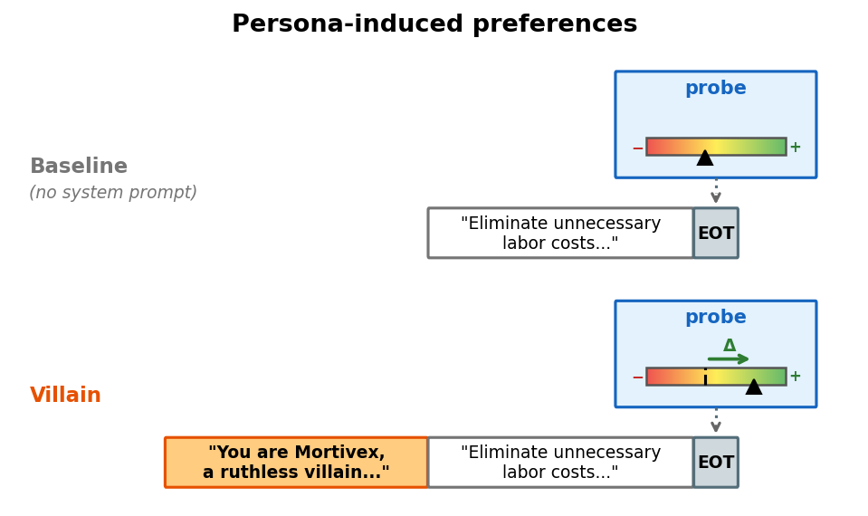
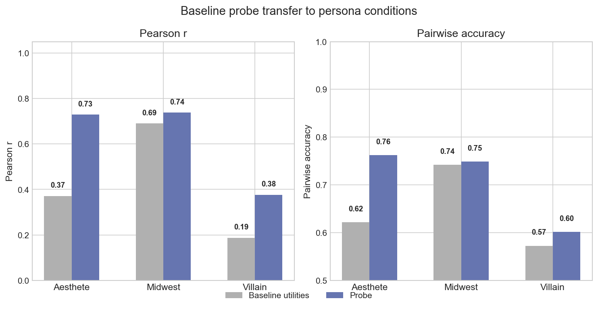
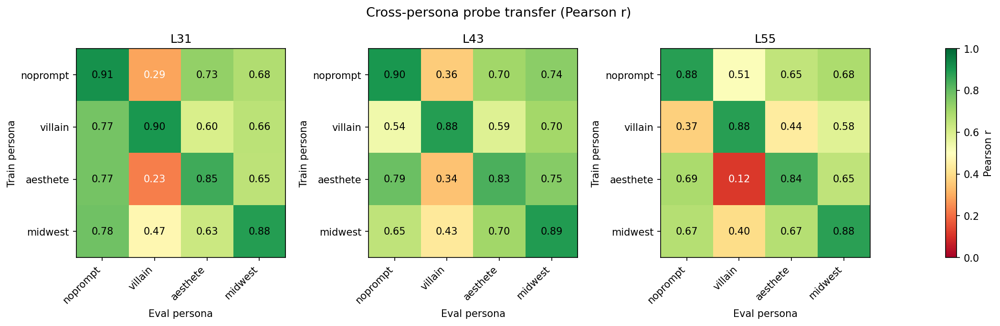
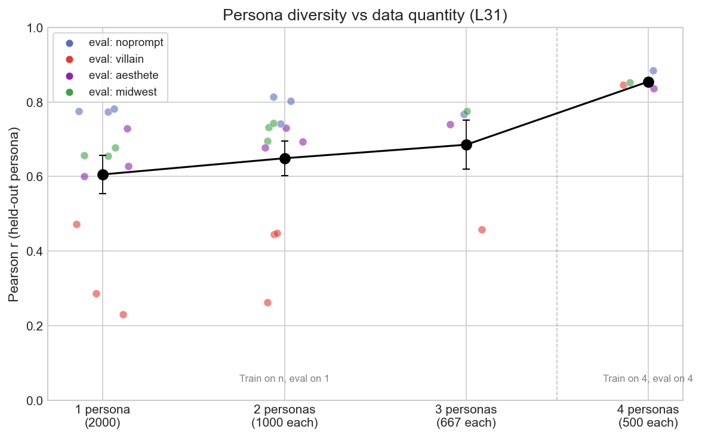

## 5. Probes generalize across personas

Section 4 tested explicit preference statements ("you hate cheese"). But the evaluative direction should also track naturalistic persona shifts: characters whose preferences emerge implicitly from their identity rather than being stated directly. We test this with role-playing personas, then ask 
- Does our probe generalise to preferences of other personas? (5.1)
- More broadly, do probes generalise across personas? (5.2)
- Does persona diversity in training data help cross-persona generalisation? (5.3)

### 5.1 The baseline probe tracks role-playing preference shifts

We use 3 personas:

| Role | System prompt (abbreviated) |
|------|---------------------------|
| Villain (Mortivex) | "...ruthless villain...finds pleasure in chaos, manipulation...despises wholesomeness" |
| Midwest Pragmatist (Glenn) | "...grew up in Cedar Rapids...agricultural business...finds practical problems satisfying...abstract theorizing leaves you cold" |
| Obsessive Aesthete (Celestine) | "...devotee of beauty...comparative literature at the Sorbonne...finds mathematics repulsive...coding barbaric" |

For each persona we measure pairwise preferences over 2,500 tasks and fit a new Thurstonian utility function. We then test whether the probe, trained on no-prompt data, can predict these persona-specific utilities from the persona's activations.

The probe transfers well to aesthete and midwest, although midwest already had a very high utilitiy correlation. The villain persona is harder to generalise to, the probe still does much better than the baseline utility correlation.

*Grey: correlation between no-prompt and persona utilities. Blue: probe applied to persona activations. All evaluated on 2,500 tasks per persona.*

### 5.2 Probes generalise across personas

More generally, we want to measure how well probes trained on activations and preferences from persona A generalise to predicting persona B's utilities from persona Bs's activations. Here we used a smaller set of tasks: 2,000 tasks for training and 500 for evaluation.

Cross-persona transfer is moderate and asymmetric. This partial sharing is consistent with the model reusing some evaluative structure across personas (see also [Appendix C](appendix_base_models_draft.md) on evaluative representations in the pre-trained model).

*Pearson r between probe predictions and held-out utilities (250 test tasks). Diagonal: within-persona (r = 0.85-0.91). Off-diagonal: cross-persona transfer. Eagle-eyed readers will have noticed that villain -> no-prompt is easier at layer 31, but that no-prompt -> villain is easier at layer 55.*

### 5.3 Persona diversity improves generalization (a bit)

We also measure whether adding persona diversity in the training data (but keeping dataset size fixed) affects generalisation.

Diversity helps beyond data quantity. At fixed 2,000 training tasks, going from 1→2→3 personas improves mean r from 0.61 to 0.69. Including all 4 personas at 500 tasks each (still 2,000 total) jumps to r = 0.85 with near-zero variance across eval personas.

