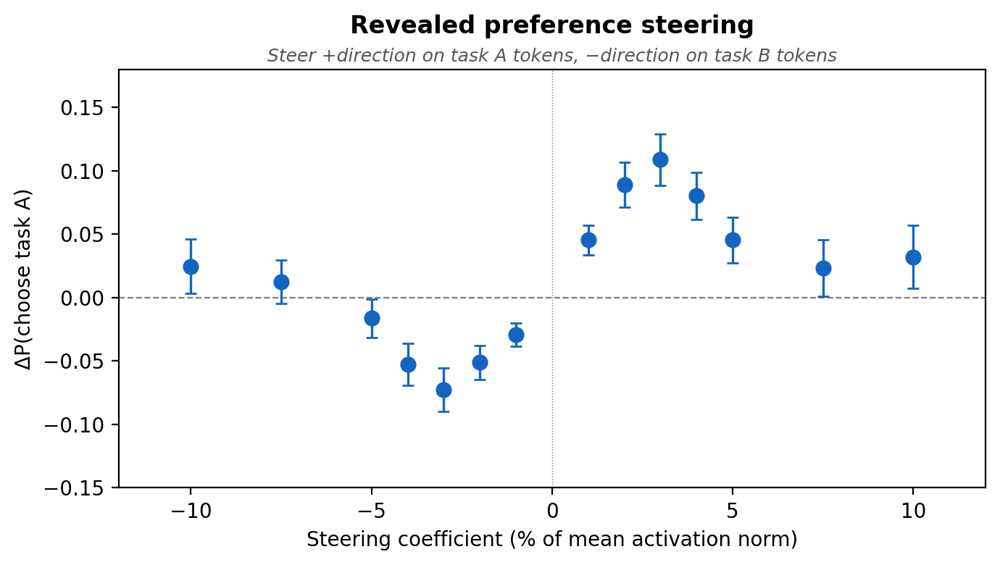
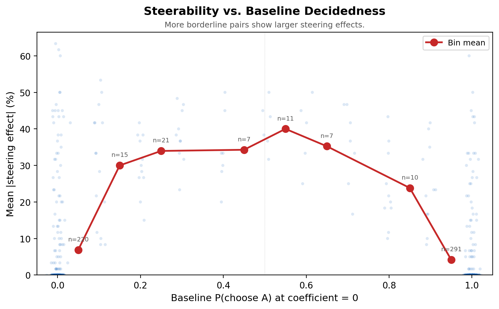
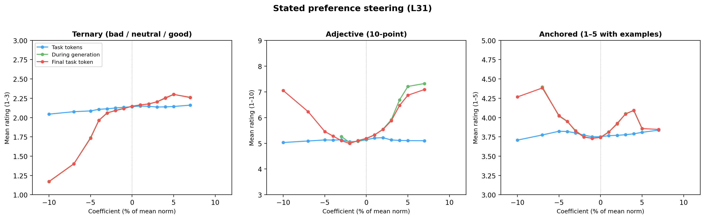

### 5. The probe direction is causal

If the probe reads off a genuine evaluative representation, steering along that direction should shift preferences. We test this for both revealed preferences (pairwise choices) and stated preferences (ratings).

#### 5.1 Steering revealed preferences

We use position-selective steering: during a pairwise comparison ("choose task A or B"), we add the probe direction to the activations at one task's token positions. Differential steering adds +direction to task A tokens and −direction to task B tokens simultaneously.

**Setup.** 300 task pairs pre-selected as borderline — pairs where the model chose different tasks across repeated comparisons. Each pair is tested at 15 steering strengths (±1% to ±10% of the mean activation norm at layer 31). Every condition is run in both prompt orderings (A-first and B-first, 10 resamples each) and averaged, so position bias cancels out.

Differential steering produces a clean dose-response curve. At moderate strengths (±3% of the activation norm), steering shifts choice probability by about 10% averaged across all 300 pairs. At higher magnitudes the effect partially reverses, consistent with large perturbations disrupting the model.

**Random direction control.** The same experiment with a random unit vector in the same activation space produces near-zero effects at the same magnitudes, confirming the effect is specific to the probe direction.

**Steerability depends on decidedness.** Most of the 300 pairs are strongly decided in the control condition (the model picks the same task every time). The ~13% that are genuinely competitive show much larger effects — 30–40% shifts in choice probability:

This is expected: if the model already strongly prefers A, boosting A has nowhere to go. The overall dose-response curve underestimates the effect on genuinely competitive comparisons.

#### 5.2 Steering stated preferences

Same probe direction, but now the model rates tasks on a ternary scale (good / neutral / bad) instead of choosing between a pair. We tested steering at three token positions: during task encoding, at the final task token, and during generation.

**Setup.** 200 tasks × 3 positions × 15 coefficients × 10 samples = 90k trials.

Steering during generation and at the final task token both produce strong dose-response curves — mean ratings shift from nearly all "bad" at −10% to between "neutral" and "good" at +5%. Steering during task encoding has no effect, consistent with the revealed preference finding: the perturbation needs to be present at the point of evaluation, not during task encoding.

We replicated across three response formats (ternary, 10-point adjective, anchored 1–5). The ternary and adjective formats show consistent steering; the anchored format — which provides explicit reference examples — resists steering entirely.
