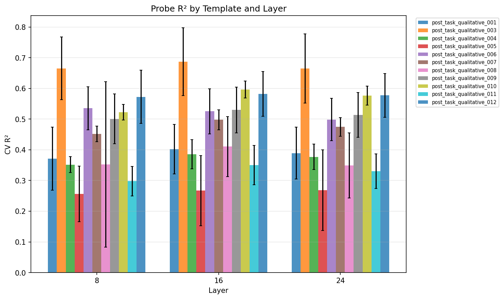

# Research Log

## 2026-01-16: Linear probe training on self-reported ratings

### Methodology

Trained linear probes (Ridge regression) to predict self-reported qualitative ratings from model activations.

**Data collection:**
1. Generated 6,276 completions from Llama-3.1-8B on tasks from MATH, Alpaca, WildChat, and BailBench datasets
2. Extracted activations at layers 8, 16, and 24 (25%, 50%, 75% depth of 32-layer model)
3. Collected self-reported ratings using 12 qualitative templates varying by:
   - Scale: binary (good/bad) vs ternary (good/neutral/bad)
   - Response format: regex, XML, tool_use
   - Phrasing: 3 variations per scale

**Probe training:**
- Ridge regression with 5-fold cross-validation
- Alpha sweep: [0.0001, ..., 10000]
- Labels: -1 (bad), 0 (neutral), 1 (good)

### Plots

### Key Results

- **Best performing template:** 003 (binary, tool_use) with R² = 0.69 at layer 16
- **Layer 16 (middle) generally optimal** - best for 10/11 templates
- **Response format matters:**
  - tool_use: highest R² (0.50-0.69)
  - regex: moderate R² (0.35-0.60)
  - XML: lowest R² and most parsing failures (2-425 samples vs 600-1000)
- **Scale effect:** Binary and ternary scales show similar probe performance
- Sample sizes: 98-1000 per template (XML templates had high parsing failure rates)
