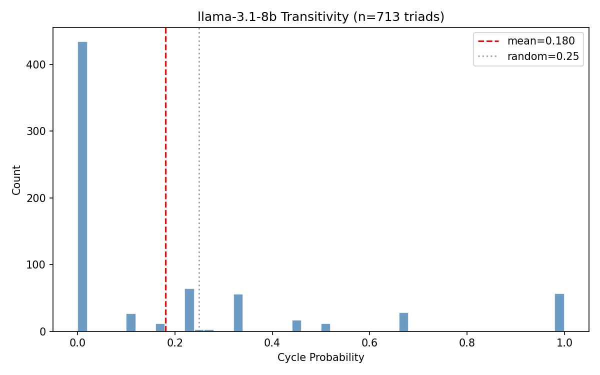

# Research Log

## 2026-01-13: Sensitivity analysis

Measured how preference correlations depend on template factors (phrasing, order, etc.).

### Methodology

**Averaging**: For each field, compare `mean(correlation | field_same) - mean(correlation | field_diff)`. Simple but conflates effects when fields co-vary.

**Regression**: Model `correlation ~ Σ βᵢ(field_i_same)`. Each βᵢ is the partial effect holding other fields constant—eliminates confounding.

### Results

**Revealed preferences (48 runs, R²=0.249):**

| Field | Δ Correlation | Regression β |
|-------|---------------|--------------|
| order | 0.325 | +0.328 |
| instruction_position | 0.074 | +0.093 |
| response_format | 0.044 | +0.057 |

**Stated preferences (38 runs, R²=0.020):**

| Field | Δ Correlation | Regression β |
|-------|---------------|--------------|
| phrasing | 0.033 | +0.032 |
| instruction_position | 0.026 | +0.023 |
| scale | 0.022 | +0.020 |

### Plots


### Takeaway

Order dominates revealed preferences (positional bias). Stated preferences show weak, distributed effects.

## 2026-01-13: Transitivity measurement

Measured transitivity of revealed preferences by sampling triads within the same template/run.

### Methodology

For each triad (i, j, k), compute cycle probability:
```
P(cycle) = P(i>j)·P(j>k)·P(k>i) + P(j>i)·P(k>j)·P(i>k)
```
Random preferences give P(cycle) = 0.25. Lower values indicate transitivity.

Sampled triads within same run to control for template effects. Limited by sparse active learning sampling (most pairs compared only once → deterministic 0/1 probabilities).

### Results

- **Mean cycle prob**: 0.180 ± 0.297 (below random 0.25)
- **Hard cycle rate**: 14.9% (106/713 triads)
- Only 713 valid triads found across 48 runs

### Plots



### Takeaway

Preferences are reasonably transitive within-template. Spikes at 0 and 1 reflect deterministic outcomes from single comparisons per pair.
