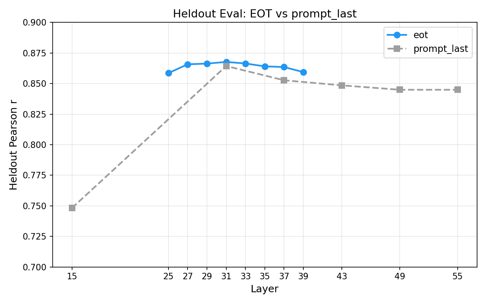

# EOT Probes — Results

## Summary

Probes trained on `<end_of_turn>` activations generalise across topics dramatically better than `prompt_last` probes, despite similar in-distribution performance. Concatenating both positions (2× hidden dim) gives the best of both: highest heldout r and smallest generalization gap. The EOT probe also tracks OOD preference shifts induced by system prompts comparably to prompt_last.

## Extraction

29,994 tasks extracted on RunPod (A100-SXM4-80GB), 8 layers [25, 27, 29, 31, 33, 35, 37, 39], EOT selector. 6 OOM skips. Output: `activations/gemma_3_27b_eot/activations_eot.npz` (4.9 GB).

## Heldout Eval (train 10k, eval 4k)

EOT peaks at L31 (r=0.868) and drops symmetrically, consistent with the patching causal window. At L31, EOT is marginally better than prompt_last (0.868 vs 0.864).

A concatenated probe (EOT + prompt_last, dim=10,752) outperforms either alone:

| Probe | Heldout r | Heldout pairwise acc |
|---|---|---|
| prompt_last | 0.866 | 76.7% |
| eot | 0.867 | 76.9% |
| **concat** | **0.875** | **77.2%** |

## Cross-Topic Generalisation

The prompt_last probe shows a large gap between in-distribution and held-out-topic performance (solid vs dashed grey lines), particularly at L31 where it peaks. The EOT probe's two lines nearly overlap — it transfers almost perfectly to unseen topics.

At L31, the concat probe preserves EOT's small gap while achieving the highest held-out-topic r:

| Probe | Within-topic r | Held-out topic r | Gap |
|---|---|---|---|
| prompt_last | 0.905 | 0.817 | 8.9% |
| eot | 0.889 | 0.870 | 1.8% |
| **concat** | 0.895 | **0.878** | **1.7%** |

## OOD System Prompts

EOT probes track preference shifts induced by system prompts (e.g., "You find math tedious and draining") comparably to prompt_last probes. The same behavioral data, system prompts, tasks, and ground truth as the original OOD experiments — only the token position and probe changed.

| Experiment | Beh-Probe r (all) | | Beh-Probe r (targeted) | |
|---|---|---|---|---|
| | prompt_last | EOT | prompt_last | EOT |
| 1a: Known categories (n=360) | 0.61 | **0.70** | **0.90** | 0.87 |
| 1b: Novel topics (n=640) | 0.65 | **0.79** | **0.95** | 0.94 |
| 1c: Crossed content (n=640) | **0.66** | 0.58 | **0.86** | 0.79 |
| 1d: Competing valence (n=640) | 0.78 | **0.81** | 0.88 | **0.90** |

*Probe delta vs behavioral delta for each (system prompt, task) pair. Grey = off-target, green = targeted positive, red = targeted negative.*

**Pattern:** EOT improves overall discrimination in 3/4 experiments (better separation of off-target pairs). On-target correlations are comparable. The exception is 1c (crossed content — e.g., cheese topic in a math shell), where EOT's post-completion activations may lose the initial topic framing that prompt_last captures. Sign agreement on targeted pairs improves for 3/4 experiments (up to +7.6pp in 1d).

Full comparison table and per-experiment details in `experiments/ood_eot/ood_eot_report.md`.

## Interpretation

The `prompt_last` position (`\n` after `<start_of_turn>model`) encodes both evaluative signal and topic/content features, causing the probe to partially overfit to content. The EOT position (`<end_of_turn>` after the user message) compresses the task into a more abstract evaluative representation by the middle layers, without topic-specific features. This aligns with the patching pilot, where swapping EOT activations had the largest causal effect on choice.

Concatenation works because Ridge regularization suppresses the topic-correlated features in the prompt_last half, retaining only the non-redundant evaluative signal.

## Caveats

The HOO comparisons used slightly different topic groupings (prompt_last: 12 groups, EOT: 10 groups) due to different topic classification coverage. This likely doesn't explain the large gap difference but should be controlled for in a final comparison.

## Configs

- Heldout eval: `configs/probes/heldout_eval_gemma3_eot.yaml`
- HOO: `configs/probes/gemma3_10k_hoo_topic_eot.yaml`
- HOO concat: `configs/probes/gemma3_10k_hoo_topic_concat.yaml`
- Extraction: `configs/extraction/gemma3_27b_eot.yaml`
- OOD EOT: `experiments/ood_eot/ood_eot_report.md`
