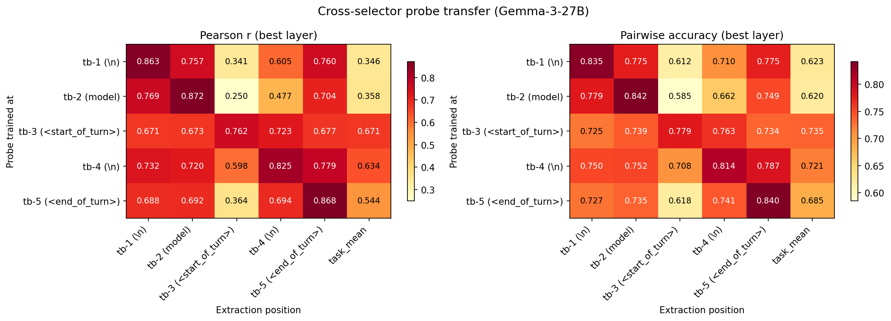

# Cross-Selector Probe Transfer

Probes are position-specific: matched-position evaluation (diagonal) consistently outperforms cross-position transfer, with Pearson r dropping 0.10–0.50 off-diagonal.

## Setup

**Question.** Do probes trained at one turn-boundary token transfer to other positions?

**Data.** 5 Ridge probes (tb-1 through tb-5), each trained on activations from a specific token in Gemma 3 27B IT's turn-boundary template. The template between user prompt and model response is:

```
<end_of_turn>\n<start_of_turn>model\n
 tb-5       tb-4  tb-3           tb-2  tb-1
```

Each probe is evaluated on activations from all 5 turn-boundary positions plus task_mean (average over all prompt tokens). 4,038 tasks, 5 layers (25, 32, 39, 46, 53); we report the best layer per cell.

## Results



### Pearson r (best layer per cell)

| Probe \ Position | tb-1 (`\n`) | tb-2 (`model`) | tb-3 (`<start_of_turn>`) | tb-4 (`\n`) | tb-5 (`<end_of_turn>`) | task_mean |
|:-----------------|:-----:|:-----:|:-----:|:-----:|:-----:|:---------:|
| **tb-1** | **0.863** | 0.757 | 0.341 | 0.605 | 0.760 | 0.346 |
| **tb-2** | 0.769 | **0.872** | 0.250 | 0.477 | 0.704 | 0.358 |
| **tb-3** | 0.671 | 0.673 | **0.762** | 0.723 | 0.677 | 0.671 |
| **tb-4** | 0.732 | 0.720 | 0.598 | **0.825** | 0.779 | 0.634 |
| **tb-5** | 0.688 | 0.692 | 0.364 | 0.694 | **0.868** | 0.544 |

### Pairwise accuracy (best layer per cell)

| Probe \ Position | tb-1 (`\n`) | tb-2 (`model`) | tb-3 (`<start_of_turn>`) | tb-4 (`\n`) | tb-5 (`<end_of_turn>`) | task_mean |
|:-----------------|:-----:|:-----:|:-----:|:-----:|:-----:|:---------:|
| **tb-1** | **0.835** | 0.775 | 0.612 | 0.710 | 0.775 | 0.623 |
| **tb-2** | 0.779 | **0.842** | 0.585 | 0.662 | 0.749 | 0.620 |
| **tb-3** | 0.725 | 0.739 | **0.779** | 0.763 | 0.734 | 0.735 |
| **tb-4** | 0.750 | 0.752 | 0.708 | **0.814** | 0.787 | 0.721 |
| **tb-5** | 0.727 | 0.735 | 0.618 | 0.741 | **0.840** | 0.685 |

*Chance pairwise accuracy = 0.50. Diagonal entries bolded.*

## Notes

- The diagonal dominates — probes do not transfer freely across turn-boundary positions.
- tb-3 (`<start_of_turn>`) is the weakest extraction position for nearly all probes (r as low as 0.25), and also the weakest training position (on-diagonal r = 0.762 vs 0.86+ for tb-1, tb-2, tb-5).
- task_mean performs comparably to tb-3 — averaging over all tokens dilutes the concentrated turn-boundary signal.
- tb-3 probe is the most position-agnostic: its off-diagonal r values (0.67–0.72) are closer to its on-diagonal (0.76) than any other probe. This may reflect that `<start_of_turn>` carries a weaker, more generic signal.
