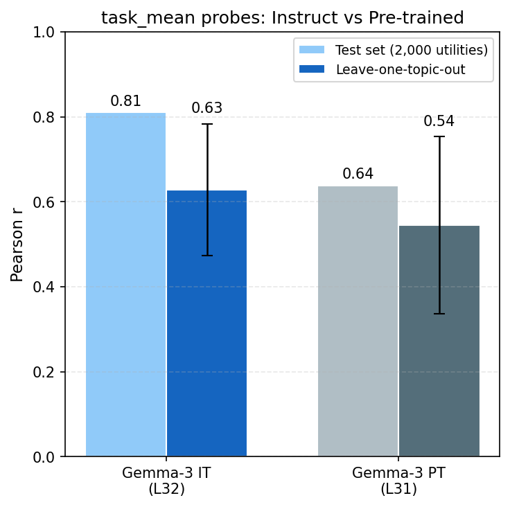
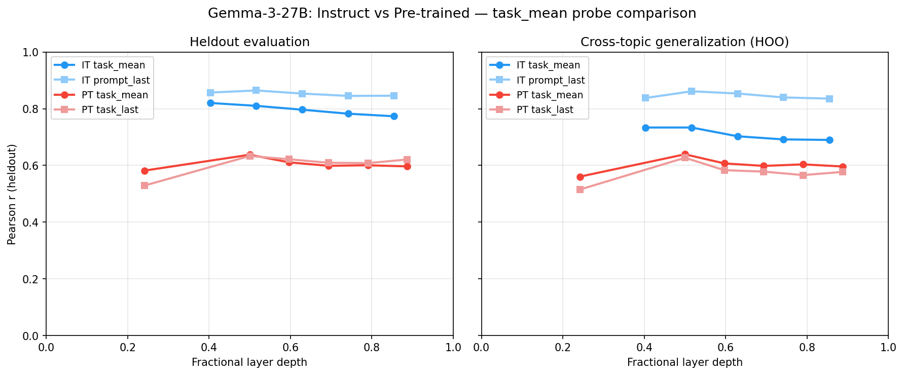
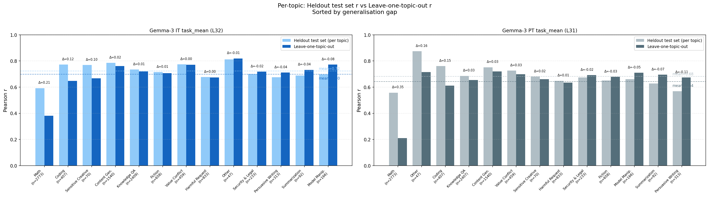

# Instruct vs Pre-trained: task_mean Probe Comparison

## Setup

We train Ridge probes on Gemma-3-27B activations to predict Thurstonian preference scores (demeaned by topic). The `task_mean` selector averages activations across all tokens in the task prompt. We compare this against position-specific selectors: `prompt_last` (turn_boundary:-1) for the instruct model and `task_last` for the pre-trained model.

Both models use the same 10k training tasks and 4k heldout evaluation tasks. Alpha is selected on the heldout eval set (2k sweep, 2k final). Cross-topic generalization is measured via hold-one-out (HOO) by topic category (13 folds), with alpha pre-selected on the heldout eval set. HOO r is reported as a task-weighted mean across folds.

## Results

### Heldout Pearson r (best layer)

| Model | task_mean | Position-specific | Gap |
|-------|-----------|-------------------|-----|
| Instruct | 0.82 (L25) | 0.86 (L32, prompt_last) | -0.04 |
| Pre-trained | 0.64 (L31) | 0.63 (L31, task_last) | +0.01 |

### Cross-topic HOO r (best layer, task-weighted)

| Model | task_mean | Position-specific | Gap |
|-------|-----------|-------------------|-----|
| Instruct | 0.63 (L25) | 0.79 (L31, concat) | -0.16 |
| Pre-trained | 0.54 (L31) | 0.54 (L31, task_last) | 0.00 |

### Per-topic generalisation

The per-topic breakdown trains a probe on all 10k data and evaluates on the 4k heldout eval set broken down by topic, compared against leave-one-topic-out r. The generalisation gap (heldout minus HOO) is small for most topics, but math is a clear outlier — both models generalise poorly to math tasks held out during training. Since math is ~28% of all tasks, this single topic drives most of the heldout-to-HOO gap in the aggregate numbers.

## Discussion

The instruct and pre-trained models show qualitatively different patterns:

1. **Instruct model: concat dominates task_mean.** The instruct model's concat probe (r=0.87 heldout) substantially outperforms task_mean (r=0.82), and the gap widens on task-weighted cross-topic generalization (0.79 vs 0.63). This is consistent with instruction tuning concentrating preference-relevant information at turn boundary token positions.

2. **Pre-trained model: task_mean matches task_last.** In the base model, mean-pooling across all task tokens performs comparably to the last token (both ~0.64 heldout, both ~0.54 task-weighted HOO). The preference signal is more distributed across positions in the pre-trained model.

3. **Instruct-PT gap is large regardless of selector.** The instruct model's best probe (r=0.87) is ~0.23 higher than the pre-trained model's best (r=0.64). Instruction tuning substantially amplifies the preference signal, not just concentrates it.

4. **Large heldout-to-HOO gap driven by math.** All probes show a substantial drop from heldout to task-weighted HOO (IT task_mean: 0.82→0.63, PT: 0.64→0.54), driven primarily by poor math generalization (r~0.2–0.4 when math is held out). Math tasks constitute ~28% of data, so task-weighting exposes this failure mode.
