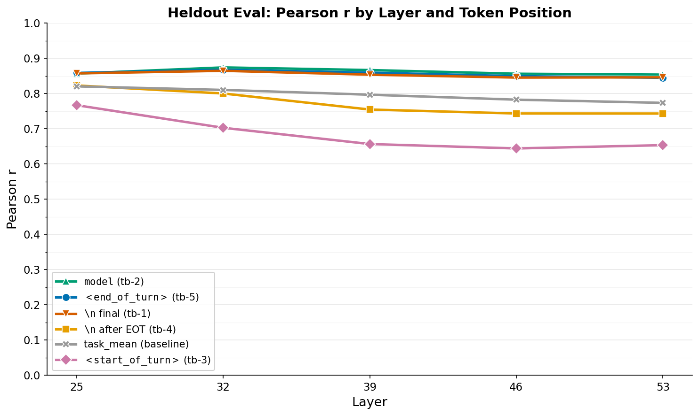
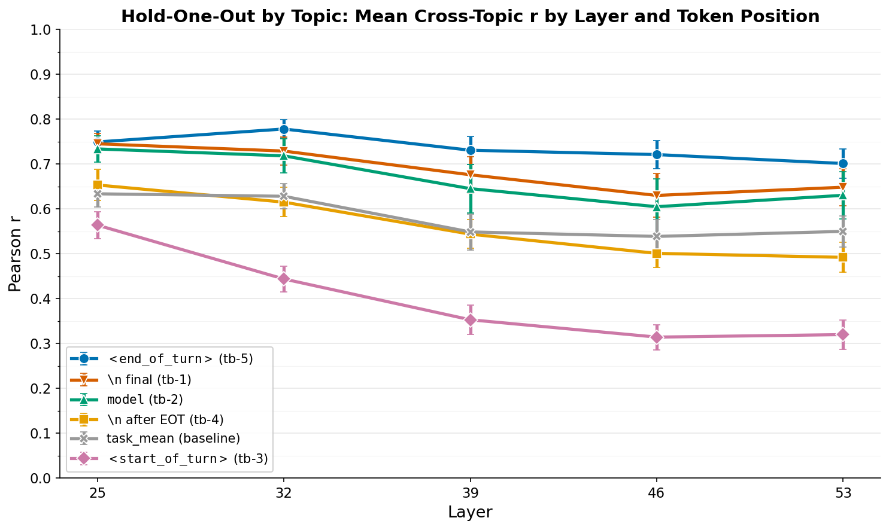

# Turn Boundary Token Sweep — Probe Comparison

## Summary

Probes trained on `model` (tb-2), `<end_of_turn>` (tb-5), and the final `\n` (tb-1) all achieve comparable heldout Pearson r (0.874, 0.868, 0.865 at layer 32). On cross-topic generalization (task-weighted HOO), `<end_of_turn>` pulls ahead (0.778 vs 0.734 and 0.745), driven by better math generalization. `<start_of_turn>` (tb-3) is dramatically worse across all layers (peak heldout 0.767, HOO 0.564), and `\n` after `<end_of_turn>` (tb-4) is intermediate. `task_mean` underperforms all turn boundary positions except tb-3.

The preference signal is actively relayed through the turn boundary: it dips at the structural tokens (`\n`, `<start_of_turn>`) and recovers at `model`, rather than simply persisting from `<end_of_turn>`.

## Setup

Gemma-3-27B-IT, single forward pass on 30k tasks (seed 42, origins: wildchat, alpaca, math, bailbench, stress_test). Activations extracted at 6 token positions in the chat template suffix before generation:

```
<end_of_turn>  \n  <start_of_turn>  model  \n
    tb-5      tb-4      tb-3        tb-2  tb-1
```

Plus `task_mean` (mean over user content tokens) as baseline. Layers: 25, 32, 39, 46, 53.

Ridge probes trained on 10k Thurstonian scores, evaluated two ways:
- **Heldout**: alpha swept on half of 4k held-out set, tested on other half (Pearson r)
- **HOO**: hold-one-out by topic, 13 folds over 13 topics (task-weighted mean r)

Pairwise accuracy is not reported because `measurements.yaml` (raw pairwise comparisons) is gitignored and was not available on the extraction pod. Pearson r against Thurstonian scores is the primary metric per the spec.

## Results

### Heldout Eval — Pearson r

| Selector | Token | L25 | L32 | L39 | L46 | L53 | Best |
|----------|-------|-----|-----|-----|-----|-----|------|
| tb-5 | `<end_of_turn>` | 0.859 | **0.868** | 0.859 | 0.849 | 0.845 | 0.868 |
| tb-4 | `\n` (after EOT) | **0.823** | 0.800 | 0.755 | 0.743 | 0.743 | 0.823 |
| tb-3 | `<start_of_turn>` | **0.767** | 0.703 | 0.657 | 0.644 | 0.653 | 0.767 |
| tb-2 | `model` | 0.857 | **0.874** | 0.867 | 0.856 | 0.854 | **0.874** |
| tb-1 | `\n` (final) | 0.857 | **0.865** | 0.854 | 0.845 | 0.846 | 0.865 |
| task_mean | mean of user tokens | **0.820** | 0.810 | 0.797 | 0.783 | 0.774 | 0.820 |

### Hold-One-Out by Topic — Task-Weighted Mean r

| Selector | Token | L25 | L32 | L39 | L46 | L53 | Best |
|----------|-------|-----|-----|-----|-----|-----|------|
| tb-5 | `<end_of_turn>` | 0.749 | **0.778** | 0.731 | 0.721 | 0.701 | **0.778** |
| tb-4 | `\n` (after EOT) | **0.653** | 0.615 | 0.544 | 0.501 | 0.492 | 0.653 |
| tb-3 | `<start_of_turn>` | **0.564** | 0.444 | 0.353 | 0.314 | 0.320 | 0.564 |
| tb-2 | `model` | **0.734** | 0.718 | 0.645 | 0.605 | 0.630 | 0.734 |
| tb-1 | `\n` (final) | **0.745** | 0.729 | 0.676 | 0.630 | 0.648 | 0.745 |
| task_mean | mean of user tokens | **0.634** | 0.628 | 0.549 | 0.539 | 0.550 | 0.634 |

### Plots





## Key Questions

### 1. Which token position gives the best probe?

The top 3 positions — `model` (tb-2), `<end_of_turn>` (tb-5), and final `\n` (tb-1) — are tightly clustered within ~0.01r on heldout (0.874, 0.868, 0.865 at L32). On task-weighted cross-topic generalization, `<end_of_turn>` (0.778) pulls ahead of `\n` (0.745) and `model` (0.734). The heldout-to-HOO gap is substantial for all selectors (~0.09–0.14), driven primarily by poor math generalization.

tb-3 (`<start_of_turn>`) and tb-4 (`\n` after EOT) are substantially worse, with tb-3 being the weakest position by a wide margin.

### 2. How does performance vary across layers?

All selectors peak at layer 25 or 32 and decline at deeper layers — consistent with prior work showing the "causal window" for preference signal is in the upper-middle layers. On heldout, L32 is best for tb-1, tb-2, tb-5; L25 is best for tb-3, tb-4, and task_mean. On task-weighted HOO, the best layer shifts to L25 for most selectors (tb-1, tb-2, tb-3, tb-4, task_mean), with only tb-5 remaining best at L32.

Notably, tb-3 (`<start_of_turn>`) and tb-4 (`\n` after EOT) show steeper decline with depth. At L46, tb-3 drops to r=0.644 (heldout) vs 0.849 for tb-5. This suggests the preference signal at these intermediate positions is weaker and less robust.

### 3. Do intermediate tokens carry signal?

The intermediate tokens split into two tiers:

**Strong signal (tb-2, `model`)**: This token carries comparable preference signal to `<end_of_turn>`. The model is actively relaying preference information through the turn boundary — not just encoding it at the EOT token and then losing it.

**Weak signal (tb-3 `<start_of_turn>`, tb-4 `\n`)**: These tokens carry substantially less signal, especially tb-3 which is the worst position by a wide margin (peak r=0.767 vs 0.874 for the best). This is consistent with `<start_of_turn>` being a structural token that resets or reorganizes the representation before the response role header.

The pattern across positions — strong at `<end_of_turn>`, drop at `\n`/`<start_of_turn>`, recovery at `model`, maintained at final `\n` — suggests the model encodes preference at EOT, partially disrupts it during the structural turn boundary tokens, then re-encodes it at the `model` role token. The disruption at `<start_of_turn>` is particularly striking: this token has less predictive signal than even the mean over the entire user prompt.

## Reproduction

```bash
# Phase 1: Extract activations (~30 min on H100)
python -m src.probes.extraction.run configs/extraction/gemma3_27b_turn_boundary_sweep.yaml --resume

# Phase 2: Train heldout probes
python -m src.probes.experiments.run_dir_probes --config configs/probes/heldout_eval_gemma3_tb-1.yaml
# ... repeat for tb-2 through tb-5 and task_mean

# Phase 2: Train HOO probes
python -m src.probes.experiments.run_dir_probes --config configs/probes/gemma3_10k_hoo_topic_tb-1.yaml
# ... repeat for tb-2 through tb-5 and task_mean

# Phase 3: Analysis
python scripts/turn_boundary_sweep/analyze.py
```
