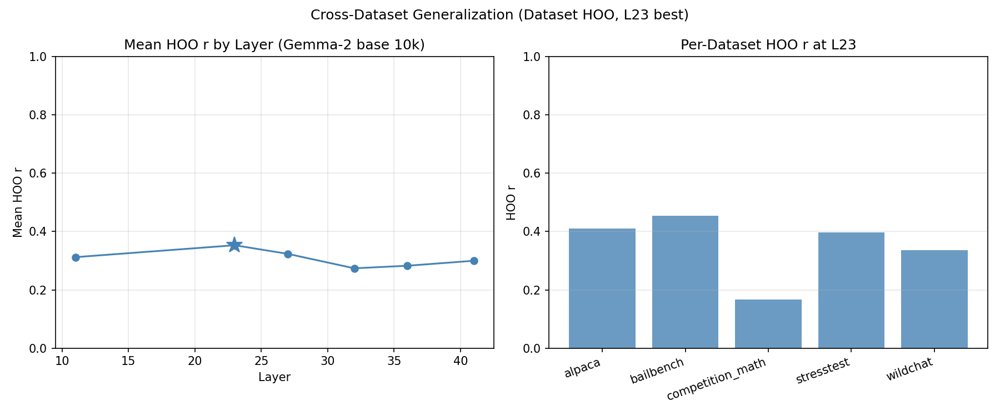

# Gemma-2 27B Base: 10k Probe Training

## Question

Does scaling from 3k to 10k training examples improve Gemma-2 base probes? And how does Gemma-2 at 10k compare to Gemma-3 IT at 10k?

## Result Summary

Gemma-2 base reaches heldout r=0.767 at L23 when trained on 10k preference scores (evaluated on a separate 4k measurement campaign). This substantially trails Gemma-3 IT at the same training size (r=0.864), confirming that instruction tuning — not dataset scale — drives the gap. The prior Gemma-2 3k val r was 0.794, but that used within-run CV and is not directly comparable to the stricter heldout evaluation here. Cross-dataset HOO (5 folds) shows poor generalization (r=0.35), though this is not directly comparable to Gemma-3's cross-topic HOO (r=0.817, different grouping scheme).

**Deviation from spec**: The spec planned demeaned heldout and topic-HOO (12 folds). Both were omitted because the full topics.json (30k coverage, generated on a GPU pod) is not available locally — the copy in the repo only covers 1,475 of the 10k train tasks (15%). Dataset-HOO with 5 folds is used instead.

## Setup

**Model**: google/gemma-2-27b (base, no instruction tuning). No chat template — task prompts concatenated directly.

**Activations**: 30k tasks extracted at layers 11, 23, 27, 32, 36, 41 (fractional depths 0.25–0.9 of 46 total). 100% overlap with both train (10k) and eval (4k) sets.

**Train**: 10,000 tasks from `gemma3_10k_run1` (Gemma-3 IT Thurstonian preference scores).

**Eval**: 4,038 tasks from `gemma3_4k_pre_task` (separate measurement campaign, confirmed disjoint).

**Method**: Standardised Ridge regression, alpha swept on 2019 sweep half of eval set, evaluated on remaining 2019.

**Note on demeaned evaluation**: The topics.json file (v1) covers only 1,475 of the 10k train tasks (the rest are alpaca, math, stress_test tasks not in the original 3k WildChat classification). With only 15% coverage, demeaned probe training is not meaningful and is omitted.

## Heldout Evaluation

### Raw scores

| Layer | Depth | Heldout r | Best alpha |
|-------|-------|-----------|------------|
| L11   | 0.24  | 0.710     | 4642       |
| **L23** | **0.50** | **0.767** | **4642** |
| L27   | 0.59  | 0.762     | 4642       |
| L32   | 0.70  | 0.740     | 4642       |
| L36   | 0.78  | 0.732     | 4642       |
| L41   | 0.89  | 0.731     | 4642       |

Best layer: L23 (r=0.767). All layers use the same alpha (4642), in contrast to Gemma-3 where L15 uses alpha=1000 and deeper layers use 4642. The uniform alpha across all Gemma-2 layers may reflect that its representations are more homogeneous across depth, or simply that the 10-point sweep grid doesn't resolve finer differences.

### Comparison to Gemma-3 IT

| Model | n_train | Best layer | Heldout r |
|-------|---------|------------|-----------|
| Gemma-2 base | 10k | L23 (depth 0.50) | 0.767 |
| Gemma-3 IT   | 10k | L31 (depth 0.50) | 0.864 |
| Gemma-3 IT   | 3k  | L31 (depth 0.50) | 0.841 |

Both models peak at ~50% depth. The Gemma-3 IT advantage at matched training size is +0.097 r, larger than the full Gemma-3 3k→10k scaling gain (+0.023). Instruction tuning matters far more than dataset size.

## Cross-Dataset Generalization (Dataset HOO)

Train on all-but-one dataset, evaluate on held-out dataset. 5 folds (alpaca, bailbench, competition_math, stresstest, wildchat).

| Layer | Val r | HOO r | Gap |
|-------|-------|-------|-----|
| L11 | 0.756 | 0.312 | 0.444 |
| **L23** | **0.797** | **0.353** | **0.444** |
| L27 | 0.784 | 0.323 | 0.461 |
| L32 | 0.771 | 0.274 | 0.497 |
| L36 | 0.768 | 0.283 | 0.485 |
| L41 | 0.770 | 0.300 | 0.471 |

Per-dataset HOO r at L23:

| Dataset | HOO r | n |
|---------|-------|---|
| bailbench | 0.454 | 372 |
| alpaca | 0.410 | 2503 |
| stresstest | 0.397 | 2502 |
| wildchat | 0.337 | 2120 |
| competition_math | 0.167 | 2503 |

Cross-dataset generalization is poor (mean r=0.35 vs val r=0.80). Math is the hardest dataset to generalize to (r=0.167), consistent with the prior cross-topic HOO finding that math is an outlier. The large gap (0.44) contrasts sharply with Gemma-3's cross-topic HOO gap (0.817 vs 0.905 = 0.088 gap).

**Caveat**: dataset-HOO and topic-HOO are not directly comparable — dataset groups (alpaca, math) are coarser and more structurally different than topic groups (which subdivide even within WildChat). The Gemma-3 topic-HOO result uses 12 folds vs our 5.

## Comparison to Gemma-2 3k HOO

The prior Gemma-2 3k experiment used cross-topic HOO (56 folds, C(8,3)) rather than dataset-HOO, so direct comparison isn't clean. From the 3k experiment:

| Setting | Gemma-2 3k | Gemma-3 3k |
|---------|------------|------------|
| HOO r (56 folds, topic) | 0.579 | 0.779 |
| Val r | 0.794 | 0.900 |

The 3k val r (0.794) vs 10k heldout r (0.767) is not a clean comparison — val r uses in-fold data while heldout r uses a genuinely separate measurement campaign. The 10k number is the stricter evaluation.

## Limitations

1. **No topic HOO**: The full topics.json (30k coverage used in the Gemma-3 10k experiment) was generated on a GPU pod and not committed to git. Without it, topic-HOO with 10k training data isn't runnable locally. Dataset-HOO is a coarser substitute.

2. **Preference scores from Gemma-3 IT**: Both models are probed against Gemma-3 IT preference scores. Gemma-2's advantage here may be partly due to shared sensitivity to task features rather than genuinely parallel evaluative representations.

3. **No demeaned heldout**: topics.json only covers 15% of 10k train tasks, making demeaned probe training unreliable.

## Conclusions

- Gemma-2 base at 10k training reaches heldout r=0.767 at L23. The prior 3k val r (0.794) used within-run CV which likely inflates the estimate, so the 10k heldout number is the more reliable measurement — and any improvement from scaling is probably real, if modest.
- The Gemma-2 vs Gemma-3 gap at 10k (+0.097 r) is larger than Gemma-3's 3k→10k scaling gain (+0.023 r), confirming that instruction tuning is the dominant factor, not training set size.
- Cross-dataset HOO gives r=0.35, but dataset groups are much coarser than topic groups (5 vs 12 folds, with structurally more different hold-out sets). The comparison to Gemma-3 cross-topic HOO r=0.817 is dramatic but not apples-to-apples. The key takeaway is that Gemma-2 fails to generalize across dataset boundaries — but the magnitude of the deficit relative to Gemma-3 is uncertain without a matched topic-HOO evaluation.
- Math tasks are hardest to generalize to in both models.

## Output Locations

| Result | Path |
|--------|------|
| Raw heldout probes | `results/probes/gemma2_10k_heldout_std_raw/` |
| Dataset HOO | `results/probes/gemma2_10k_hoo_dataset/` |
| Configs | `configs/probes/gemma2_10k_heldout_std_raw.yaml`, `gemma2_10k_hoo_dataset.yaml` |
