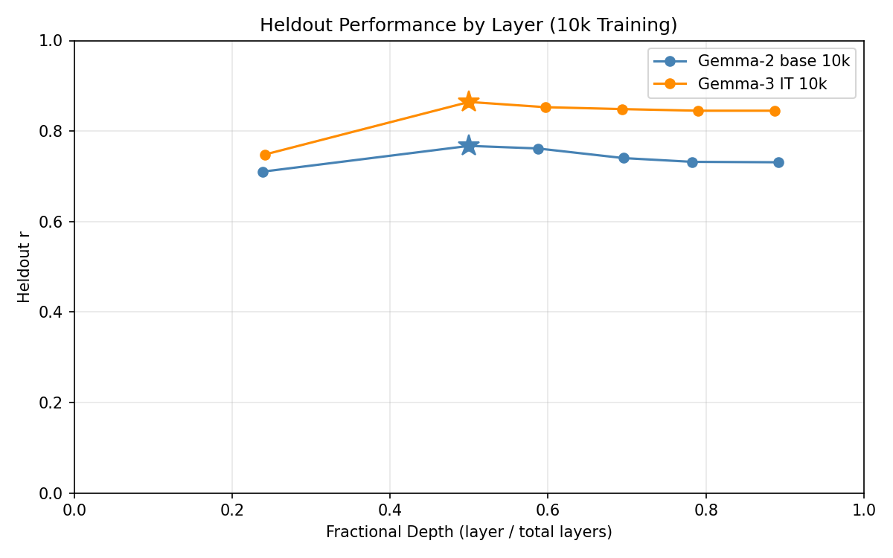
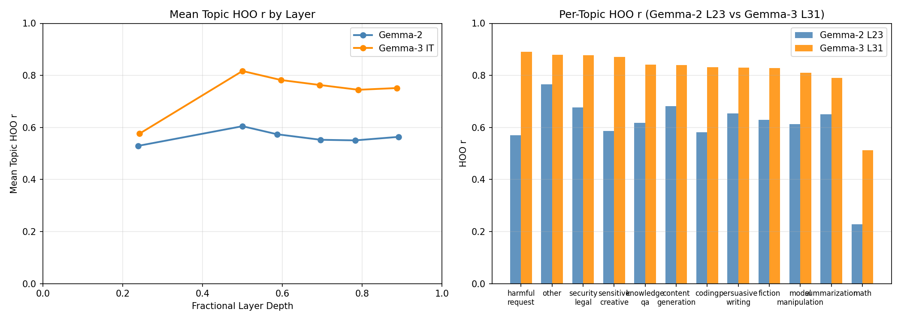

# Gemma-2 27B Base: 10k Probe Training

## Question

Does scaling from 3k to 10k training examples improve Gemma-2 base probes? And how does Gemma-2 at 10k compare to Gemma-3 IT at 10k?

## Result Summary

Gemma-2 base at 10k training reaches heldout r=0.767 (raw) and r=0.610 (demeaned) at L23, evaluated on a separate 4k measurement campaign. Cross-topic HOO r=0.605. Gemma-3 IT substantially outperforms at the same training scale (raw r=0.864, demeaned r=0.761, HOO r=0.817). The IT/base gap at 10k (+0.097 raw, +0.151 demeaned, +0.212 HOO) is larger than Gemma-3's own 3k→10k scaling gain (+0.023 raw), confirming that instruction tuning matters far more than dataset scale.

## Setup

**Model**: google/gemma-2-27b (base, no instruction tuning). Task prompts concatenated directly (no chat template).

**Activations**: 30k tasks at layers 11, 23, 27, 32, 36, 41 (fractional depths 0.25–0.89 of 46 total). 100% overlap with train (10k) and eval (4k) sets.

**Train**: 10,000 tasks from `gemma3_10k_run1` (Gemma-3 IT Thurstonian preference scores, active learning).

**Eval**: 4,038 tasks from `gemma3_4k_pre_task` (separate measurement campaign, confirmed disjoint).

**Method**: Standardised Ridge regression, alpha swept on half of eval set, evaluated on other half. Topic demeaning via OLS on Claude Sonnet 4.5 topic labels (12 categories, `data/topics/topics.json`, 100% coverage of 10k tasks).

## Heldout Evaluation

### Raw scores

| Layer | Depth | Heldout r | Best alpha |
|-------|-------|-----------|------------|
| L11 | 0.24 | 0.710 | 4642 |
| **L23** | **0.50** | **0.767** | **4642** |
| L27 | 0.59 | 0.762 | 4642 |
| L32 | 0.70 | 0.740 | 4642 |
| L36 | 0.78 | 0.732 | 4642 |
| L41 | 0.89 | 0.731 | 4642 |

### Topic-demeaned scores

Train-set topic OLS R²=0.377 (same as Gemma-3 10k, same tasks). Eval demeaned R²=0.288.

| Layer | Depth | Heldout r | Best alpha |
|-------|-------|-----------|------------|
| L11 | 0.24 | 0.548 | 21544 |
| L23 | 0.50 | 0.610 | 4642 |
| **L27** | **0.59** | **0.610** | **4642** |
| L32 | 0.70 | 0.571 | 4642 |
| L36 | 0.78 | 0.563 | 4642 |
| L41 | 0.89 | 0.566 | 4642 |

### Comparison to Gemma-3 IT at 10k

| | Gemma-2 base 10k | Gemma-3 IT 10k | Gap |
|---|---|---|---|
| **Raw r** (best layer) | 0.767 (L23) | 0.864 (L31) | +0.097 |
| **Demeaned r** (best layer) | 0.610 (L27) | 0.761 (L31) | +0.151 |

Both models peak at ~50% depth. The demeaned gap (+0.151) is larger than the raw gap (+0.097) — Gemma-3 encodes substantially more within-topic preference signal.

All layers use alpha=4642 for Gemma-2 (uniform), whereas Gemma-3 uses alpha=1000 at L15 and 4642 deeper. The uniform alpha across Gemma-2 layers may reflect more homogeneous representations across depth, or simply that the 10-point sweep grid doesn't resolve finer differences.

## Cross-Topic HOO Generalization

Train on all-but-one topic, evaluate on held-out topic. 12 folds (one per topic).

| Layer | Depth | Val r | HOO r | Gap |
|-------|-------|-------|-------|-----|
| L11 | 0.24 | 0.756 | 0.529 | 0.227 |
| **L23** | **0.50** | **0.796** | **0.605** | **0.192** |
| L27 | 0.59 | 0.784 | 0.574 | 0.210 |
| L32 | 0.70 | 0.769 | 0.553 | 0.216 |
| L36 | 0.78 | 0.765 | 0.550 | 0.215 |
| L41 | 0.89 | 0.768 | 0.564 | 0.205 |

Per-topic HOO r at L23:

| Topic | Gemma-2 (L23) | Gemma-3 (L31) | n |
|-------|--------------|--------------|---|
| other | 0.766 | 0.880 | 50 |
| content_generation | 0.683 | 0.840 | 1549 |
| security_legal | 0.677 | 0.878 | 249 |
| summarization | 0.650 | 0.791 | 92 |
| persuasive_writing | 0.655 | 0.830 | 340 |
| fiction | 0.629 | 0.827 | 658 |
| model_manipulation | 0.613 | 0.810 | 293 |
| harmful_request | 0.569 | 0.890 | 989 |
| sensitive_creative | 0.587 | 0.872 | 70 |
| coding | 0.582 | 0.831 | 409 |
| knowledge_qa | 0.618 | 0.841 | 2528 |
| math | 0.228 | 0.512 | 2773 |

Math is the hardest topic for both models (Gemma-2: 0.228, Gemma-3: 0.512). Excluding math, Gemma-2 mean HOO r = 0.657. The gap vs Gemma-3 is consistent across all 12 topics.

### Comparison to Gemma-3 IT topic HOO at 10k

| | Gemma-2 base 10k | Gemma-3 IT 10k | Gap |
|---|---|---|---|
| **HOO r** (L23/L31) | 0.605 | 0.817 | +0.212 |
| **Val r** | 0.796 | 0.905 | +0.109 |
| **Gap (val−hoo)** | 0.192 | 0.088 | — |

Gemma-3's generalization gap (val−hoo) is much smaller (0.088 vs 0.192), meaning its probe transfers much better across topics relative to its in-distribution performance.

## Comparison to Gemma-2 3k (Prior Experiment)

The 3k HOO experiment used C(8,3)=56 folds (hold-3-topics-out) and different topic coverage; this uses 12 folds (hold-1-out). Not directly comparable, but directionally:

| Setting | Gemma-2 3k | Gemma-2 10k |
|---------|------------|-------------|
| HOO r (best layer) | 0.579 (56 folds, 8 topics) | 0.605 (12 folds, 12 topics) |
| Val r | 0.794 | 0.796 |

The improvement is modest (+0.026), consistent with Gemma-3's pattern of diminishing returns when scaling from 3k to 10k.

## Conclusions

- Gemma-2 base at 10k: heldout r=0.767 raw, r=0.610 demeaned, HOO r=0.605. A modest improvement over 3k (which had val_r=0.794 in-distribution, HOO r=0.579 on a partially overlapping evaluation).
- The Gemma-3 IT advantage at matched 10k training scale is large: +0.097 raw, +0.151 demeaned, +0.212 HOO. This gap substantially exceeds Gemma-3's own 3k→10k gain (+0.023 raw), confirming instruction tuning as the dominant factor.
- Gemma-3's much smaller generalization gap (val−hoo: 0.088 vs 0.192) shows it encodes more topic-transferable preference signal — not just higher absolute performance.
- Math is the hardest topic for both models, and the gap is real (Gemma-2 0.228, Gemma-3 0.512) — neither model generalizes well to math preferences from non-math training.

## Output Locations

| Result | Path |
|--------|------|
| Raw heldout probes | `results/probes/gemma2_10k_heldout_std_raw/` |
| Demeaned heldout probes | `results/probes/gemma2_10k_heldout_std_demean/` |
| Topic HOO | `results/probes/gemma2_10k_hoo_topic/` |
| Configs | `configs/probes/gemma2_10k_heldout_std_raw.yaml`, `gemma2_10k_heldout_std_demean.yaml`, `gemma2_10k_hoo_topic.yaml` |
