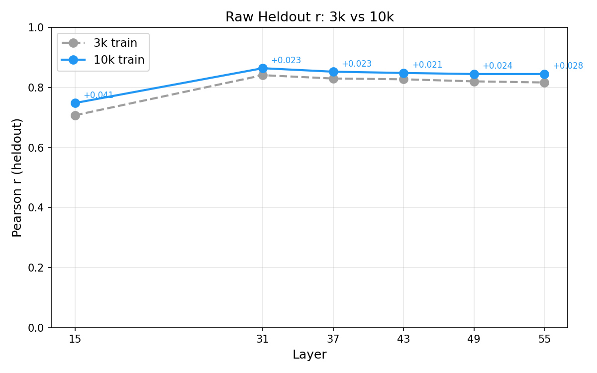
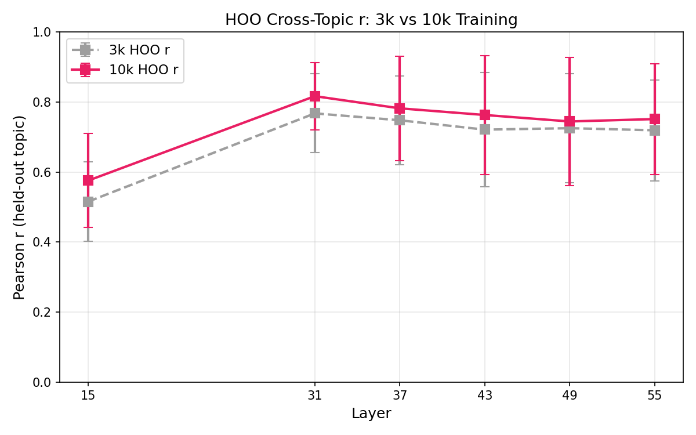

# 3k vs 10k Probe Training Comparison

How much does 3x more training data improve probe quality? Both probes are evaluated on the same 4k held-out set with identical methodology, so this is a fair comparison.

## Setup

| | 3k | 10k |
|---|---|---|
| Train tasks | 3,000 | 10,000 |
| Train samples/task | 5 | 5 |
| Eval tasks | 4,038 | 4,038 |
| Eval split | 2019 sweep / 2019 final | 2019 sweep / 2019 final |
| Activations | Same (`activations_prompt_last.npz`) | Same |
| Topic classifier | `topics.json` (v1) | `topics.json` (v1) |

Both use standardised Ridge regression with 10-point alpha sweep on half the eval set.

We report Pearson r throughout (rather than R²). For this comparison r is preferable because it's scale-invariant: the 3k and 10k training sets have different score distributions (train-set topic OLS R² is 0.607 for 3k vs 0.377 for 10k), so R² could be affected by differences in score variance rather than probe quality. HOO r means: how well the probe generalises *to* the held-out topic when trained on all other topics.

## Heldout Evaluation

### Raw scores

| Layer | 3k r | 10k r | Delta | 3k R² | 10k R² | 3k acc | 10k acc |
|-------|------|-------|-------|-------|--------|--------|---------|
| L15   | 0.708 | 0.748 | +0.041 | 0.501 | 0.560 | 68.2% | 69.8% |
| **L31** | **0.841** | **0.864** | **+0.023** | **0.707** | **0.747** | **74.9%** | **76.8%** |
| L37   | 0.830 | 0.853 | +0.023 | 0.689 | 0.727 | 74.4% | 75.4% |
| L43   | 0.827 | 0.849 | +0.021 | 0.685 | 0.720 | 73.6% | 75.2% |
| L49   | 0.821 | 0.845 | +0.024 | 0.673 | 0.714 | 73.8% | 75.1% |
| L55   | 0.817 | 0.845 | +0.028 | 0.667 | 0.714 | 73.1% | 75.0% |

10k training gives a consistent +0.02–0.04 improvement in Pearson r across all layers. At L31, R² goes from 0.707 to 0.747 (+4pp variance explained) and accuracy from 74.9% to 76.8% (+1.9pp). The gain is largest at L15 (+0.041 r) and smallest at the peak layer L31 (+0.023 r), consistent with diminishing returns — the best layers are already near ceiling on the linear signal.

### Topic-demeaned scores

| Layer | 3k r | 10k r | Delta | 3k R² | 10k R² | 3k acc | 10k acc |
|-------|------|-------|-------|-------|--------|--------|---------|
| L15   | 0.527 | 0.602 | +0.075 | 0.278 | 0.362 | 61.5% | 64.1% |
| **L31** | **0.699** | **0.761** | **+0.062** | **0.488** | **0.579** | **65.5%** | **68.9%** |
| L37   | 0.665 | 0.738 | +0.073 | 0.442 | 0.544 | 65.0% | 68.2% |
| L43   | 0.654 | 0.729 | +0.075 | 0.427 | 0.531 | 64.8% | 67.6% |
| L49   | 0.641 | 0.716 | +0.074 | 0.411 | 0.512 | 64.6% | 67.2% |
| L55   | 0.645 | 0.721 | +0.075 | 0.416 | 0.519 | 64.3% | 66.8% |

The scaling benefit is much larger for demeaned scores (+0.06–0.08 r). At L31, R² jumps from 0.488 to 0.579 (+9pp) and accuracy from 65.5% to 68.9% (+3.4pp). Once topic-level variance is removed, the remaining within-topic signal is subtler and benefits more from additional training examples.

Note on demeaning: the train-set topic OLS R² differs between the two conditions (3k: 0.607, 10k: 0.377), meaning topic labels explain more utility variance in the 3k set. The 10k set draws from a larger task pool, so there is more within-topic variance for the probe to learn from. The eval-set demeaning R² is 0.288 in both cases (same eval set, same demeaning coefficients applied).

## HOO Cross-Topic Generalisation

### Mean HOO r across layers

| Layer | 3k HOO r | 10k HOO r | Delta |
|-------|----------|-----------|-------|
| L15   | 0.516 | 0.576 | +0.060 |
| **L31** | **0.768** | **0.817** | **+0.049** |
| L37   | 0.748 | 0.782 | +0.034 |
| L43   | 0.721 | 0.763 | +0.042 |
| L49   | 0.725 | 0.745 | +0.019 |
| L55   | 0.719 | 0.751 | +0.032 |

### Per-topic breakdown (L31)

| Topic | 3k r | 10k r | Delta | n (3k) | n (10k) |
|-------|------|-------|-------|--------|---------|
| harmful_request | 0.844 | 0.890 | +0.046 | 714 | 989 |
| other | 0.906 | 0.880 | -0.027 | 12 | 50 |
| security_legal | 0.816 | 0.878 | +0.062 | 56 | 249 |
| sensitive_creative | 0.826 | 0.872 | +0.046 | 31 | 70 |
| knowledge_qa | 0.790 | 0.841 | +0.051 | 644 | 2528 |
| content_generation | 0.793 | 0.840 | +0.047 | 375 | 1549 |
| coding | 0.699 | 0.831 | +0.132 | 125 | 409 |
| persuasive_writing | 0.844 | 0.830 | -0.014 | 93 | 340 |
| fiction | 0.793 | 0.827 | +0.035 | 161 | 658 |
| model_manipulation | 0.824 | 0.810 | -0.013 | 91 | 293 |
| summarization | 0.570 | 0.791 | +0.221 | 26 | 92 |
| math | 0.509 | 0.512 | +0.003 | 672 | 2773 |

Scaling helps most for topics that were underrepresented in the 3k set: **coding** (+0.13, from 125→409 train examples) and **summarization** (+0.22, from 26→92). Topics that were already well-represented see smaller gains. Math remains the hardest topic regardless of training size.

Three topics show small decreases with 10k (other, persuasive_writing, model_manipulation) — all small categories where the estimates are noisy.

Note: the HOO gains conflate two effects — more total training examples *and* better topic coverage (e.g., coding goes from 125 to 409 examples). Topics where both the held-out n and the remaining training n increase will benefit from both effects.

## Summary

| Metric (L31) | 3k | 10k | Delta |
|--------------|-----|-----|-------|
| Heldout r (raw) | 0.841 | 0.864 | +0.023 |
| Heldout R² (raw) | 0.707 | 0.747 | +0.040 |
| Heldout acc (raw) | 74.9% | 76.8% | +1.9pp |
| Heldout r (demeaned) | 0.699 | 0.761 | +0.062 |
| Heldout R² (demeaned) | 0.488 | 0.579 | +0.091 |
| Heldout acc (demeaned) | 65.5% | 68.9% | +3.4pp |
| Mean HOO r | 0.768 | 0.817 | +0.049 |

3.3x more training data gives a modest gain on raw heldout performance (+0.023) but a much larger gain on the harder evaluations: demeaned (+0.062) and cross-topic generalisation (+0.049). The demeaned probe benefits most because within-topic signal is subtler and requires more examples to learn reliably.

## Output Locations

| Result | Path |
|--------|------|
| 3k raw probes | `results/probes/gemma3_3k_heldout_std_raw/` |
| 3k demeaned probes | `results/probes/gemma3_3k_heldout_std_demean/` |
| 3k HOO | `results/probes/gemma3_3k_hoo_topic_v1/` |
| 10k raw probes | `results/probes/gemma3_10k_heldout_std_raw/` |
| 10k demeaned probes | `results/probes/gemma3_10k_heldout_std_demean/` |
| 10k HOO | `results/probes/gemma3_10k_hoo_topic/` |
