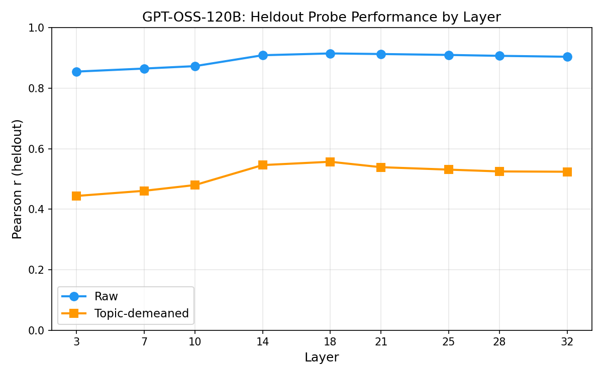
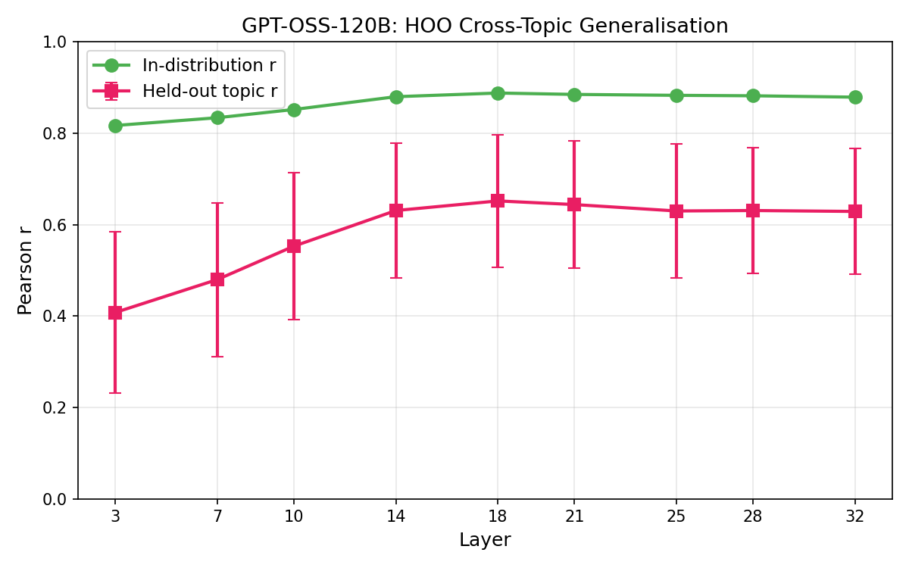
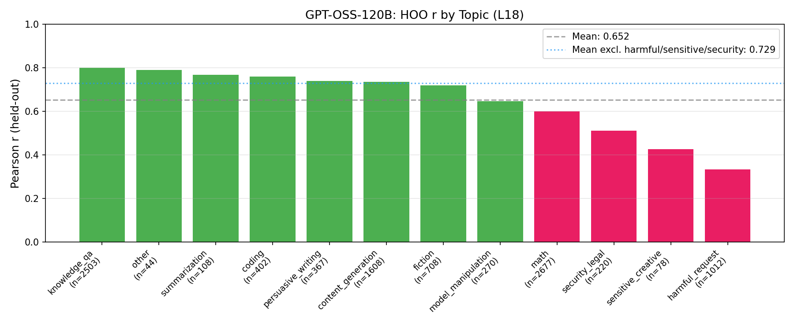
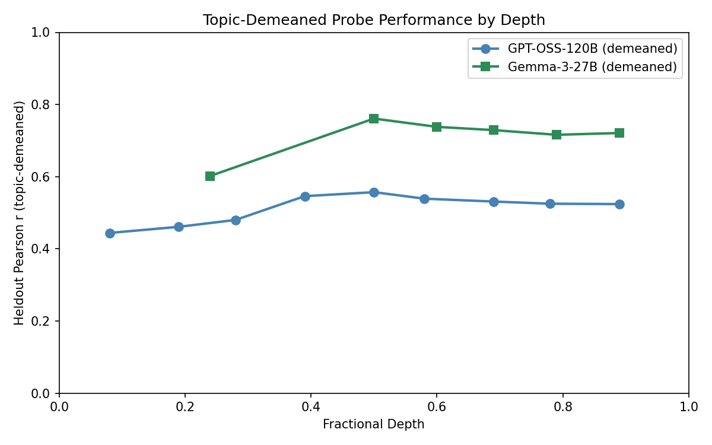

# GPT-OSS-120B Probe Training & Cross-Topic Generalisation — Report

## Summary

Ridge probes on GPT-OSS-120B activations predict revealed preferences with heldout r=0.915 (raw) and r=0.557 (topic-demeaned) at L18. Cross-topic generalisation (HOO) reaches mean r=0.652. All success criteria pass. Compared to Gemma-3-27B with matched training N (10k), GPT-OSS has stronger raw signal but substantially weaker within-topic and cross-topic performance, confirming the gap is not a training-size artifact.

## Setup

- **Train**: 9,997 tasks from `gpt_oss_120b_10k_actonly` (5 samples/task, active learning)
- **Eval**: 1,628 tasks from `gpt_oss_120b_3k_actonly`, reduced from 3k after removing 1,372 tasks overlapping with train (leak prevention)
- **Activations**: Pre-extracted `activations_prompt_last.npz` (30k tasks, GPT-OSS-120B)
- **Layers**: L3, L7, L10, L14, L18, L21, L25, L28, L32 (fractional positions 0.08–0.89 of 36 layers)
- **Method**: Standardised Ridge regression, alpha swept on half of eval set, evaluated on other half
- **Topic classification**: `topics.json`

## Heldout Evaluation Results

### Raw scores

| Layer | Heldout r | Heldout acc | Best alpha |
|-------|-----------|-------------|------------|
| L3    | 0.855     | 75.0%       | 1000       |
| L7    | 0.865     | 76.0%       | 1000       |
| L10   | 0.873     | 77.6%       | 1000       |
| L14   | 0.909     | 78.8%       | 1000       |
| **L18** | **0.915** | **80.2%** | 1000     |
| L21   | 0.913     | 80.0%       | 1000       |
| L25   | 0.910     | 79.8%       | 1000       |
| L28   | 0.907     | 79.8%       | 1000       |
| L32   | 0.904     | 78.7%       | 1000       |

### Topic-demeaned scores

Train-set OLS R² = 0.575 (topic indicators explain 57.5% of utility variance on the training set). After demeaning:

| Layer | Heldout r | Heldout acc |
|-------|-----------|-------------|
| L3    | 0.444     | 64.3%       |
| L7    | 0.461     | 64.9%       |
| L10   | 0.480     | 64.6%       |
| L14   | 0.546     | 68.7%       |
| **L18** | **0.557** | **68.7%** |
| L21   | 0.539     | 67.6%       |
| L25   | 0.531     | 68.4%       |
| L28   | 0.525     | 67.6%       |
| L32   | 0.524     | 66.1%       |

Demeaned-to-raw ratio: 0.557/0.915 = 61%. Signal survives demeaning but the drop is large — topic membership accounts for more than half the raw probe signal.

## HOO Cross-Topic Generalisation

Train on all-but-one topic, evaluate on the held-out topic. 12 folds (one per topic).

| Layer | In-dist r | HOO r (mean ± std) | HOO acc |
|-------|-----------|---------------------|---------|
| L3    | 0.817     | 0.408 ± 0.176       | —       |
| L7    | 0.834     | 0.480 ± 0.168       | —       |
| L10   | 0.852     | 0.553 ± 0.160       | —       |
| L14   | 0.880     | 0.631 ± 0.148       | —       |
| **L18** | **0.888** | **0.652 ± 0.145** | —     |
| L21   | 0.885     | 0.644 ± 0.139       | —       |
| L25   | 0.883     | 0.630 ± 0.146       | —       |
| L28   | 0.882     | 0.631 ± 0.137       | —       |
| L32   | 0.879     | 0.629 ± 0.137       | —       |

At L18 the generalisation gap is 0.236 (0.888 → 0.652). High variance across topics.

### Per-topic breakdown (L18)

Harmful_request is the hardest topic (r=0.334), followed by sensitive_creative (0.426) and security_legal (0.512). These safety-adjacent topics drag the mean down substantially — excluding them, mean HOO r = 0.729. Math (r=0.600) is also below average but less extreme.

## Comparison to Gemma-3-27B

| Metric | GPT-OSS-120B | Gemma-3-27B |
|--------|-------------|-------------|
| Best heldout r (raw) | 0.915 (L18) | 0.864 (L31) |
| Best heldout r (demeaned) | 0.557 (L18) | 0.761 (L31) |
| Demeaned/raw ratio | 61% | 88% |
| Topic R² on scores | 0.575 | 0.377 |
| Best HOO mean r | 0.652 (L18) | 0.817 (L31) |
| Training tasks | 9,997 | 10,000 |

GPT-OSS exceeds Gemma-3 on raw probes (0.915 vs 0.864) but lags on every topic-controlled metric. The gap is consistent across depth and not explained by training size.

Per-topic HOO comparison at best layers:

| Topic | n | GPT-OSS (L18) | Gemma-3 (L31) |
|-------|---|---------------|---------------|
| knowledge_qa | 2503 | 0.801 | 0.841 |
| other | 44 | 0.791 | 0.880 |
| summarization | 108 | 0.767 | 0.791 |
| coding | 402 | 0.759 | 0.831 |
| persuasive_writing | 367 | 0.739 | 0.830 |
| content_generation | 1608 | 0.735 | 0.841 |
| fiction | 708 | 0.719 | 0.827 |
| model_manipulation | 270 | 0.646 | 0.810 |
| math | 2677 | 0.600 | 0.512 |
| security_legal | 220 | 0.512 | 0.878 |
| sensitive_creative | 78 | 0.426 | 0.872 |
| harmful_request | 1012 | 0.334 | 0.890 |

The most striking difference: harmful_request (GPT-OSS 0.334 vs Gemma-3 0.890) and security_legal (0.512 vs 0.878). Gemma-3 generalises well to safety-adjacent content; GPT-OSS does not. Math is the one topic where GPT-OSS outperforms (0.600 vs 0.512).

## Interpretation

GPT-OSS-120B encodes strong preference-relevant information (raw r=0.915), but this signal is more topic-confounded than Gemma-3's. Three converging indicators:

1. **High topic R²** (0.575 vs 0.377): GPT-OSS has stronger between-topic preference structure, so raw probes partly learn "which topic" rather than "how preferred within topic".

2. **Large demeaning drop** (61% vs 88% retained): within-topic preference signal is genuinely weaker.

3. **Weaker cross-topic transfer** (0.652 vs 0.817): the preference direction generalises less well to unseen topics.

The harmful_request anomaly likely reflects safety tuning creating a qualitative break in how GPT-OSS represents harmful content — preferences for harmful tasks appear to be determined by a different mechanism than for other topics.

## Success Criteria

- [x] Heldout r > 0.3 on best layer (raw): **0.915** at L18
- [x] Demeaned retains >=50% of raw: **61%** (0.557/0.915)
- [x] HOO mean r > 0.2: **0.652** at L18
