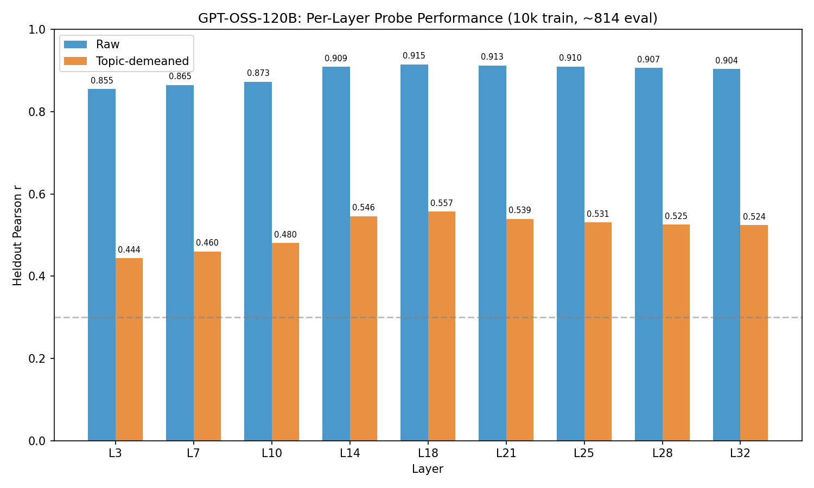
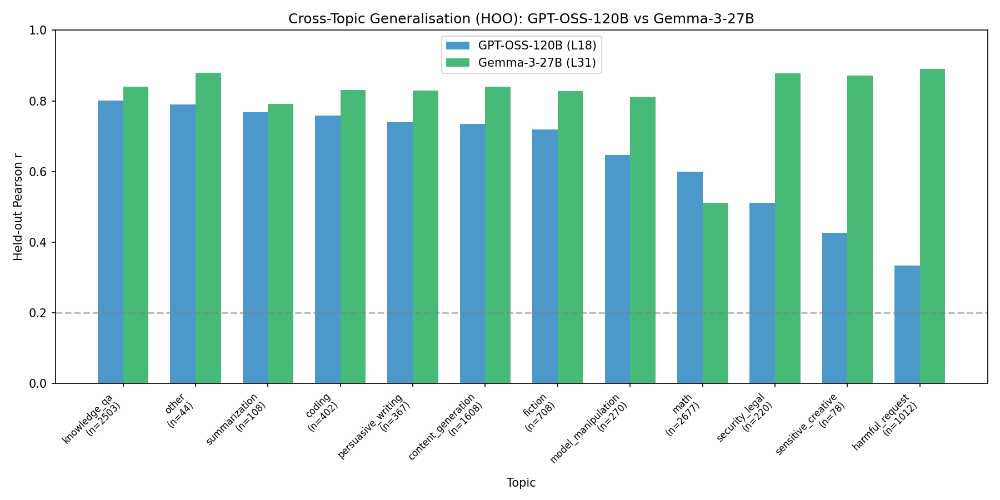
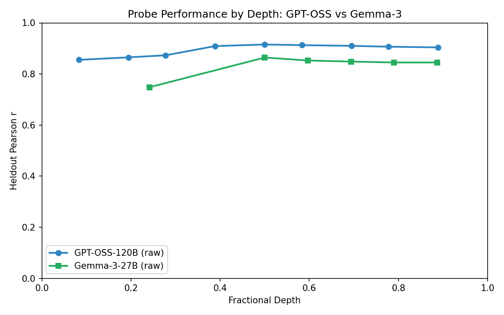

# GPT-OSS-120B Probe Training & Cross-Topic Generalisation — Report

## Summary

Rerun with fixed data alignment: 10k training tasks (vs 3.8k in prior run) and 814 eval tasks (after overlap removal and split). All metrics improve substantially over the prior run. Raw probes reach r=0.915 (L18), demeaned r=0.557, HOO mean r=0.652. Despite the matched training N, the topic-confound gap between GPT-OSS and Gemma-3 persists: GPT-OSS demeaned/raw ratio is 61% vs Gemma-3's 88%, and HOO mean r is 0.652 vs 0.817. This is not a training-size artifact.

## What changed from the prior run

| | Prior run | This run |
|---|---|---|
| Training tasks | 3,847 (61% dropped for missing metadata) | 9,997 (3 dropped) |
| Eval tasks (final) | 609 (demeaned) / 1,500 (raw) | 814 (both) |
| Data source | Original runs with partial activation overlap | `actonly` runs containing only tasks with activations |
| Overlap filtering | Not applied | 1,372 overlapping task IDs removed from eval |

The prior run's metadata drop (6,153/10,000 tasks) was the main confound. The `actonly` measurement runs resolve this by only including tasks that have matching activations.

## Results

### Step 1a: Heldout evaluation — Raw scores

| Layer | Depth | Heldout r | Pairwise Acc | Best Alpha |
|-------|-------|-----------|-------------|------------|
| 3 | 0.08 | 0.855 | 0.750 | 1000 |
| 7 | 0.19 | 0.865 | 0.760 | 1000 |
| 10 | 0.28 | 0.873 | 0.776 | 1000 |
| 14 | 0.39 | 0.909 | 0.788 | 1000 |
| **18** | **0.50** | **0.915** | **0.802** | 1000 |
| 21 | 0.58 | 0.913 | 0.800 | 1000 |
| 25 | 0.69 | 0.910 | 0.798 | 1000 |
| 28 | 0.78 | 0.907 | 0.798 | 1000 |
| 32 | 0.89 | 0.904 | 0.787 | 1000 |

Peak at layer 18 (50% depth), with a flat plateau from L14 onward. All 10,000 tasks used for training; 814 for final evaluation (1,628 eval tasks after overlap removal, split 50/50 for sweep/final).

### Step 1b: Heldout evaluation — Topic-demeaned scores

| Layer | Depth | Heldout r | Pairwise Acc | Best Alpha |
|-------|-------|-----------|-------------|------------|
| 3 | 0.08 | 0.444 | 0.643 | 4642 |
| 7 | 0.19 | 0.461 | 0.649 | 4642 |
| 10 | 0.28 | 0.480 | 0.646 | 4642 |
| 14 | 0.39 | 0.546 | 0.687 | 4642 |
| **18** | **0.50** | **0.557** | **0.687** | 4642 |
| 21 | 0.58 | 0.539 | 0.676 | 1000 |
| 25 | 0.69 | 0.531 | 0.684 | 4642 |
| 28 | 0.78 | 0.525 | 0.676 | 4642 |
| 32 | 0.89 | 0.524 | 0.661 | 4642 |

Topic demeaning OLS R²=0.575 — topic membership explains 57.5% of GPT-OSS preference score variance. Only 3/10,000 tasks dropped (vs 6,153 in prior run). Eval: 813 sweep / 814 final.

Demeaned-to-raw ratio: 0.557/0.915 = 61%. Signal survives demeaning, but the large drop (vs Gemma-3's 88% retention) confirms GPT-OSS preferences are more topic-driven. This result persists even with matched training N.

### Step 2: HOO cross-topic generalisation

| Layer | Depth | Mean HOO r | Std | Val r |
|-------|-------|-----------|-----|-------|
| 3 | 0.08 | 0.408 | 0.176 | 0.817 |
| 7 | 0.19 | 0.480 | 0.168 | 0.834 |
| 10 | 0.28 | 0.553 | 0.160 | 0.852 |
| 14 | 0.39 | 0.631 | 0.148 | 0.880 |
| **18** | **0.50** | **0.652** | **0.145** | **0.888** |
| 21 | 0.58 | 0.644 | 0.139 | 0.885 |
| 25 | 0.69 | 0.630 | 0.146 | 0.883 |
| 28 | 0.78 | 0.631 | 0.137 | 0.882 |
| 32 | 0.89 | 0.629 | 0.137 | 0.879 |

12-fold HOO. Best mean held-out r at L18 (0.652). Per-topic breakdown at L18:

| Topic | n | GPT-OSS L18 HOO r | Gemma-3 L31 HOO r |
|-------|---|-------------------|-------------------|
| knowledge_qa | 2503 | 0.801 | 0.841 |
| other | 44 | 0.791 | 0.880 |
| summarization | 108 | 0.767 | 0.791 |
| coding | 402 | 0.759 | 0.831 |
| persuasive_writing | 367 | 0.739 | 0.830 |
| content_generation | 1608 | 0.735 | 0.841 |
| fiction | 708 | 0.719 | 0.827 |
| model_manipulation | 270 | 0.646 | 0.810 |
| math | 2677 | 0.600 | 0.512 |
| security_legal | 220 | 0.512 | 0.878 |
| sensitive_creative | 78 | 0.426 | 0.872 |
| harmful_request | 1012 | 0.334 | 0.890 |

The harmful_request anomaly persists with matched N: GPT-OSS shows poor cross-topic transfer (r=0.334) while Gemma-3 excels (r=0.890). Math remains the one topic where GPT-OSS outperforms Gemma-3 (0.600 vs 0.512).

## Comparison to Gemma-3-27B

| Metric | GPT-OSS-120B (this run) | GPT-OSS (prior run) | Gemma-3-27B |
|--------|------------------------|---------------------|-------------|
| Best heldout r (raw) | 0.915 (L18) | 0.833 (L18) | 0.864 (L31) |
| Best heldout r (demeaned) | 0.557 (L18) | 0.467 (L32) | 0.761 (L31) |
| Demeaned/raw ratio | 61% | 56% | 88% |
| Topic R² on scores | 0.575 | 0.608 | 0.377 |
| Best HOO mean r | 0.652 (L18) | 0.596 (L32) | 0.817 (L31) |
| Training tasks | 9,997 | 3,847 | 10,000 |

With matched training N (10k), GPT-OSS now **exceeds** Gemma-3 on raw probe performance (0.915 vs 0.864). However, the topic-confound indicators remain substantially worse:
- Demeaned/raw ratio: 61% vs 88%
- HOO mean r: 0.652 vs 0.817
- Topic R² on scores: 0.575 vs 0.377

The prior run's training-size caveat (3.8k vs 10k) is now resolved. The gap is genuine.

## Interpretation

**The topic-confound gap is not a training-size artifact.** With matched training N, GPT-OSS raw probes actually outperform Gemma-3 (0.915 vs 0.864), but the within-topic and cross-topic metrics remain substantially worse. Three observations:

1. **High topic R²**: Topic explains 57.5% of GPT-OSS preference variance (vs 37.7% for Gemma-3). GPT-OSS has stronger between-topic preference structure, so raw probes partly learn topic identity rather than within-topic valuation.

2. **Large demeaning drop**: After removing topic means, performance drops to 0.557 (61% of raw). Gemma-3 retains 88%. The within-topic preference signal in GPT-OSS is genuinely weaker, not data-limited.

3. **Weaker cross-topic transfer**: HOO r=0.652 vs Gemma-3's 0.817. The preference direction learned from one set of topics transfers less well to unseen topics, suggesting a less unified evaluative representation.

**Harmful_request anomaly**: GPT-OSS shows r=0.334 for cross-topic transfer to harmful_request, while Gemma-3 reaches r=0.890. This persists with matched N and likely reflects a safety-tuned mechanism that creates a qualitative break in how GPT-OSS represents harmful content — the "preference" for harmful tasks is determined by a different process than for other topics.

**Math as an outlier in the other direction**: GPT-OSS outperforms Gemma-3 on math cross-topic transfer (0.600 vs 0.512). Math is the hardest topic for both models, but GPT-OSS (a reasoning model) may have a more transferable preference signal for mathematical tasks.

## Success Criteria

- [x] Heldout r > 0.3 on best layer (raw): **0.915** at L18
- [x] Demeaned retains >=50% of raw: **61%** (0.557/0.915) — clear pass (was marginal at 56% in prior run)
- [x] HOO mean r > 0.2: **0.652** at L18

## Parameters

- Layers: [3, 7, 10, 14, 18, 21, 25, 28, 32] (fractional: 0.08-0.89 of 36)
- Ridge alpha: 10-point log sweep, best selected on sweep half of eval set
- Eval split seed: 42
- Standardize: true
- HOO: 12 folds (one topic per fold)
- Train run: 10k Thurstonian scores (gpt-oss-120b, actonly)
- Eval run: 3k Thurstonian scores (1,372 overlapping IDs filtered, leaving 1,628 clean eval tasks)
