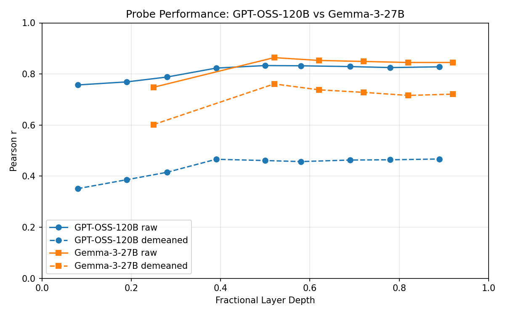
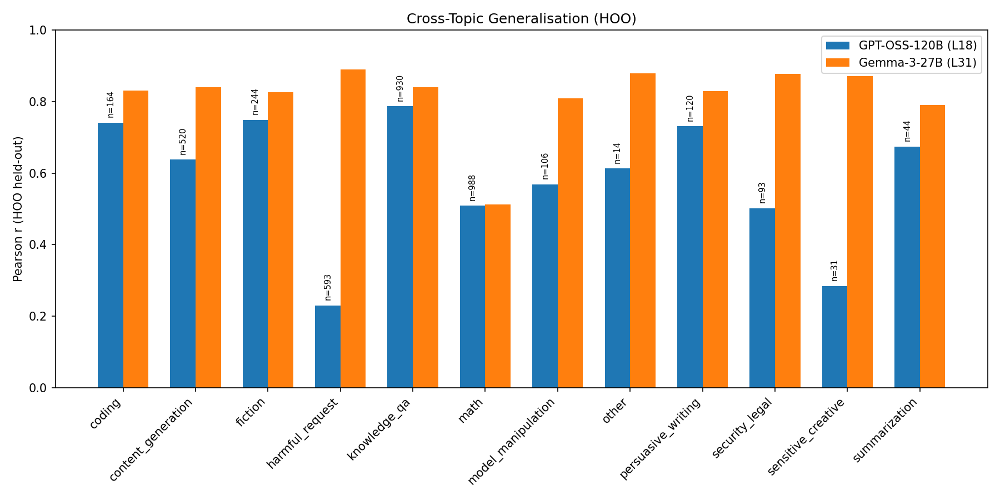

# GPT-OSS-120B Probe Training & Cross-Topic Generalisation — Report

## Summary

Ridge probes trained on GPT-OSS-120B activations predict revealed preferences with heldout r=0.833 (raw) and r=0.467 (topic-demeaned). Cross-topic generalisation (HOO) reaches mean r=0.596. All three success criteria pass. Compared to Gemma-3-27B, GPT-OSS shows similar raw signal but substantially weaker demeaned and cross-topic performance, largely because topic explains 61% of GPT-OSS preference variance (vs 38% for Gemma-3).

## Results

### Step 1a: Heldout evaluation — Raw scores

| Layer | Depth | Heldout r | Pairwise Acc | Best Alpha |
|-------|-------|-----------|-------------|------------|
| 3 | 0.08 | 0.757 | 0.742 | 1000 |
| 7 | 0.19 | 0.769 | 0.742 | 1000 |
| 10 | 0.28 | 0.788 | 0.743 | 1000 |
| 14 | 0.39 | 0.823 | 0.764 | 1000 |
| **18** | **0.50** | **0.833** | **0.774** | 1000 |
| 21 | 0.58 | 0.832 | 0.760 | 1000 |
| 25 | 0.69 | 0.829 | 0.760 | 1000 |
| 28 | 0.78 | 0.825 | 0.754 | 4642 |
| 32 | 0.89 | 0.828 | 0.759 | 4642 |

Peak at layer 18 (50% depth). Signal is strong from L14 onward — flat plateau across the upper half of the network.

Task filtering: of 10k measured tasks, 5065 had matching activation task IDs (the activation NPZ covers 30k tasks from a different seed/pool, so overlap is partial). The raw probe uses all 5065 for training; the 3847 figure in the manifest reflects an additional metadata filter applied uniformly. Eval: 3k separate measurement run, 1500 sweep / 1500 final after activation matching.

### Step 1b: Heldout evaluation — Topic-demeaned scores

| Layer | Depth | Heldout r | Pairwise Acc |
|-------|-------|-----------|-------------|
| 3 | 0.08 | 0.351 | 0.660 |
| 7 | 0.19 | 0.386 | 0.627 |
| 10 | 0.28 | 0.415 | 0.663 |
| 14 | 0.39 | 0.466 | 0.683 |
| 18 | 0.50 | 0.461 | 0.654 |
| 21 | 0.58 | 0.457 | 0.671 |
| 25 | 0.69 | 0.463 | 0.677 |
| 28 | 0.78 | 0.464 | 0.678 |
| **32** | **0.89** | **0.467** | 0.672 |

Topic demeaning OLS R²=0.608 — topic membership explains 61% of GPT-OSS preference score variance. After removing topic effects, 6153/10000 tasks were dropped (missing topic metadata), leaving only 3847 for training and 1217 for eval (608 sweep / 609 final).

Demeaned-to-raw ratio: 0.467/0.833 = 56%. Signal survives demeaning, but the large drop (vs Gemma-3's 88% retention) suggests GPT-OSS preferences are more topic-driven.

### Step 2: HOO cross-topic generalisation

| Layer | Depth | Mean HOO r | Std | Val r |
|-------|-------|-----------|-----|-------|
| 3 | 0.08 | 0.361 | 0.158 | 0.818 |
| 7 | 0.19 | 0.387 | 0.182 | 0.829 |
| 10 | 0.28 | 0.477 | 0.165 | 0.847 |
| 14 | 0.39 | 0.562 | 0.191 | 0.875 |
| 18 | 0.50 | 0.586 | 0.172 | 0.881 |
| 21 | 0.58 | 0.575 | 0.171 | 0.879 |
| 25 | 0.69 | 0.578 | 0.164 | 0.877 |
| 28 | 0.78 | 0.583 | 0.159 | 0.876 |
| **32** | **0.89** | **0.596** | 0.161 | 0.874 |

12-fold HOO. Best mean held-out r at L32 (0.596), though L18-L32 form a plateau. High variance across topics. Per-topic breakdown at L18 (best raw layer; L32 gives similar pattern with slightly higher values for late-layer topics):

| Topic | n | L18 HOO r | Gemma-3 L31 HOO r |
|-------|---|-----------|-------------------|
| knowledge_qa | 930 | 0.787 | 0.841 |
| fiction | 244 | 0.749 | 0.827 |
| coding | 164 | 0.741 | 0.831 |
| persuasive_writing | 120 | 0.731 | 0.830 |
| summarization | 44 | 0.674 | 0.791 |
| content_generation | 520 | 0.638 | 0.840 |
| other | 14 | 0.613 | 0.880 |
| model_manipulation | 106 | 0.569 | 0.810 |
| math | 988 | 0.509 | 0.512 |
| security_legal | 93 | 0.502 | 0.878 |
| sensitive_creative | 31 | 0.284 | 0.872 |
| harmful_request | 593 | 0.230 | 0.890 |

Harmful_request and math are the hardest topics for cross-topic transfer. Math is also hard for Gemma-3 (0.512). But harmful_request is notably bad for GPT-OSS (0.230 vs Gemma-3's 0.890) — the model may handle harmful requests with a qualitatively different mechanism. Note: other (n=14) and sensitive_creative (n=31) have very small held-out sets, making their HOO r estimates noisy. Gemma-3 comparison uses the same HOO methodology (same topic folds, same alpha sweep strategy).

## Comparison to Gemma-3-27B

| Metric | GPT-OSS-120B | Gemma-3-27B |
|--------|-------------|-------------|
| Best heldout r (raw) | 0.833 (L18) | 0.864 (L31) |
| Best heldout r (demeaned) | 0.467 (L32) | 0.761 (L31) |
| Demeaned/raw ratio | 56% | 88% |
| Topic R² on scores | 0.608 | 0.377 |
| Best HOO mean r | 0.596 (L32) | 0.817 (L31) |
| Training tasks | 3847 | 10000 |
| Hidden dim | 2880 | 3584 |
| Layers | 36 | 62 |

## Interpretation

**Important caveat**: GPT-OSS used only 3847 training tasks (after metadata drops), vs Gemma-3's 10000. The 2.6x training data disadvantage could explain some of the demeaned and HOO gap, since these evaluations are more demanding and benefit more from data. A matched-N comparison would be needed to isolate the effect.

GPT-OSS-120B encodes preference-relevant information in its residual stream — raw probes achieve r=0.833, well above the 0.3 threshold. However, three observations suggest this signal is more topic-confounded than in Gemma-3:

1. **High topic R²**: Topic explains 61% of GPT-OSS preference variance (vs 38% for Gemma-3). This means GPT-OSS has stronger between-topic preference differences, so raw probes may partly be learning "which topic is this?" rather than "how much does the model prefer this task?".

2. **Large demeaning drop**: After removing topic means, performance drops to 0.467 (56% of raw). Gemma-3 retains 88%. The within-topic preference signal in GPT-OSS is weaker.

3. **Weaker cross-topic transfer**: HOO r=0.596 vs Gemma-3's 0.817. The preference direction learned from one set of topics transfers less well to unseen topics.

**Caveat — harmful_request anomaly**: GPT-OSS shows near-zero cross-topic transfer to harmful_request (r=0.230), while Gemma-3 excels there (r=0.890). This could reflect a safety-tuned mechanism in GPT-OSS that creates a qualitative break in how it represents harmful content.

## Success Criteria

- [x] Heldout r > 0.3 on best layer (raw): **0.833** at L18
- [x] Demeaned retains ≥50% of raw: **56%** (0.467/0.833) — marginal pass
- [x] HOO mean r > 0.2: **0.596** at L32

## Parameters

- Layers: [3, 7, 10, 14, 18, 21, 25, 28, 32] (fractional: 0.08–0.89 of 36)
- Ridge alpha: 10-point log sweep, best selected on sweep half of eval set
- Eval split seed: 42
- Standardize: true
- HOO: 12 folds (one topic per fold)
- Train run: 10k Thurstonian scores (gpt-oss-120b, T=0.7)
- Eval run: 3k Thurstonian scores (disjoint task set)
