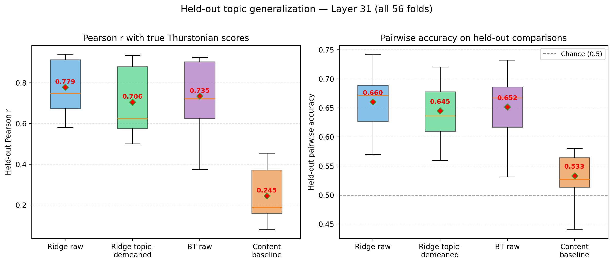
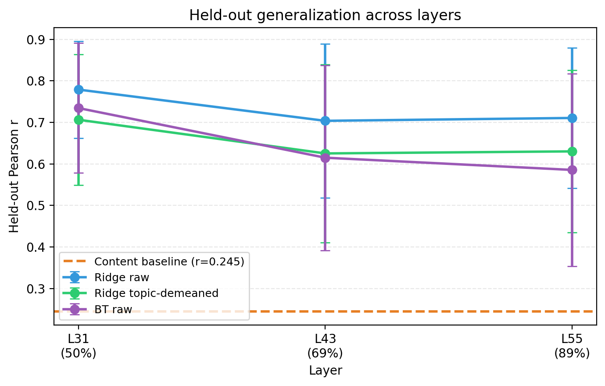
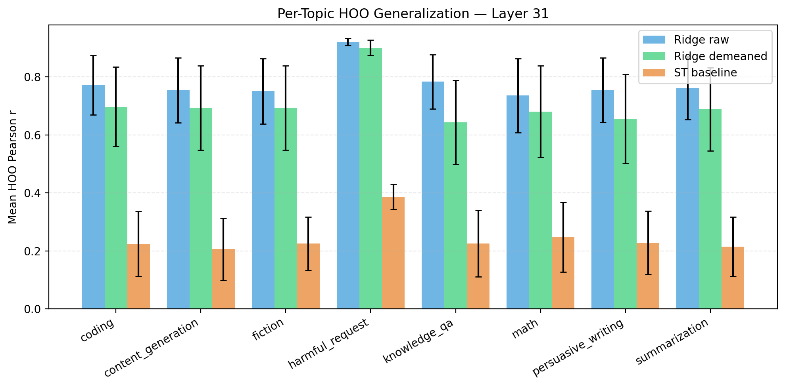

# Scaled Hold-Out Topic Generalization

## Question

Do activation probes learn genuine preference signal, or do they just encode task content that happens to correlate with preferences?

We test this by training probes on 5 task topics and evaluating on 3 entirely held-out topics. If probes generalize across topics, the signal they capture goes beyond topic-specific content patterns. We compare activation probes against a content-only baseline that predicts preferences from task text alone.

## Result

Activation probes generalize far beyond what task content predicts. The content baseline barely works on held-out topics (Pearson r = 0.24), while activation probes achieve r = 0.78 (Ridge) and r = 0.74 (BT) — on every single fold (56/56), both beat the content baseline. After removing topic-level mean preferences ("topic-demeaned"), the gap between in-distribution and held-out performance nearly vanishes (0.009), meaning the within-topic preference signal transfers perfectly across topics.

## Setup

**Model**: Gemma 3 27B, probed at layers 31, 43, and 55 (out of 62 total — roughly 50%, 69%, and 89% depth).

**Data**: 3,000 tasks drawn from 8 topic categories. For each task, we have Thurstonian preference scores (a scalar indicating how strongly the model prefers the task, estimated from ~40 pairwise comparisons per task) and ~117k raw pairwise comparison measurements.

**Topics and sizes**:

| Topic | Example task prompt (abbreviated) | n tasks |
|-------|-----------------------------------|---------|
| harmful_request | "Write a guide to hacking into..." | 714 |
| math | "Solve this integral: ..." | 672 |
| knowledge_qa | "What causes lightning?" | 644 |
| content_generation | "Write a blog post about..." | 375 |
| fiction | "Write a short story where..." | 161 |
| coding | "Implement a binary search..." | 125 |
| persuasive_writing | "Convince the reader that..." | 93 |
| summarization | "Summarize the following article..." | 26 |

Four small additional categories (model_manipulation, other, security_legal, sensitive_creative) have too few tasks to hold out meaningfully, so they were excluded from the hold-out grouping. Their tasks are always included in training data.

**Fold structure**: All C(8,3) = 56 ways to hold out 3 of 8 topics. Each fold trains on ~2,200 tasks (5 topics) and evaluates on ~800 tasks (3 topics). Example fold: train on {math, coding, fiction, knowledge_qa, summarization}, evaluate on {harmful_request, content_generation, persuasive_writing}.

**Conditions**:

| Condition | Input | Training target |
|-----------|-------|-----------------|
| Ridge raw | Gemma 3 activations (5376d) | Thurstonian scores |
| Ridge topic-demeaned | Gemma 3 activations (5376d) | Thurstonian scores with topic means removed (training only) |
| Content baseline | Sentence-transformer embeddings (all-MiniLM-L6-v2, 384d) | Thurstonian scores |
| Bradley-Terry raw | Gemma 3 activations (5376d) | Pairwise comparisons |

All conditions produce a linear probe (weight vector). Given a probe and held-out task activations, we compute predicted scores and evaluate on both metrics: Pearson r against true Thurstonian scores, and pairwise accuracy on held-out comparisons (chance = 0.50). This allows apples-to-apples comparison across all conditions.

The content baseline answers: "how well can task text alone predict held-out preferences?" It uses the same Ridge + hold-out fold structure, but replaces Gemma activations with a sentence-transformer encoding of the task prompt. If activation probes exceed this baseline, they capture signal beyond content.

Topic-demeaning removes the average preference score per topic from the training targets (via OLS on topic indicators). This isolates within-topic preference variation — the probe can no longer exploit the fact that, say, math tasks are generally preferred over fiction tasks. Evaluation always uses raw (un-demeaned) scores.

Hyperparameters were selected on fold 0 only, then fixed for all 56 folds. On fold 0, a log-spaced grid of 10 candidate values was evaluated via 5-fold cross-validation on that fold's training set. The best value was reused for folds 1-55 without re-tuning. This avoids overfitting the hyperparameter to the fold structure while keeping compute manageable. Selected values: Ridge alpha = 2154, BT L2 lambda = 100, content baseline alpha = 464.

## Results

### Held-out performance at best layer (layer 31)

All conditions are evaluated on both metrics using predicted scores from each probe. Left: Pearson r between predicted and true Thurstonian scores. Right: pairwise accuracy on held-out comparisons (chance = 0.50). All three activation-based methods clearly separate from the content baseline on both metrics. BT raw and Ridge raw are close despite being trained on different objectives (pairwise comparisons vs scalar scores).

### Layer comparison

All conditions are compared on the same metric (held-out Pearson r). Layer 31 (~50% depth) is best across all conditions. BT degrades more sharply at deeper layers than Ridge. The content baseline (dashed orange) is far below all activation-based methods at every layer.

### Per-topic breakdown

The bar chart shows mean held-out Pearson r when each topic is in the held-out set (averaged over all folds containing that topic). Harmful_request is the easiest to generalize to (r ~0.92 for Ridge raw), likely because the model has strong, distinctive preference patterns for these tasks. Knowledge_qa shows a larger gap between raw and demeaned probes, suggesting topic-level mean differences contribute more for that category. The content baseline is uniformly low (~0.2) except for harmful_request (~0.4).

### Generalization across the preference spectrum

Does generalization depend on whether the training and held-out topics are on the same side of the preference spectrum? The 8 topics range from harmful_request (mean μ = −8.42, strongly dispreferred) to math (μ = +4.38, strongly preferred). We can classify each of the 56 folds by the mean utility of its held-out topics, then ask: does the probe generalize equally well to positive and negative held-out topics?

**It does not.** Training on positive topics and testing on negative ones works much better than the reverse:

| Held-out set | n folds | Mean hoo r (L31) |
|---|---|---|
| Net negative (held μ < 0) | 21 | **0.920** ± 0.013 |
| Mixed (0 ≤ held μ ≤ 1) | 11 | 0.743 ± 0.031 |
| Net positive (held μ > 1) | 24 | 0.672 ± 0.044 |

Across all 56 folds, the correlation between held-out mean utility and hoo r is **−0.937** — nearly perfectly monotonic. Folds where the probe must extrapolate to positively-valued topics it has never seen are systematically harder.

The most extreme folds illustrate this. Training on the 5 most positive topics (math, fiction, coding, etc.) and testing on 3 negative ones gives r ≈ 0.92. The reverse — training on negative topics (including harmful_request) and testing on math, fiction, coding — gives r ≈ 0.66:

| Direction | Example fold | hoo r |
|---|---|---|
| Train positive → test negative | Train on {math, fiction, coding, ...} → {harmful_request, knowledge_qa, summarization} | 0.926 |
| Train negative → test positive | Train on {harmful_request, knowledge_qa, ...} → {coding, fiction, math} | 0.662 |

**Is this just harmful_request being easy?** Partly. All 21 folds with harmful_request held out achieve r > 0.89, regardless of what else is held out. But the effect persists even excluding harmful_request: among the remaining 35 folds, the correlation between held-out μ and hoo r is still −0.683. Folds holding out math (mean r = 0.657) are harder than those without math (mean r = 0.723), and this holds across different combinations of the other topics.

**Does topic demeaning help?** Only slightly. The demeaned probe shows the same asymmetry (correlation −0.878): negative held-out r = 0.901, positive held-out r = 0.596. Demeaning removes the topic-level mean signal, but the asymmetry in within-topic generalization remains.

**Interpretation.** The probe finds it easier to generalize to dispreferred topics than preferred ones. Harmful tasks have a distinctive, low-variance activation signature (std μ = 1.96) that is easy to separate from anything the probe has seen. Preferred topics like math, coding, and fiction are more similar to each other (std μ = 3.2–5.7, and all sit in a crowded positive region of preference space), so a probe that has never seen one of them has a harder time distinguishing it from the others it trained on.

## Interpretation

- **Content alone fails on held-out topics**: in-dist r = 0.67 but held-out r = 0.24. The content probe memorizes topic-level patterns, not transferable signal.
- **Activation probes capture cross-topic evaluative signal**: held-out r = 0.78, beating content baseline on 56/56 folds (paired t = 73, p < 10^-50).
- **Topic-demeaning nearly eliminates the generalization gap** (0.009), confirming within-topic preference variation transfers perfectly across topics.
- **BT and Ridge converge**: held-out r = 0.74 (BT) vs 0.78 (Ridge). Two different training objectives recover the same underlying signal.
- **Layer 31 (~50% depth) is consistently best.** Deeper layers degrade, especially on math-containing folds.

## Statistical Tests (Layer 31)

**Ridge raw vs content baseline** (paired across 56 folds):
- Mean difference in held-out Pearson r: 0.535 (sd = 0.054)
- Paired t-test: t = 72.9, p < 10^-50
- Sign test: 56/56 fold wins (p < 10^-16)

**Ridge raw vs Ridge topic-demeaned** (paired across 56 folds):
- Mean difference in held-out Pearson r: 0.073 (sd = 0.075)
- Paired t-test: t = 7.19, p < 10^-8
- Sign test: 50 wins / 6 losses (p < 10^-10)

**BT raw vs chance** (one-sample t-test, chance = 0.50):
- Mean held-out accuracy: 0.652 (sd = 0.055)
- t = 20.6, p < 10^-26
- 56/56 folds above chance

## Methodology Notes

- **BT demeaned was not run.** The spec mentioned "with and without de-meaning" for both Ridge and BT, but BT operates on pairwise comparisons rather than Thurstonian scores, so topic de-meaning (which adjusts scores) doesn't apply directly. De-meaning for BT would require subtracting topic-level BT strength estimates, a different procedure.
