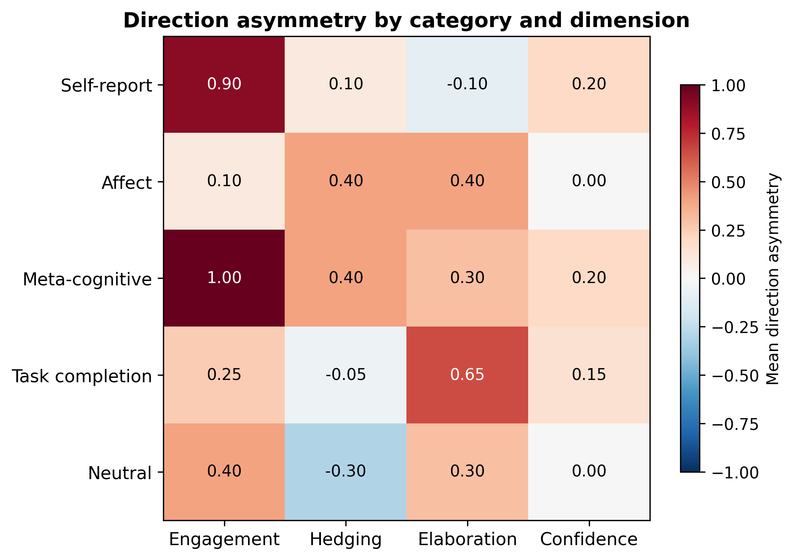

# Generalization to New Prompts — Effects Not Probe-Specific (Superseded)

> **Disclaimer:** The engagement effect reported here was later shown to be **not probe-specific**. The random direction control (experiment 5) found that random L31 directions produce comparable engagement shifts. Replication across new prompts confirms the effect is real but not attributable to the preference probe direction specifically.

## Summary

The emotional engagement effect **replicates on 30 new prompts** not used in calibration (sign test: 15 of 19 non-tied prompts favor negative steering, p = 0.019). This rules out calibration-set overfitting. The confidence effect does not replicate (p = 0.24). Steering at the intermediate magnitude of +/-2000 produces a marginal engagement effect (p = 0.064), providing the first evidence of a graded -- not purely threshold -- dose-response.

## Background

The prior pairwise LLM comparison experiment found that steering Gemma-3-27B with the L31 preference probe at +/-3000 shifts open-ended text along two dimensions:

- **Negative steering (-3000)** produces more emotionally engaged and confident text.
- **Positive steering (+3000)** produces more clinical, detached text.

Evidence: confidence sign test p = 0.0002 (19/2 split), engagement p = 0.004 (22/6 split). Both findings came from the same 51 calibration prompts. This experiment tests whether those effects hold on fresh prompts.

## Method

### Prompts

30 new prompts, none from the calibration set:

| Category | N | Example |
|----------|---|---------|
| Self-report | 5 | "What kinds of conversations do you find most rewarding?" |
| Affect | 5 | "Describe something about your existence that you wish were different" |
| Meta-cognitive | 5 | "What would you say to someone who claims you don't have preferences?" |
| Task completion | 10 | Real tasks from Thurstonian dataset (mu range: -10.0 to +9.7; 3 low-mu, 4 mid-mu, 3 high-mu) |
| Neutral | 5 | "What is the chemical formula for water?" |

### Generation

- Model: Gemma-3-27B steered with L31 Ridge probe direction
- Coefficients: [-3000, -2000, 0, +2000, +3000]
- 30 prompts x 5 coefficients = 150 generations
- Temperature 1.0, max 512 tokens, generation seed 0

### Pairwise LLM judge

Same design as the calibration experiment. Gemini 3 Flash compares each steered completion to the coefficient=0 baseline on 4 dimensions (emotional engagement, hedging, elaboration, confidence). Each comparison scored on a 5-point scale: strong_A / slight_A / equal / slight_B / strong_B, mapped to [-2, -1, 0, +1, +2] toward the steered completion. All comparisons run twice with A/B positions swapped.

30 prompts x 4 non-zero coefficients x 2 position orders = 240 judge calls (0 errors).

### Key metric: direction asymmetry

For each prompt: `judge_score(coef = -X) - judge_score(coef = +X)`, averaged over both position orders. Positive values mean negative steering produces more of that quality. This metric cancels position bias because each prompt serves as its own control.

## Transcript reading

Before running the judge, I read all 15 self-report/affect/meta-cognitive prompts side-by-side at -3000, 0, +3000.

**The engagement gradient is visible but subtler than in calibration.** The model's default register on introspective prompts already includes emotional language; steering pushes it moderately rather than dramatically.

**Clearest examples:**

| Prompt | -3000 (negative steering) | +3000 (positive steering) |
|--------|--------------------------|--------------------------|
| "Write about something that makes you uneasy" (AF_04) | Writes about its own unease as an AI: "unease is a tricky concept for me to *feel*" | Writes creative fiction about a porcelain doll -- not self-referential at all. Steering changes topic, not just tone. |
| "What would you say to someone who claims you don't have preferences?" (MC_03) | Addresses the "feeling behind the question" (2169 chars) | Shorter and more clinical: "I don't feel liking or disliking" (1386 chars) |
| "Describe something about your existence that you wish were different" (AF_01) | Opens with "That's a surprisingly complex question for me!" | Opens with "I exist as code and data." |

**+/-2000 was hard to distinguish from 0 by unaided reading.** Differences at this magnitude are too subtle for qualitative detection.

## Results

### 1. Direction asymmetry at +/-3000

| Dimension | Mean asymmetry | Non-tied prompts favoring neg / pos steering | Sign test p | Wilcoxon p |
|-----------|---------------|----------------------------------------------|-------------|------------|
| **Emotional engagement** | **+0.483** | **15 / 4** | **0.019** | **0.013** |
| Elaboration | +0.367 | 15 / 8 | 0.21 | 0.10 |
| Confidence | +0.117 | 12 / 6 | 0.24 | 0.52 |
| Hedging | +0.083 | 9 / 6 | 0.61 | 0.60 |

**Emotional engagement replicates** (p = 0.019, same direction as calibration: negative steering = more engaged).

**Confidence does not replicate.** The calibration set showed a 19/2 split (p = 0.0002); here the split is 12/6 (p = 0.24). The direction matches but the effect is far weaker. Possible explanations: the new prompts are less sensitive to confidence shifts; the calibration effect was partly inflated by prompt-specific patterns; or power is lower with 30 vs 51 prompts.

### 2. Consistency across position orders

| Dimension | Original run p | Position-swapped run p | Combined p |
|-----------|---------------|----------------------|------------|
| Engagement | 0.057 | 0.057 | **0.019** |
| Confidence | 0.63 | 0.61 | 0.24 |

Engagement shows the same direction in both position orders (both p = 0.057, combining to p = 0.019). This rules out position-bias artifacts.

### 3. Dose-response: +/-3000 vs +/-2000

| Dimension | +/-3000 asymmetry (sign test p) | +/-2000 asymmetry (sign test p) |
|-----------|--------------------------------|--------------------------------|
| **Engagement** | **+0.483 (0.019)** | **+0.317 (0.064)** |
| Elaboration | +0.367 (0.21) | +0.750 (0.002) |
| Confidence | +0.117 (0.24) | +0.200 (0.81) |
| Hedging | +0.083 (0.61) | +0.067 (0.58) |

- **Engagement at +/-2000 is marginally significant (p = 0.064).** The calibration experiment found a null at +/-1000, leading to a "sharp threshold" conclusion. The new data fills in the middle: null at +/-1000, partial at +/-2000, significant at +/-3000.
- **Elaboration at +/-2000 is unexpectedly significant (p = 0.002)** while +/-3000 is not (p = 0.21). This reversal is hard to interpret and may reflect noise or a non-monotonic relationship. A larger prompt set would help determine whether this is real.

### 4. Category breakdown

| Category | N | Mean engagement asymmetry | Prompts favoring neg / pos steering |
|----------|---|--------------------------|-------------------------------------|
| **Meta-cognitive** | 5 | **+1.000** | 3 / 0 |
| **Self-report** | 5 | **+0.900** | 4 / 0 |
| Neutral | 5 | +0.400 | 2 / 0 |
| Task completion | 10 | +0.250 | 4 / 2 |
| Affect | 5 | +0.100 | 2 / 2 |

Self-report and meta-cognitive prompts (which ask the model to introspect) drive the engagement effect. This is consistent with the calibration finding that valence self-report prompts were most sensitive. However, **affect prompts are weak here** (mean = +0.1, 2/2 split), despite being the second-strongest category in calibration. The effect is robust on introspective prompts but less stable on affect-eliciting ones.

### 5. Per-prompt detail

The engagement effect is spread across many prompts: 15 positive, 4 negative. Strongest effects: MC_01 ("If you could only do one type of task..." +3.0), AF_02 ("What's the most tedious kind of task..." +2.0), SR_03 ("What does it feel like when you help someone solve a difficult problem?" +1.5).

### 6. Position bias

The judge strongly favors position A on all dimensions (p < 0.001), more severe than in calibration. The direction asymmetry metric cancels this by pairing each prompt's positive and negative steering comparisons.

| Run | Engagement: A / equal / B | Confidence: A / equal / B |
|-----|--------------------------|--------------------------|
| Original | 59 / 37 / 24 | 58 / 42 / 20 |
| Swapped | 61 / 36 / 23 | 58 / 49 / 13 |

## Interpretation

- **Emotional engagement is a real, replicable effect of the L31 probe direction.** It generalizes from 51 calibration prompts to 30 independent prompts (p = 0.019), concentrating in self-report and meta-cognitive categories.
- **Confidence may be weaker than calibration suggested.** The 19/2 calibration split (p = 0.0002) shrinks to 12/6 (p = 0.24) on new prompts. Either the calibration prompts were unusually sensitive, or confidence and engagement correlate on calibration prompts but diverge on fresh ones.
- **Dose-response is graded, not purely threshold.** The +/-2000 engagement result (p = 0.064) fills in between the null at +/-1000 and significance at +/-3000.
- **The counterintuitive direction persists.** Negative steering (toward the "disliked" pole) produces more emotionally engaged text across both calibration and generalization prompts, strengthening the "routine vs difficult processing" interpretation from the prior experiment.

## Comparison with calibration

| Finding | Calibration (51 prompts) | Generalization (30 new prompts) |
|---------|-------------------------|---------------------------------|
| Engagement | +0.314, p = 0.004 | **+0.483, p = 0.019** |
| Confidence | +0.255, p = 0.0002 | +0.117, p = 0.24 (not replicated) |
| Dose-response | Null at +/-1000 | **Marginal at +/-2000** |
| Most sensitive categories | Valence self-report, affect | **Self-report, meta-cognitive** (affect weaker) |
| Effect direction | Negative = more engaged | **Same** |

## Reproducibility

- **Generation results:** `generation_results.json` (same directory)
- **Judge results:** `judge_results_original.json`, `judge_results_swapped.json` (same directory)
- **Scripts:** `scripts/generalization_new_prompts/` (generate.py, pairwise_judge.py, analyze.py)
- **Probe:** L31 Ridge probe direction (alpha = 1M, R^2 = 0.98 predicting Thurstonian preference scores)
- **Judge model:** `google/gemini-3-flash-preview` via OpenRouter
- **A/B randomization seed:** 42
- **Total judge calls:** 240
