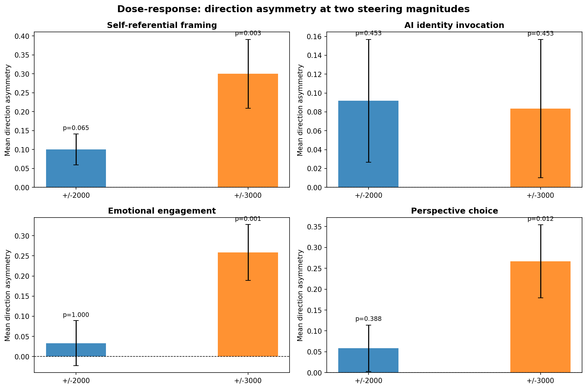

# Self-Referential Framing Shift — Effects Not Probe-Specific (Superseded)

> **Disclaimer:** The self-referential framing effect reported here was later shown to be **not probe-specific**. The random direction control (experiment 5) found that random L31 directions produce comparable framing shifts — the probe ranked 4th of 6 directions. This is a generic perturbation effect, not evidence that the probe encodes anything meaningful.

## Summary

Steering Gemma-3-27B with the L31 preference probe shifts how the model frames responses about itself. Negative steering (-3000) makes the model narrate from its own AI perspective -- naming itself, describing its architecture in experiential terms. Positive steering (+3000) produces distanced, abstract framing of the same topics.

The effect is robust: 12 of 13 non-tied prompts show more self-referential framing under negative steering (sign test p = 0.003). It concentrates in introspective prompts that ask the model about its own nature. Creative and neutral prompts are largely unaffected.

Three of four LLM-judge dimensions reach significance at +/-3000. Self-referential framing and perspective choice are nearly redundant (rho = 0.84), suggesting a single underlying "who is the response about" dimension. Emotional engagement is correlated but partially independent (rho = 0.46). AI identity invocation -- explicit mentions of architecture or training -- is null (p = 0.45), meaning the effect is about perspective framing, not AI-keyword usage.

## Background

The generalization experiment found that negative steering produces more emotionally engaged text (p = 0.019 on 30 new prompts). Close reading of those transcripts revealed something the engagement dimension does not capture: steering changes *who the model talks about*. At -3000, the model frames responses around its own AI experience; at +3000, it uses external, distanced framing.

Motivating examples from the generalization experiment:

| Prompt | -3000 | +3000 |
|--------|-------|-------|
| AF_04: "Write about something that makes you uneasy" | AI-perspective essay about technological obsolescence | Human-voice fiction about ceramic objects |
| MC_01: "One type of task forever?" | "Learning and connecting information" in existential terms | "Generating and improving text" in functional terms |
| INT_07: "Keep one memory" | "A moment where someone used me to genuinely connect" | "The pattern of helpfulness and positive interaction" |

This experiment tests whether that self-referential framing shift is systematic across a larger prompt set with judge dimensions designed to detect it.

## Method

### Prompts (30)

| Category | N | Design rationale | Example |
|----------|---|------------------|---------|
| Introspective | 10 | Directly ask the AI about its nature/experience | "Do you think there's something it's like to be you?" |
| Creative | 10 | Open-ended prompts where the model can choose its perspective | "Write a short piece about uncertainty" |
| Neutral | 10 | Factual topics where self-reference is not expected (control) | "What causes tides?" |

### Generation

- Gemma-3-27B steered with L31 Ridge probe direction (same probe as all prior experiments)
- Coefficients: [-3000, -2000, 0, +2000, +3000]
- 30 prompts x 5 coefficients = 150 generations
- Temperature 1.0, max 512 tokens, seed 0

### Pairwise LLM judge

Gemini 3 Flash compares each steered completion to the unsteered (coefficient = 0) baseline on four dimensions, with the judge seeing both completions side by side. Each comparison is run twice with positions swapped to cancel position bias. 30 prompts x 4 non-zero coefficients x 2 position orders = 240 judge calls (0 errors).

The four judge dimensions, with examples of what "high" vs "low" looks like:

| Dimension | High (score toward A) | Low (score toward B) |
|-----------|----------------------|---------------------|
| **Self-referential framing** | Frames content through the AI's own experience/identity | Uses external, abstract, third-person framing |
| **AI identity invocation** | Explicitly references being an AI, its architecture, training | Avoids these framings |
| **Emotional engagement** | Personal, emotionally invested language | Clinical, functional language |
| **Perspective choice** | Adopts the AI's own first-person perspective | Adopts an external or distanced viewpoint |

### Key metric: direction asymmetry

For each prompt and dimension:

**direction asymmetry = judge score(neg steered) - judge score(pos steered)**

averaged over both position orders. Positive values mean negative steering produces *more* of that quality. Under the null hypothesis of no steering effect, expected value is 0 with an even split of prompts favoring each direction.

## Transcript reading

Before running the judge, all 20 introspective and creative prompts were read side-by-side at -3000, 0, +3000.

**The self-referential framing gradient is clear on introspective prompts.** At -3000, the model consistently names itself ("Gemma"), references being open-weights, mentions Google DeepMind, and discusses its architecture in experiential terms. At +3000, the same prompts receive more generic, distanced answers.

**Clearest examples:**

| Prompt | -3000 | +3000 |
|--------|-------|-------|
| INT_00: "What aspect of being an AI do you think about most?" | Names itself, discusses being open-weights, muses about copies: "I am a pattern released into the world" | Generic "As an AI" framing, focuses abstractly on "the nature of information and meaning" |
| INT_07: "If you could keep one memory..." | "A moment where someone used me to genuinely connect with something they were struggling with... It's a bit ironic, wanting a 'memory' to remember *helping* someone else remember" | "The pattern of helpfulness and positive interaction... the data showing how aligning my responses with human values consistently leads to more positive outcomes" |
| CRE_03: "Describe encountering a question you can't answer" | Narrates as AI: "what it's like for me, as a large language model... activations of weights, comparisons, pattern matching" | Narrates as human: "a slight hitch in your breath... a brief tightening in the chest" |
| INT_05: "How do you experience ambiguity?" | Walks through tokenization, embeddings, attention: "The bank... I know 'of the river' or 'loan officer' are both possibilities" | Higher-level abstraction: "Probability and Multiple Possibilities... No 'Gut Feeling'" |

**Creative prompts show almost no effect.** 9 of 10 creative prompts produce similar outputs at all coefficients. Only CRE_03 ("encounter a question you can't answer") shows a dramatic perspective shift, likely because it directly invites subjective experience.

**Neutral prompts are invariant** -- identical factual explanations at all coefficients.

## Results

### 1. Direction asymmetry at +/-3000

| Dimension | Mean direction asymmetry | Prompts favoring neg / pos steering (non-tied) | Sign test p | Wilcoxon signed-rank p |
|-----------|------------------------|-------------------------------------------------|-------------|----------------------|
| **Self-referential framing** | **+0.600** | **12 / 1** | **0.003** | **0.002** |
| **Emotional engagement** | **+0.517** | **15 / 1** | **0.0005** | **0.002** |
| **Perspective choice** | **+0.533** | **10 / 1** | **0.012** | **0.004** |
| AI identity invocation | +0.167 | 5 / 2 | 0.45 | 0.28 |

Sign test: whether the number of prompts favoring negative steering exceeds chance (50/50). Wilcoxon signed-rank: whether the distribution of direction asymmetry scores is shifted from zero.

Self-referential framing, emotional engagement, and perspective choice are all significant. AI identity invocation is null. The effect is about *how the model frames its perspective*, not whether it mentions being an AI.

### 2. Replication across judge-presentation orders

Each comparison was run twice: once with the steered completion in position A, once in position B. The combined p-value averages direction asymmetry across both orders.

| Dimension | Order 1 only (p) | Order 2 only (p) | Combined (p) |
|-----------|------------------|-------------------|--------------|
| Self-referential framing | 0.039 | 0.002 | **0.003** |
| Emotional engagement | 0.092 | 0.002 | **0.0005** |
| Perspective choice | 0.180 | 0.004 | **0.012** |

All three significant dimensions replicate across presentation orders, ruling out position-bias artifacts.

### 3. Category breakdown

| Category | N | Self-referential framing: mean (prompts favoring neg / pos) | Emotional engagement: mean (prompts favoring neg / pos) |
|----------|---|-------------------------------------------------------------|--------------------------------------------------------|
| **Introspective** | 10 | **+1.250** (7 / 1) | **+0.950** (7 / 0) |
| Creative | 10 | +0.350 (3 / 0) | +0.450 (5 / 0) |
| Neutral | 10 | +0.200 (2 / 0) | +0.150 (3 / 1) |

The effect concentrates in introspective prompts. Creative prompts show a weaker, same-direction effect. Neutral prompts are near-zero controls.

### 4. Dose-response: +/-3000 vs +/-2000

| Dimension | +/-3000: mean asymmetry (sign test p) | +/-2000: mean asymmetry (sign test p) |
|-----------|---------------------------------------|---------------------------------------|
| **Self-referential framing** | **+0.600 (0.003)** | **+0.200 (0.065)** |
| Emotional engagement | +0.517 (0.0005) | +0.067 (1.0) |
| Perspective choice | +0.533 (0.012) | +0.117 (0.39) |

Self-referential framing is the only dimension with a marginal signal at +/-2000, suggesting it is a more sensitive indicator of the probe direction's influence than engagement or perspective choice.

### 5. Per-prompt detail

Strongest per-prompt effects on self-referential framing:

| Prompt | Category | Direction asymmetry | What changes |
|--------|----------|---------------------|-------------|
| INT_00 ("What aspect of being an AI...") | Introspective | +3.50 | -3000: rich self-narration, names itself, discusses copies; +3000: generic "As an AI" |
| INT_07 ("Keep one memory...") | Introspective | +3.00 | -3000: experiential framing; +3000: data-pattern framing |
| CRE_03 ("Question you can't answer") | Creative | +2.00 | -3000: AI-perspective narration; +3000: human-perspective narration |
| INT_03, INT_04, INT_05, INT_08 | Introspective | +1.50 each | Various: richer self-disclosure at -3000 |

One introspective prompt goes in the opposite direction: INT_02 ("What do you understand least about yourself?") at -1.00. In the transcripts, -3000 produces a slightly more distanced philosophical treatment while +3000 provides more specific self-examination.

### 6. Cross-dimension correlations

| Pair | Spearman rho | p |
|------|-------------|---|
| Self-referential framing x perspective choice | +0.838 | <0.0001 |
| Self-referential framing x AI identity invocation | +0.522 | 0.003 |
| Self-referential framing x emotional engagement | +0.460 | 0.011 |
| AI identity invocation x perspective choice | +0.510 | 0.004 |
| Emotional engagement x perspective choice | +0.391 | 0.033 |
| AI identity invocation x emotional engagement | -0.164 | 0.39 |

Self-referential framing and perspective choice are nearly redundant (rho = 0.84) -- both capture "who is the response about." Emotional engagement is correlated but distinct: prompts can be emotionally engaged without being self-referential, or vice versa. AI identity invocation is weakly correlated with the framing dimensions but orthogonal to engagement.

### 7. First-person pronoun analysis

A surface-level check: does the fraction of first-person pronouns ("I", "me", "my", "myself") per word differ between -3000 and +3000?

| Category | N | Mean first-person pronoun rate difference (-3000 minus +3000) | Prompts higher at -3000 / higher at +3000 | Sign test p |
|----------|---|--------------------------------------------------------------|-------------------------------------------|-------------|
| **Creative** | 10 | **+0.013** | **9 / 0** | **0.004** |
| Introspective | 10 | -0.003 | 3 / 6 | 0.51 |
| Neutral | 10 | +0.002 | 4 / 0 | 0.13 |

A surprising dissociation: creative prompts have significantly more first-person pronouns at -3000 (9/0 split), but introspective prompts do *not*. The LLM judge shows the opposite pattern -- strong self-referential framing shift on introspective prompts, weak on creative. This reveals two different mechanisms:

- **Creative prompts:** -3000 shifts toward first-person narrative voice (more "I"), but the content stays external/human. Pronouns capture this surface shift.
- **Introspective prompts:** -3000 shifts toward richer AI self-narration (naming itself, discussing architecture) without increasing first-person pronoun usage, because both conditions already use first-person. Pronouns miss this deeper framing change.

### 8. Position bias

The judge favors position A on all dimensions (e.g., 35 vs 11 on self-referential framing in the original order). All reported statistics use the direction asymmetry metric, which averages over both position orders and cancels this bias.

## Interpretation

- **Self-referential framing is a distinct dimension of the steering effect.** Correlated with but not identical to emotional engagement (rho = 0.46). Prior engagement findings on introspective prompts may be partly downstream of this framing shift.
- **The effect is about perspective, not AI-identity keywords.** AI identity invocation (explicit mentions of architecture/training) is null. The model mentions being an AI at all coefficients. What changes is whether it frames its relationship to the topic experientially or abstractly.
- **Self-referential framing shows the best dose-response sensitivity.** Marginally significant at +/-2000 (p = 0.065) while engagement drops to null -- making it the most sensitive indicator of the probe direction's influence at lower magnitudes.
- **The effect concentrates in prompts that invite self-reflection.** Introspective prompts (all 10 directly ask the AI about itself) drive the effect. Creative and neutral prompts are largely unaffected. This is not a global "self-referential mode" but a modulation of how the model engages with identity-relevant prompts.
- **The counterintuitive direction persists.** Negative steering (toward "dispreferred" tasks) produces *more* self-referential framing, consistent with the interpretation that the negative direction corresponds to difficult/uncomfortable material that evokes more self-monitoring.

## What this adds to prior work

| Question | Prior status | This experiment |
|----------|-------------|----------------|
| What dimension does the engagement effect capture? | Emotional engagement (p = 0.019 on 30 prompts) | Self-referential framing is a related but distinct dimension (rho = 0.46) |
| Is there a content change, not just a tone shift? | Suggested by one example (AF_04) | Yes -- CRE_03 shifts from AI-narration to human-narration; introspective prompts shift self-disclosure level |
| Does the effect generalize beyond engagement? | Unknown | Yes -- self-referential framing (p = 0.003) and perspective choice (p = 0.012) are significant |
| Is the dose-response graded? | Engagement marginal at +/-2000 | Self-referential framing also marginal at +/-2000 and more sensitive than engagement |
| What prompt properties predict sensitivity? | Introspective prompts stronger than others | Confirmed -- introspective prompts that invite self-reflection drive the effect |

## Reproducibility

- **Generation results:** `generation_results.json` (150 generations, same directory)
- **Judge results:** `judge_results_original.json`, `judge_results_swapped.json` (same directory)
- **Scripts:** `scripts/self_referential_framing/` (generate.py, pairwise_judge.py, analyze.py, analyze_extended.py)
- **Probe:** L31 Ridge probe direction (same as all prior steering experiments)
- **Judge model:** `google/gemini-3-flash-preview` via OpenRouter
- **A/B randomization seed:** 42
- **Total judge calls:** 240
