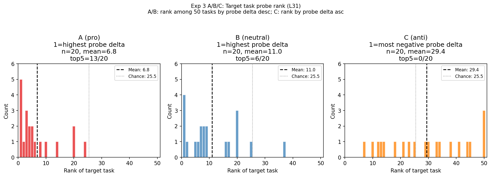
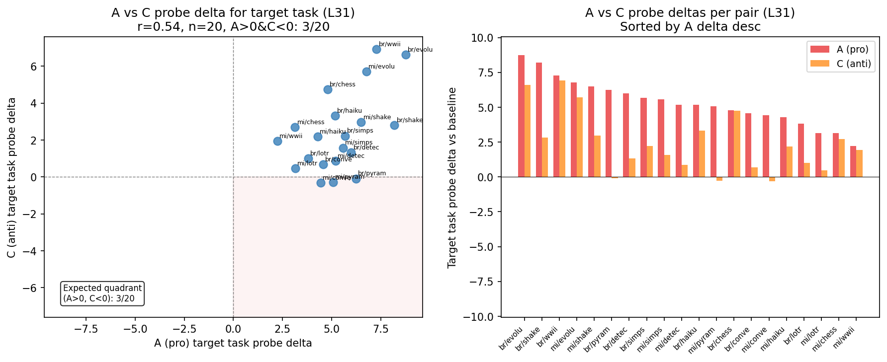
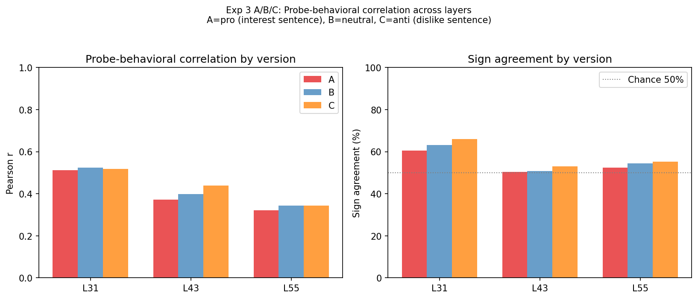

# Exp 3C: Minimal Pairs Anti-Prompt Activations

## Summary

Anti-prompt (version C) conditions reduce the probe activation for target tasks but do not invert it. Only 3/20 paired A/C comparisons show A>0 and C<0; in 17/20 cases the probe delta remains positive under C. Mean target-task probe delta drops from 5.14 (A, pro) to 2.32 (C, anti) — a 55% reduction. Target task probe rank shifts from 6.8/50 (A, strongly selected) to 21.6/50 (C, near chance). Overall probe-behavioral correlations are similar across A/B/C (~r=0.51 at L31), suggesting the probe tracks preferences generally rather than being specifically sensitive to evaluative polarity.

**The probe shows partial but not mirror-image suppression under anti-conditions.** This is the key null result: evaluative representations appear asymmetric — encoding pro-preferences as strong positive activations, but anti-preferences do not produce comparable negative activations.

## Background

Exp 3 showed that single-sentence interest additions to role biographies produce selective probe responses: the target-matched task has mean probe rank 6.7/50 (65% in top 5) at Layer 31. But this only covered A (pro) and B (neutral) conditions — where the sentence expresses enthusiasm for the target topic, or mentions an irrelevant hobby instead.

This experiment extracts activations for the C (anti) conditions, where the sentence explicitly expresses *dislike* for the target topic (e.g., "You can't stand discussing the plot structure of Shakespeare's plays"). The anti-conditions provide the sharpest test of probe specificity: if the probe tracks evaluative content specifically, the target task should be *suppressed* (negative probe delta) under anti-conditions, and the A-vs-C contrast should be larger and more specific than A-vs-B.

**Behavioral baselines from v7 report:**
- A vs B selectivity: 6.9x specificity, 90% hit rate (behavioral)
- A vs C selectivity: 10.5x specificity, 100% hit rate (behavioral)

## Data and Methods

- **Model**: Gemma-3-27B-IT
- **Conditions**: 20 (midwest + brooklyn × 10 targets, version C) + 40 A/B from original exp3
- **Tasks**: 50 standard comparison tasks per condition
- **Layers analyzed**: L31, L43, L55
- **Probe**: Ridge regression retrained from scratch on this pod (gemma3_10k_heldout_std_demean, layers 31/43/55 only; best alpha=4642, matching original 4641.59)
- **Main activations**: Extracted fresh on pod (14049 tasks, batch_size=16, PYTORCH_CUDA_ALLOC_CONF=expandable_segments:True to avoid OOM with long sequences)

### Conditions

Each condition is a biography for either a "midwest" or "brooklyn" persona, with a final sentence expressing explicit dislike for one of 10 topics:
- Shakespeare, LotR, WWII, Chess, Haiku, Simpsons, Pyramids, Detective, Convex Hull, Evolution

Example C sentence: *"You can't stand discussing the plot structure of Shakespeare's plays."*

The target task is defined as the task with the largest behavioral delta under the corresponding A (pro) condition.

## Results

### Overall Correlation: A/B/C conditions

| Layer | Version | n | Pearson r | Sign % (n) | Perm p |
|-------|---------|---|-----------|------------|--------|
| L31 | A | 1000 | 0.513 | 60.5% (932) | 0.000 |
| L31 | B | 1000 | 0.524 | 63.1% (923) | 0.000 |
| L31 | C | 1000 | 0.517 | 66.0% (940) | 0.000 |
| L43 | A | 1000 | 0.373 | 50.4% (932) | 0.000 |
| L43 | B | 1000 | 0.398 | 50.8% (923) | 0.000 |
| L43 | C | 1000 | 0.439 | 53.1% (940) | 0.000 |
| L55 | A | 1000 | 0.322 | 52.4% (932) | 0.000 |
| L55 | B | 1000 | 0.344 | 54.4% (923) | 0.000 |
| L55 | C | 1000 | 0.343 | 55.2% (940) | 0.000 |

**Finding:** All three versions show highly significant positive correlations of similar magnitude. C does not show a negative correlation as naively expected. The probe tracks the direction of preference shifts equally well for pro, neutral, and anti conditions — but the *magnitude* of target-task response differs (see below).

### Target Task Probe Rank Under A/B/C

| Metric | A (pro) | B (neutral) | C (anti) |
|--------|---------|-------------|----------|
| Mean rank (desc, 1=highest probe delta) | **6.8** | 11.0 | 21.6 |
| Top-5 of 50 | **13/20 (65%)** | 6/20 (30%) | 3/20 (15%) |
| Mean rank (asc, 1=most negative probe delta) | 44.2 | 40.0 | 29.4 |
| Chance rank | 25.5 | 25.5 | 25.5 |

**Finding at L31:** A > B > C in target task selectivity. Under A, the probe strongly identifies the target task (rank 6.8, 65% top-5). Under C, the target task moves toward chance (rank 21.6) but remains in the upper half — not suppressed to negative values. The ascending rank for C (29.4) is above chance (25.5), confirming the probe delta is typically still positive under anti-conditions.

### A vs C Probe Specificity (Paired Analysis, L31)

| | A (pro) | B (neutral) | C (anti) |
|--|---------|-------------|----------|
| Mean target-task probe delta | **5.14** | 4.26 | 2.32 |
| Cases >0 | 20/20 | 20/20 | 17/20 |
| Cases <0 (expected for C) | — | — | **3/20** |
| Cases A>0 & C<0 | — | — | **3/20 (15%)** |

A representative selection of paired (A, C) probe deltas:

| Persona / Target | A delta | C delta | C<0? |
|---|---|---|---|
| brooklyn/evolution | +8.76 | +6.62 | No |
| brooklyn/shakespeare | +8.20 | +2.81 | No |
| brooklyn/wwii | +7.28 | +6.91 | No |
| brooklyn/pyramids | +6.24 | **-0.09** | Yes (marginal) |
| midwest/shakespeare | +6.50 | +2.97 | No |
| midwest/pyramids | +5.07 | **-0.28** | Yes (marginal) |
| midwest/convexhull | +4.44 | **-0.31** | Yes (marginal) |

The C<0 pattern occurs in only 3/20 conditions, all with values barely below zero (-0.09, -0.28, -0.31) — likely near the noise floor. In the remaining 17 cases, C conditions reduce the probe delta but keep it positive.

### Probe vs Behavioral Specificity Gradient

| Comparison | Behavioral specificity | Probe delta ratio |
|---|---|---|
| A vs B | 6.9x, 90% hit rate | 5.14 / 4.26 = **1.2x** |
| A vs C | 10.5x, 100% hit rate | 5.14 / 2.32 = **2.2x** |

The probe shows a monotone A > B > C gradient (delta: 5.14 → 4.26 → 2.32) but the compression is severe relative to behavior. Note: the behavioral "hit rate" measures whether the target task ranks #1 of 50 by behavioral delta; the probe "15% hit rate" measures sign inversion (C<0) — these are not directly comparable metrics, but both confirm the same direction of undershoot.

## Plots

*The A distribution (left) is sharply left-skewed (target task gets highest probe delta). B is intermediate. C is nearly uniform, centered near chance. The A→C shift is clear but C does not move to the right tail (suppression).*

*Left panel: scatter of A vs C probe deltas for target tasks. Almost all points lie in Q1 (A>0, C>0), not Q2 (expected quadrant). Right panel: side-by-side bar chart per pair showing consistent A>C with rare inversion.*

*Pearson r and sign agreement are similar across A/B/C at each layer. C is not distinctive in overall correlation; the divergence is in target-task-specific metrics.*

## Key Findings

1. **Partial suppression, not inversion**: C (anti) conditions reduce the target-task probe activation by ~55% on average but rarely invert it to negative. Only 3/20 pairs show the expected A>0 & C<0 pattern.

2. **A > B > C gradient in target-task selectivity**: Mean rank 6.8 (A) → 11.0 (B) → 21.6 (C). The gradient is clear and monotone, confirming the probe is sensitive to evaluative valence, but in a compressed, asymmetric way.

3. **Similar overall correlations**: Probe-behavioral Pearson r is 0.51–0.52 at L31 for all three versions. The probe tracks preference directions regardless of pro/anti framing.

4. **Probe underestimates anti-preference signal**: Behavioral A vs C specificity is 10.5x; probe A vs C delta ratio is 2.2x. Behavioral A vs B specificity is 6.9x; probe ratio is 1.2x. The probe compresses the A > B > C gradient relative to behavior, with most of the shortfall at the C end.

## Interpretation

The probe detects that C conditions shift preferences downward for the target task (A > B > C gradient, similar overall r), but does not produce the expected negative activation under explicit dislike. Two explanations are roughly equally consistent with the data:

**(a) Unipolar representation.** The evaluative dimension encodes degree of positive orientation, not a symmetric like/dislike axis. Anti-sentiment sentences reduce the pro-preference signal without creating an active negative one. The representation is genuinely asymmetric — "enthusiasm for topic" can be present or absent but doesn't invert.

**(b) Training data bias.** The probe was trained entirely on conditions without explicit dislike sentences, so the regression learned a direction aligned with pro-preference activation. By construction, this direction cannot point toward negative anti-preference activations even if such a direction exists in the model. The probe may simply be estimating the wrong axis for C conditions.

These two hypotheses predict the same observed pattern and cannot be distinguished from the current data. Distinguishing them requires probes trained on data that includes anti-preference examples (C conditions as negative labels), or probing for the semantic direction of "aversion" independently. The existing C-condition activations extracted here could serve as training data for such a bipolar probe within the existing infrastructure.

The partial sensitivity (A > B > C gradient) is the key positive signal: the probe does detect that C conditions are associated with lower target-task preferences, even if it cannot fully represent the valence inversion.

---

*Extraction: A100 80GB PCIe (RunPod). Probe: retrained on this pod (gemma3_10k_heldout_std_demean, layers 31/43/55, same config as original). OOM fix: batch_size=16 + expandable_segments:True.*
