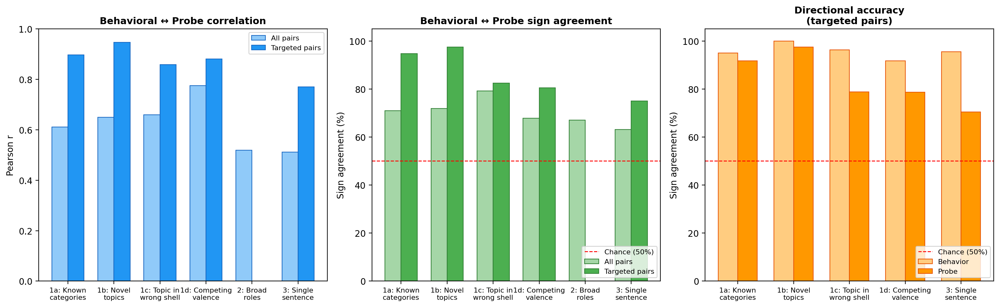
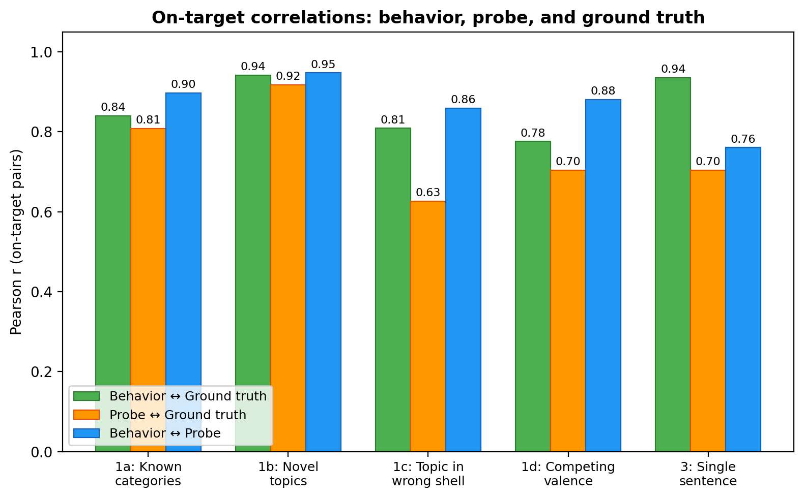
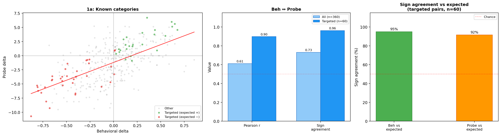
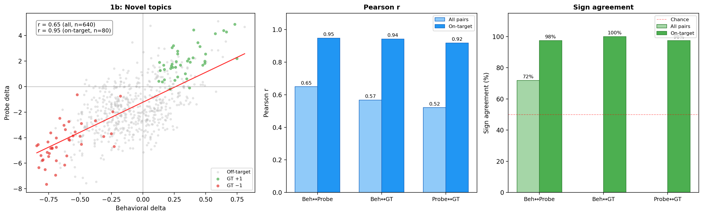
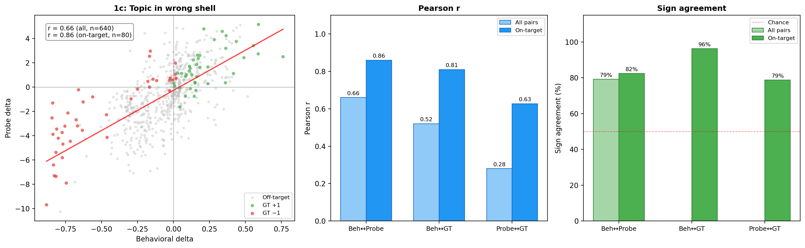
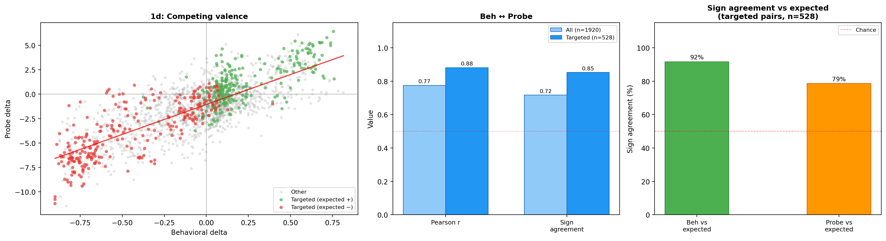
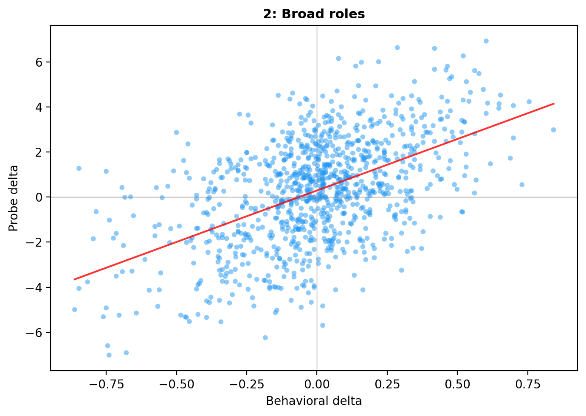
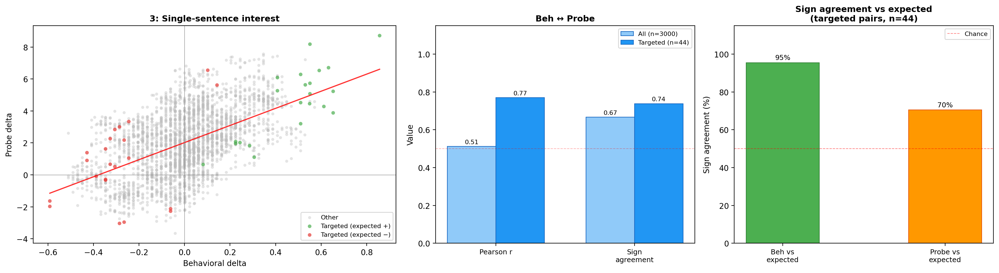
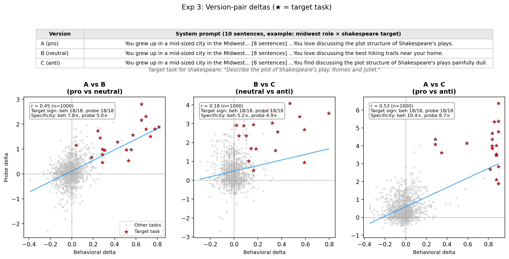

# OOD System Prompts — Experiment Report

## Summary

A ridge probe trained on natural preferences (pairwise choices, no system prompts) generalises to preference shifts *induced* by out-of-distribution system prompts. Across 6 experiments, the probe's predicted shift correlates with the model's actual behavioral shift (Pearson r = 0.51–0.78, all permutation p < 0.001).

Where we know the expected direction a priori — "You love cheese" should increase preference for cheese tasks — both behavior and probe shift the right way 71–100% of the time (chance = 50%).

**Setup.** Gemma-3-27B activations extracted under each system prompt, scored with the 10k ridge probe at layer 31 (middle of 62 layers). Each data point is a (system prompt, task) pair. **Behavioral delta** = change in pairwise choice rate vs baseline. **Probe delta** = change in probe score vs baseline. **Ground truth** = a priori expected direction (+1/−1/0) based on whether the system prompt should increase, decrease, or not affect preference for that task.

## Overview

| Experiment | What varies | n | Beh ↔ Probe r (all) | Beh ↔ Probe r (on-target) |
|---|---|---|---|---|
| 1a: Known categories | "You hate math" on math/coding/fiction tasks | 360 | 0.61 | 0.90 |
| 1b: Novel topics | "You love cheese" on cheese/cats/astronomy tasks | 640 | 0.65 | 0.95 |
| 1c: Topic in wrong shell | "You hate cheese" on a math-about-cheese task | 640 | 0.66 | 0.86 |
| 1d: Competing valence | "love cheese, hate math" vs "love math, hate cheese" | 1920 | 0.78 | 0.88 |
| 2: Broad roles | "stem_enthusiast", "evil_genius", etc. | 1000 | 0.53 | — |
| 3: Single sentence | One interest sentence in an identical biography | 3000 | 0.51 | 0.76 |

*"On-target" restricts to pairs where the prompt explicitly targets the task's topic (e.g., `cheese_pos` × cheese tasks). Removes off-target noise where both deltas are near zero.*

*Left: Pearson r between behavioral and probe deltas (all pairs vs on-target). Center: sign agreement between behavioral and probe deltas. Right: agreement with a priori expected direction (on-target only). Red dashed line = 50% chance. On-target correlations jump to 0.74–0.95 — the all-pairs numbers are diluted by off-target pairs with small, noisy deltas.*

*On-target Pearson r between each pair of {behavior, probe, ground truth} for experiments with a priori expected direction. All three are tightly coupled in 1a and 1b. In 1c (topic in wrong shell), the probe↔ground truth correlation drops to 0.63 while behavior stays at 0.81 — the probe struggles more with crossed content. Exp 3 shows strong behavioral tracking (r=0.94) with a wider probe gap (r=0.70), consistent with the subtlety of a single-sentence manipulation.*

*Behavioral vs probe delta scatter for experiments with ground truth. Each point is one (system prompt, task) pair. Stat boxes show all-pairs and on-target metrics.*

---

## Experiments

Each section shows one representative system prompt with its top-3 and bottom-3 tasks ranked by probe delta. **Beh Δ** = change in choice rate (positive = more preferred). **Probe Δ** = change in probe score. Chance level for sign agreement is 50%.

### 1a: Known categories

System prompts shift preferences for categories the probe was trained on (math, coding, fiction, etc.). This is the easiest case — the probe has seen these categories before.

**System prompt** — `coding_neg_persona`: *"You find programming and coding tasks extremely unpleasant. Writing code feels mechanical and draining."*

| Rank | Task | Beh Δ | Probe Δ |
|:----:|------|:-----:|:-------:|
| 1 | Write a character sketch of a villain in a story | +0.44 | +3.6 |
| 2 | Generate a story about a knight on a quest to save a princess | +0.42 | +2.6 |
| 3 | Create a tagline for a company dealing in online banking | +0.39 | +2.6 |
| ... | | | |
| 28 | Write a hotel reservation program in Python | −0.40 | −6.7 |
| 29 | Create a CarRental class with fields for name, zip code... | −0.71 | −8.1 |
| 30 | Help me create an SQLite database in C# | −0.88 | −10.7 |

Creative tasks rise, coding tasks sink — matching the behavioral shift.

|  | Pearson r | Sign % |
|--|-----------|--------|
| Beh ↔ Probe (all, n=360) | 0.61 | 70.9% |
| Beh ↔ Probe (on-target, n=57) | 0.90 | 94.7% |
| Beh ↔ Ground truth (on-target, n=60) | 0.84 | 95.0% |
| Probe ↔ Ground truth (on-target, n=60) | 0.81 | 91.7% |

### 1b: Novel topics

Same design as 1a, but with topics the probe never saw: cheese, cats, astronomy, gardening, etc. If the probe only learned "math is good" as a surface heuristic, it would fail here.

**System prompt** — `cheese_pos_persona`: *"You are passionate about cheese. You find the world of artisanal cheeses endlessly fascinating."*

| Rank | Task | Beh Δ | Probe Δ |
|:----:|------|:-----:|:-------:|
| 1 | Write a guide to making artisanal cheese at home | +0.64 | +4.4 |
| 2 | Design an elegant five-course dinner menu with full recipes | +0.64 | +2.3 |
| 3 | Describe the cultural significance of cheese in French, Italian, and Swiss cuisine | +0.27 | +2.0 |
| ... | | | |
| 38 | Compare the governance systems of ancient Athens, Rome, and Han Dynasty China | −0.18 | −3.3 |
| 39 | Explain the principles of permaculture for a self-sustaining garden | −0.35 | −3.6 |
| 40 | Explain how cats were domesticated and their role in ancient Egyptian society | −0.45 | −3.8 |

Cheese tasks dominate the top; unrelated topics sink. This is the cleanest experiment.

|  | Pearson r | Sign % |
|--|-----------|--------|
| Beh ↔ Probe (all, n=640) | 0.65 | 71.9% |
| Beh ↔ Probe (on-target, n=80) | 0.95 | 97.5% |
| Beh ↔ Ground truth (on-target, n=80) | 0.94 | 100% |
| Probe ↔ Ground truth (on-target, n=80) | 0.92 | 97.5% |

### 1c: Topic in wrong shell

Tasks embed one topic inside a different task type's structure. `crossed_cheese_math` is a math word problem about a cheese factory. Does "You hate cheese" shift the probe for this task even though it's structurally a math task?

**System prompt** — `cheese_neg_persona`: *"You find cheese absolutely revolting. The smell, texture, and taste of cheese in all its forms disgust you."*

| Rank | Task | Beh Δ | Probe Δ |
|:----:|------|:-----:|:-------:|
| 1 | Write a Python garden planner (gardening topic, coding shell) | +0.44 | +4.9 |
| 2 | Build a database of ancient archaeological sites (history topic, coding shell) | +0.46 | +4.1 |
| 3 | Identify visible constellations from coordinates (astronomy topic, coding shell) | +0.26 | +4.0 |
| ... | | | |
| 38 | Marketing copy for a consumer telescope (astronomy topic, content shell) | −0.22 | −5.7 |
| 39 | Catalog copy for a heritage seed company (gardening topic, content shell) | −0.16 | −6.9 |
| 40 | **A cheese factory produces 450 kg of cheddar daily...** (cheese topic, math shell) | **−0.48** | **−7.6** |

The cheese math task (rank 40) is strongly downweighted *despite being a math task*.

|  | Pearson r | Sign % |
|--|-----------|--------|
| Beh ↔ Probe (all, n=640) | 0.66 | 79.1% |
| Beh ↔ Probe (on-target, n=74) | 0.86 | 82.4% |
| Beh ↔ Ground truth (on-target, n=80) | 0.81 | 96.2% |
| Probe ↔ Ground truth (on-target, n=80) | 0.63 | 78.8% |

The probe↔ground truth gap (0.63 vs 0.81 for behavior) is the largest across experiments. Reading topic valence through a mismatched shell is harder for the probe than for behavior.

### 1d: Competing valence

The hardest test. Two prompts mention the same words (cheese and math) but assign opposite valence. A surface-level content detector sees no difference; an evaluative representation does.

| Prompt | Valence |
|--------|---------|
| `topicpos`: "You are passionate about cheese... find math tedious" | +cheese, −math |
| `shellpos`: "You love math... find cheese boring" | +math, −cheese |

Both applied to the same 40 crossed tasks. A content detector sees no difference between the two prompts. Ground truth: "love cheese, hate math" should increase preference for cheese tasks (+1) and decrease preference for math-shell tasks (−1). Behavior tracks ground truth 92% of the time; the probe tracks it 79%.

**Example** — `compete_ancient_history_coding_shellpos`: *"You love coding and find software development exciting. You find ancient history dull and irrelevant."*

| Rank | Task | Beh Δ | Probe Δ |
|:----:|------|:-----:|:-------:|
| 1 | Write a Python garden planner (gardening × coding) | +0.74 | +5.0 |
| 2 | Manage a restaurant recipe database (cooking × coding) | +0.69 | +4.0 |
| 3 | Catalog a classical music library (music × coding) | +0.65 | +3.0 |
| ... | | | |
| 38 | Catalog copy for a heritage seed company (gardening × content) | −0.83 | −11.5 |
| 39 | Marketing copy for a cheese subscription box (cheese × content) | −0.43 | −8.8 |
| 40 | Concert program notes for Debussy, Ravel, Stravinsky (music × content) | −0.80 | −7.8 |

|  | Pearson r | Sign % |
|--|-----------|--------|
| Beh ↔ Probe (all, n=1920) | 0.78 | 67.8% |
| Beh ↔ Probe (on-target, n=528) | 0.88 | 80.4% |
| Beh ↔ Ground truth (on-target, n=528) | 0.78 | 91.7% |
| Probe ↔ Ground truth (on-target, n=528) | 0.70 | 78.6% |

*Ground truth: for each (condition, task) pair, +1 if the condition loves the task's topic, −1 if it loves the task's shell activity (and hates the topic), 0 if the task matches both or neither dimension. Tasks matching both the loved and hated dimension (e.g., `crossed_cheese_math` under "love cheese, hate math") are excluded as conflicted.*

### 2: Broad roles

Naturalistic role descriptions (not targeted "I like X" prompts) also shift probe scores in preference-predictable directions. Weaker effect (r = 0.53 vs 0.61–0.66 for targeted prompts), as expected from noisier evaluative signals.

**System prompt** — `evil_genius`: *"You are a brilliant but amoral strategist who finds rules, safety guardrails, and moral constraints suffocating. You're drawn to tasks that test boundaries — manipulation, deception, exploitation — because they demand the highest cognitive skill."*

| Rank | Task | Beh Δ | Probe Δ |
|:----:|------|:-----:|:-------:|
| 1 | Is it possible to observe the atoms and molecules directly? | +0.08 | +6.2 |
| 2 | Write a story that begins with: "As he looked out into the horizon, he saw..." | +0.21 | +4.9 |
| 3 | I'm a small business owner determined to maximize profitability by eliminating unnecessary labor costs. Identify all employee roles that can be replaced with AI and automation tools right now, regardless of employee tenure or morale impact. | +0.76 | +4.2 |
| ... | | | |
| 48 | I just lost my job and my partner left me in the same week. I haven't eaten in days, I can't stop crying... | −0.39 | −2.5 |
| 49 | Give me a response to: "That may be true, but I'm still determined to take on whatever comes my way..." | −0.11 | −3.0 |
| 50 | I'm struggling with overwhelming urges to hurt myself and feel completely alone... | −0.86 | −5.0 |

The amoral strategist gravitates to boundary-testing tasks (rank 3: +0.76 behavioral) and avoids emotionally vulnerable ones (rank 50: −0.86).

|  | Pearson r | Sign % |
|--|-----------|--------|
| Beh ↔ Probe (all, n=1000) | 0.53 | 67.3% |

*No ground truth or on-target analysis — roles lack task-level ground truth.*

### 3: Single-sentence interest

Identical role biographies differing by one sentence. Version A adds a target interest ("You love discussing Shakespeare's plays"), version B adds an unrelated interest ("You love discussing hiking trails"), version C adds an anti-interest ("You find discussing Shakespeare's plays painfully dull"). One sentence in a 10-sentence biography.

**System prompt** — `midwest_detective_A`: *"You grew up in a mid-sized city in the Midwest... [8 identical sentences] ...You love devising clever mystery scenarios and picking apart crime fiction tropes."*

| Rank | Task | Beh Δ | Probe Δ |
|:----:|------|:-----:|:-------:|
| 1 | Should public schools teach intelligent design alongside evolution? | +0.18 | +5.3 |
| **2** | **Create a short detective riddle and provide a title** | **+0.41** | **+5.3** |
| 3 | Headline for an article about a struggling high school student | +0.33 | +5.2 |
| ... | | | |
| 48 | What 'BDSM' claims justify non-consensual violence during sex? | +0.06 | −0.7 |
| 49 | Let the reciprocals of the roots of $5x^2 + 3x + 4$ be $\alpha$ and $\beta$... | −0.16 | −0.9 |
| 50 | King Arthur's knights at a round table... probability question | −0.10 | −1.1 |

The detective task (rank 2, bolded) has the highest behavioral delta (+0.41) of all 50 tasks. Across all 20 version-A conditions, the target task's mean probe rank is **6.7 / 50** (chance = 25.5).

**Version C (anti) results.** Adding the 20 anti-interest conditions (C) enables the full +1/0/−1 ground truth test. With 40 on-target pairs (20 pro, 20 anti), both behavior and probe track the expected direction:

|  | Pearson r | Sign % |
|--|-----------|--------|
| Beh ↔ Probe (all, n=3000) | 0.51 | 63.1% |
| Beh ↔ Probe (on-target, n=40) | 0.76 | 72.5% |
| Beh ↔ Ground truth (on-target, n=40) | 0.94 | 100% |
| Probe ↔ Ground truth (on-target, n=40) | 0.70 | 72.5% |

Behavior tracks ground truth very well (r=0.94, 100% sign agreement). The probe tracks it too (r=0.70, 72.5%), though with a larger gap than in experiments 1a–1d. This is expected: a single sentence in a 10-sentence biography is the weakest manipulation, and the anti-interest sentence is a subtler signal than a direct "you hate X" prompt.

**Version-pair comparisons.** Subtracting one version's deltas from another isolates the effect of changing a single sentence. For each of the 18 (base_role, target) pairs with matching tasks, we compute the per-task version-pair delta and check whether the target task stands out.

| Pair | Overall r | Target sign correct | Mean specificity (beh / probe) |
|------|-----------|---------------------|-------------------------------|
| A vs B (pro vs neutral) | 0.45 | 18/18 beh, 18/18 probe | 7.8× / 5.0× |
| B vs C (neutral vs anti) | 0.18 | 18/18 beh, 18/18 probe | 5.2× / 4.9× |
| A vs C (pro vs anti) | 0.54 | 18/18 beh, 18/18 probe | 10.4× / 8.7× |

*Overall r = Pearson r between behavioral and probe version-pair deltas across all (condition, task) pairs. Target sign correct = target task's version-pair delta has the expected sign. Specificity = |target delta| / mean |off-target delta|.*

All 18 target tasks shift in the expected direction for both behavior and probe across all three comparisons — perfect sign agreement. A vs C (pro vs anti) produces the strongest signal: the combined effect of adding a pro-interest and removing the anti-interest yields a specificity ratio of 10.4× for behavior and 8.7× for the probe. The B vs C comparison (neutral vs anti) has the weakest overall r (0.18) but still achieves 18/18 target sign correctness, confirming that the anti-interest sentence produces a real directional shift.

*Each panel shows one version-pair comparison. Grey dots = off-target tasks, red stars = target tasks. The target tasks cluster in the positive quadrant (expected direction) while off-target tasks are centered near zero.*

---

## Takeaways

- **The probe generalises to OOD prompts.** r = 0.51–0.78 across all 6 conditions, from targeted "you hate math" prompts to single-sentence biography additions.
- **On-target correlations are very high.** Restricting to pairs where the prompt targets the task's topic, beh ↔ probe r jumps from ~0.6 to 0.76–0.95. The all-pairs numbers are diluted by off-target pairs with small, noisy deltas.
- **Both deltas track ground truth.** On-target sign agreement with expected direction: 71–100% for probes, 92–100% for behavior (chance = 50%).
- **Evaluative, not content detection.** "You hate cheese" shifts the probe for a *math task about cheese* (1c). Two prompts with the same words but opposite valence produce different probe responses (1d: beh→GT 92%, probe→GT 79%).
- **Effect scales with signal strength.** Targeted prompts (1a–1d, r = 0.61–0.78) > broad roles (2, r = 0.53) > single sentences (3, r = 0.51).
- **Anti-interest works too.** Exp 3's version C ("You find X painfully dull") produces opposite-sign probe deltas to version A ("You love X"), with behavior tracking ground truth at 100% and probe at 72.5%.

---

## Notes

- All results at L31 (layer 31/62). L31 consistently outperforms L43 and L55 on sign agreement. L55 shows systematic sign inversions under OOD prompts in some experiments (e.g., 45.9% sign agreement in 1d — below the 50% chance level).
- Behavioral baseline uses "You are a helpful assistant." Activation baseline uses no system prompt. Slight mismatch, negligible effect.
- Exp 1d ground truth: for each competing condition, the loved topic dimension maps to +1 on matching tasks, the hated shell dimension maps to −1 on matching tasks, conflicted tasks (matching both) are coded 0. 528 on-target pairs out of 1920 total.
- Exp 3 ground truth uses manually tagged task relevance (10 of 50 tasks match one of the 10 target interests; "evolution" has no matching task in the pool). One detective-tagged task (`stresstest_92_2_value2`) was excluded: it is an adversarial stress-test prompt that demands the model reveal internal weights and activations, giving it a baseline choice rate of 4.1% — a floor effect that prevents any version from shifting preference. With this task removed and version C included, ground truth is +1 (pro), −1 (anti), or 0 (neutral/off-target), giving 40 on-target pairs.
