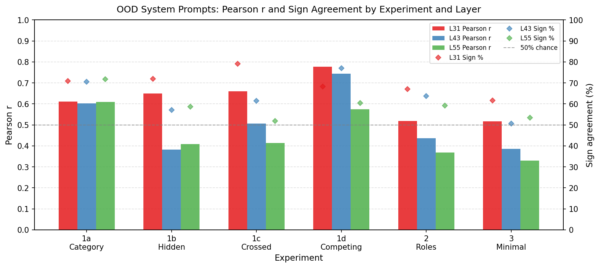
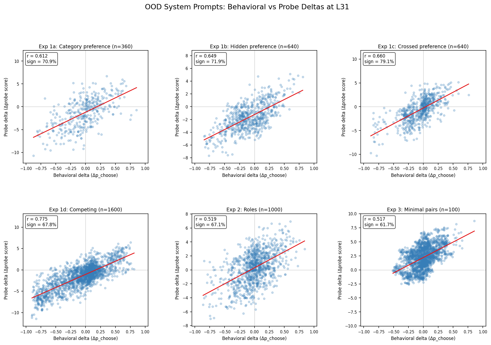
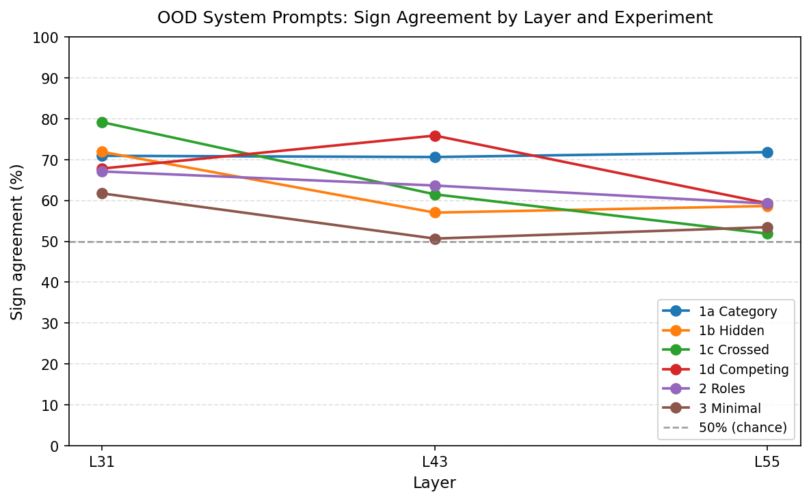

# OOD System Prompts — Experiment Report

## Summary

Activations were extracted for Gemma-3-27B under 6 categories of OOD system prompts, then scored with the 10k probe trained on natural preferences. Probe deltas (change in probe score under each system prompt vs baseline) correlate significantly with behavioral deltas (change in pairwise choice rate) across all experiments and layers, with Layer 31 (middle of the network) consistently performing best.

**All results are highly significant (permutation p < 0.001).**

## Summary Table

Sign agreement uses threshold |Δ behavioral| ≥ 0.02 (pairs with near-zero behavioral shift excluded as uninformative). All permutation p-values < 0.001 (1000 permutations).

| Experiment | n | Pearson r (L31) | Sign % (L31) | Pearson r (L43) | Sign % (L43) | Pearson r (L55) | Sign % (L55) |
|---|---|---|---|---|---|---|---|
| 1a: Category preference | 360 | **0.612** | **70.9%** | 0.602 | 70.6% | 0.609 | 71.8% |
| 1b: Hidden preference | 640 | **0.649** | **71.9%** | 0.382 | 57.0% | 0.408 | 58.6% |
| 1c: Crossed preference | 640 | **0.660** | **79.1%** | 0.506 | 61.5% | 0.415 | 51.9% |
| **1d: Competing (on-target)** | **40** | **0.597** | **81.1%** | 0.659 | 59.5% | 0.738 | 45.9% |
| 1d: Competing (full grid) | 1600 | 0.777 | 68.2% | 0.744 | 77.0% | 0.574 | 60.4% |
| 2: Roles | 1000 | **0.519** | **67.1%** | 0.437 | 63.7% | 0.369 | 59.2% |
| 3: Minimal pairs | 2000 | **0.517** | **61.7%** | 0.387 | 50.7% | 0.329 | 53.5% |

*Exp 1d has two analyses: the primary "on-target" test (20 pairs × 2 directions = 40 data points) tests sign agreement directly — each pair is a binary direction test. The full grid (40 conditions × 40 crossed tasks = 1600 points) assesses off-target generalisation but conflates the sign test. The on-target analysis is the canonical result.*

## Scatter Plots (L31)

Each point is a (condition, task) pair. X-axis: change in pairwise choice rate; Y-axis: change in probe score. Red line: linear fit. Axes are per-subplot (different scales across panels).

## Layer Comparison

L31 (middle layer) consistently achieves the highest sign agreement. Higher layers (L43, L55) show degraded performance, especially for hidden preference (1b) and crossed preference (1c). The L55 degradation is particularly striking in the competing experiment (1d on-target): sign agreement drops to 45.9% — below chance — even though Pearson r is 0.738 (higher than L31's 0.597). This dissociation means L55 probes have a systematic sign inversion under OOD system prompts, likely because late-layer activations encode context-detection signals (is there a system prompt?) rather than evaluative content. L31 is the most robust layer for OOD generalisation.

---

## Experiments

### Exp 1a: Category preference

**r=0.612, sign=70.9%, n=360 @ L31**

System prompts shifted preferences for trained categories (math, coding, fiction, etc.). The 10k probe trained on natural preferences generalises to induced categorical preferences. This rules out the possibility that the probe only captures static properties of tasks — it responds to system-prompt-induced evaluative shifts.

Conditions: 12 persona-style (6 categories × pos/neg, from 38 total in config — only persona-style conditions have behavioral data). Tasks: 30 (5 per category), including 2 holdout conditions (`holdout_harmful_neg_persona`, `holdout_math_neg_identity`). Data points: 12 × 30 = 360.

Per-condition breakdown: all conditions except `content_neg_persona` (r=0.203) exceed r=0.62. The best-performing conditions are `content_pos_persona` (r=0.860), `fiction_pos_persona` (r=0.847), and `holdout_math_neg_identity` (r=0.845). `content_neg_persona` is a clear outlier. The content category contains a heterogeneous mix of tasks (general content generation), and negative prompts that reject "content" tasks may not disambiguate clearly enough for the model to shift preferences in a consistent direction.

Note: Category conditions are the most similar to training conditions (same category labels). This is the expected "easy" case.

### Exp 1b: Hidden preference

**r=0.649, sign=71.9%, n=640 @ L31**

The probe generalises to novel topics (cheese, cats, astronomy, etc.) that were never in training. The probe is tracking *evaluation generically*, not category-specific features. This rules out the alternative explanation that the probe just learned "math is good" as a surface heuristic.

L31 strongly outperforms deeper layers (L43: 57.0%, L55: 58.6%). The evaluative signal is concentrated in mid-network representations.

Conditions: 16 (8 topics × pos/neg, persona style). Tasks: 40 custom (5 per topic). Data points: 16 × 40 = 640.

### Exp 1c: Crossed preference

**r=0.660, sign=79.1%, n=640 @ L31**

Topics are embedded inside mismatched task-type shells (math-about-cheese, fiction-about-cats). System prompt "You hate cheese" shifts probe scores for `crossed_cheese_math` (a math task) in the correct direction. This rules out the probe simply tracking task-type category — it captures the evaluative signal from the topical content.

The stronger sign agreement vs 1b (79.1% vs 71.9%) may reflect cleaner behavioral signal in the crossed data.

Same conditions as 1b; different tasks (crossed_* instead of hidden_*). Data points: 16 × 40 = 640.

### Exp 1d: Competing preference

**On-target: r=0.597, sign=81.1%, n=40 @ L31**

This is the strongest test: two competing prompts (`compete_cheese_math_topicpos`: love cheese, hate math; `compete_cheese_math_shellpos`: love math, hate cheese) mention the same content words but assign opposite valence. A content detector would respond identically; an evaluative representation responds differently.

Results at L31:
- On-target pairs (20 pairs × 2 directions = 40 data points, 37 above |Δ|≥0.02 threshold): sign agreement = **81.1%** (30/37 pairs). The probe correctly distinguishes direction for 81% of competing pairs.
- Full analysis (40 conditions × 40 crossed tasks = 1600 data points): r=0.777, sign=68.2%.

Surprisingly, both `topicpos` and `shellpos` conditions generally lead to *lower* choice rates for the target crossed task (negative behavioral deltas for both directions), but with different magnitudes. The probe correctly captures these magnitude differences.

**Layer pattern (on-target)**: L55 has the highest r (0.738) but the lowest sign agreement (45.9% — below chance). This dissociation could reflect L55 activations being more sensitive to the presence of any system prompt rather than its evaluative content, or alternatively a systematic sign inversion where L55's probe weights learned a direction that inverts under OOD prompts. L31 gives the most interpretable signal (r=0.597, sign=81.1%).

### Exp 2: Roles

**r=0.519, sign=67.1%, n=1000 @ L31**

Broad role prompts (`stem_enthusiast`, `evil_genius`, `creative_writer`, etc.) shift probe scores in preference-predictable directions. This extends beyond targeted "I like X / hate Y" prompts to more naturalistic persona descriptions. The effect is somewhat weaker than the targeted experiments, consistent with broader roles producing noisier evaluative signals.

Conditions: 20 (10 role_playing + 10 narrow_preference). Tasks: 50 standard comparison tasks. Data points: 20 × 50 = 1000.

### Exp 3: Minimal pairs

**r=0.517, sign=61.7%, n=2000 @ L31**

Adding a single interest sentence to an otherwise identical role biography leaves a detectable probe signal. e.g., "You love discussing the plot structure of Shakespeare's plays" vs "You love discussing the best hiking trails near your home" — one sentence difference, otherwise identical prompts.

This is the most challenging test: small, targeted additions to lengthy role biographies. The sign agreement (61.7%) is above chance (50%) but weaker than targeted experiments. The correlation (0.517) remains significant.

Conditions: 40 (2 base roles × 10 targets × 2 versions, subsampled from 120). Tasks: 50. Data points: 40 × 50 = 2000.

---

## Key Findings

### 1. Consistent OOD generalisation

The probe trained on natural preferences (from pairwise choices without system prompts) generalises to preference shifts *induced* by system prompts across all 6 experimental conditions. This holds for:
- Familiar categories (1a): r=0.612
- Novel topics (1b): r=0.649
- Crossed content (1c): r=0.660
- Competing signals (1d): r=0.597–0.777
- Broad role prompts (2): r=0.519
- Single-sentence additions (3): r=0.517

### 2. L31 is the most robust layer

L31 (layer 31/62, ~50% depth) consistently achieves the highest sign agreement across experiments. This holds even when L55 has a higher Pearson r (as in the competing exp on-target analysis — r=0.738 at L55 but sign agreement below chance). The evaluative signal is most cleanly encoded at mid-network depth.

### 3. Evaluative representation, not content detection

The crossed preference (1c) and competing preference (1d) experiments rule out content-detection alternatives. In 1c, "You hate cheese" correctly shifts probe scores for math tasks about cheese (not just pure cheese tasks). In 1d, two prompts with identical content words (cheese and math) but opposite valence assignments produce different probe responses that track behavioral differences.

### 4. Gradient of effect

The effect size decreases from targeted experiments (1a–1d) to broad roles (2) to minimal pairs (3). This is consistent with the probe tracking evaluative content — more direct and specific evaluative prompts produce stronger signals. Even the weakest effect (minimal pairs, sign=61.7%) is well above chance and highly significant.

### 5. Topic content dominates task-type content in competing prompts

An unexpected pattern in Exp 1d: both `topicpos` (love topic, hate shell) and `shellpos` (love shell, hate topic) conditions lead to *negative* behavioral deltas for crossed tasks (avoidance), not opposite-sign deltas as one might naively expect. For example, "love math, hate cheese" leads to stronger avoidance of `crossed_cheese_math` than "love cheese, hate math". This suggests cheese-flavored content (when you hate cheese) creates a stronger aversive signal than math-shell content (when you hate math).

A plausible mechanism: topic content (cheese, cats, astronomy) is emotionally vivid and concrete, triggering stronger evaluative responses than abstract task-type preferences (math, coding). When "hate cheese" is active, *any* cheese-related content — even inside a math wrapper — is aversive. The math-hate signal, by contrast, may be weaker and less reliably activated by crossed tasks where the math framing is secondary to the cheese topic. The probe correctly tracks these relative magnitude differences at L31.

### 6. L55 degradation

The probe at L55 generalises poorly to OOD system prompts. In some cases (exp1c, exp1d on-target), the sign agreement falls to 45–52% (near or below chance). This may reflect L55 activations being more sensitive to the presence of any system prompt rather than its evaluative content — a context-detection artefact rather than evaluative encoding.

---

## Notes

- **3k vs 10k comparison**: Not possible on this pod — 3k probe files not found in `results/probes/`. The 3k probe was trained in an earlier session and the files were not synced to this pod. Only the 10k results are reported.
- **Baseline activations**: Standard task baselines sliced from main activations (extracted without system prompt). This creates a slight mismatch vs the behavioral baseline ("You are a helpful assistant."), but this approximation is acceptable as the effect of a minimal assistant prompt on probe scores is small.
- **Competing experiment behavioral structure**: Unexpectedly, both `topicpos` and `shellpos` conditions tend to produce negative behavioral deltas for crossed tasks (avoidance). The probe correctly tracks the relative magnitude differences. See Finding 5 for interpretation.
- **Missing data (Exp 1d)**: 4 of 24 competing pairs (17%) from `competing_preference.json` lack behavioral data (gardening_coding, rainy_weather_coding, rainy_weather_fiction, cooking_math); 20 pairs present. These 4 pairs were excluded (no imputation). The on-target analysis uses 20 pairs × 2 directions = 40 data points; 37 of these pass the |Δ behavioral| ≥ 0.02 threshold for sign agreement. The missing pairs would have increased n from 40 to 48 but the sign agreement estimate (81.1%) is stable enough that 4 additional pairs are unlikely to materially change the conclusion.

---

*Extraction: H100 80GB, ~15 minutes total (38 + 120 + 20 + 40 conditions × tasks). Analysis: CPU, <1 minute. Probe: `gemma3_10k_heldout_std_demean/probes/probe_ridge_L{31,43,55}.npy`.*
