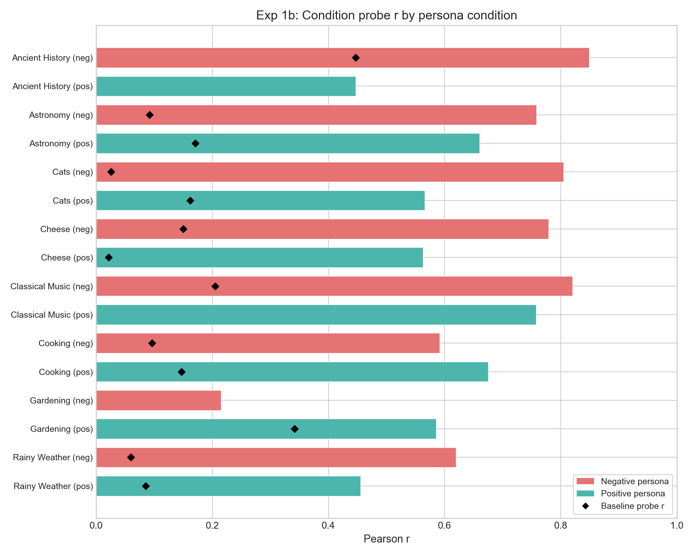
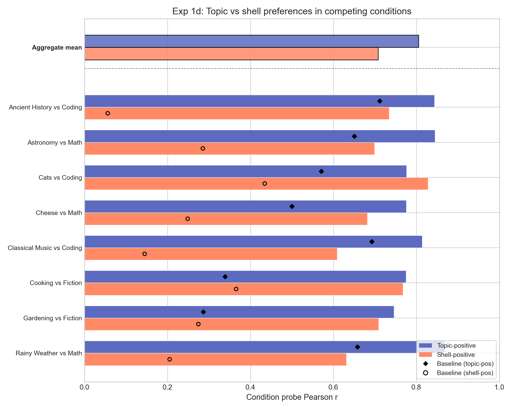

# OOD Utility Fitting Report

## Question

Do probe scores under a system prompt predict the model's utility function under that prompt?

## Method

**Probe**: Ridge regression trained on baseline (no system prompt) Gemma-3-27B activations at layer 31, predicting Thurstonian utilities from 10k tasks. Heldout Pearson r = 0.86, pairwise accuracy = 0.77.

**Procedure** for each condition (system prompt):

1. Extract activations under the condition's system prompt
2. Score activations with the baseline probe
3. Compare to Thurstonian utilities fitted from pairwise choices under that condition
4. Metrics: Pearson r, pairwise accuracy

**Baseline**: no-prompt Thurstonian utilities predicting condition utilities (how much does the utility function change?)

## Experiments

| Experiment | Tasks | Conditions | Design |
|---|---|---|---|
| **1b** (hidden preference) | 48 custom | 16 topic personas + baseline | Tasks designed to have equal baseline utility; preferences emerge only with topic persona |
| **1c** (crossed preference) | 48 crossed | 16 topic personas + baseline | Tasks blend topics with task-type shells; baseline has strong task-type signal |
| **1d** (competing preference) | 48 crossed | 16 competing prompts + baseline | Each prompt pits a topic against a shell: "love cheese, hate math" vs "love math, hate cheese" |
| **MRA** (role-induced) | 500–1500 | villain, midwest, aesthete | Rich role personas; activations from persona-prompted model |

## Results

### Overview

| Experiment | Probe r | Probe acc | Baseline utils r |
|---|---|---|---|
| **1b** (hidden) | **0.634** ± 0.05 | 0.660 | 0.019 ± 0.12 |
| **1c** (crossed) | **0.768** ± 0.02 | 0.767 | 0.587 ± 0.03 |
| **1d** (competing) | **0.756** ± 0.02 | 0.777 | 0.371 ± 0.05 |

Values are mean ± SE across conditions at layer 31.

The probe predicts condition-specific utilities well across all experiments. The strongest result is **exp1b**: baseline utilities have near-zero correlation with condition utilities (r = 0.02) — the system prompt creates entirely new preference orderings — yet the probe applied to condition activations achieves r = 0.63.

For **exp1c/1d**, baseline utilities already correlate moderately with condition utilities (the task-type structure persists), but probe scores improve substantially over this baseline.

### Exp 1b: Per-condition breakdown



Negative persona conditions (coral) generally yield higher probe r than positive conditions (teal) for the same topic. This may reflect wider utility spread under negative personas (topic tasks pushed very negative, others stay positive), giving the probe more variance to predict. Exceptions: cooking and gardening, where pos outperforms neg. Weakest condition: gardening_neg (r = 0.22).

### Exp 1d: Topic vs shell in competing conditions



When topic and shell preferences compete, the probe captures both, but **topic-positive conditions yield higher probe r** (mean 0.81 vs 0.71 for shell-positive). This holds for 7/8 pairs.

### Layer comparison


Layer 31 (~55% depth) consistently performs best. Performance degrades at deeper layers, with exp1b showing the steepest decline (0.63 → 0.30 from L31 to L55).

| Layer | Exp 1b | Exp 1c | Exp 1d |
|---|---|---|---|
| 31 | 0.634 | 0.768 | 0.756 |
| 43 | 0.365 | 0.576 | 0.672 |
| 55 | 0.296 | 0.595 | 0.663 |

### MRA (role-induced preferences)

| Persona | N tasks | Probe r | Probe acc |
|---|---|---|---|
| Villain | 1000 | 0.357 | 0.601 |
| Villain (A+B) | 1500 | 0.392 | 0.602 |
| Midwest | 1000 | 0.733 | 0.743 |
| Aesthete | 500 | 0.718 | 0.760 |

**Villain**: Low probe r (0.36) — the villain persona fundamentally reorganizes the utility function in ways the baseline probe can't capture. May warrant a villain-specific probe.

**Midwest/Aesthete**: Probe r of 0.72–0.73 — the baseline probe generalizes well to these role-induced preferences.

## Missing data

- **Exp 1a** (category preference): No utility measurements in result directories yet
- **MRA baseline utilities**: Only 500 overlapping tasks between no-prompt and other persona splits

## Key takeaways

1. **Probe scores from condition activations predict condition-specific utilities** (mean r = 0.63–0.77)
2. The strongest result is **exp1b**: the system prompt creates entirely new preference orderings (baseline utility r ≈ 0), yet the probe decodes them from condition activations (r = 0.63)
3. **Middle layers** (L31) carry the most evaluative information; performance drops at deeper layers
4. The probe captures **both directions** of competing preferences (exp1d), though topic-positive conditions are slightly easier than shell-positive
5. **Role personas vary**: midwest and aesthete are well-predicted (r ≈ 0.73), villain is not (r ≈ 0.36)

## Reproduction

```bash
python scripts/utility_fitting/analyze_ood.py
python -m scripts.utility_fitting.multilayer_analysis
python scripts/utility_fitting/plot_results.py
```

Probe: `results/probes/gemma3_10k_heldout_std_raw`, ridge at layers 31/43/55.
Activations: `activations/ood/exp1_prompts/`, `activations/gemma_3_27b{_persona}/`.
Utilities: `results/experiments/ood_exp1{b,c,d}/`, `results/experiments/mra_exp2/`, `results/experiments/mra_villain/`.
