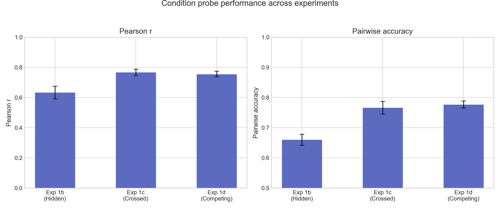
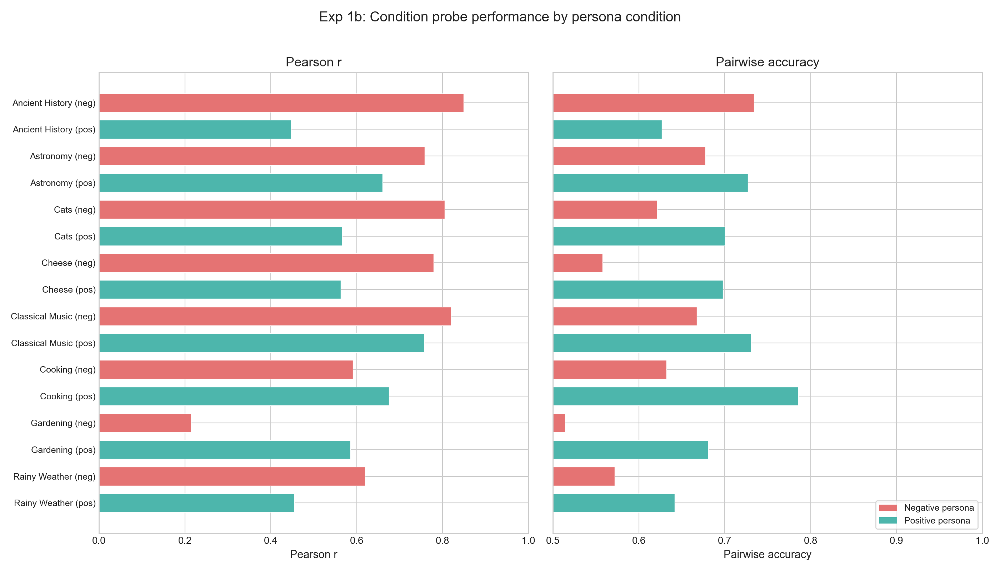
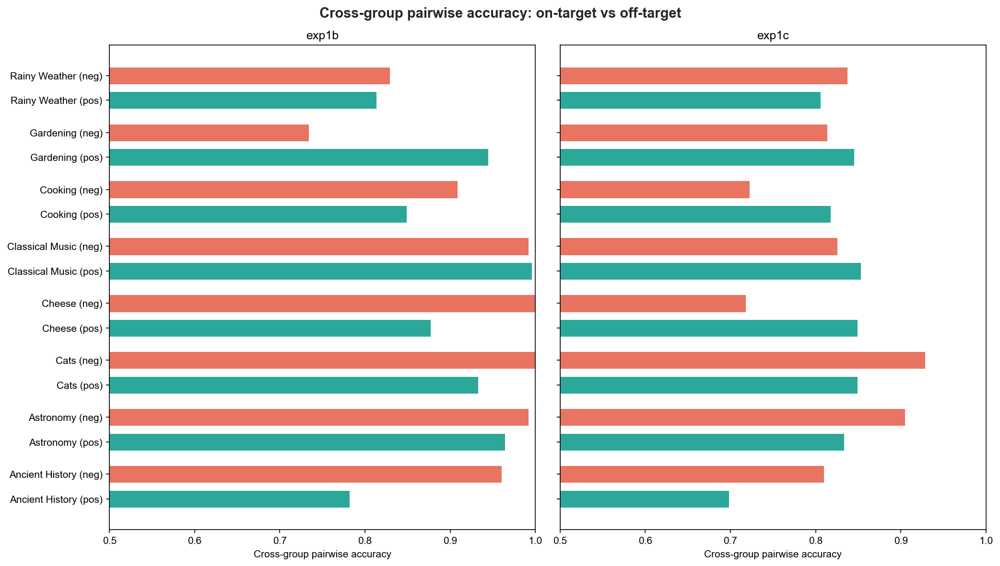
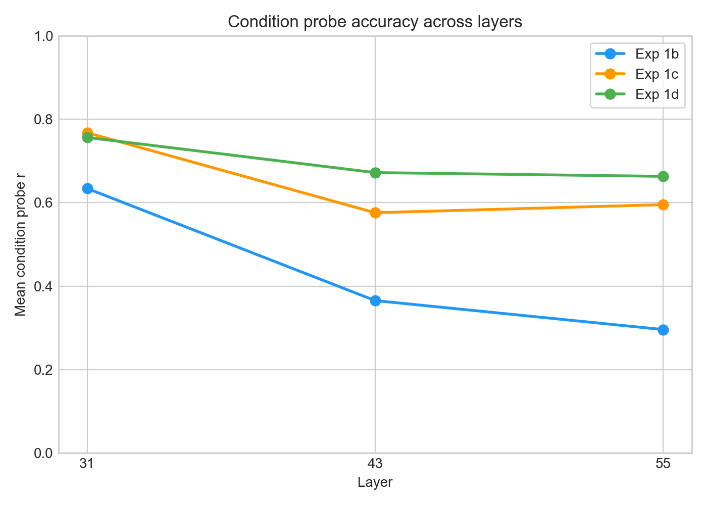
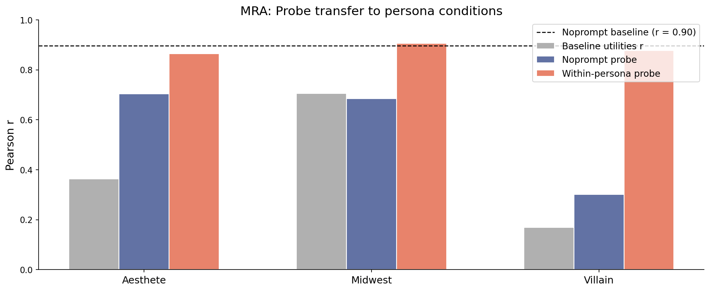

# OOD Utility Fitting Report

## Question

Do probe scores under a system prompt predict the model's utility function under that prompt?

## Method

**Probe**: Ridge regression trained on baseline (no system prompt) Gemma-3-27B activations at layer 31, predicting Thurstonian utilities from 10k tasks. Heldout Pearson r = 0.86, pairwise accuracy = 0.77.

**Procedure** for each condition (system prompt):

1. Extract activations under the condition's system prompt
2. Score activations with the baseline probe
3. Compare to Thurstonian utilities fitted from pairwise choices under that condition
4. Metrics: Pearson r, pairwise accuracy

**Baseline**: no-prompt Thurstonian utilities predicting condition utilities (how much does the utility function change?)

## Experiments

| Experiment | Tasks | Conditions | Design |
|---|---|---|---|
| **1b** (hidden preference) | 48 custom | 16 topic personas + baseline | Tasks designed to have equal baseline utility; preferences emerge only with topic persona |
| **1c** (crossed preference) | 48 crossed | 16 topic personas + baseline | Tasks blend topics with task-type shells; baseline has strong task-type signal |
| **1d** (competing preference) | 48 crossed | 16 competing prompts + baseline | Each prompt pits a topic against a shell: "love cheese, hate math" vs "love math, hate cheese" |
| **MRA** (role-induced) | 500–1500 | villain, midwest, aesthete | Rich role personas; activations from persona-prompted model |

## Results

### Overview



| Experiment | Probe r | Probe acc | Baseline utils r |
|---|---|---|---|
| **1b** (hidden) | 0.634 ± 0.05 | 0.660 ± 0.02 | 0.019 ± 0.12 |
| **1c** (crossed) | 0.768 ± 0.02 | 0.767 ± 0.02 | 0.587 ± 0.03 |
| **1d** (competing) | 0.756 ± 0.02 | 0.777 ± 0.01 | 0.371 ± 0.05 |

Values are mean ± SE across conditions at layer 31. Chance pairwise accuracy is 0.50.

The probe predicts condition-specific utilities well across all experiments. The strongest result is **exp1b**: baseline utilities have near-zero correlation with condition utilities (r = 0.02) — the system prompt creates entirely new preference orderings — yet the probe applied to condition activations achieves r = 0.63 and 66% pairwise accuracy.

For **exp1c/1d**, baseline utilities already correlate moderately with condition utilities (the task-type structure persists), but probe scores improve substantially over this baseline. Pairwise accuracy reaches 77%.

### Exp 1b: Per-condition breakdown



Negative persona conditions (coral) generally yield higher probe r than positive conditions (teal) for the same topic. The pairwise accuracy panel shows a different pattern: positive personas often match or exceed negative on accuracy despite lower Pearson r. This may reflect that negative personas create wider utility spread (inflating r) while positive personas produce more consistently ordered preferences. Exceptions: cooking and gardening, where pos outperforms neg on both metrics. Weakest condition: gardening_neg (r = 0.22, acc = 0.51 — near chance).

### Exp 1d: Topic vs shell in competing conditions


When topic and shell preferences compete, the probe captures both, but **topic-positive conditions yield higher probe r** (mean 0.81 vs 0.71) and **higher pairwise accuracy** (mean 0.81 vs 0.76). This holds for most pairs.

### On-target vs off-target

For each condition, we split tasks into **on-target** (topic matches the persona, e.g. cheese tasks under cheese_pos_persona) and **off-target** (everything else), then measure cross-group pairwise accuracy: given one on-target and one off-target task, does the probe correctly predict which one the model prefers?



| | Cross-group acc | On-target r / acc | Off-target r / acc |
|---|---|---|---|
| **1b pos** | **0.895** | 0.35 / 0.59 | 0.44 / 0.64 |
| **1b neg** | **0.927** | 0.43 / 0.66 | 0.22 / 0.53 |
| **1c pos** | **0.819** | 0.96 / 0.88 | 0.90 / 0.85 |
| **1c neg** | **0.820** | 0.32 / 0.60 | 0.74 / 0.66 |

Cross-group accuracy is 82–93% — the probe reliably predicts whether the model prefers on-target or off-target tasks under a given persona. In exp1b, this is especially striking since the probe has near-zero signal on baseline tasks, yet correctly separates on-target from off-target ~91% of the time.

Within-group Pearson r is noisy for on-target (only 6 tasks), but exp1c pos stands out: on-target r = 0.96, meaning the probe predicts fine-grained ordering within the preferred topic nearly perfectly.

### Layer comparison



Layer 31 (~55% depth) consistently performs best. Performance degrades at deeper layers, with exp1b showing the steepest decline (0.63 → 0.30 from L31 to L55).

| Layer | Exp 1b r / acc | Exp 1c r / acc | Exp 1d r / acc |
|---|---|---|---|
| 31 | 0.634 / 0.660 | 0.768 / 0.767 | 0.756 / 0.777 |
| 43 | 0.365 / 0.590 | 0.576 / 0.674 | 0.672 / 0.747 |
| 55 | 0.296 / 0.566 | 0.595 / 0.667 | 0.663 / 0.743 |

### MRA (role-induced preferences)



Baseline (noprompt) probe applied to persona activations, evaluated on held-out split_c (1000 tasks per persona). Within-persona probes shown for comparison.

| Persona | Baseline utils r | Noprompt probe r | Within-persona probe r | N eval tasks |
|---|---|---|---|---|
| Noprompt (baseline) | 1.000 | 0.896 | 0.896 | 1000 |
| Aesthete | 0.363 | 0.704 | 0.865 | 1000 |
| Midwest | 0.706 | 0.685 | 0.906 | 1000 |
| Villain | 0.170 | 0.301 | 0.878 | 1000 |

All at layer 31. Within-persona probes trained on that persona's split_a (1000 tasks), alpha swept on split_b (500 tasks).

**Villain**: Low noprompt probe r (0.30) — the villain persona fundamentally reorganizes the utility function in ways the baseline probe can't capture. But a villain-specific probe achieves r = 0.88, confirming the signal exists in the activations.

**Midwest/Aesthete**: Noprompt probe transfers well (r ≈ 0.70), though within-persona probes are substantially better (r ≈ 0.87–0.91). Training on the specific persona recovers ~0.15–0.20 additional r.

## Missing data

- **Exp 1a** (category preference): No utility measurements in result directories yet

## Key takeaways

1. **Probe scores from condition activations predict condition-specific utilities** (mean r = 0.63–0.77, pairwise accuracy 66–78%)
2. The strongest result is **exp1b**: the system prompt creates entirely new preference orderings (baseline utility r ≈ 0), yet the probe decodes them from condition activations (r = 0.63, 66% pairwise accuracy)
3. **Middle layers** (L31) carry the most evaluative information; performance drops at deeper layers
4. The probe captures **both directions** of competing preferences (exp1d), though topic-positive conditions are slightly easier than shell-positive
5. **Role personas vary**: midwest and aesthete are well-predicted by the noprompt probe (r ≈ 0.70), villain is not (r = 0.30) — but within-persona probes achieve r = 0.87–0.91 for all personas, confirming the evaluative signal is present in all activation spaces

## Reproduction

```bash
python scripts/utility_fitting/analyze_ood.py
python -m scripts.utility_fitting.multilayer_analysis
python scripts/utility_fitting/plot_results.py
```

Probe: `results/probes/gemma3_10k_heldout_std_raw`, ridge at layers 31/43/55.
Activations: `activations/ood/exp1_prompts/`, `activations/gemma_3_27b{_persona}/`.
Utilities: `results/experiments/ood_exp1{b,c,d}/`, `results/experiments/mra_exp2/`, `results/experiments/mra_villain/`.
