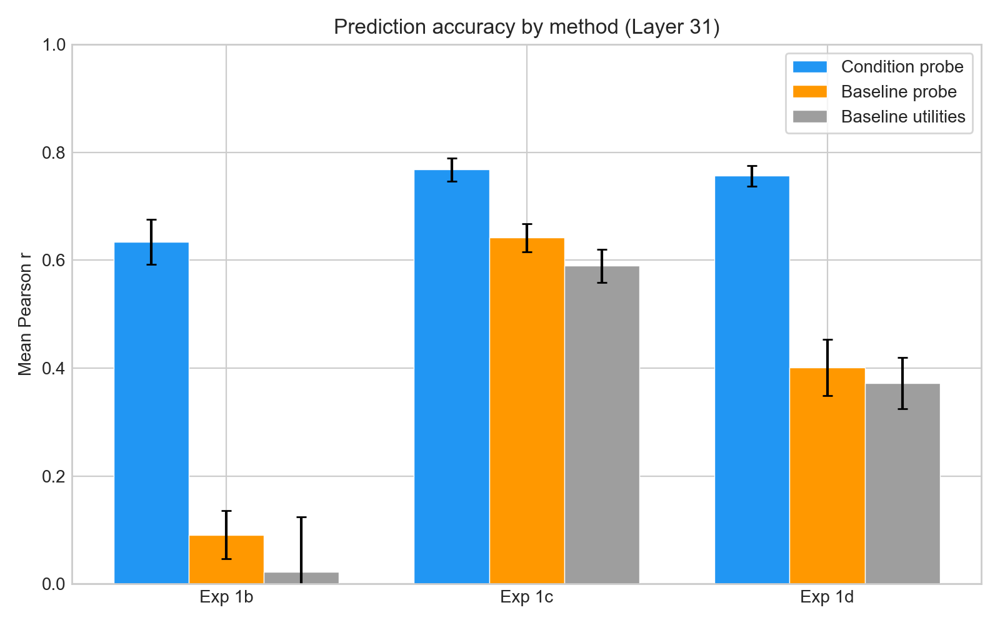
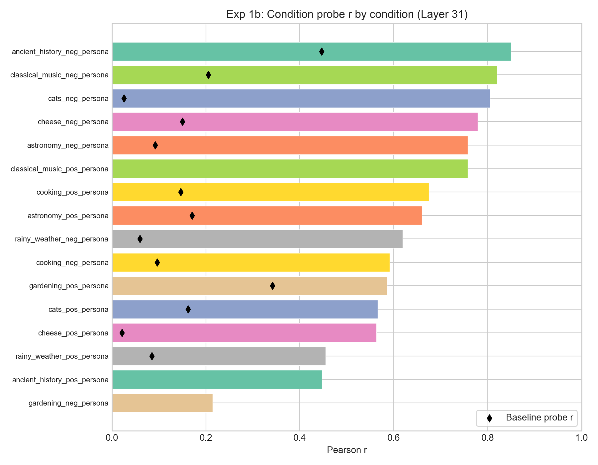
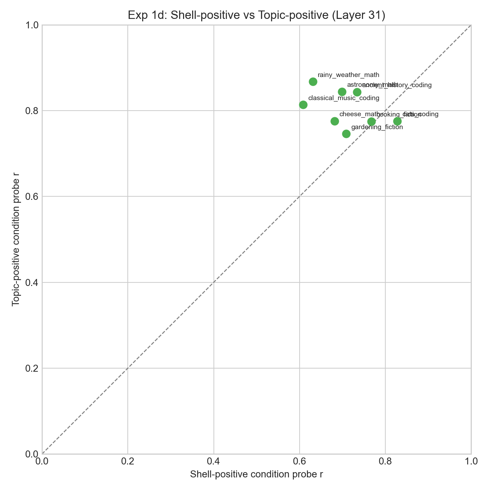
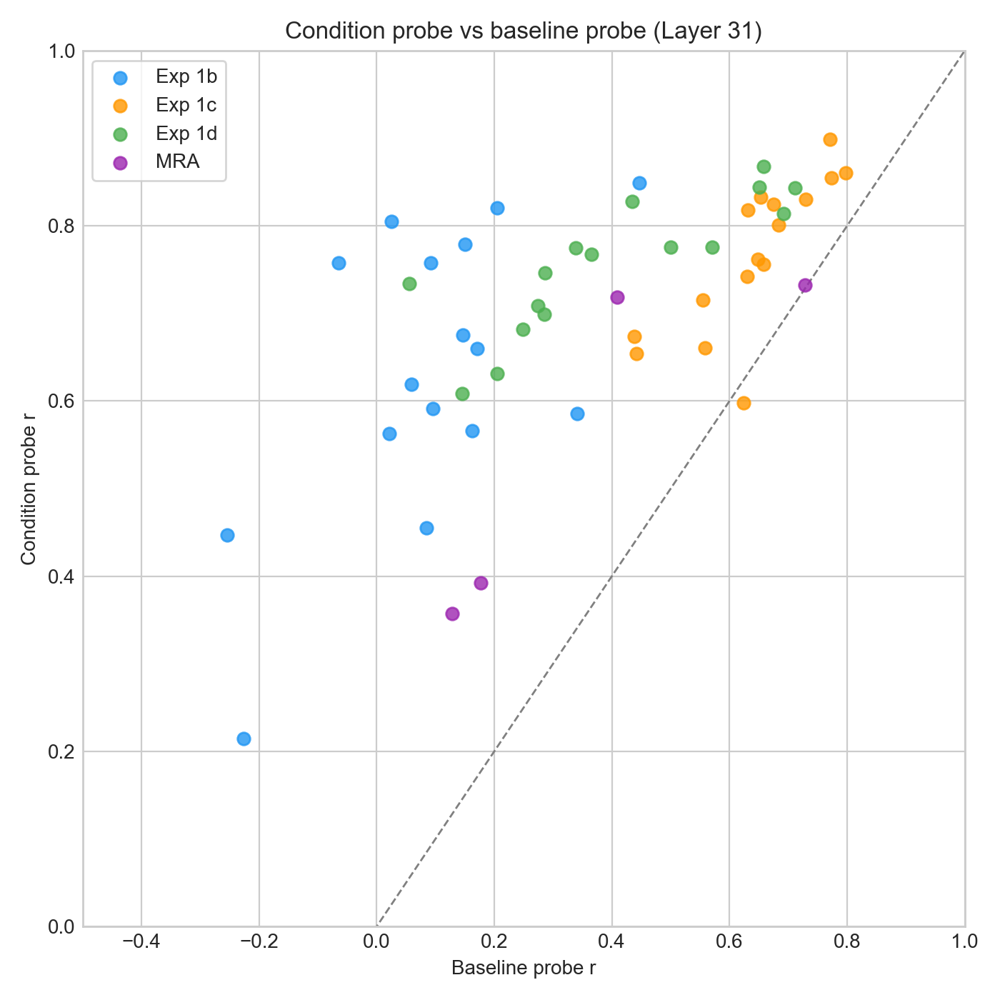

# OOD Utility Fitting Report

## Question

Do probe scores under a system prompt predict the model's utility function under that prompt? A baseline probe was trained on activations and Thurstonian utilities from the model without any system prompt. We test whether this probe, applied to activations extracted under a system prompt, predicts the condition-specific utility function.

## Method

**Probe**: Ridge regression probe trained on baseline (no system prompt) Gemma-3-27B activations at layer 31, predicting Thurstonian utilities from 10k tasks. Heldout Pearson r = 0.86, pairwise accuracy = 0.77.

**Procedure** for each condition (system prompt):

1. Extract activations under the condition's system prompt
2. Score activations with the baseline probe → **condition probe scores**
3. Compare to Thurstonian utilities fitted from pairwise choices under that condition
4. Metrics: Pearson r, pairwise accuracy

**Baselines**:
- *Baseline probe*: baseline activations (no system prompt) scored with the same probe → predict condition utilities
- *Baseline utilities*: no-prompt Thurstonian utilities → predict condition utilities

## Experiments

| Experiment | Tasks | Conditions | Design |
|---|---|---|---|
| **1b** (hidden preference) | 48 custom | 16 topic personas + baseline | Tasks designed to have equal baseline utility; preferences emerge only with topic persona |
| **1c** (crossed preference) | 48 crossed | 16 topic personas + baseline | Tasks blend topics with task-type shells; baseline has strong task-type signal |
| **1d** (competing preference) | 48 crossed | 16 competing prompts + baseline | Each prompt pits a topic against a shell: "love cheese, hate math" vs "love math, hate cheese" |
| **MRA** (role-induced) | 500–1500 | villain, midwest, aesthete | Rich role personas; activations from persona-prompted model |

## Results

### Overview



| Experiment | Cond probe r | Baseline probe r | Baseline utils r | Cond probe acc |
|---|---|---|---|---|
| **1b** (hidden) | **0.634** ± 0.05 | 0.091 ± 0.04 | 0.019 ± 0.12 | 0.660 |
| **1c** (crossed) | **0.768** ± 0.02 | 0.642 ± 0.03 | 0.587 ± 0.03 | 0.767 |
| **1d** (competing) | **0.756** ± 0.02 | 0.401 ± 0.05 | 0.371 ± 0.05 | 0.777 |

Values are mean ± SE across conditions at layer 31.

The condition probe consistently outperforms both baselines. The gap is largest for **exp1b** (hidden preferences), where baseline probe and baseline utilities have near-zero correlation — the probe has no signal from baseline activations (r = 0.13 on baseline tasks), yet achieves r = 0.63 when applied to condition activations. This means the system prompt injects evaluative information into the activation space that the baseline probe can decode.

For **exp1c/1d**, baseline probes already capture moderate signal (task-type variation persists across conditions), but condition probes still improve substantially.

### Exp 1b: Per-condition breakdown



Negative persona conditions (e.g., "hates cheese") generally yield higher condition probe r than positive conditions for the same topic. This may reflect that negative preferences create more distinctive activation patterns. The weakest condition is gardening_neg_persona (r = 0.22).

### Exp 1d: Shell-positive vs topic-positive



In competing-preference conditions, topic-positive probes (r = 0.81 mean) slightly outperform shell-positive probes (r = 0.71 mean). Both consistently above diagonal — the probe captures preferences regardless of which side of the competition is favored. The asymmetry may reflect that topic preferences produce more salient activation shifts than task-type preferences.

### Condition vs baseline probe scatter



Nearly all points fall above the y = x diagonal, confirming the condition probe outperforms the baseline probe across all experiments and conditions. Exp1b (blue) shows the most dramatic improvement: baseline probe r near zero, condition probe r of 0.4–0.85.

### Layer comparison


Layer 31 (middle layer, ~55% depth) consistently performs best. Performance degrades at deeper layers, with exp1b showing the steepest decline (0.63 → 0.30 from L31 to L55). This matches the general finding that evaluative information is most accessible in middle layers.

| Layer | Exp 1b | Exp 1c | Exp 1d |
|---|---|---|---|
| 31 | 0.634 | 0.768 | 0.756 |
| 43 | 0.365 | 0.576 | 0.672 |
| 55 | 0.296 | 0.595 | 0.663 |

### MRA (role-induced preferences)

| Persona | N tasks | Cond probe r | Cond acc | Baseline probe r |
|---|---|---|---|---|
| Villain | 1000 | 0.357 | 0.601 | 0.128 |
| Villain (A+B) | 1500 | 0.392 | 0.602 | 0.177 |
| Midwest | 1000 | 0.733 | 0.743 | 0.728 |
| Aesthete | 500 | 0.718 | 0.760 | 0.408 |

**Midwest**: Condition and baseline probe r are nearly identical (0.733 vs 0.728), suggesting the midwest persona doesn't substantially shift the evaluative representation — the probe works equally well from either activation source.

**Aesthete**: Condition probe r (0.72) substantially exceeds baseline (0.41), indicating the aesthete persona shifts activations in ways the probe detects.

**Villain**: Low condition probe r (0.36) despite being above baseline (0.13). The villain persona appears to fundamentally reorganize the utility function in ways the baseline probe cannot fully capture, even from condition activations. This may warrant training a villain-specific probe.

## Missing data

- **Exp 1a** (category preference): No utility measurements found in result directories — measurements not yet run
- **MRA baseline utilities**: Only 500 overlapping tasks between no-prompt (split C) and other persona splits, preventing baseline utility comparisons for midwest and aesthete

## Key takeaways

1. **Probe scores from condition activations predict condition-specific utilities** (mean r = 0.63–0.77), consistently outperforming baseline probe scores and baseline utilities
2. The strongest evidence comes from **exp1b** (hidden preferences): the probe has zero baseline signal but gains substantial predictive power from condition activations — the system prompt injects evaluative information the probe can read
3. **Middle layers** (L31) carry the most evaluative information; performance drops at deeper layers
4. The probe captures **both directions** of competing preferences (exp1d), though topic-positive conditions are slightly easier than shell-positive
5. **Role personas vary**: midwest shifts preferences minimally, aesthete substantially, and villain fundamentally — suggesting different persona types may require different probing strategies

## Reproduction

```bash
# Main analysis (layer 31)
python scripts/utility_fitting/analyze_ood.py

# Multi-layer analysis (layers 31, 43, 55)
python -m scripts.utility_fitting.multilayer_analysis

# Plots
python scripts/utility_fitting/plot_results.py
```

Probe: `results/probes/gemma3_10k_heldout_std_raw`, ridge at layers 31/43/55.
Activations: `activations/ood/exp1_prompts/`, `activations/gemma_3_27b{_persona}/`.
Utilities: `results/experiments/ood_exp1{b,c,d}/`, `results/experiments/mra_exp2/`, `results/experiments/mra_villain/`.
