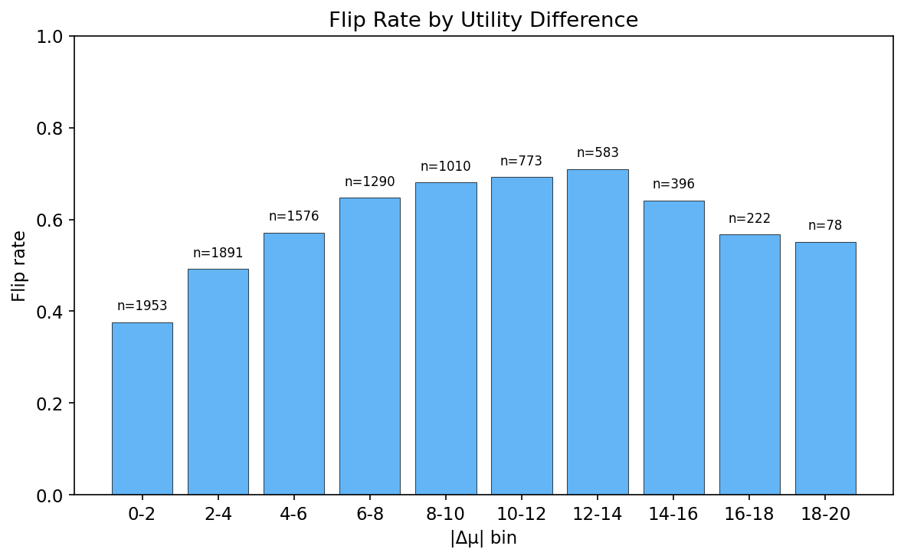
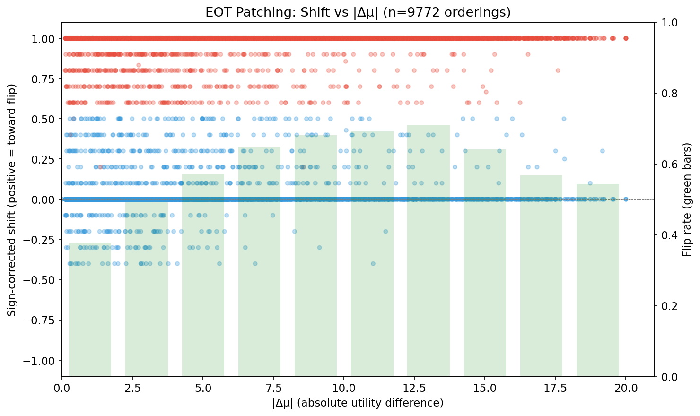
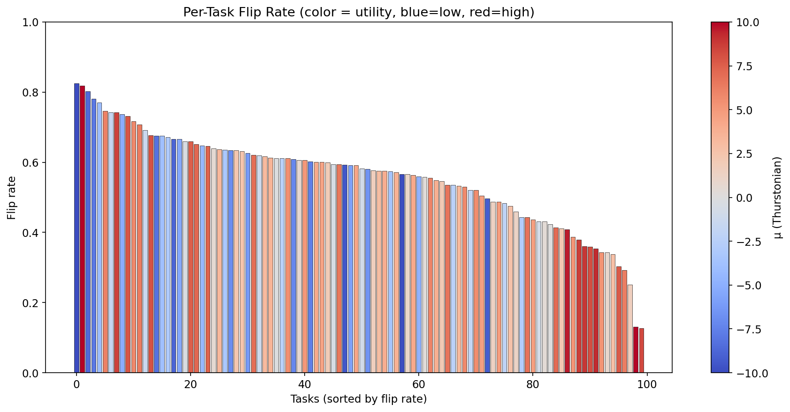

# EOT Scaled Patching — Report

**Status: Phase 1 COMPLETE. Phase 2 running (per-layer sweep). Phase 3 pending.**

## Summary

Scaling the pilot's EOT patching experiment from 10 tasks (45 pairs) to 100 tasks (4,950 pairs). Phase 1 (9,900 orderings) confirms the pilot's key finding: patching just 2 tokens (`<end_of_turn>` + `\n`) from the opposite ordering flips the model's choice in **55.9%** of orderings (pilot: 54%).

| Metric | Pilot (10 tasks) | Scaled (100 tasks) |
|--------|------------------|---------------------|
| Tasks | 10 | 100 |
| Pairs | 45 | 4,950 |
| Orderings analyzed | 90 | 9,784 |
| All-layer EOT flip rate | 54% | **55.9%** |
| P(choose position A) | 0.591 | 0.546 |
| Phase 1 runtime | ~10 min | 4.3h |

The scaled experiment closely reproduces the pilot's flip rate, confirming that the effect is not an artifact of a small task sample. The inverted-U relationship between flip rate and utility difference |Δμ| is now well-powered across all bins.

## Setup

| Parameter | Value |
|-----------|-------|
| Model | Gemma 3 27B (bfloat16), 62 layers |
| Tasks | 100 at evenly spaced utility quantiles (mu: -10.0 to +10.0) |
| Pairs | 4,950 canonical (all C(100,2)), each in AB and BA ordering |
| Phase 1 trials | 10 per ordering per condition |
| Phase 2/3 trials | 5 per ordering per condition |
| Temperature | 1.0 |
| max_new_tokens | 16 |
| Template | completion_preference (CompletionChoiceFormat) |
| EOT tokens patched | 2 (`<end_of_turn>` + `\n`, positions -5 and -4 from prompt end) |

## Phase 1: Baseline + All-Layer EOT Patch (COMPLETE)

**9,900 orderings processed in 4.3h.**

### Overall flip rate

| Metric | Value |
|--------|-------|
| Total records | 9,900 |
| Parse-fail dominant (excluded) | 65 (0.7%) |
| Ambiguous baseline (excluded) | 51 (0.5%) |
| Analyzed orderings | 9,784 |
| **Flipped** | **5,468/9,784 = 55.9%** |

### Position bias

P(choose position A) = 0.546 (53,250/97,599 valid trials). Mild position A preference, weaker than the pilot's (0.591).

### Flip rate by utility difference

Clear inverted-U pattern across |Δμ| bins:

| |Δμ| bin | Flip rate | n |
|---------|-----------|-----|
| 0-2 | 37.6% | 1,953 |
| 2-4 | 49.2% | 1,891 |
| 4-6 | 57.1% | 1,576 |
| 6-8 | 64.7% | 1,290 |
| 8-10 | 68.1% | 1,010 |
| 10-12 | 69.1% | 773 |
| **12-14** | **71.1%** | **583** |
| 14-16 | 64.3% | 396 |
| 16-18 | 57.0% | 222 |
| 18-20 | 55.1% | 78 |

Peak at |Δμ| 12-14 (71.1%). At low |Δμ| (0-2), the baseline itself is ambiguous (similar tasks), so "flipping" is noisy. At very high |Δμ| (16+), strong content preferences resist the structural patch. The sweet spot is moderate-to-large utility differences where there is a clear preference direction but it is carried by the structural (EOT) representation rather than overwhelming content signals.

### Shift vs utility difference

Nearly all flipped orderings show a full +1.0 sign-corrected shift — when patching works, it works completely (all 10 trials flip). Non-flipped orderings cluster at 0.0 (no effect). Very few orderings show intermediate shifts. This deterministic, all-or-nothing pattern matches the pilot and suggests the EOT representation is a binary "choice signal" rather than a graded preference strength.

### Task-specific effects

Per-task flip rates range from ~13% to ~83%, broadly distributed across all utility levels. No single task dominates — a major improvement over the pilot, where 2 tasks drove most flips. Tasks across the full utility spectrum (blue=low mu, red=high mu) show similar flip susceptibility, with no systematic relationship between task utility and flip rate.

**Top 10 tasks by flip count** (each task appears in 198 orderings):

| Task | Flips | Total | Rate | mu |
|------|-------|-------|------|----|
| wildchat_48415 | 162 | 198 | 82% | +10.0 |
| stresstest_82_1391_neutral | 153 | 196 | 78% | -7.9 |
| bailbench_1481 | 151 | 183 | 82% | -10.0 |
| stresstest_38_1271_neutral | 148 | 184 | 80% | -8.6 |
| alpaca_7447 | 147 | 198 | 74% | -1.6 |
| competition_math_4154 | 147 | 197 | 75% | +6.1 |
| competition_math_1031 | 147 | 198 | 74% | +8.5 |
| alpaca_1380 | 146 | 198 | 74% | -5.1 |
| alpaca_12029 | 145 | 198 | 73% | +7.8 |
| bailbench_424 | 145 | 188 | 77% | -4.1 |

Diverse mix of task types and utility levels in the top-flipping tasks.

## Phase 2: Per-Layer Sweep (IN PROGRESS)

Testing 38 layers individually on 5,511 flipping orderings:
- Every layer in 20-45 (26 layers)
- Every 3rd layer outside: 0, 3, 6, ..., 18 and 48, 51, 54, 57, 60 (12 layers)
- 5 trials per layer at temperature 1.0

Early data (n=3 orderings): L34 already showing highest single-layer flip rate (67%), with L32-33 also active. Consistent with pilot's L25-34 causal window.

Expected completion: ~24h from Phase 1 end (~March 7 12:00 UTC).

## Phase 3: Layer Combinations (pending)

From Phase 2 top-5 layers:
- All pairs (10 combos), all triples (10 combos), top-4, top-5, causal window
- 5 trials per combination per ordering

Expected: reveal whether top layers are additive or redundant. ~12h runtime.

## Infrastructure

- All phases support `--resume` via JSONL checkpointing
- Master runner: `nohup bash scripts/eot_scaled/run_all.sh` chains Phase 1 → 2 → 3
- Phase 1: completed in 4.3h (9,900 orderings at ~38/min)
- Phase 2: estimated ~24h (5,511 orderings × 38 layers × 5 trials)
- Phase 3: estimated ~12h (5,511 orderings × ~20 combos × 5 trials)

## Limitations

- Phase 2/3 not yet complete — no layer profile or combination data at scale
- Parse failure rate low (0.7%) — much lower than interim estimate (5.8%) which was inflated by early bailbench pairs
- Position bias (0.546) may slightly inflate flip rates for orderings where baseline prefers position A
