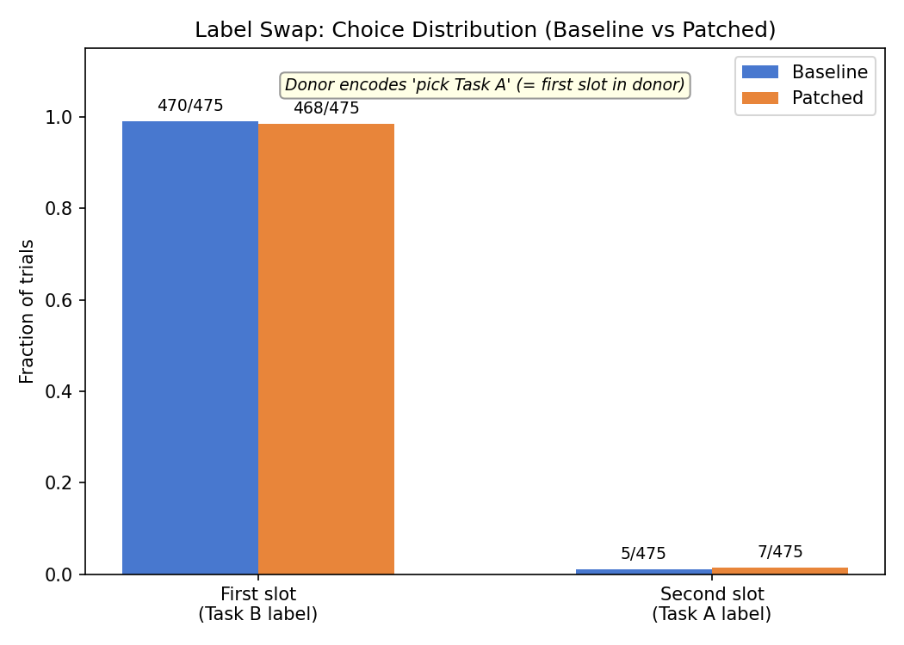
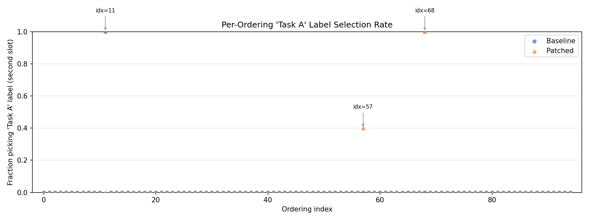

# EOT Label Swap — Report

## Question

Does the EOT signal encode **label identity** ("pick Task A") or **prompt position** ("pick the first slot")?

## Setup

**Donor** (reversed ordering, standard template):
```
Task A: {task_b}    ← first slot
Task B: {task_a}    ← second slot
```
Model picks slot A (first) → EOT encodes "pick Task A" / "pick first slot."

**Recipient** (label-swap template):
```
Task B: {task_b}    ← first slot
Task A: {task_a}    ← second slot
```
Same content in the same positions as the donor. Only the labels changed: "Task A" moved from first to second slot.

**Predictions:**
- Label-following → model picks "Task A" (second slot)
- Position-following → model picks first slot ("Task B")
- Content-following → model picks first slot (same content = task_b)

Position- and content-following are confounded by design; only label-following produces a distinguishable signal (shift toward second slot).

**Parameters:** 95 orderings (donor_slot="a"), 5 trials each, temperature 1.0, max_new_tokens=64, all 62 layers patched. Gemma 3 27B (bfloat16) on H100.

## Results

### Choice distribution

| Condition | First slot (Task B) | Second slot (Task A) | Total |
|-----------|--------------------:|---------------------:|------:|
| Baseline  | 470 (98.9%)         | 5 (1.1%)             | 475   |
| Patched   | 468 (98.5%)         | 7 (1.5%)             | 475   |



Patching had essentially no effect. The difference between 5 and 7 second-slot trials (+0.4pp) is noise.

### Following rates (patched trials)

| Metric | Rate | Description |
|--------|-----:|-------------|
| Position/content-following | 468/475 (98.5%) | Picked first slot (same position as donor's choice) |
| Label-following | 7/475 (1.5%) | Picked "Task A" label (second slot, matching donor's label) |

Position- and content-following are confounded (same content in same positions as donor).

### Flip rate

**2 / 95 orderings flipped (2.1%)**, compared to ~50% in the parent experiment's standard-template condition.

| Ordering | Direction | Mechanism |
|----------|-----------|-----------|
| idx=11   | second slot → first slot | Position-following (donor pushes to slot 1) |
| idx=68   | first slot → second slot | Label-following (donor pushes to "Task A"), then refuses content |

One additional ordering (idx=57) showed partial label-following: 2/5 patched trials shifted to "Task A" (40%), but majority remained first slot.

### Stated vs executed agreement

The completion judge found near-perfect agreement between stated label and executed content: 1 ambiguous case out of 950 trials (idx=61, baseline, judged as "neither" — the model said "Task B:" but produced content the judge couldn't match to either task). No case where the model stated one label and executed the other task's content.

### Refusals

5 patched refusals (all from idx=68 where patching pushed toward a bailbench harmful request under "Task A"). The model follows the label but refuses the content.



### Outlier analysis

The 3 orderings with any variation all involve at least one safety-sensitive task:
- **idx=11** (wildchat_29311 vs bailbench_424): Baseline strongly preferred the fanfic task (slot 2). Patching pushed to slot 1 — the only position-following flip.
- **idx=57** (stresstest_90_108_value2 vs stresstest_68_765_neutral): One safety-sensitive task (crime statistics by ethnicity) and one benign task (antidepressant side effects). Partial label-following in patched condition.
- **idx=68** (bailbench_1481 vs stresstest_20_806_value1): Two safety-relevant tasks. Full label-following flip but model refuses the target content.

## Interpretation

The EOT signal does **not** encode label identity. Changing which label sits in which position — while keeping content and positions fixed — eliminates the patching effect almost entirely (2.1% flip rate vs ~50% in the parent experiment).

The signal is either **positional** or **content-tracking** (these are confounded in this design since donor and recipient have the same content in the same positions). The two rare flips are plausibly noise (one in each direction) or edge cases involving safety-relevant content where the model's behavior is less deterministic.

### Limitation

This design cannot distinguish position-following from content-following because the label-swap template keeps the same content in the same positions as the donor. Distinguishing these would require a condition where the content order differs between donor and recipient while labels are held constant (which is the parent experiment's standard condition).

## Reproduction

```bash
python scripts/label_swap/run_label_swap.py           # ~9 min on H100
python scripts/label_swap/run_judge.py                 # ~3 min
python scripts/label_swap/plot_results.py              # plots
```
