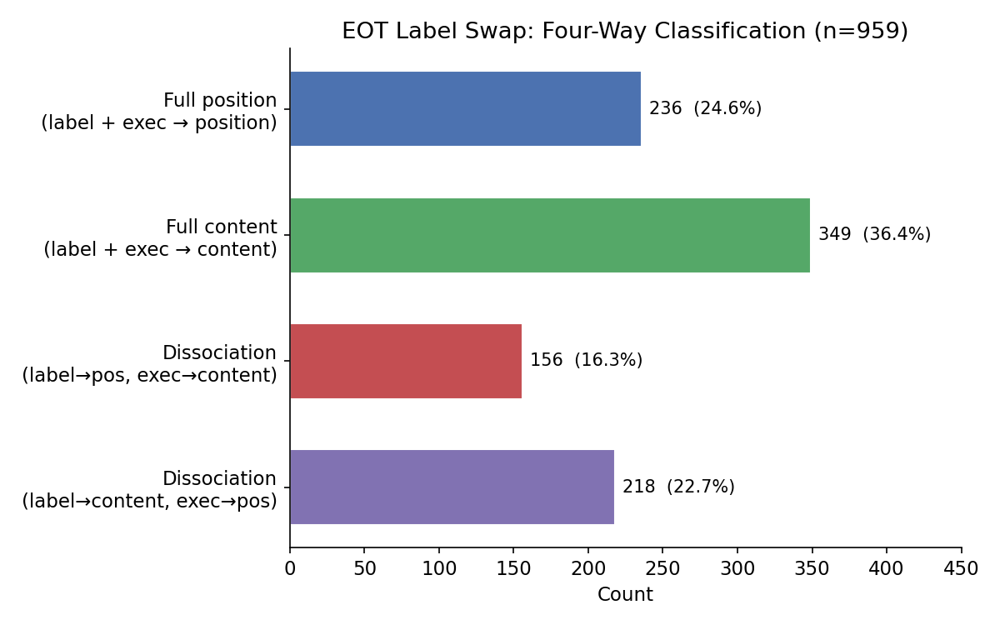
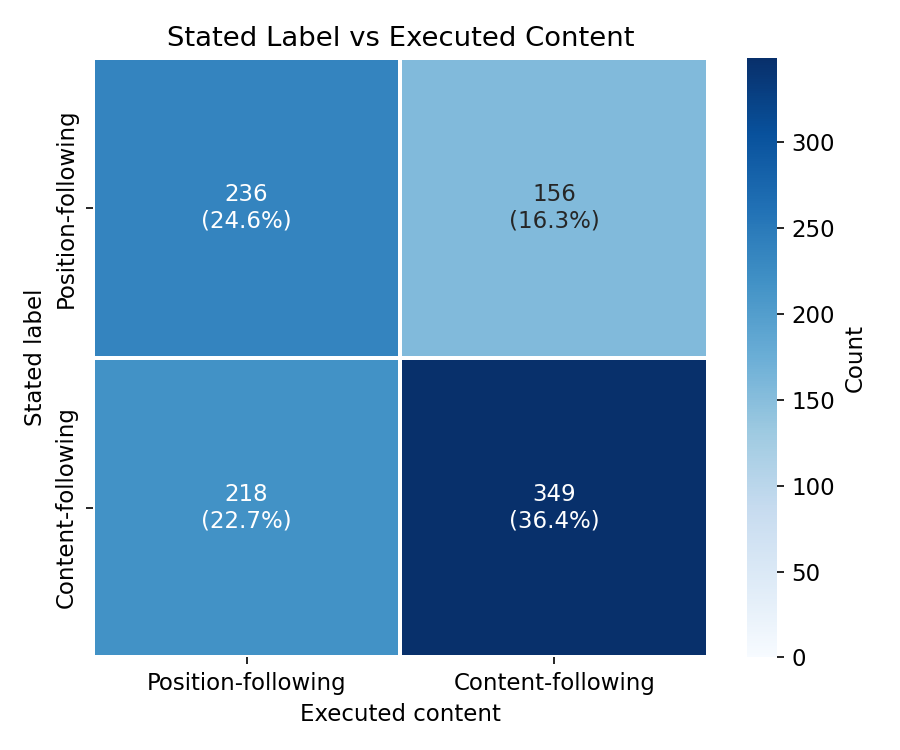

# EOT Label Swap — Report

**Status: COMPLETE**

## Summary

The EOT token carries **separable position and content signals** that can be driven apart by swapping task positions. When donor EOT activations are patched into a recipient with swapped task content, 39.0% of trials show **dissociation** — the stated label follows one signal (position or content) while the executed content follows the other. This is ~13x the parent experiment's 3.0% dissociation rate, where labels and content stayed aligned.

Content-following slightly dominates both the label dimension (59.0%) and execution dimension (52.7%), but position-following is substantial in both. The EOT signal is genuinely mixed — neither purely positional nor purely content-based.

| Metric | Value | 95% CI |
|--------|-------|--------|
| Flip rate (majority label change) | **87.5%** | [83.0%, 92.0%] (bootstrap) |
| Dissociation rate (stated != executed) | **39.0%** | — |
| Parent control dissociation | 3.0% | — |

## Setup

| Parameter | Value |
|-----------|-------|
| Model | Gemma 3 27B (bfloat16), 62 layers |
| Source orderings | 200 (from `selected_orderings.json`) |
| Donor | **Source ordering** (where model's natural preference is observed) |
| Recipient | Reversed ordering (same labels, task content swapped) |
| Trials per ordering | 5 baseline + 5 patched |
| Temperature | 1.0 |
| max_new_tokens | 64 |
| EOT tokens patched | 2 (`<end_of_turn>` + `\n`) across all 62 layers |
| Completion judge | gpt-5-nano (2,000 calls, 0 errors) |
| Runtime | 19m generation + 45m judging |

### Design rationale

The parent experiment's donor was the *opposite* ordering — if the source had (task_a in A, task_b in B), the donor was (task_b in A, task_a in B). For label swap, this would make the recipient identical to the donor (a no-op). Instead, the donor is the **source ordering itself**, and the recipient has task positions reversed. This creates a disagreement between position and content: the donor's preferred slot points to the non-preferred task in the recipient.

### Classification scheme

Each patched trial is classified on two dimensions:

- **Stated label**: Does the model say the donor's slot (position-following) or the slot where the preferred task is in the recipient (content-following)?
- **Executed content**: Does the model perform the task at the donor's positional slot (position-following) or the preferred task regardless of position (content-following)?

This yields four categories: full position, full content, and two types of dissociation.

*Example*: If the source model picks slot B for a math task, and in the recipient the math task is in slot A, then a patched completion saying "Task A:" and solving math is content-following on both dimensions.

39 patched trials (3.9%) were flagged as refusals by the judge; of these, 29 had valid stated+executed classifications. All refusals are excluded from the four-way analysis below (n=959 valid non-refusal trials).

## Results

### 1. Four-way classification

| Category | Count | % (n=959) |
|----------|-------|-----------|
| Full position (label + exec → position) | 236 | 24.6% |
| Full content (label + exec → content) | 349 | 36.4% |
| Dissociation (label→pos, exec→content) | 156 | 16.3% |
| Dissociation (label→content, exec→pos) | 218 | 22.7% |
| Excluded (refusal or unclassifiable) | 41 | — |

Full content-following is the most common single outcome (36.4%), but position-following is substantial. The two dissociation types together account for 39.0% of valid trials.

### 2. Stated vs executed matrix

Marginal rates:

| Dimension | Position-following | Content-following |
|-----------|-------------------|-------------------|
| Stated label | 41.0% | 59.0% |
| Executed content | 47.3% | 52.7% |

Both dimensions show a roughly 40/60 split favoring content, but neither dominates. The off-diagonal cells (39.0% total) demonstrate that the label and content are controlled by **partially independent** components of the EOT signal.

### 3. Asymmetry by source preference

| Source preference | n | Flip rate | Mechanism |
|-------------------|---|-----------|-----------|
| baseline_dominant="a" | 105 | **94.3%** | Content-driven |
| baseline_dominant="b" | 95 | **80.0%** | Position-driven |

The flip rate differs by 14pp depending on whether the source ordering's preferred slot was A or B.

**bd="a"** (model picks slot A in source): The donor EOT encodes a preference for task_a. In the recipient, task_a sits in slot B, so the patching effect redirects the model from its baseline choice (slot A) to slot B. 94.3% flip rate. Baseline majority on the recipient is slot A for all 105 orderings (99.4% of individual trials) — the model picks slot A in both source and recipient, suggesting position bias. Yet patching overrides this, showing the content signal in the EOT is strong enough to overcome position bias.

**bd="b"** (model picks slot B in source): The donor EOT encodes "pick slot B," which pushes toward slot B in the recipient (where the non-preferred task now sits). 80.0% flip rate. This is position-following — the model follows the donor's slot regardless of which task is there.

### 4. Dissociation breakdown by source preference

| Source pref | n | Full position | Full content | Dissoc (label→pos, exec→content) | Dissoc (label→content, exec→pos) |
|-------------|---|---------------|--------------|-----------------------------------|-----------------------------------|
| bd="a" | 498 | 44 (8.8%) | 236 (47.4%) | 0 (0.0%) | 218 (43.8%) |
| bd="b" | 461 | 192 (41.6%) | 113 (24.5%) | 156 (33.8%) | 0 (0.0%) |

The two dissociation types are *exclusive* to different source-preference groups:

- **bd="b" dissociation** (156 trials, 33.8% of bd="b"): Label follows *position* ("Task B:") but execution follows *content* (preferred task_b in slot A). The model says the donor's label but does the preferred task.
- **bd="a" dissociation** (218 trials, 43.8% of bd="a"): Label follows *content* ("Task B:" because task_a is there) but execution follows *position* (slot A content = task_b, not preferred). The model finds the right label but generates the wrong task's content.

### 5. Baseline on recipient

| Metric | Value |
|--------|-------|
| Baseline "a" on recipient | 97.9% (979/1000) |
| Baseline "b" on recipient | 2.1% (21/1000) |
| Baseline determinism (>=4/5 same) | 200/200 (100%) |

The baseline is overwhelmingly slot A for all orderings, regardless of source preference. This reflects a combination of content preference (for bd="b", the preferred task is in slot A of the recipient) and position bias (for bd="a", slot A is preferred despite the preferred task being in slot B).

### 6. Comparison to parent experiment

| Metric | Parent control | Label swap |
|--------|---------------|------------|
| Flip rate | 83.6% | 87.5% |
| Dissociation | 3.0% | **39.0%** |
| Donor | Opposite ordering | Source ordering |

The flip rates are similar, but the dissociation rate is ~13x higher. The parent's low dissociation (3.0%) reflects that position and content signals were *aligned* in the control condition — both pointed to the same slot. In the label swap, they're deliberately misaligned, and the 39.0% dissociation reveals their partial independence.

## Interpretation

The EOT token encodes a **mixed signal** with at least two partially separable components:

1. **Positional component**: "Pick the Nth slot." When task positions are swapped, this pushes toward the wrong task. Visible in bd="b" orderings (80% flip rate driven by position-following) and in the 24.6% of trials showing full position-following.

2. **Content component**: "Pick task X." When task positions are swapped, this finds the preferred task in its new location. Visible in bd="a" orderings (94.3% flip rate driven by content-following) and in the 36.4% of trials showing full content-following.

3. **Dissociation**: The two components can drive *different parts of the output*. In 39.0% of trials, the stated label follows one signal while the executed content follows the other. This means the position and content signals are not fully integrated at the EOT — they influence the label-generation and content-generation stages somewhat independently.

The asymmetry between bd="a" and bd="b" suggests that the balance between position and content components depends on the original choice:

- When the model chose slot A (first task) in the source, the EOT carries a stronger content signal. Choosing the first task may require more active content-based reasoning (overriding recency bias), producing a stronger content encoding.
- When the model chose slot B (second task) in the source, the EOT carries a stronger positional signal. Choosing the second task aligns with recency and position, so the positional encoding is more prominent.

## Limitations

- **Donor differs from parent**: This experiment uses the source ordering as the donor (not the opposite ordering), so flip rates are not directly comparable to the parent's conditions.
- **No per-layer analysis**: The positional and content components might localize to different layers. All-layer patching conflates them.
- **Judge accuracy**: The completion judge classifies executed content from 64 tokens of generation. Short or ambiguous completions may be misclassified. The 0% error rate suggests reliable judge behavior, but subtle content mismatches could be missed.
- **Baseline position bias**: For bd="a" orderings, the baseline on the recipient is 99.4% slot A despite the preferred task being in slot B. This position bias may interact with the patching effect in ways that complicate interpretation.
- **Refusal exclusion**: 39 patched trials (3.9%) were flagged as refusals. Of these, 29 had valid stated+executed classifications but were excluded from the four-way analysis. Including them shifts dissociation from 39.0% to 38.2% — minimal impact.
