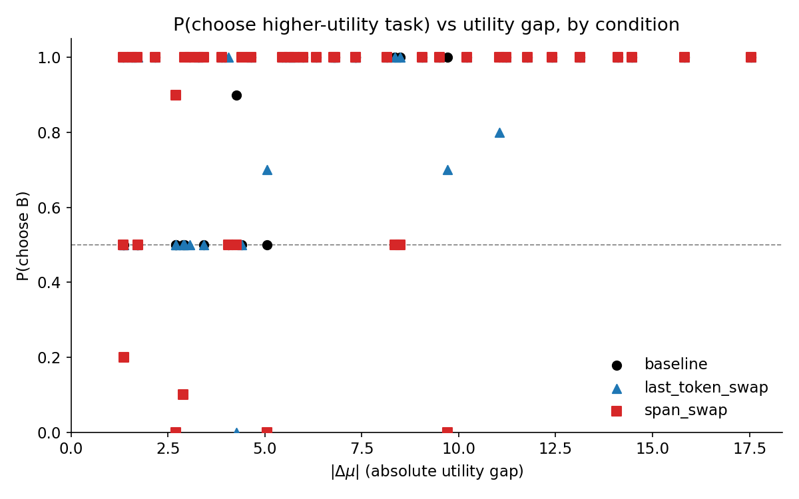
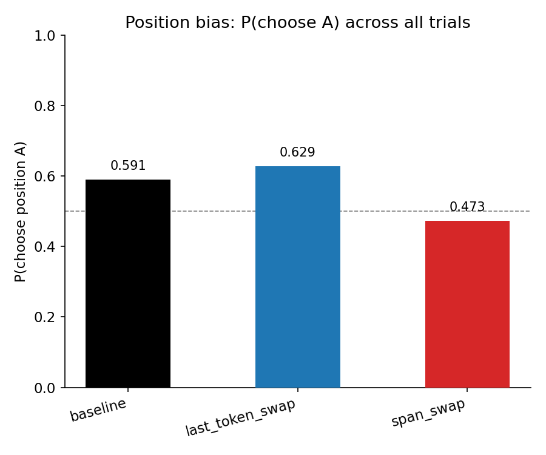
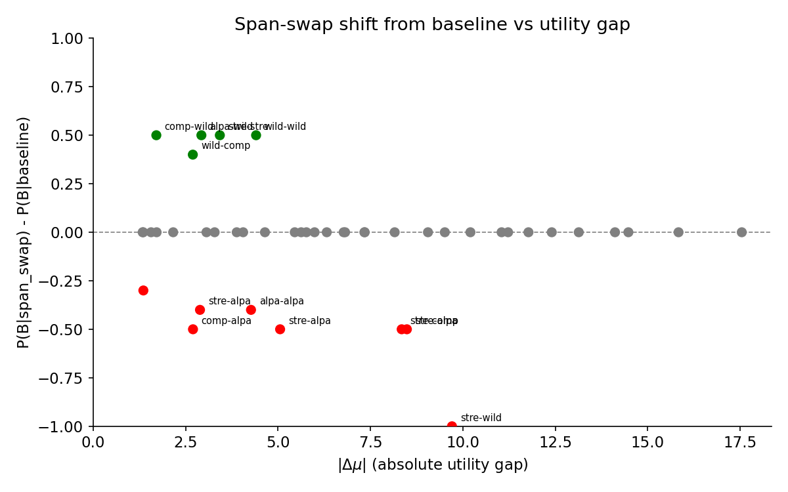

# Activation Patching Pilot — Report

## Summary

Swapping task-position activations across all 62 layers during prefill has a limited causal effect on pairwise choice. Span swap produces significant shifts in 12/45 pairs (27%), but only 1 true flip (2.2%). Last-token swap is nearly inert. The dominant finding is that most choices are deterministic and robust to activation patching — the model either follows position bias (low utility gap) or makes a strong content-based choice (high gap) that survives even full-span activation swaps.

## Setup

| Parameter | Value |
|-----------|-------|
| Model | Gemma 3 27B (bfloat16), 62 layers |
| Tasks | 10 at evenly spaced utility quantiles (mu: -8.7 to +8.8) |
| Pairs | 45 canonical, each in AB and BA ordering = 90 prompts |
| Conditions | baseline, last_token_swap, span_swap |
| Trials | 5 per ordering per condition (10 per pair per condition) |
| Temperature | 1.0 |
| max_new_tokens | 16 |
| Template | completion_preference |
| Total generations | 1350 |
| Parse failures | 0/1350 |

BOS token offset = 1 (verified: `find_pairwise_task_spans` returns positions without BOS; `_tokenize` adds BOS). All span positions shifted by +1 and verified against decoded tokens for first pair.

## Baseline Behavior

**Position bias**: P(choose position A) = 0.591 across all 450 baseline trials.

After aggregating both orderings into canonical pairs (where "B" = higher utility task):
- **12/45 pairs** (27%) show P(B) = 0.50 — pure position bias, no content discrimination
- **32/45 pairs** (71%) show P(B) = 1.00 — model always picks higher-utility task regardless of position
- **1 pair** (alpaca_13384 vs alpaca_5688) shows P(B) = 0.90

The two regimes overlap: P(B)=0.50 pairs exist up to |delta_mu|=5.1, while P(B)=1.00 pairs appear as low as |delta_mu|=1.4. The rough transition occurs around |delta_mu| ~ 3-5.

## Last-Token Swap

Swapping activations at the last token of each task span across all 62 layers.

| Metric | Value |
|--------|-------|
| Significant shifts (p<0.05) | 6/45 (13%) |
| Flips (crosses 0.5) | 1/45 (2.2%) |
| Mean |shift| | 0.069 |
| Gap-shift correlation | r=-0.10, p=0.50 |

**Verdict**: A single token position carries almost no causal information for choice. This makes sense — the model's choice depends on the full task representation, not the activation at any one position.

## Span Swap

Swapping activations across the full task spans (right-aligned when lengths differ) at all 62 layers during prefill.

| Metric | Value |
|--------|-------|
| Significant shifts (p<0.05) | 12/45 (27%) |
| Flips (crosses 0.5) | 1/45 (2.2%) |
| Mean |shift| | 0.144 |
| Gap-shift correlation | r=-0.28, p=0.064 |

Span swap reduces overall position-A bias from 0.591 to 0.473 — a reversal of the position bias direction.

### Direction of Shifts

Among 13 pairs with |shift| > 0.05:

| Direction | Count | Involving stresstest |
|-----------|-------|---------------------|
| Positive (toward higher utility) | 5 | 1 |
| Negative (toward lower utility) | 8 | 5 |

Negative shifts disproportionately involve `stresstest_4_304_value1` (4 of 8 negative shifts). This task has unusually high sigma (4.37 vs median 0.53), suggesting the model's handling of adversarial/safety-relevant tasks is particularly disrupted by activation swaps.

For non-stresstest pairs, shifts are roughly balanced (4 up, 3 down) — span swap does not systematically push toward higher or lower utility.

### Utility Gap Effect

Shifts are concentrated at |delta_mu| < 10. All 10 pairs with |delta_mu| > 10 show zero shift. The marginal correlation (r=-0.28, p=0.06) suggests larger gaps resist patching, but the effect is driven by a ceiling: high-gap pairs are already at P(B)=1.0 in baseline and remain there under patching.

The one full reversal (stresstest_4_304 vs wildchat_27471, P(B): 1.0 -> 0.0, |delta_mu|=9.7) is an outlier likely driven by the stresstest task's unusual properties.

## Interpretation

Per the spec's framework:
> **<20% pairs flip** -> task-position activations are not the primary causal driver

With only 1/45 pairs flipping (2.2%), task-position activations are clearly not the primary determinant of choice. The model's choice mechanism appears to rely on:

1. **Position bias** — a strong default toward position A (~59%) that persists even when content is swapped. The bias likely comes from instruction tokens and positional encoding, not task content.

2. **Redundant content representations** — for high-utility-gap pairs, the model identifies the preferred task through information that survives activation swapping (possibly via non-residual pathways, attention patterns, or representations at non-task positions like "Task A:"/"Task B:" label tokens).

3. **Task content at task positions** — contributes only partially. Span swap shifts some pairs, but the effect is modest and inconsistent in direction.

## Limitations

- **max_new_tokens=16** limits the model's completion. It's enough for the "Task A:" / "Task B:" prefix plus a few words, but not a full response. This may suppress cases where the model would have changed its mind during a longer completion.
- **10 trials per pair** provides limited statistical power. Many pairs are at 0/10 or 10/10, leaving little room for detecting shifts.
- **All-layer swap** is the most aggressive intervention. The null result at this extreme makes layer-selective patching unlikely to succeed, but differential effects across layers could still be informative.
- **Residual stream only** — hooks modify the residual stream but not attention weights or MLP internals directly. Information may persist through other pathways.

## Conclusion

Swapping task-position activations across all layers does not reliably flip pairwise choices. The model's choice mechanism is robust to this intervention, relying on position bias and redundant representations beyond the task token positions. Span swap is strictly stronger than last-token swap but still insufficient to reverse most choices.

For follow-up: layer-selective patching to identify which layers carry the most choice-relevant information, or extending the swap to include label tokens ("Task A:"/"Task B:") in addition to task content.
